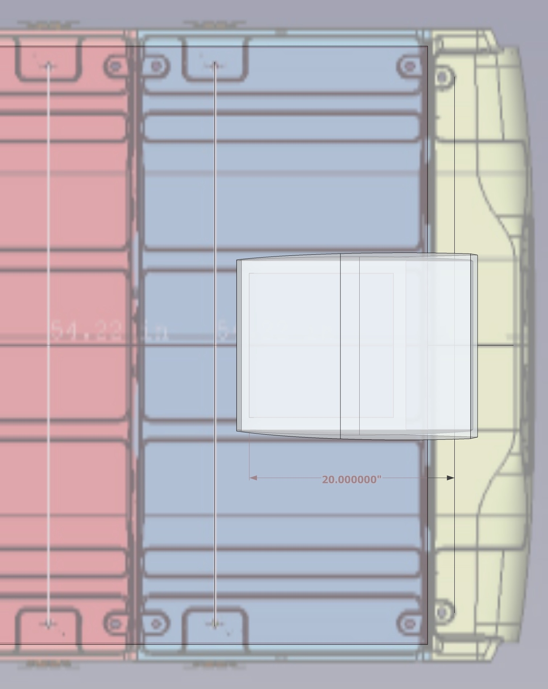
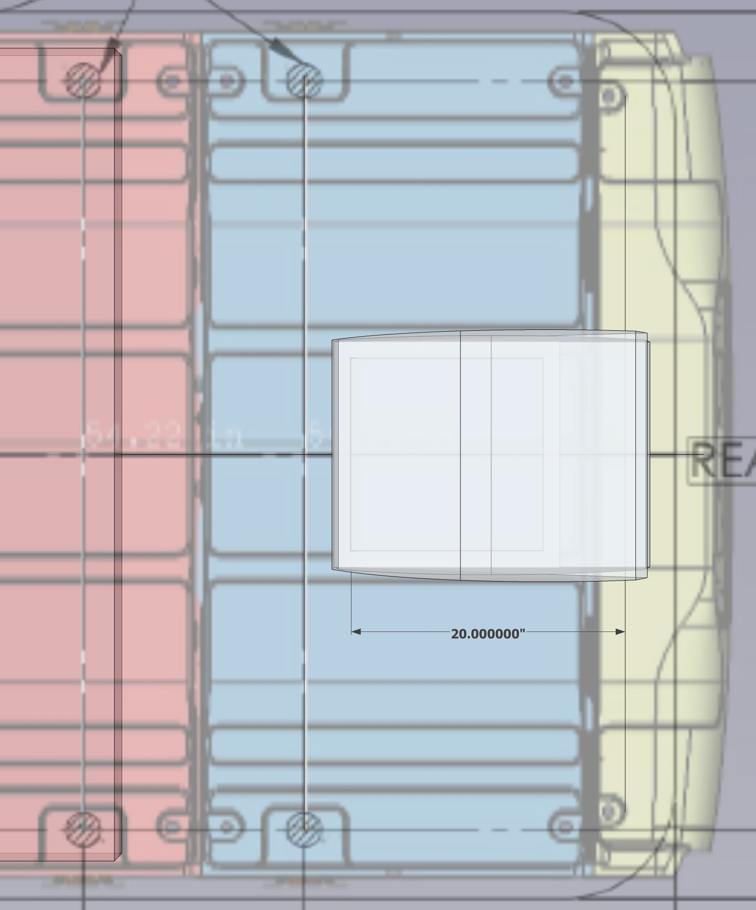

# Roof Arrangement Notes

## Solar

Aluminess tubing is 1 5/16". Assuming aluminess drawing is outer dimension of upper rack, that means, available space between upper rack tubes is 61.875". [TODO: Confirm with Aluminess]  Panasonic solar panel dimensions are 62.6".  We have an interference.  They could sit on top the upper rails.  4 Grape Solar panels could be used at the expense of roof space for roof deck.  Upside is more solar.

Spacing between athwart rack supports on Low Pro Rack is under 58".  Panasonic panels would over hang substantially.  Grape Solar would almost sit above flush (due to inward angle at the top of the athwart supports).

To provide voltage headroom over a 24V system, the Grape Solar panels (24V) would need to be wired in series.  This does require an even number of panels.

Another Panel Option 200W 58.7 x 26.8 x 1.4 MP Imp is 9.8A Isc is 10.2 https://richsolar.com/collections/solar-panels/products/200-watt-solar-panel

**Based on the model, both racks (Aluminess and Low Pro) will accomodate the 4 200W solar panels.**

## Fan Location

The fan will be mounted behind the rear-most roof rib, as forward as possible.  Based on the interior measurements, this would but the forward edge of the roof cut 20" from the door rib (note this will involve drilling through the lip of the rear-most-roof_rib).  The door rib location is estimated on the roof model.

Mounted in this location the fan will interfere with the rear-most cross beam of the low pro rack.  

This interference was confirmed by the company.  The provided the following dimension that confirms it, given that the fan itself is 23" long when closed:

I could add a flat bracket that bolts to where the rear cross beam is and shifts the rear cross bar backwards.  That would be pretty easy to fab, but creates and even longer cantilevered rear.

The rear of the aluminess rack appears to clear the fan.

**Only the Aluminess rack will support installing the fan in the rear most location.**