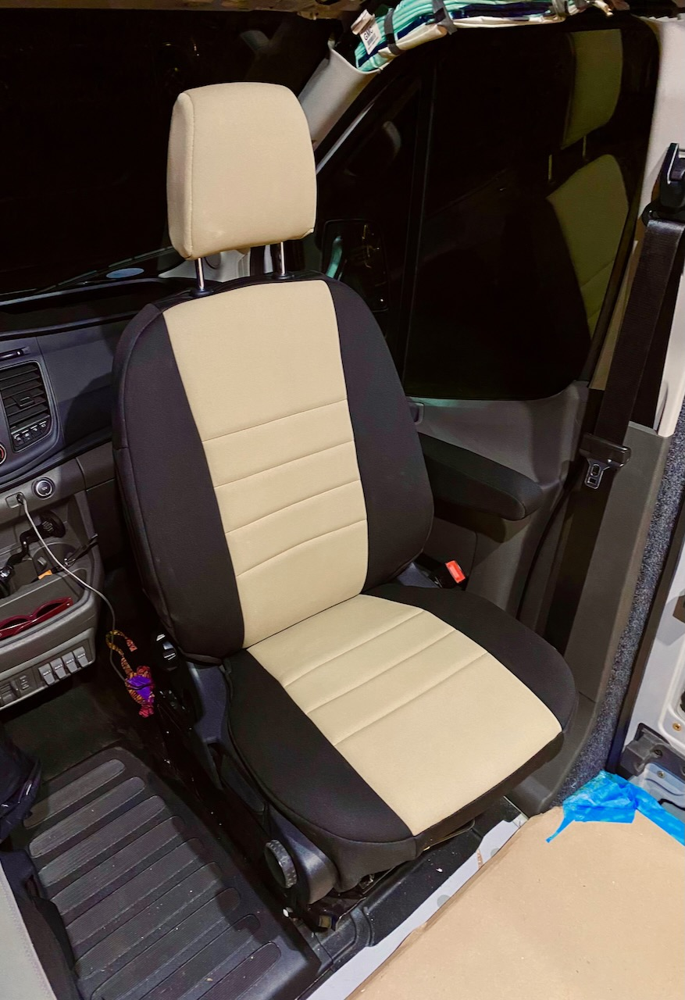
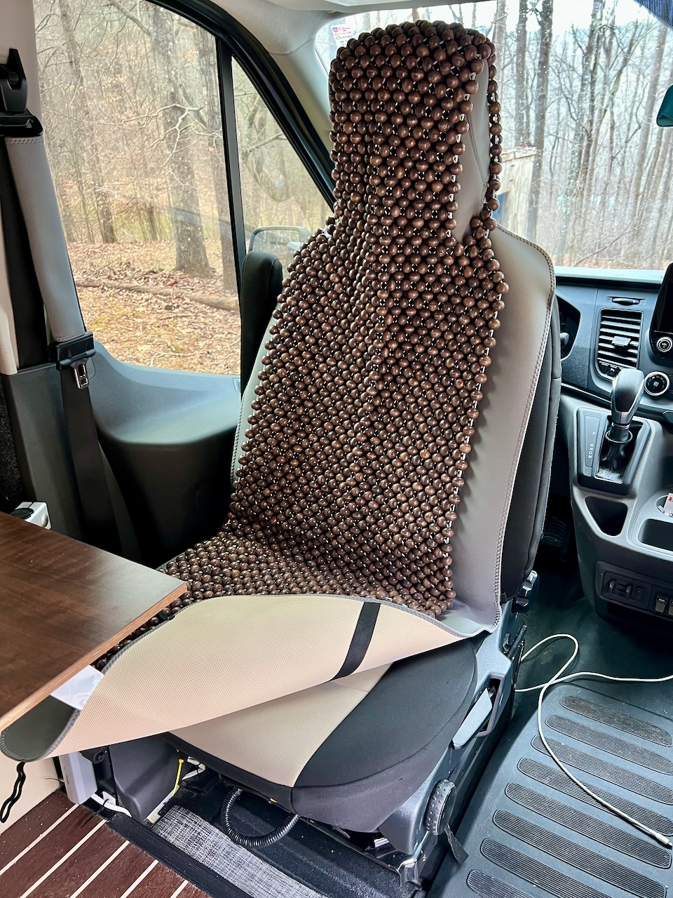

**TLDR: We installed seat covers because we have cats and commonly drive while wearing wet wetsuits.  Also, they match our interior color scheme.**<!--excerpt-->

Our kiteboarding means driving while wearing wet swimsuits or wet wetsuits is common.  In Van 1.0 we used these layover covers.  For Van 2.0 we wanted something more substantial and that matched our interior.  We had a good experience with neoprene covers on our jeep to serve the same function.  

We settled on Wet Okole covers for Van 2.0.  The install is fidgety, but they fit well and look great.

_Our walls and cabinets are tan, so these match pretty well._

Of course, with such fancy covers, we need to protect those as well.  We use [these layover covers](https://www.amazon.com/dp/B09LTYL212/) on top of the seat covers.  These work really well to easily manage cat hair and dander on the seats.  Part of our morning routine is shaking our the layover covers and lint rolling them.

Lastly, because neither of the above cover layers are breathable, we've been experimenting with [these beaded covers](https://www.amazon.com/gp/product/B01GYF72OQ) for added comfort.  So far we're pretty happy with everything but the weight.

_Here's the full stack._

Timeline:

* Installed seat covers (10-17-2022)
* Added seat cover covers (4-12-2022)
* Added seat cover cover beaded cover (10-25-2022)