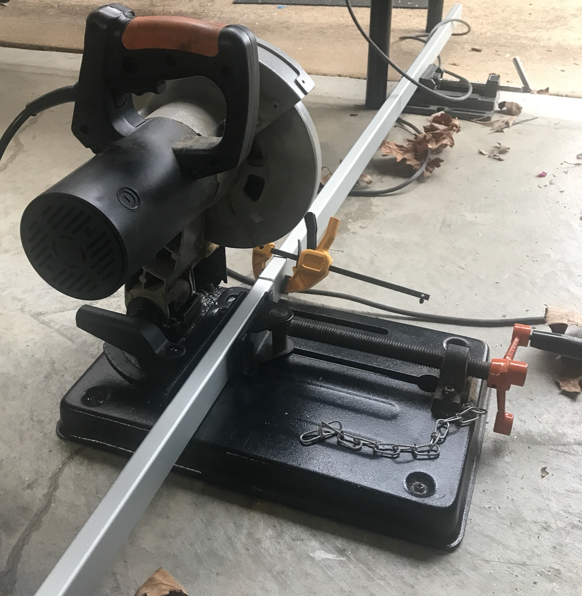
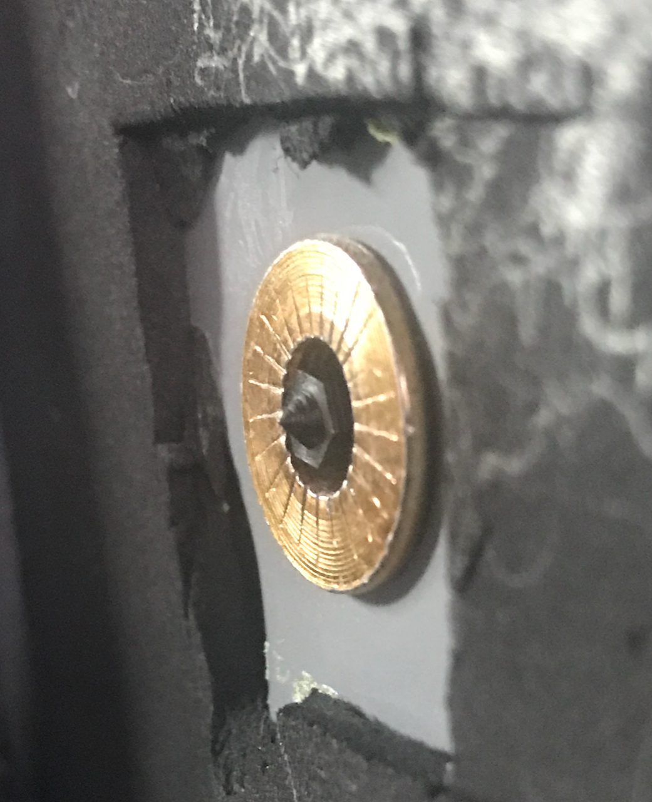
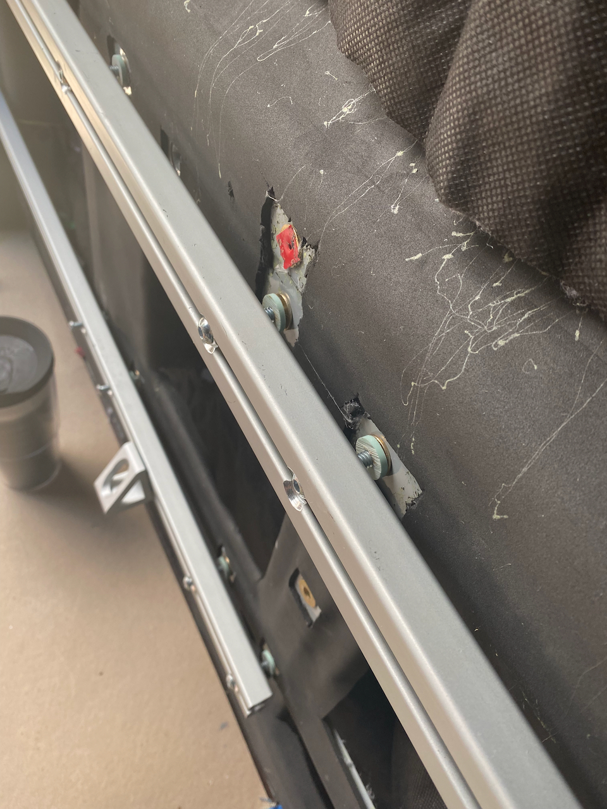

**TLDR: We installed lengths of 1575 series 8020 down the lower sides of the Van walls to facilitate future attachment of all of our 8020 structure.**

The reasons why we chose to use "wall 8020" in our build are contained in [this article](/van/structural/wall_8020_mount/wall-8020-mount).  The details of our thermal breaks can be found in [this article](/van/structural/thermal-break/thermal-break).  This post is mostly the how and when.

## Method

We took advantage of two rows of co-planer aligned factory holes in the bottom third or so of the passenger and driver side walls.  We populated those holes with plusnuts, as detailed [here](/blog/2021-8-29-plusnuts/plusnut-install). 

We cut the 8020 to length using our trusty Evolution Rage4 metal chop saw (after a lot of effort to square it).  

_This saw is a pretty good bargin and served well for two builds._

We match drilled the holes making excellent use of a center scribe, transfer screws, and a drill press.  For details on how we did this, see our [post](/blog/2021-10-27-ltrack/ltrack) on installing L-track, as it's basically the same idea.  

_We cannot emphasize enough how useful transfer screws are._

We used a wide step bit to open up the holes on the outer faces to pass the fastener head.  

We loc-tited and installed.  

_Ready for Loc-tite and torque._

## What We Would (Probably Not) Change

We used the 1575 profile, but the 1534-lite profile is slightly lighter.  In our build we would have saved 1.6 lbs using the lighter profile.  Thats a pretty small improvement, and based on availability and order times, we'd probably stick with what we did.

## Timeline

Note, this doesn't reflect full time effort. It's mostly evenings and partial days, limited by work, etc.

* Tuned saw to be square and cut and match drilled all wall 8020 (Sat 10-17-2021)
* Fabricated 8020 inserts and insulating spacers 1.0 (Tue 10-19-2021)
* Fabricated insulating spacers 2.0, drilled out holes for capscrew heads, ordered a new step bit (Thu 10-21-2021)
* Finished drilling holes for capscrew heads (Sat 10-23-2021)
* Loc-tited and torqued the wall 8020 (Wed 11-10-2021)