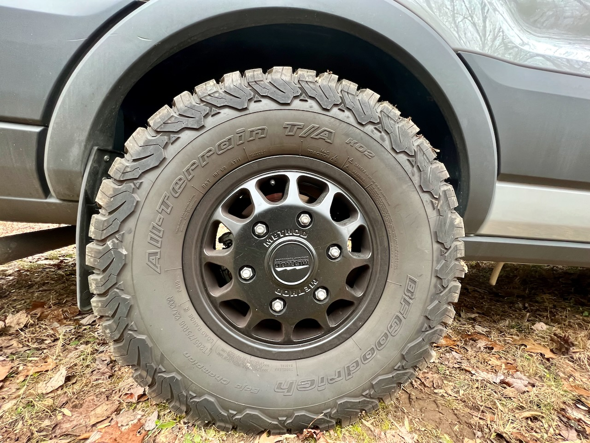
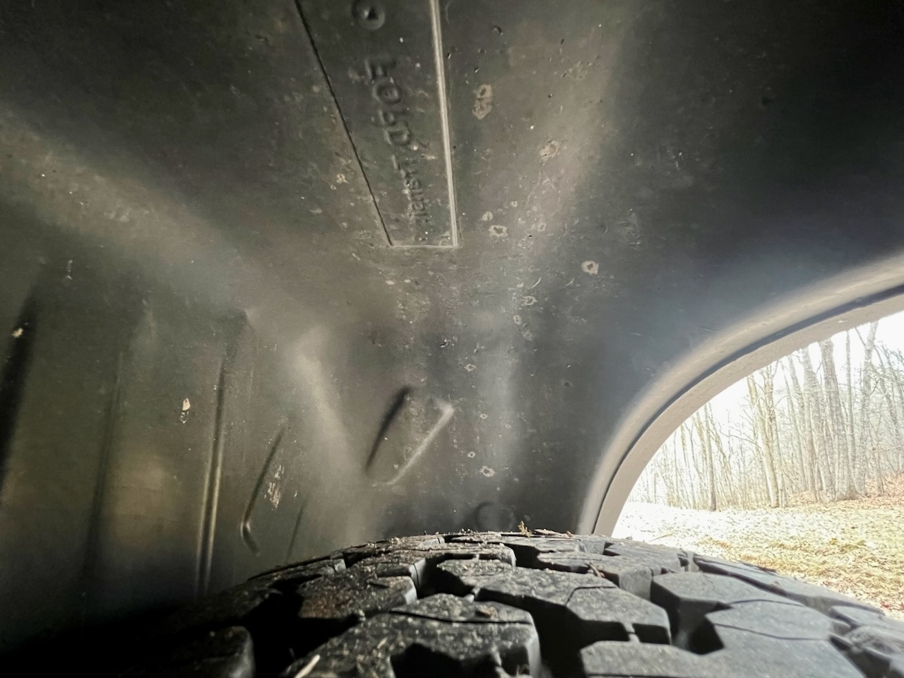

**TLDR: We installed WeatherTech rear mudflaps and OMAC rear wheel well liners.**

In fact that about sums it up.  They both install in minutes.

There is a good forum discussion about the liners [here](https://www.fordtransitusaforum.com/threads/rear-wheel-well-liners-sourced-installed.86603/#post-1129623).

We installed the WeatherTech mudflaps before we received the wheel well liners.  We weren't sure the two products would be compatible together.

With some patience and encouragement, everything went together fine.

One thing we didn't do is use the self-tappers they came with to fasten the inboard vertical portions of the liner to the wheel well.  Seemed like its asking for a future corrosion problem.  Instead we liberally used some VHB and Eternabond tape.  20K miles and a lift with larger tires later, we haven't noticed any problems with skipping the self tappers.

_A little tight with our K02s, but here you can see mudflap._

_A better shot from inside the well._

## Timeline:

Note, this doesn't reflect full time effort.  It's mostly evenings and partial days, limited by work, warm sun to unfurl balled up plastic liners, etc.

* Installed WeatherTech rear mudflaps (10-21-2021)
* Installed passenger side wheel well liner (11-21-2021)
* Installed driver side wheel well liner (12-5-2021)
* Added some VHB (2021-12-16)