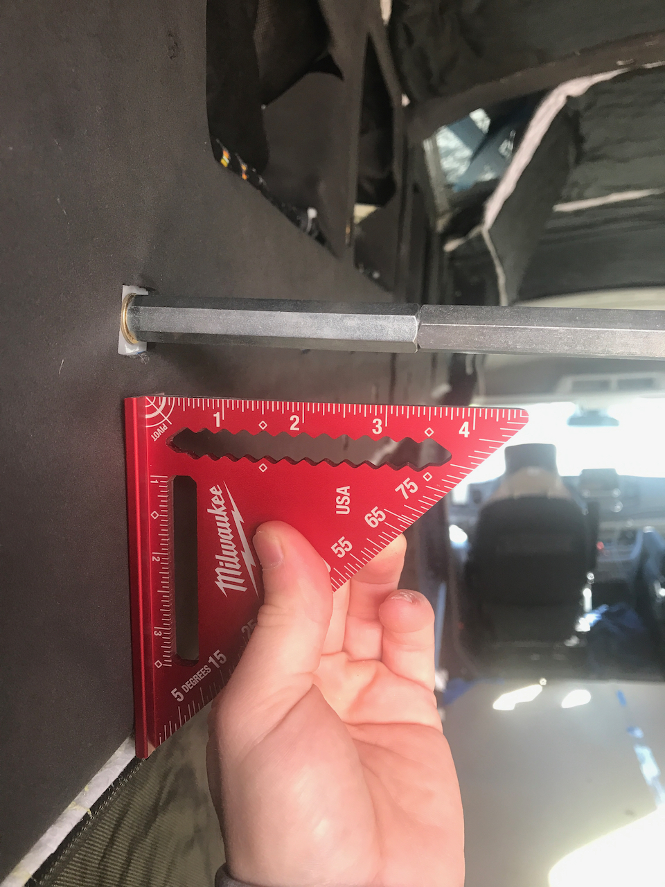

The utility of L-track was a major take-away of Van 1.0.  For 2.0, we knew we would replicate the use of L-track as the foundation for our diy-mule-bag overhead storage.  We also wanted to run an extra strip of L-track along the wall of each side that would not be covered by the overhead storage.  This meant 6 total runs: passenger and driver "upper-wall" and "ceiling" L-track used for the overhead storage mounts, and passenger and driver "lower-wall" L-track for future random utility.

Van 1.0 used pre-drilled L-track.  This meant we had to drill and plus-nut holes in the van to match the existing holes in the L-track.  For Van 2.0, out of sensitivity to unnecessary drilling/holes, we procured L-track without holes, and match-drilled it to pre-existing holes/plusnut holes.  There are merits to each approach, but think we made the right choice for Van 2.0.  It also meant we didn't have to wrestle with drilling any boron-steel which is a huge plus.

The L-track we used is made by Ancra, is 144 inches long, and was procured by a Baltimore Potomac Truck Center, a local supplier (who was fantastic to work with).  It took some work to verify the right product number for "hole-less" 12 ft L-track but both Ancra and BPTC were super helpful.  In case its helpful, the two product numbers that meet this requirement are 40467-31-144 (6351-T6 material good enough) and 40467-11-144 (7075-T6 material - more expensive). 

The major install steps were measuring and cutting to length, match-drilling, milling where needed, cutting counterbores, and final fastening.

## General Procedure for Match Drilling L-track

1. Center scribe the L-track

_A center scribe tool is critical_

2. Measure the location for the rear-most hole, mark and Scribe

_Measure_

_Mark_

_Scribe_

3. Punch the intersection for rear-most hole

4. Drill rear-most hole

5. Bolt up using rear-most hole

6. Install transfer screw in a middle-ish plusnut and then "Pivot" the L-track on rear bolt to scribe at the transfer screw location

_Transfer screws are critical_

7. Punch at the intersection for the middle hole (after taking down the L-track) and drill

8. Bolt up using rear-most and middle hole to check accuracy, then remove the rear fastener

_We use the middle fastener as a pivot point_

9. For the remaining hole locations moving outward from the middle hole, one a time, install a transfer screw and pivot the L-track on the middle fastener to scribe each location with the transfer screw

    
10. Punch the intersections and drill

11. Bolt up using all holes as a final fit check

_Thank the gods_

## Additional Steps

Before any of the above described work, we recommend running a 1/4-20 tap through each plusnuts to clean up the threads.  We also recommend "straightening" the plusnut so the threaded hole is properly perpendicular to the surface.  We used 1/4-20 long hex stand-offs from McMaster to accomplish this.

To use all locations in the L-track, you have to counterbore the holes and use flat head fasteners.  This will keep the fastener from interfering with whatever L-track thingy you want to attach over or adjacent to the fastener location.  

Flat head fasteners, it turns out, have a larger head diameter than the narrow faces of the L-track.  Therefore, in some locations we had to mill out narrow face to pass the fastener.  This could also be accomplished with a dremel.  Alternatively, you can use a button head fastener and skip the milling and counterbore.  The downside is that you will can't use the L-track adjacent to that fastener.  

_End mill_

_After milling_

For the upper and ceiling L-track, because we didn't want to constrain where our overhead storage could mount, we went through the trouble of counterboring and milling.  For the "lower-wall" L-track we skipped that trouble and used button head (interfereing) fasteners.

For pretty much all metal that bolts to the van, we use a 1/8 inch thick home-made FR4 washer as a thermal break.  We made a bunch of these by slicing FR4 "tube", available from McMaster, on a band saw.  This material has enough compressive strength that you can use it and still get a properly pre-loaded bolted joint (something a plastic or wood spacer will not allow).

For the ceiling L-track, we used angle to fabricate brackets to support at the rear end since there isn't a ceiling rib at that location.  The brackets are installed with plusnuts into the rear wall.

## Useful Tools

This job would be almost impossible without: a center scribe, transfer screws, punch, drill press, square, extreme patience, and slow, deliberate actions.

## Surprises and Cautions
In our van, the rear-most ceiling rib holes (Ford's) are shifted toward passenger side by like 1/16 (as buillt - not by design).  Thankfully aluminum is compliant enough to bend.

We had a few spinner plus nuts.  We were able to remove/reinstall in each case.  But in some cases, depending on the location, this would not be recoverable. You would have to deal without.  May the force be with you.  If you check out our [post on plusnuts](/blog/2021-8-29-plusnuts/plusnut-install#what-we-would-change) we discuss some solutions to this problem.

## What We Would Change

If we were starting from scratch, we might opt for half height 10 or 15 series 8020 over the upper wall and ceiling L-track.  It would serve the purpose of mounting our overhead storage just as well.  ~~We would still include at least one strip of L-track on either side (the lower wall) for adhoc utililty.~~

Based on several months of full-time use, we would skip the second layer of wall L-track.  We don't use it much.  The upper layer is accessible forward of our overhead storage for hooks and things.  This change would have saved us 13 lbs and much of that match drilling effort.

## Timeline

Note, this doesn't reflect full time effort. It's mostly evenings and partial days, limited by work, trick-or-treaters, etc.

* Straightened Plus-nuts. Cut driver and passenger upper-wall L-track to length. Match drilled upper-wall L-track. (2021-10-27)
* Cut ceiling and lower-wall L-track to length. Match drilled the ceiling L-track. (2021-10-31)
* Match drilled lower-wall L-track. Milled upper-wall and ceiling L-track to pass flat-head fasteners. Started counterbores for upper wall and ceiling L-track. (2021-11-1)
* Finished counterbores for upper-wall and ceiling L-track. Fabricated rear brackets. Drilled and painted holes for roof L-track brackets. (2021-11-2)
* Completed rear brackets installation (including plusnuts). Completed lower-wall L-track installation. Completed ceiling L-track installation. (2021-11-3)

