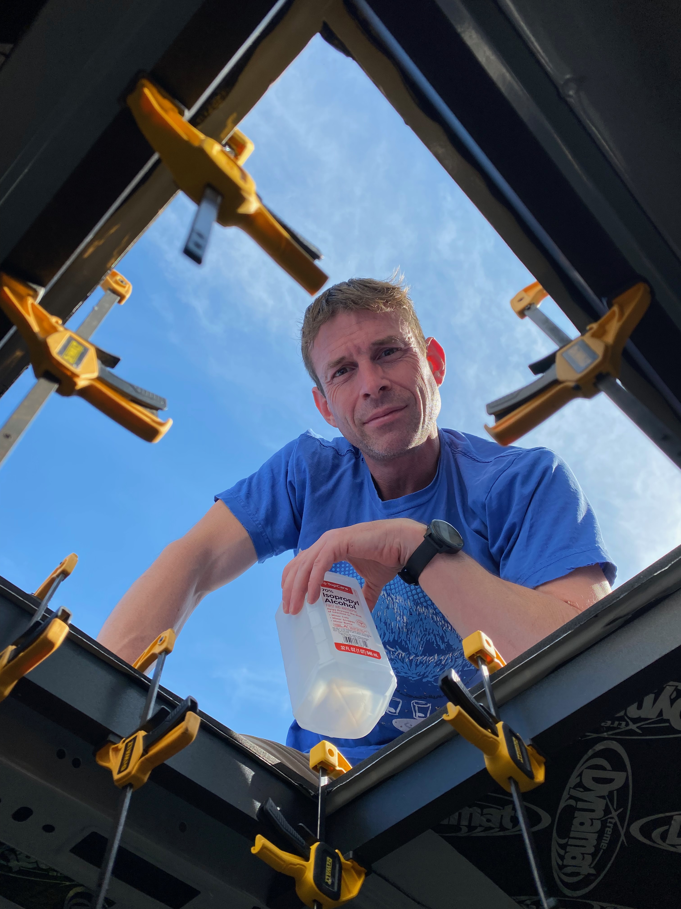
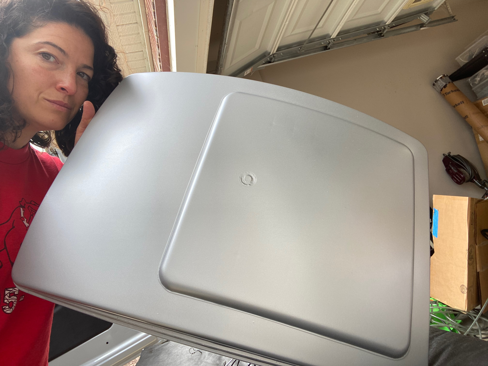

**TLDR: We installed a single MaxxFan in the rearmost possible location.**

We're not breaking any new ground installing a MaxxFan. It's a pretty obvious choice if you want decent ventilation.  They are reliable, can operate during rain, and have enough speeds to find the right balance between quiet and low power vs air flow for any given situation.

In Van 1.0 we installed two fans, one forward and one in the rear.  We did this based on other builders advocating this arrangement to maximize air flow through the van by operating the fans in a "push-pull" configuration.  We never found it effective and decided it was not worth the extra cost, install time, and most importantly, the roof real estate.  What we did learn from Van 1.0 is the importance of directable interior fans on comfort, but that is a subject for a future entry.

_Cutting a 14x14 inch hole in the of a van is a rite of passage for any van builder._

Placement of the single fan in the rear was obvious for us.  We're most likely to be counting on the fan to provide comfort while sleeping, so having it over the bed maximized that function.  In cold weather we rely on the fan to remove moisture to limit condensation, so having it above the primary source of moisture (us while sleeping) makes sense.  The downside is it is some distance from the cooking area, the other primary source of moisture, but this hasn't been a problem.  This placement also maximizes contiguous roof space for solar, another key consideration.

On Van 1.0 we used [DIYVan's](https://diyvan.com/) Sprinter roof adapter with great success.  Using the Transit version for Van 2.0 was a no-brainer, highly recommend.  We also used their interior reinforcement which provided a good substrate for the screws penetrating the van roof to bury in.

On Van 1.0 we used a dicor/sikaflex type product to seal the install.  For Van 2.0 we used flex-seal paint.  It took many coats and thus more time, but gave us a much cleaner install.  If you have the time and patience, we'd recommend it.

One area where we tried to innovate was using a vinyl wrap to try to opaque the shroud.  One of us is pretty sensitive to light waking us up so this was part of our attempt to black out the interior as much as possible.  This was only moderately successful.  The vinyl we chose isn't fully opaque.  Even it was, the inside of the shroud is pretty reflective so light from outside gets reflected into the van.  To do this properly, I think the best route would be to remove the shroud entirely, paint the inside with a matte black, and paint the outside with something opaque.  The vinyl wrap on the fan hasn't help up terrible well (unlike the wrap on the roof rack).  It still looks great from the ground, and matches the van color well, so its got that going for it.

Here's an obligatory timelapse of the majority of our install:
`vimeo: https://vimeo.com/644785111`

## Install Tips

* Some aluminum flat stock can be used to reinforce the plastic frame of the MaxxAir.  If you look close you can see this in the timelapse. This prevents cracking or breaking the frame when screwing it to the roof/adapter.  We can't say for sure if its needed, but its pretty cheap and easy.  We used this reinforcement on all three of our MaxxFan installs.  An easier way to approximate this would be some fender washers.

* Jigsaws will throw sheet metal crumbs further than you think.  We learned this the hard way on Van 1.0.  On Van 2.0 we made very liberal use of drop cloth plastic and trash bags to cover the entire top of the Van.

* Sheet metal on the Transits is very thin.  Thinner than our old T1N Sprinter.  Unless you can come up with a way to install the fan without ever putting body weight on the roof, you will deform it here and there.  Even if you try and only put weight on the supported regions. Outside of substantial scaffold or JLG-style lift we don't know a way to avoid this.

* Using the adapter and reinforcement meant using a 3M Urethane adhesive (window weld).  This stuff is thick.  We highly recommend picking up a pneumatic dispenser if you have access to an air compressor (which we also highly recommend).

## What We Would Change

We would forgo the vinyl wrap as it's begun to bubble and peel a little after 12 months in the sun.  Instead we'd probably just scuff and paint or plasti-dip.

Based on the difficulty, we might try and remove the canopy and scuff the inside and paint with a matte black.

## Timeline

* Cut the hole, installed the DIYVan adapter and interior reinforcement, installed the fan base, sealed with a few coats of flexseal (10-3-2021)
* Added another coat of flexseal (10-4-2021)
* Picked up fan from vinyl wrap shop, installed fan (10-16-2021)
