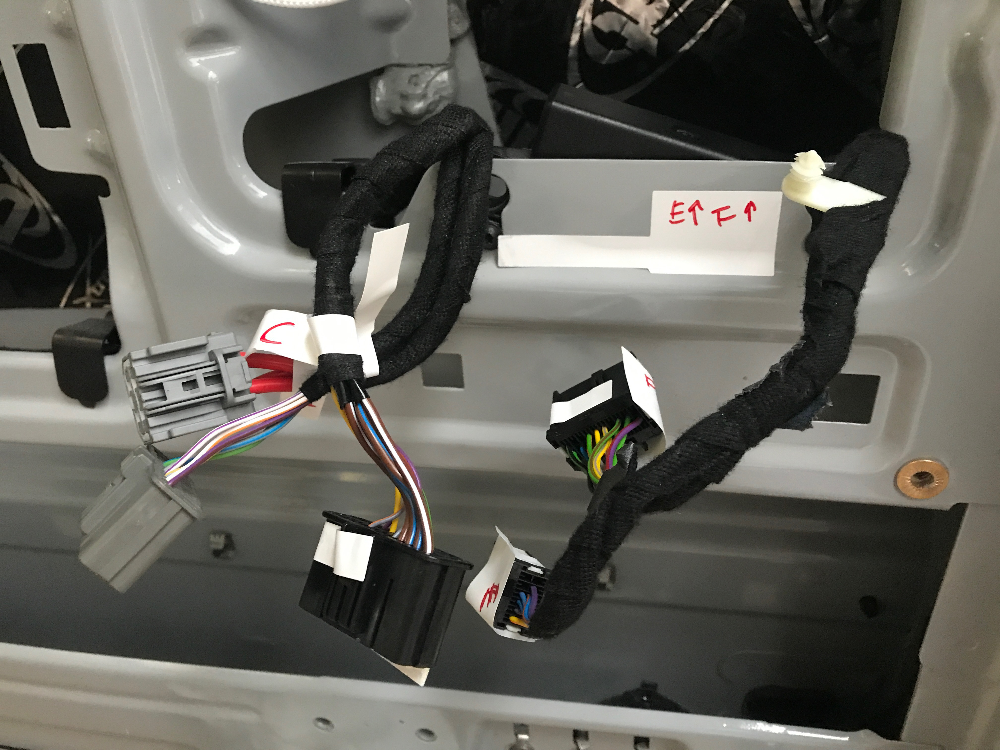
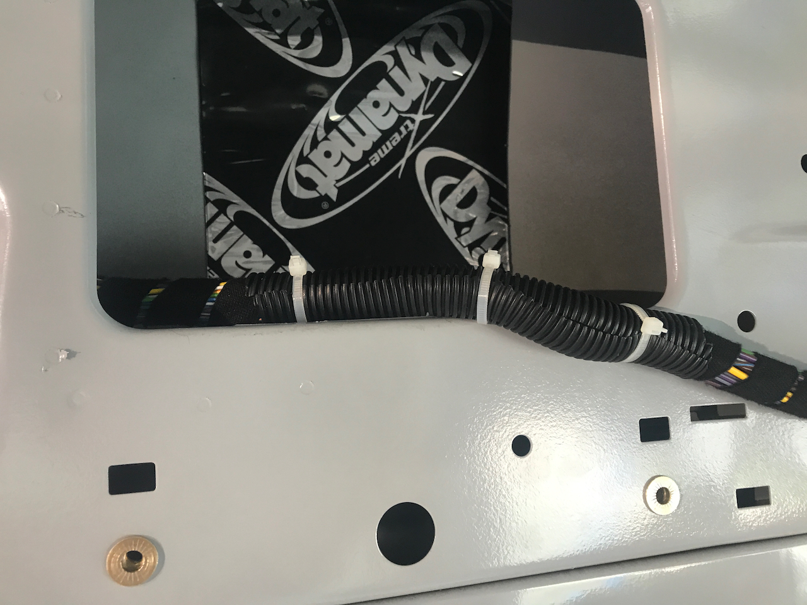
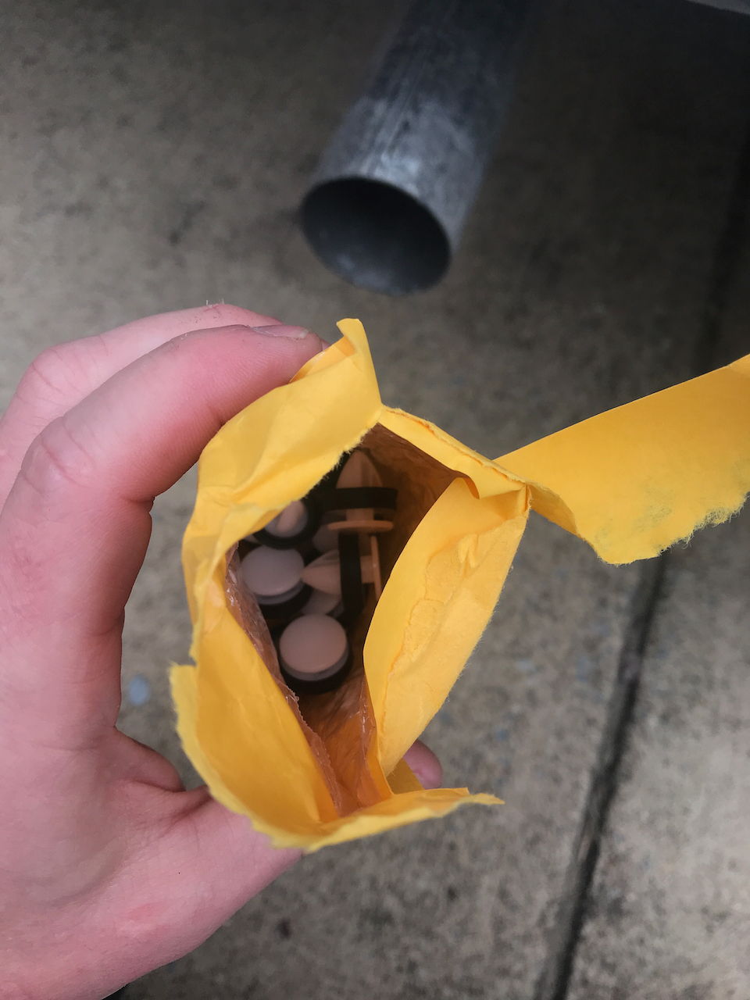
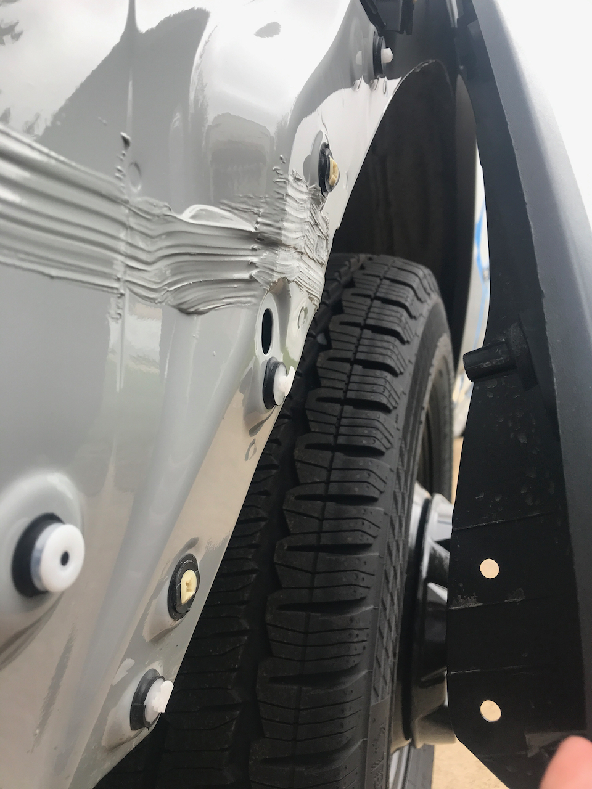

**TLDR: For our build, it made sense to reroute the factory harness in the cargo area.  YMMV.**

For our build we planned to have soft overhead storage mounted L-track running down the ceiling and walls.  The L-Track mounts using plusnuts that installed in the square holes used to mount the factory plastic harness guard.  We also planned to install the air handler for our Undermount AC system in the same location.

This work is not absolutely necessary.  We are sure we could work around the harness for all of the above and our neoprene insulation,  but it seemed pretty simple to get it out of the way all together.  It also yielded a cleaner build.

Our guide for this work was [this post]() by forum member [@RichBuilt](https://www.fordtransitusaforum.com/members/richbuilt.104853/) which includes [this video](https://www.youtube.com/watch?v=p-ynmpxAlHw&t=2s) by the same.

_Label liberally!_

One slight difference from the video was the harness that ran down the passenger side in our van.  Depending on vehicle options, you may or may not have one, but the process is the same as the driver/rear harness.

Lastly, you cannot do a full reroute without cutting, which we don't recommend.  There will be and area on both sides of the van where the harness must run outside the upper cavity because there is no hole large enough to pass the harness plugs through.

_Here you can se where we added some split loom to protect the harness the the area where it must run outside the upper cavity._

## Tips and Tricks

* Disconnect the battery before you disconnect anything else.  
* We'd recommend ordering [these replacement clips](https://www.amazon.com/dp/B07CJL9XSN?psc=1&ref=ppx_yo2_dt_b_product_details) before you start.  It's highly likely you'll break a few removing the passenger rear trim to access some of the harness disconnections.  You feel much better if you can just fix it immediately.
* Have plenty of split loom and zip ties on hand.  You do NOT want to damage this harness now, or down the road.  As you reroute the harness you can add protection to any areas that cross sharp metal edges or spot weld slag.
* Don't force the harness plugs/disconnects.  If you are having trouble, you're probably not seeing a release tab.
* Label everything as you disconnect (e.g., A' to A').  The plugs are generally unique, but we can't say for sure they will always be based on the options on your van.
* We initially aspired to write detailed instructions for the passenger rear trim removal.  But we're over a year out at this point.  What we can say is its pretty easy and straight forward once you get into it.

_Get these ahead of time, you'll probably need them._

_Here you can see a few broken clips._

## Timeline

Note, this doesn't reflect full time effort.  It's mostly evenings and partial days, limited by other work, clip delivery, etc.

* Completed passenger side harness reroute, finished all disconnections on driver/rear side harness except grounds, broke clips removing passenger rear trim (10-8-2021)
* Completed driver/rear harness disconnects (10-9-2021)
* Finished driver/rear harness reroute, replaced broken clips and re-installed trim (10-10-2021)
* Reconnected battery, only forgot 3 connections ;) (10-11-2021)