**TLDR: We used Dynamat Extreme for sound dampening.  We used automotive felt, neoprene, and thinsulate for thermal (and some acoustic) insulation of the walls and ceiling.**

## Sound Dampening

All of the consumer damping products (dynamat, killmat, etc.) operate via the same mechanism and are also known technically as "[constrained layer damping](https://en.wikipedia.org/wiki/Constrained-layer_damping)":  

A thick flexible glue-like layer is sandwiched between two longitudinally stiff layers.  One of these stiff layers is the van sheet metal.  The other is a thin layer of aluminum foil/sheet.  

As the sheet metal panel attempts to vibrate, it is bending (like a drum head) and thus stretching.  The glue layer tries to bring the other stiff layer along for the ride.  That layer doesn't want to stretch.  

This puts the glue layer in shear, which dissipates some of the vibrational energy as heat.  Thus the vibration is damped.

A secondary affect, which is probably almost as responsible for the effectiveness of consumer products.

Given those mechanisms, one can see where it will be the most effective and least effective.  Large flexible panels subject to high displacement vibration will see a lot of benefit.  Stiff areas, like the floor with its stiffening corrugation will see little benefit.

On Van 1.0 we used a product distributed a local (and fantastic) Maryland company that operated a website called "sounddeadenershowdown.com" (SDS).  We were able to obtain large sheets that could double as a sort-of thermal break/condensation barrier for the internal sheet metal.  We used it to pretty much cover the walls and floor. The company ceased operations sometime between Van 1.0 and 2.0 so we had to pursue other products.

We decided to go with [Dynamat Extreme](/van/parietal/sound-deadening/sound-deadening).  Two [boxes](https://www.amazon.com/gp/product/B00020CB2S/) were enough to liberally hit all the vibration susceptible panels in the walls, roof, and doors with a little left over.  This included cutting smaller pieces to go against the outer sheet metal inside the structural bump-outs near the ceiling and floor.  Not much else to say on this front, pretty easy and nothing you wouldn't find in the majority of builds out there.

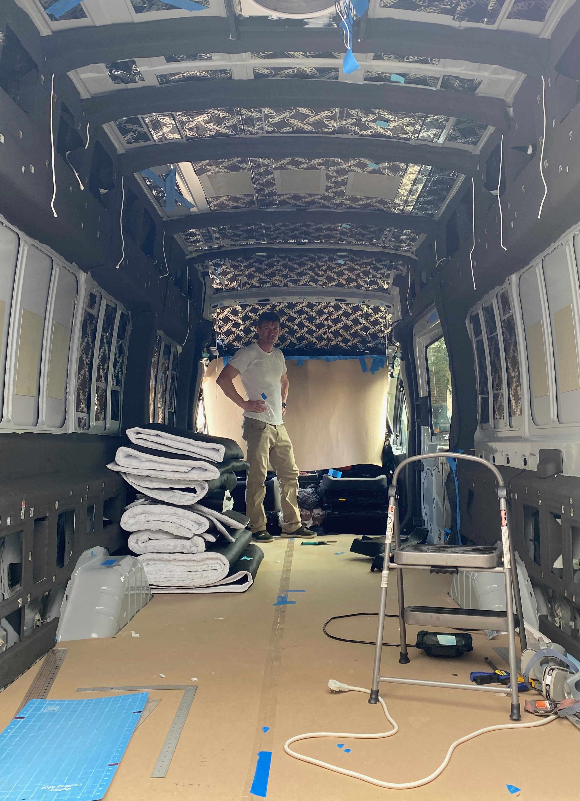
_This should give a sense of our liberal coverage with Dynamat Extreme.  We'll discuss all the other black stuff on the walls later._

## Neoprene

Because we invested in a cheap Harbor Freight air compressor, cheap Harbor Freight [HVLP spray guns](https://www.harborfreight.com/air-tools-compressors/air-spray-guns/hvlp-lvlp-spray-guns.html), and procured [Weldwood Landau](https://www.amazon.com/Dap-Weldwood-Contact-Adhesive-Solvent/dp/B004IH3HAQ) by the gallon, we were not as limited from an adhesive perspective like we would be using a can based product like 3M-90.

This enabled us to liberally use 1/8" thick neoprene to cover the the van sheet metal and ribs that would not be covered by thinsulate.  This eliminates high conductivity "radiators" that can rob the interior of warmth or coldth.  Some of this metal would be behind cabinets, or wall panels, which would limit this effect, but much of it would remain in communication with the bulk air in the van (e.g. behind and around our duffle bag based overhead storage).  It was low enough effort that it just made sense do it all rather than be selective.  So thats what we did.

We masked areas of the main factory wire harness that could get sprayed.  We made tons of 1x1 inch square pieces of masking tape and covered all our plusnuts.  We labeled, photographed, and masked remaining factory holes so we could use them in the future.  We ran string through the roof ribs to allow later fishing of thinsulate through them which would be difficult with the neoprene covering many of the access holes.

Our process for the large areas was:

* Glue a large sheet of neoprene over an area of the metal structure.
* cut "X's" into the neoprene covering the "windows" in the structure.
* fold and glue the material around to the back side of the structure.
* Use a fine x-acto knife to librate the plusnuts

Lastly we hit the roof ribs and the vertical pillar structures.

Here's some pictures of the process:
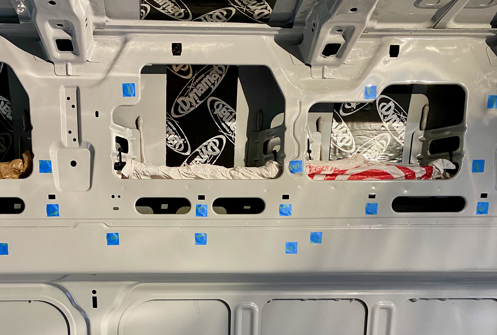
_Masking all the things._

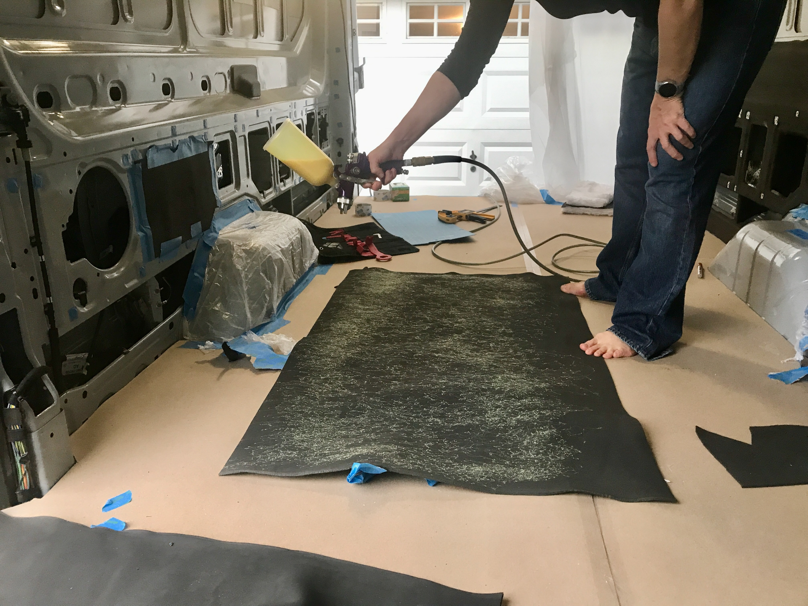
_Can't recommend the Harbor Freight air compressor/hvlp + Weldwood Landau approach enough.  Much better than buying a million cans of 3M-90._

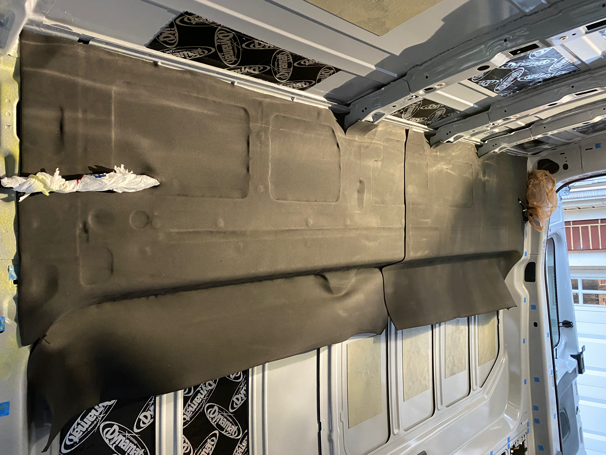
_Initial glue-up._

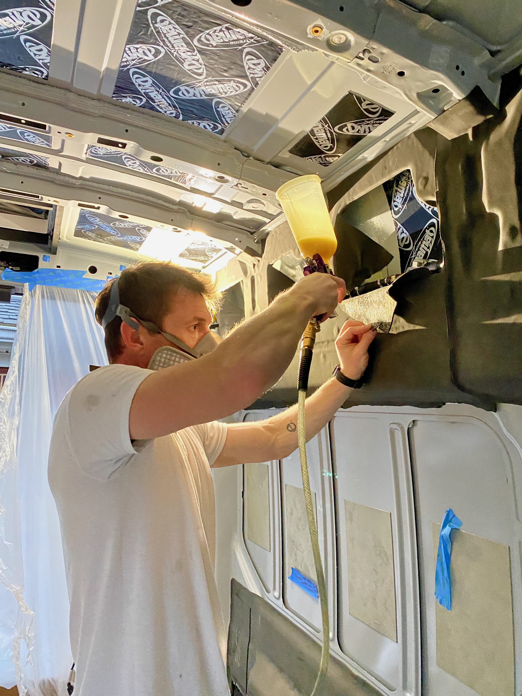
_Opening the windows and insulating the backside._

If you want to see the completed neoprene (with the exception of the front roof rib) scroll back up the picture showing the Dynamat.

We are very happy with how the full coverage neoprene worked out and how everything has held up 12 months in. 

Thermal insulation of a van is a bunch of resistors in parallel.  Without doing something about the metal inside that conducts to and from the outside, you have a thermal short circuit in your insulation system.

## Automotive Felt

We left Van 1.0 rough around the edges and never finished the exposed, hard to cover areas around the doors.  For Van 2.0 for asthetic and thermal reasons we planned to do better.

The obvious choice was "four-way-stretch automotive felt" used in [this video](https://www.youtube.com/watch?v=TON7xuJkQs8).  Well before van delivered we ordered material from a UK seller on Ebay.  That seller doesn't exist anymore, so we can't provide a link.  Most of the stuff appears pretty similar, based on some material we ordered (but didn't use) from [grahamfabrics.com](https://www.grahamfabrics.com/automotive-carpet-speaker-carpet-padding/).  We'd also recommend [perfectfit.com](https://www.perfectfit.com/Carpet-Flooring/Auto/Product/Trunklining) based on working with them regarding Lonseal and marine vinyl.

Initially we considered first applying 1/8" neoprene and then applying the felt over that.  This would provide better thermal insulation.  However, if you've ever worked with neoprene, it tears pretty easily.  Its quite possible that this would happen while working and repositioning the felt to follow the van's curves.  We decided to go with the safer, easier route and just go with the felt on bare metal.  You are still getting a significant insulating effect.

We used Weldwood Landau adhesive to bond the material to the van walls.  Twelve months later everything is holding strong.

We used three strips to do the areas around the sliding door and rear doors, overlapping and then cutting through both layers so they perfectly abut.  Its almost impossible to see these seams, and using a single piece would waste significant amounts of material.

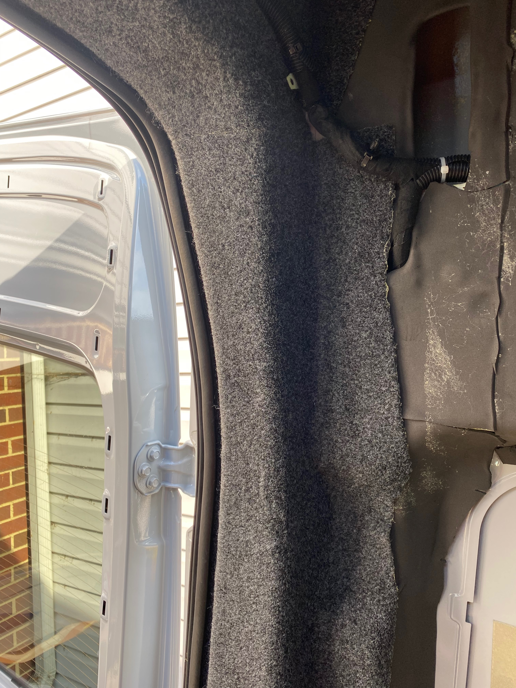
_If you look super close you might barely see the seam between two pieces at the corner._

The interior edges we left rough since they would be covered later by wall panels, ceiling panels, or stock trim.  

The exterior edges we are bonded to interior side of the seam that the sliding and rear door gasket is installed over.  This means the gaskets need to be removed, at least in the area being worked, and the grease needs to be cleaned off the surface the felt is adhered to.  We finished this late one night and regret not doing a better job degreasing both sides of the pinch seam.  No long term issues, but it made things messier and we are probably relying on the gasket for some mechanical fixing of the end of the felt.  In any case, the felt was glued down and then trimmed flush with the seam.  The gaskets were then install over it.  We though this approach might cause problems down the road with our Bug Wall install, but it did not.

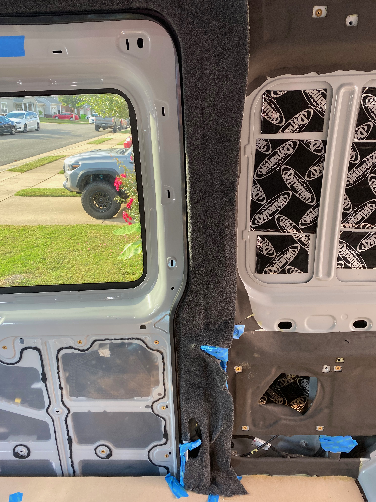
_We had no problem manipulating the felt to match all the curves.  Just be sure to start with a large piece and trim after installation._

We are very happy with how the felt turned out.  It provides a great looking trim that minimizes bare surfaces for condensation formation and heat loss/gain.  Highly recommend this approach.

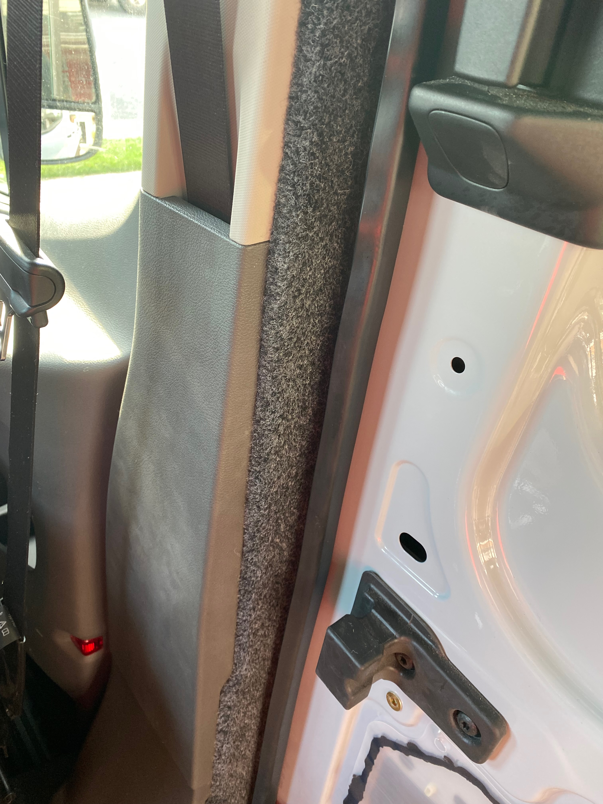
_Stoked with how pro it looks with the factory trim re-installed._

Several days later later we completed the "blobs".  We cut them according to this [video](https://youtu.be/bBWzx7OZXbA?t=861) and then covered them in felt.

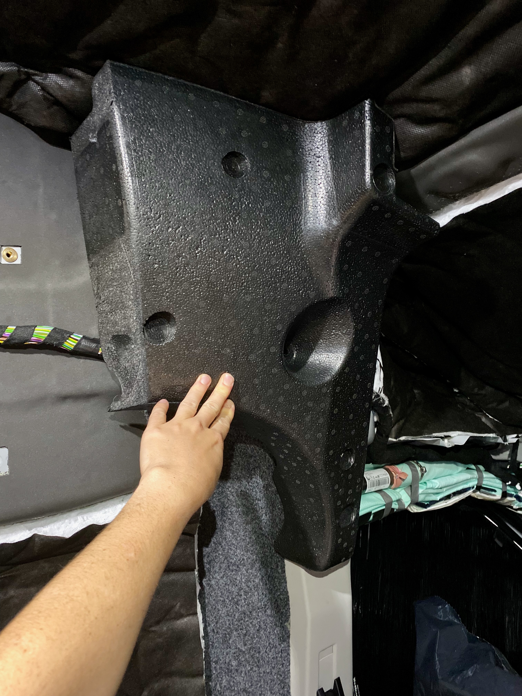
_This is what it looks like with rear edge cut to be straight._

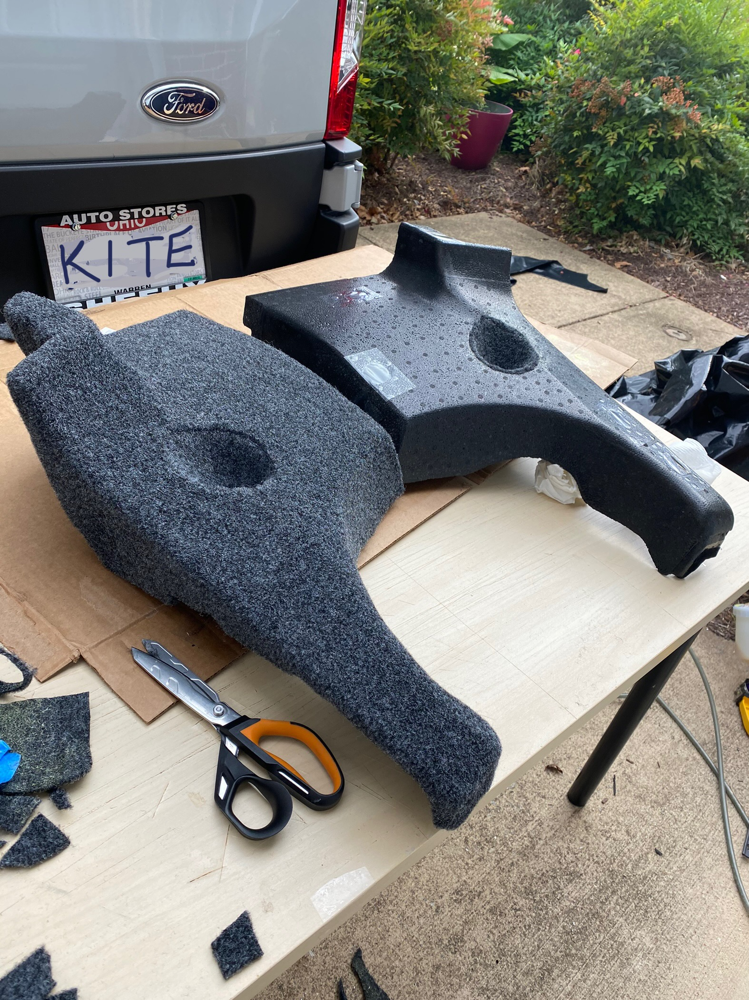
_Goodbye ugly black styrofoam._

We did find we needed to order [replacement plastic pins](https://www.amazon.com/gp/product/B07D6KXZKZ/) to effectively hold the blobs in place after reinstalling (the original pins were too deformed from removal).

## Thinsulate

We were very happy with our choice of thinsulate on Van 1.0.  We didn't think much at all about using it again.  While its not the best performer, its ease of install, and ease of working around during later portions of the build make it a great choice in our opinion. 

Not much to say about install, there's not much of a trick.  Cut and glue up the large pieces.  Cut and stuff the small pieces.

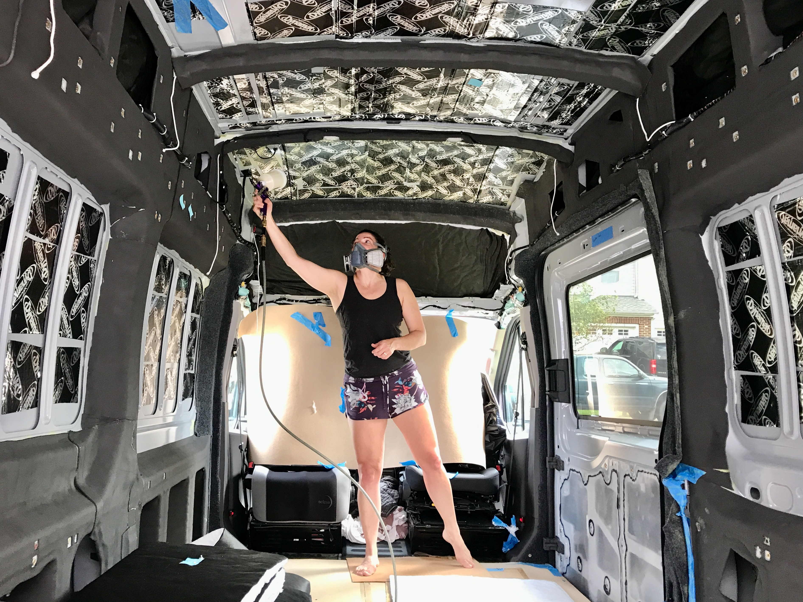
_Second ceiling piece about to go in.  You can see the first piece that will be covered by the headliner is already up._

## Fin

Here's the completed wall and ceiling sound and thermal treatments.  We'll get even more thermal and sound insulating from the remainder of the build (cabinets, wall panels, ceiling panels) but this is the foundation.

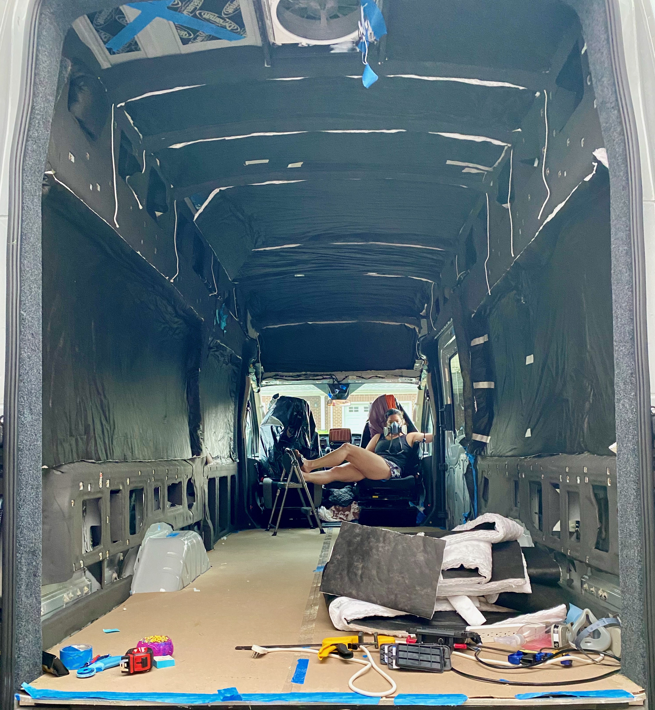
_Ok...not really finished.  There is still thinsulate that will go in to fill all the cubbies formed by the upper and lower van structure, in the sliding door, and in the rear doors, but we don't have a good picture of that._

## Tips and Tricks

* [Maui the Van](https://mauithevan.com/2020/09/2020-ford-transit-headliner-removal-noico-havelock-install/) has a great guide for removing the headliner which allows you access to add sound damping and thermal insulation to a region that really needs it.
* This [forum post](https://www.fordtransitusaforum.com/threads/b-pillar-trim-removal.82473/post-1071885) and this [forum post](https://www.fordtransitusaforum.com/threads/driver-side-b-piller-mid-and-lower-dress-panel-removal.82411/) are useful for B-Pillar trim removal.
* A wooden roller is useful for installing the Dynamat.
* These harbor freight HVLP guns are great for spraying many things including Weldwood Landau.  If you fail to clean well and brick one, its not too pricey to lose sleep over.
* Weldwood Landua was the primary adhesive we used on our build, for this work and later wall panel and ceiling panel uphostery.  Highly recommend it, just ensure you have a long time to let it finish off-gassing before you do a lot of closed up/inside work.
* Do NOT do any of this without a good respirator.  We've used these 3M respirators on two builds.  Don't forget to use fresh cartridges.
* Pay close attention to weather.  Adhesives generally have a narrow range of allowable application temperatures.  We luckily finished the thinsulate minutes before a cold front rolled in that heralded extended cold fall weather.

## What We Would Change

This is one of the few times that there isn't anything that we would change.  Our wall/ceiling thermal and sound treatments provide pretty complete coverage and have proven effective and durable after several months of full time use.

## Timeline

Note, this doesn't reflect full time effort.  It's mostly evenings and partial days, limited by work, ambient temperatures, etc.

* Ordered 5Mx2M anthracite stretch felt fabric from a UK ebay store (3-5-2021)
* Ordered one box of Dynamat Extreme (8-13-2021)
* Installed the bulk of our Dynamat (8-28-2021)
* Removed the "blobs" (10-6-2021)
* Removed headliner (10-7-2021)
* Installed Dynamat in the headliner (10-8-2021)
* Ordered another box of Dynamat Extreme (10-10-2021)
* Masked and started neoprene (10-11-2021)
* Exposed plusnuts (10-12-2021)
* Finished wall and most of ceiling neoprene (10-13-2021)
* Removed B-pillar trim, completed automotive felt install (10-15-2021)
* Reinstalled B-pillar trim, finished roof rib neoprene, finished bulk wall and ceiling thisulate (10-16-2021)
* Finished the wheel well neoprene and glued the thinsulate in teh lower structural cubbies (20-21-2021)
* Cut "blobs" (10-22-2021)
* Covered "blobs" in automtive felt (10-23-2021)
