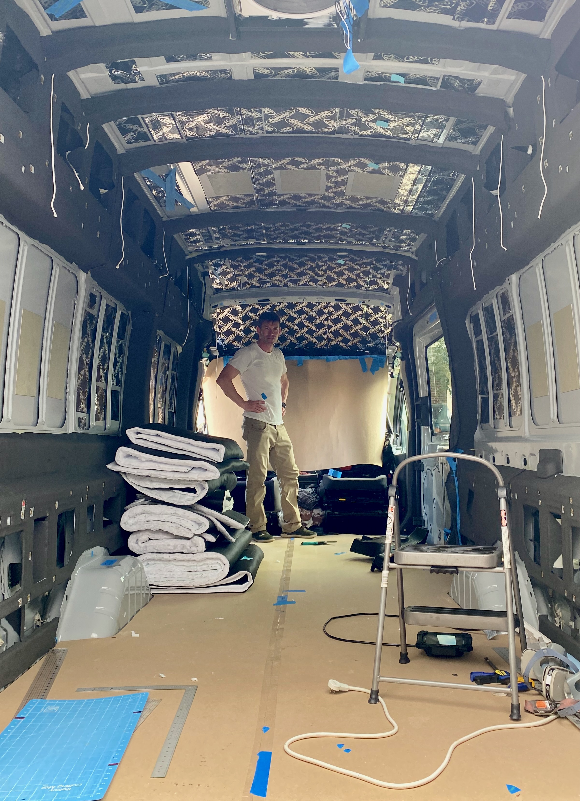

**TLDR: We used Dynamat Extreme for sound dampening.  We used automotive felt, neoprene, and thinsulate for thermal (and some acoustic) insulation of the walls and ceiling.**

## Sound Dampening

All of the consumer damping products (dynamat, killmat, etc.) operate via the same mechanism and are also known technically as "[constrained layer damping](https://en.wikipedia.org/wiki/Constrained-layer_damping)":  

A thick flexible glue-like layer is sandwiched between two longitudinally stiff layers.  One of these stiff layers is the van sheet metal.  The other is a thin layer of aluminum foil/sheet.  

As the sheet metal panel attempts to vibrate, it is bending (like a drum head) and thus stretching.  The glue layer tries to bring the other stiff layer along for the ride.  That layer doesn't want to stretch.  

This puts the glue layer in shear, which dissipates some of the vibrational energy as heat.  Thus the vibration is damped.

A secondary affect, which is probably almost as responsible for the effectiveness of consumer products.

Given those mechanisms, one can see where it will be the most effective and least effective.  Large flexible panels subject to high displacement vibration will see a lot of benefit.  Stiff areas, like the floor with its stiffening corrugation will see little benefit.

On Van 1.0 we used a product distributed a local (and fantastic) Maryland company that operated a website called "sounddeadenerhowdown.com".  We were able to obtain large sheets that could double as a sort-of thermal break/condensation barrier for the internal sheet metal.  We used it to pretty much cover the walls and floor. The company ceased operations sometime between Van 1.0 and 2.0 so we had to pursue other products.

We decided to go with [Dynamat Extreme](/van/parietal/sound-deadening/sound-deadening).  Two [boxes](https://www.amazon.com/gp/product/B00020CB2S/) were enough to liberally hit all the vibration susceptible panels in the walls, roof, and doors with a little left over.  This included cutting smaller pieces to go against the outer sheet metal inside the structural bump-outs near the ceiling and floor.  Not much else to say on this front, pretty easy and nothing you wouldn't find in the majority of builds out there.

_This should give a sense of our liberal coverage with Dynamat Extreme.  We'll discuss all the other black stuff on the walls later._

## Automotive Felt

We left Van 1.0 rough around the edges and never finished the exposed, hard to cover areas around the doors.  For Van 2.0 for asthetic and thermal reasons we planned to do better.

The obvious choice was "four-way-stretch automotive felt" used in this video.  Well before van delivered we ordered material from a UK seller on Ebay.  That seller doesn't exist anymore, so we can't provide a link.  Most of the stuff appears pretty similar, based on some material we ordered (but didn't use) from [grahamfabrics.com](https://www.grahamfabrics.com/automotive-carpet-speaker-carpet-padding/).  We'd also recommend [perfectfit.com](https://www.perfectfit.com/Carpet-Flooring/Auto/Product/Trunklining) based on working with them regarding Lonseal and marine vinyl.

Initially we considered first applying 1/8" neoprene and then applying the felt over that.  This would provide better thermal insulation.  However, if you've ever worked with neoprene, it tears pretty easily.  Its quite possible that this would happen while working and repositioning the felt to follow the van's curves.  We decided to go with the safer, easier route and just go with the felt on bare metal.  You are still getting a significant insulating effect.

We used Weldwood Landau adhesive to bond the material to the van walls.  Twelve months later everything is holding strong.

We used three strips to do the areas around the sliding door and rear doors, overlapping and then cutting through both layers so they perfectly abut.  Its almost impossible to see these seams, and using a single piece would waste significant amounts of material.

_If you look super close you might barely see the seam between two pieces at the corner._

The interior edges we left rough since they would be covered later by wall panels, ceiling panels, or stock trim.  

The exterior edges we are bonded to interior side of the seam that the sliding and rear door gasket is installed over.  This means the gaskets need to be removed, at least in the area being worked, and the grease needs to be cleaned off the surface the felt is adhered to.  We finished this late one night and regret not doing a better job degreasing both sides of the pinch seam.  No long term issues, but it made things messier and we are probably relying on the gasket for some mechanical fixing of the end of the felt.  In any case, the felt was glued down and then trimmed flush with the seam.  The gaskets were then install over it.  We though this approach might cause problems down the road with our Bug Wall install, but it did not.

_We had no problem manipulating the felt to match all the curves.  Just be sure to start with a large piece and trim after installation._

We are very happy with how the felt turned out.  It provides a great looking trim that minimizes bare surfaces for condensation formation and heat loss/gain.  Highly recommend this approach.

_Stoked with how pro it looks with the factory trim re-installed._

## Neoprene

## Thinsulate

## Tips and Tricks

* A wooden roller is useful for installing the dynamat
* These harbor freight HVLP guns are great for spraying many things including Weldwood Landau.  If you fail to clean well and brick one, its not too pricey to lose sleep over.
* Do NOT do any of this with out a good respirator.  We've used these 3M respirators on two builds.  Don't forget to use fresh cartridges.

## What We Would Change

## Timeline

Combined timelines

2021-3-5
Ordered 5Mx2M anthracite stretch felt fabric from a UK ebay store.

2021-8-13
Ordered one box of [Dynamat Extreme](https://www.amazon.com/gp/product/B00020CB2S/)

2021-8-28
Installed bulk dynamat

2021-10-6
Removed blobs

2021-10-7
Removed headliner following maui guide

2021-10-8
Dynamat in headliner area

10-10-10
Ordered another box of Dynamat Extreme (for doors?)

2021-10-11
Masked and started neoprene (finished most of it)

2021-10-12
Exposed plusnuts

2021-10-13
Finished all neoprene (roof ribs, sides)

2021-10-15
Removed trim
Finished automotive fabric
Link to trim removal: https://www.fordtransitusaforum.com/threads/b-pillar-trim-removal.82473/post-1071885
Another helpful post: https://www.fordtransitusaforum.com/threads/driver-side-b-piller-mid-and-lower-dress-panel-removal.82411/

2021-10-16
Replaced trim
Finished all thinsulate and neo (except wheel wells)
Thinsualated and neoprened headliner area

2021-10-21:
Neoprened the wheel wells
Glued the lower thinsulate insulation

2021-10-22
Cut Blobs.  Used this video as inspiration:
https://youtu.be/bBWzx7OZXbA?t=861

1021-10-23
Covered blogs in auto fabric  
reinstalled head liner after vantop camera wirinig was ocmplete  
Couldn't get good purchase with pin re-install blobs with all the insulation and neo, will bolt through. Update - ordered new plastic pins and they installed snug.