**TLDR: We built Van 2.0's structure with 15 series 8020 extruded aluminum based on its precision, strength, and popularity among DIY van conversion projects. Ordering cut-to-length and counter-bored pieces made assembly and install a breeze (relatively).**

## Structure Assembly

We ordered our 8020 through a local-ish affiliate named PennAir.  When I originally called 8020 they recommended not ordering directly for such a large order.  PennAir was great to work with and made pickup super easy.  

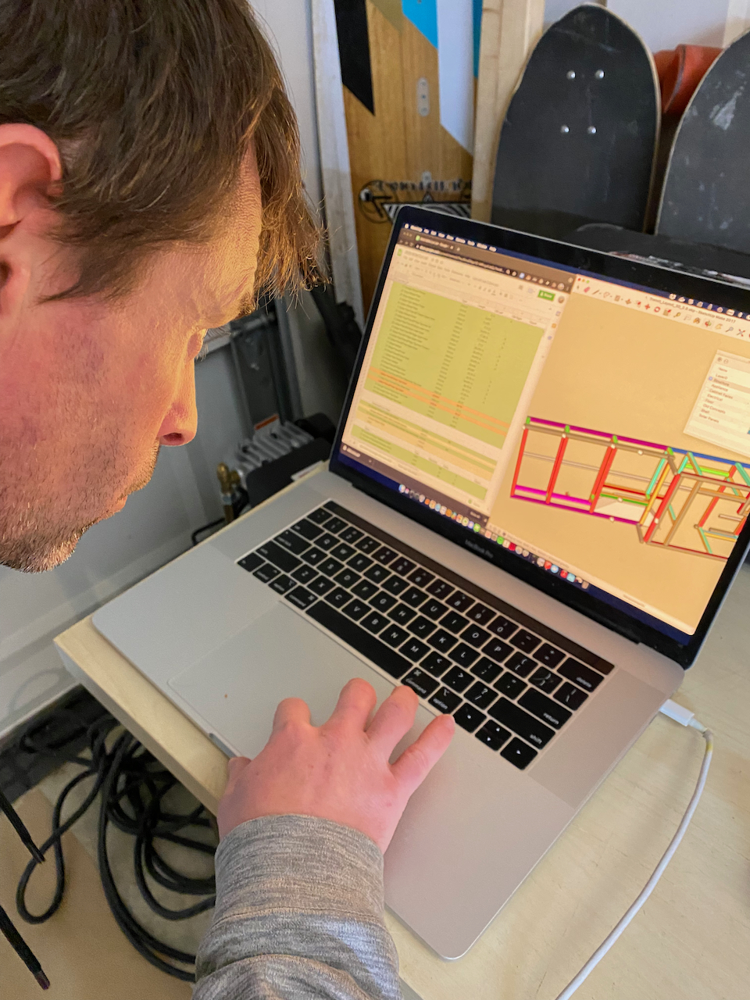
_We checked each piece of as we unloaded._

We spent the first night checking the delivery vs our BOM and found no issues.  We also put some masking tape on the smooth faces that would be exposed on the galley fronts.

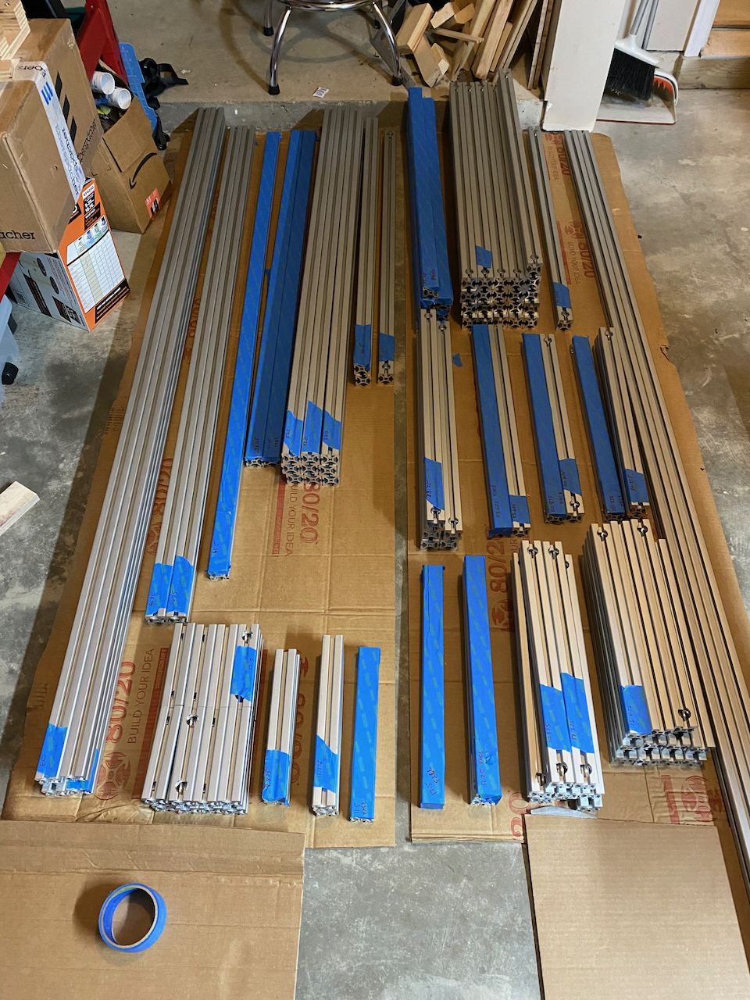
_A nice organized laydown area always makes things easier._

Early in the assembly, we found that we could not tighten the anchor fasteners in the short six inch cross members in the rear portions of the structure.  To solve this problem we cut a rounded hex key short to use with a small ratchet.

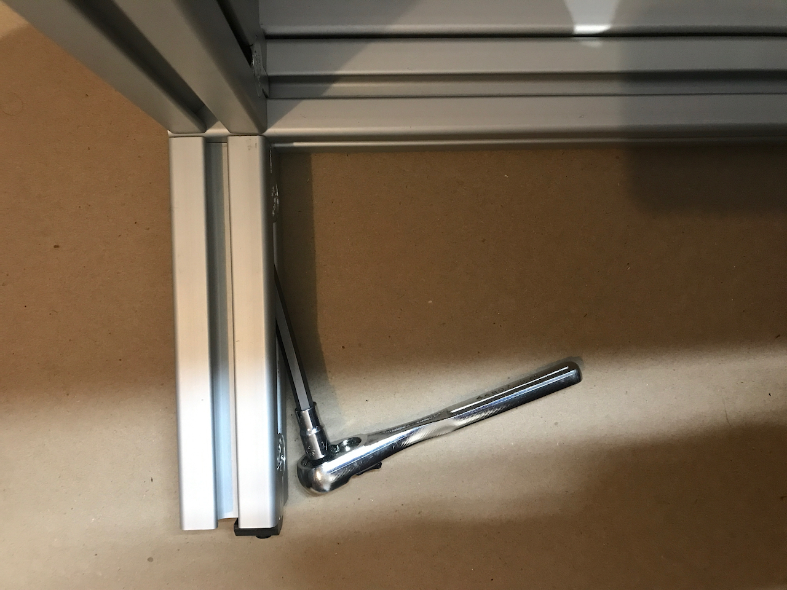
_Here you can see how it works and why its needed._

Assembly was quick, each side took maybe an hour or so.  The slowest part is just making sure everything stays square.  If we did this again, we would probably design some tooling to help with the holding pieces square during fitup and fastening rather than just using speed squares.

Another tip is to build it on a flat a surface as possible.  The garage floor we assembled on wasn't super flat which made keeping things square more difficult.

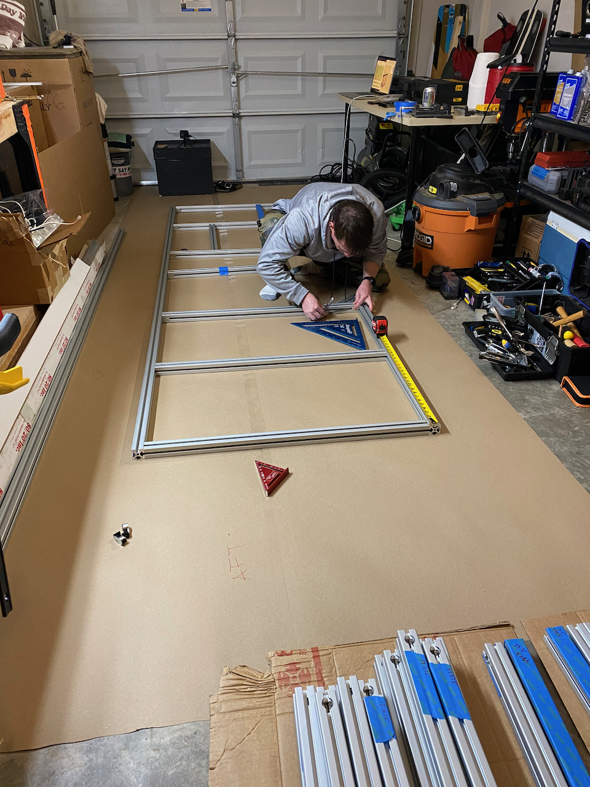
_It gets a little more challenging to keep square once you break into that third dimension._

Here's our driver and passenger side timelapses for your viewing pleasure.

`vimeo: https://vimeo.com/644786579`
_Driver side._  

`vimeo: https://vimeo.com/644787257`
_Passenger side._  

After assembling each side, in turn, we loaded them into the van for a trial fit.  The only interference we found was on the passenger side D-pillar power point.  We had no anticipated need for this power source, but we relocated it to the D-Pillar access panel.

When we designed the structure, there were a few locations/dimensions that we didn't want to fix in advance.  One of these was the length of the in-board upper fore-aft pieces in the garage.  We wanted the pieces to end as close to the rear doors as possible while supporting an athwart cross piece that spans between the D-pillars.  

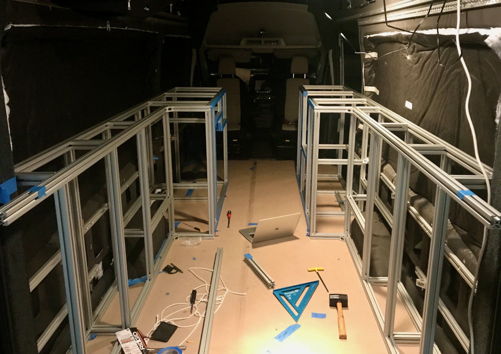
_This image shows both sides during the test load.  Toward the bottom of the image you can see the two pieces protruding past the D-pillar that we cut to length after measuring in place._

We ordered these intentionally long, and then once the two assemblies were loaded, we measured in place, removed and cut these two pieces (to 70 inches).  Then we were able to measure and cut that rear-most athwart piece (to 61.25 in).  We could now close the rear doors again.

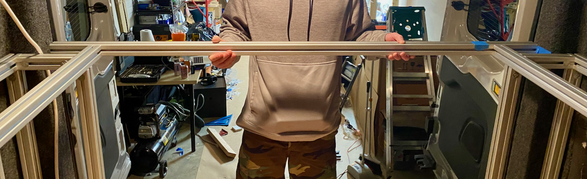
_Testing placement of the rear-most cross member after all cuts._

After the test loads we moved on to final squaring and torquing.  One side at a time, and one joint at a time, interatively, we went back and carefully squared each each structure.  This was time consuming.  Once we had a structure fully squared, we'd use extra brackets to support a single joint, remove each fastener one at a time, add loc-tite, and torque.  Based on [this guide](ebn-spring15.pdf), we settled on 10 ft-lbs.  Then we'd mark the fastener with green tape, remove the support, and move on.  This was also time consuming.  In hindsight with better jigs and squaring tools, we probably could have done all the squaring as part of initial assembly.  While this process was ongoing, we began working on the panels that would fasten to the backside of each assembly.

## Backside Panels

We decided to mount 1/2 in Okoume plywood to the backside of the structures in the rear.  We did this to:
* provide a surface to mount heavy electrical components
* attach restraints for gear
* keep stuff from falling between the structure and van walls
* stiffen the structure from a "parallelogram" mode of deformation while moving around prior to fastening in place

Our use of the half-height wall 8020 gives enough space on the backside of the structure for these panels (it also allows the structure to clear the inward curvature of the van).

We cut the panels, drilled the holes and features for attachment and access, and then sprayed four coats of water-based spar urethane (our default treatment for all wood used in the build).

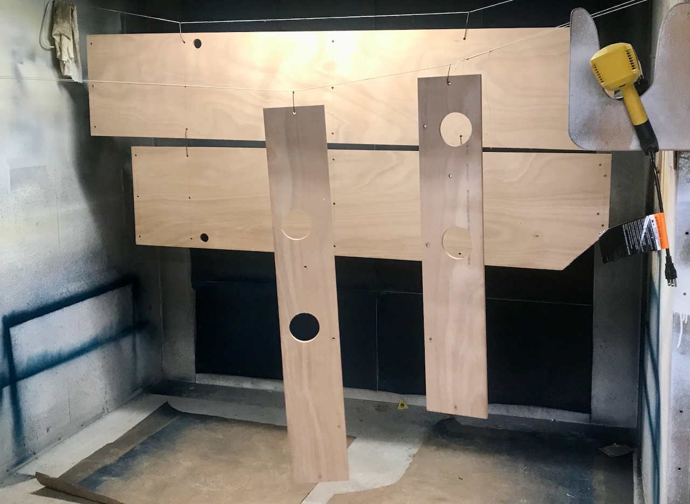
_The passenger and driver side backside panels.  We were super fortunate to have access to a spray booth with incredible exhaust.  It kept dry times to about 40 minutes per coat._

The backside panels are attached with 5/16" fasteners, t-nuts, and fender washers.  To further stiffen we added some 8020 gussets at upper midpoints and fastened to screw-in t-nuts set in the panels.

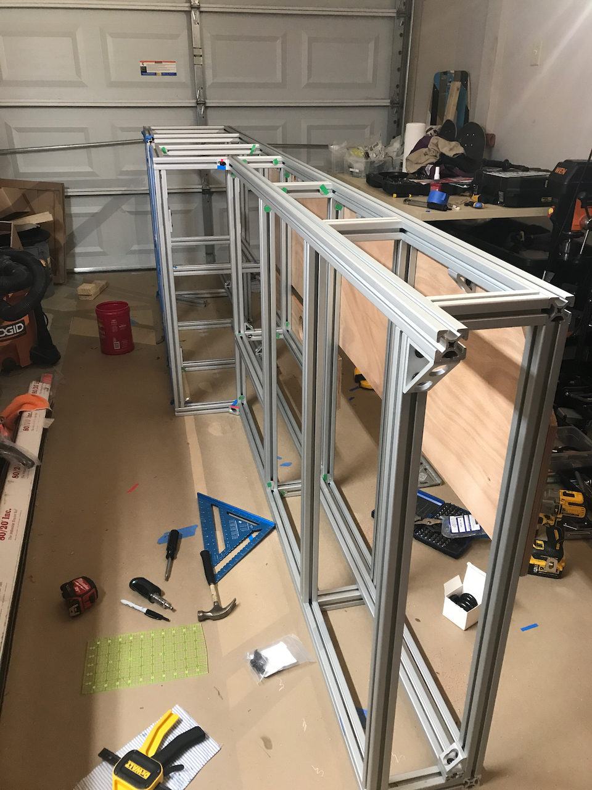
_You can see the 8020 gussets in between the verticals in this image.  You can also see the green tape denoting a squared, loc-tited, and torqued fastener._

We spent a lot of time figuring out how to mount the electrical equipment in a way that was secure but removable without access to the backside.  Similar to the gussets mentioned above, we opted to use screw-in tee-nuts.  We had ok experience with tee-nuts on Van 1.0 but wanted something more secure.

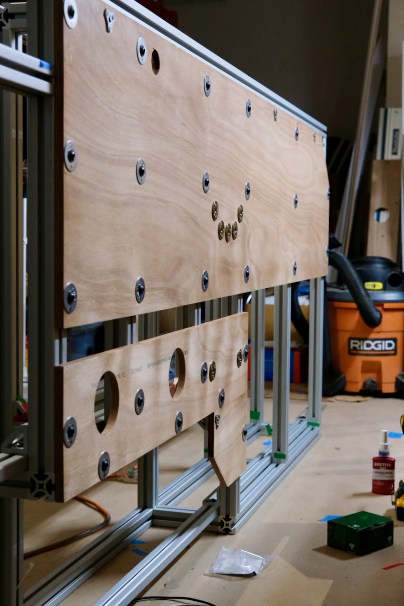
_In the middle of this image you can see six brass colored M6 screw in tee-nuts.  These receive the fasteners for the Multiplus mounting bracket and the two fasteners at the bottom of the Multiplus.  Later we added four additional tee-nuts above the Multiplus mount location for the MPPT.  Along the top of the panel are the additional 5/16" screw in tee-nuts for the 8020 gussets.  All other attachments are just 5/16 fasteners, fender washers, and drop-in t-nuts._

<b>All The Electrical Mounting Details</b>

This is mostly for our own benefit just so we remember how this was done.

## Multiplus Mounting: 

* [Button Head Hex Drive Screws Zinc-Plated Alloy Steel, M6 x 1 mm Thread, 20 mm Long](https://www.mcmaster.com/91306A673/)
* Bracket to Back Panel [Steel Phillips Flat Head Screws M6 x 1 mm Thread, 20 mm Long](https://www.mcmaster.com/91420A428/)
* [Three-hole M6 Tee-Nuts](https://www.amazon.com/gp/product/B08LMYNSWF/)
* [#7 Phillips Flat Head Screws](https://www.mcmaster.com/90031A170/) attach the tee-nuts

We also found the tee-nuts were like 1/16" proud on the inside such that the bolted joint wasn't compressing the wood and helping to lock in the tee-nut.  To fix this we added four layers of self adhesive UHMW tape to the back of the Multiplus bracket and to the lower bolted region of the Multiplus.  This stood the components off so they did not rest or touch the tee-nuts.  If this doesn't make sense, just reach out.

We also f'd up and located the holes for the multiplus 1" higher than planned (measure three times I guess).  This placed the MPPT right up against the upper horizontal 8020 such that any natural convection across its heat sink fins would be blocked.  

## MPPT Mounting: 

Originally we were going to use the same M6 hardware for the multiplus.  However, because we screwed up the multiplus location and impacted the MPPT natural convective cooling, we decided to use spacers to offset the MPPT inboard so that it's fins were not fully blocked by the 8020 above it.  It turns out that M6 spacers that met our requirements were hard to procure.  Thus we shifted to 1/4-20 hardware, as spacers in that dimension were easier to come by.  However, all the 1/4-20 screw-in tee-nuts we purchased seemed really wimpy.  So we then pivoted to 5/16 hardware.  This meant enlarging the MPPT mounting holes, which we did with a step bit.  Full stack:

* [Black-Oxide Alloy Steel Flanged Button Head Screw 5/16"-18 Thread, 1-1/2" Long](https://www.mcmaster.com/91355A189/) attach the MPPT to the backside panel
* [Zinc-Plated Steel Unthreaded Spacer 3/4" OD, 3/4" Long, for 5/16" Screw Size](https://www.mcmaster.com/92415A131/) spaces the MMPT inboard to allow convective cooling
* [Zinc-Plated Steel Oversized Washer for 5/16" Screw Size, 0.344" ID, 1.25" OD](https://www.mcmaster.com/91090A111/) sit between the spacer and the wood
* [Zinc-alloy three-hole 5/16-18 Tee-nuts](https://www.mcmaster.com/94122A100/) mates with the main fastener
* [#6 Phillips Flat Head Screws](https://www.mcmaster.com/90031A148/) attach the tee-nuts

In hindsight, we should have fabricated spacers out of FR4 from the same stock we used for floor bolting.  Then we could have picked our length and stuck with M6 hardware through the process.

## Final Load and Install

For each assembly, after we completed the backside panels install we proceeded with the final load (to allow squaring and working panels for the other assembly).  We led with the driver side assembly.

We braced it with extra 8020 to make sure all joint remained square during movement.  We loaded it into the van and removed the bracing.  With the structure nearly in place, we could see where all the structure and panels were located against the van internals.  We modified the stock factory wall panel material to cover the van interstitial spaces that aren't covered by our backside panels. We cut and attached them such that they can be easily removed with the assemblies installed.  We did this keep things tidy and provides a little thermal benefit. 

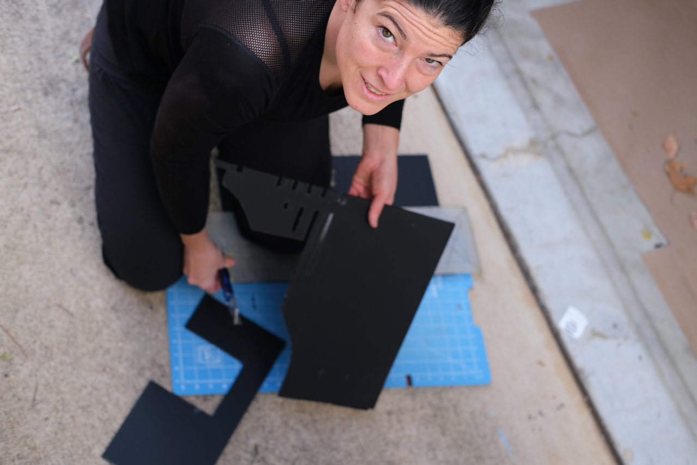
_These prevents wires from poking out, and crap from falling into crevices._

We also had to feed all of our branch wiring that runs in the van interstitials through the accesses we included in the backside panels prior to moving into place.

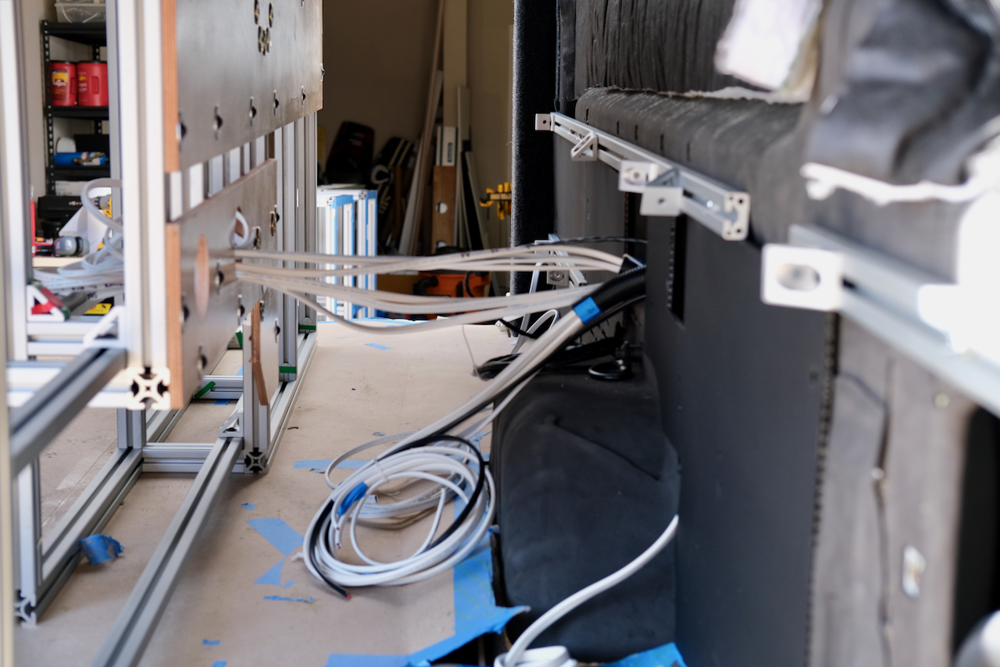
_We have a lot of wiring.  This image also shows the modified factory panels pretty well._

After we had all the stuff behind the assemblies sorted, we moved them into place.Once the assembly was in the correct location and bolted it to the wall 8020.  We then identified the four floor-through-bolting locations for that assembly.  We then drilled, primed, and painted the floor holes.  We then fabricated the brackets and through-bolted that side.

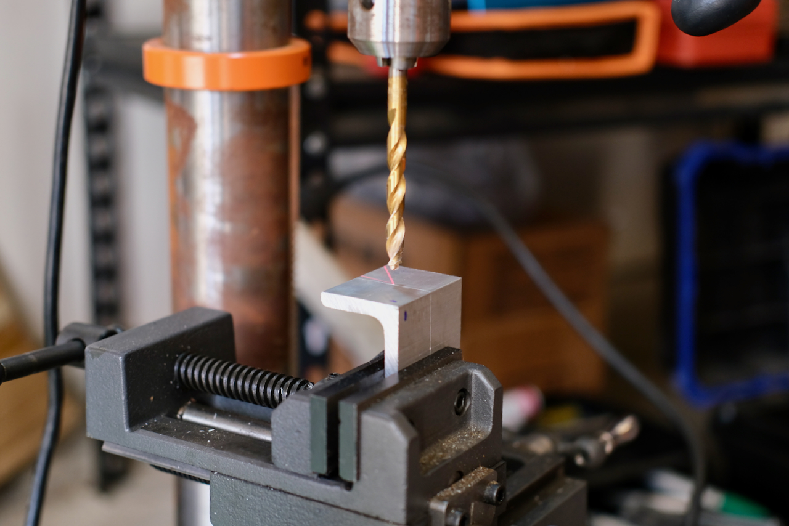
_I think everyone can imagine what bracket fabrication looks like, but have some B-roll._

### Through Bolting - Here Be Dragons

**When you care about the integrity of a bolted joint it is critical to make sure the fastener involved is properly preloaded/tensioned.  If its not, the fastener will likely end up with excessive bending and/or shear stress and will fail.**  This becomes a challenge when you are bolting though materials less compressive strength and/or creep resistance than the fastener involved.  Bolting through a floor composed of wood and foam is a perfect example of this problem.  If you tried to preload the fastener you will just crush and destroy the floor under it and still never get appropriate tension on the fastener.

So, the right thing to do is insert a material that has sufficient compressive strength and creep resistance to withstand the appropriate level of preload.  We elected to use tubular FR4 which also provides a thermal break to eliminate heat conduction between the fastener and the other structure.

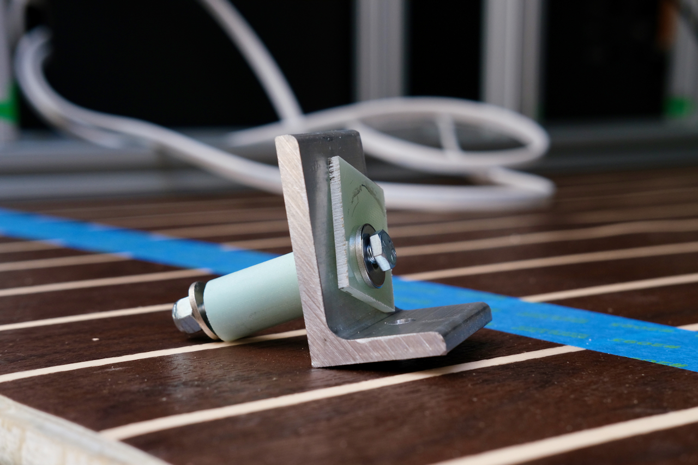
_This is what our though-bolting system looks like._

We used 1/4-20 fasteners for though bolting, but could have gone with something a little larger.  Step one is to drill a 1/4-20 hole in the right spot though the floor and floor sheet metal.  Step two is to drill a larger hole in the same location just through the floor.  The FR4 spacer is sized lengthwise to just allow a little compression of the floor when everything is tight.  The bracket is attached to the 8020 in the right location.  The fastener passes through, from inside out, a washer, an 1/8" FR4 thermal break, the bracket, the FR4 tubular spacer (and wood and foam), the floor sheet metal, a fender washer, and a lock nut.  We hit the underside components with primer and rubberized undercoat once they were all torqued.

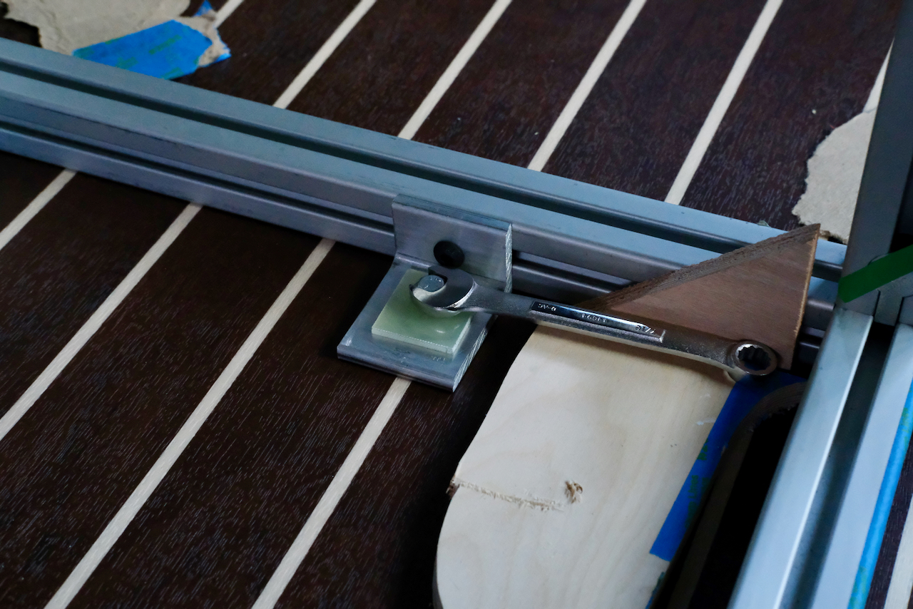
_Here's what that all looks like from inside._

<b>All The Through-Bolting Details</b>

We wanted the bracket to slightly compress the floor when the joint is fully preloaded.  We also have some "less compressible" areas in our floor where we used expanded PVC under the subfloor.  We didn't want to crush those areas.

Stackup of the minicell areas was 1 and 7.2/16 inches:

* 0.4 in layer of minicell
* 0.5 in layer of minicell
* 12 mm layer of baltic birch
* 2 mm layer of lon marine

Stackup of the expanded PVC areas was 1 and 6.5/16 inches:
* 13/16 in layer of expanded PVC
* 0.045 in layer of VHB tape
* 12 mm layer of baltic birch
* 2 mm layer of lon marine

Based on these two stackups we sized our spacers to just over 1 and 3/8 inches (keeping in mind we are cutting these on a band saw).

The components of our joint were:

* [Medium-Strength Grade 5 Steel Hex Head ScrewZinc-Plated, 1/4"-20 Thread Size, 2-1/2" Long, Fully Threaded](https://www.mcmaster.com/92865A552/) for the fasteners
* 1/4-20 washers for the inside washer
* [Flame-Retardant Garolite G-10/FR4 Bar Multipurpose, 1-1/2" Wide, 1/8" Thick, Yellow](https://www.mcmaster.com/8557K12/) for the inside thermal break
* 1.5" x 2.0" x 1/4" Aluminum Angle cut to 2" lengths for the brackets
* [Flame-Retardant Garolite G-10/FR4 Tube 3/16" Wall Thickness, 3/4" OD, 3/8" ID, 42" Long](https://www.mcmaster.com/6394A19/) for the spacers, cut to ~1 3/8"
* Assorted Fender Washers (largest that will fit interferences in each case) for the underside washer
* [Medium-Strength Steel Nylon-Insert Locknut Grade 5, Zinc-Plated, 1/4"-20 Thread Size](https://www.mcmaster.com/95615A120/) for the lock nuts

### End Through-Bolting Rant

After we had the driver side assembly though bolted, we loc-tited and torqued it to the wall 8020.  We then loaded and positioned the passenger side assembly following the same steps.

With both sides in, and one fully fixed, we measured for the remaining 8 cross members, and cut them.  We installed two cross members but did not fully tighten or torque.  

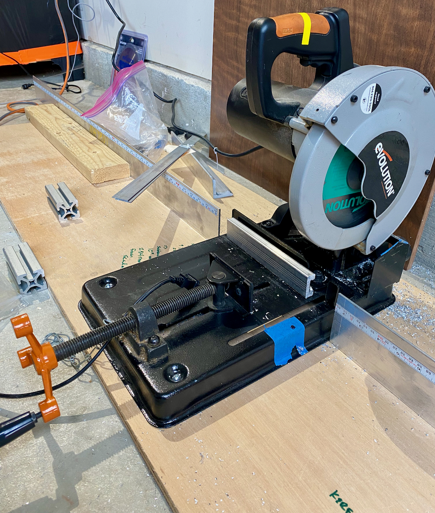
_Our cutting setup evolved and improved over time.  This is the version that got us though most of the build._

We then followed all the same sequence for though bolting and wall fastening for the passenger side assembly.  

Finally, we loc-tited and torqued the two cross members uniting the passenger and driver side assemblies into one single awesome structure like Voltron. And of course we never took a picture of this part...

## What We Would Change

For Van 3.0 (as if), to shave weight we'd probably use aluminum stock to mount the electrical components and use PennLight as a backing materials for the rest of the structure.  This would save approximately 13 lbs (and a lot of urethane and time).  We haven't used the rigidity or thickness of backside panels for restraining gear, and temporary structure could be employed for temporary rigidity.

For the MPPT mounting, we should have fabricated spacers out of FR4 from the same stock we used for floor bolting.  Then we could have picked our length and used the same with M6 hardware as the Multplus mounting.

We think with better jigs and squaring tools, we probably could have done all the precise final squaring as part of initial assembly rather than after the fact.  

Those aside, we are very happy with how it turned out and has held up.  

## Timeline:

Note, this doesn't reflect full time effort.  It's mostly evenings and partial days, limited by work, delivery times, wood shop access, etc.

* Ordered 8020 (9-9-2021)
* Picked up 8020 at PennAir, uncrated, sorted, inventoried, and taped smooth sides (10-18-2021)
* Started driver side assembly (11-2-2021)
* Fabricated tool for tightening short sections (11-4-2021)
* Completed driver side assembly, trial load of driver side (11-5-2021)
* Assembled passenger side (11-7-2021)
* Trial load of passenger side, cut rear fore-aft 8020 pieces to length (70 in), cut rear-most athwart 8020 piece to length (61.25 in), unloaded from van, measured for backside panels (11-8-2021)
* Picked up Okoume, cut backside panels (11-9-2021)
* Removed D-pillar 12V power point to eliminate interference, drilled and fitup upper backside panels (2021-11-11)
* Drilled and fitup lower backside panels (11-12-2021)
* Noodling on electrical layout, relocated planned espar location away from driver side rear (11-14-2021)
* Located holes in backside panels for passing wiring and anything else, noodling on general panel to 8020 mounting, began final squaring of driver side assembly (11-15-2021)
* Cut wheel well backside panel, Added holes in backside panels, sanded/sprayed  3 coats of spar urethane on backside panels (11-16-2021)
* Sanded/sprayed final coat of spar urethane on backside panels, fabricated floor-through-bolting spacers (11-18-2021)
* Brushed spar urethane on backside panel edges, installed 8020 vertical piece in electrical area, completed final squaring of driver side assembly (11-20-2021)
* Added temporary/supplemental squaring support, began torquing and lock-titing driver side assembly (12-2-2021)
* Continued torquing and loc-titing driver side assembly (12-3-2021)
* Completed torquing and loc-titing driver side assembly (12-5-2021)
* Discovered misaligned backside panel mounting holes due to squaring (12-9-2021)
* Dremel-slotted select backside panel mounting holes, installed driver side backside panels, installed tee-nuts for Multiplus, adhered 4 layers of UHMW tape to Multiplus bracket to clear inside raised edge of tee-nuts (12-11-2021)
* Installed tee-nuts in backside panels to attach upper edge to 8020 brackets, installed wheel well backside panel (12-12-2021)
* Installed 5/16 in tee-nuts for MPPT, enlarged MPPT mounting holes to accomodate 5/16 in fasteners (12-14-2021)
* Loaded driver side assembly into the van, tweaked plastic wall panels to ensure removable, drilled and primed/painted 4 driver side floor-through-bolting holes (12-15-2021)
* Started final squaring passenger side assembly, fabricated driver side floor-through-bolting brackets, through-bolted driver side assembly to floor, primed and painted driver side through-bolting hardware under van, torqued and loc-tited driver side assembly to wall 8020, finalized plastic van wall panels and installed (12-16-2021)
* Completed final squaring passenger side assembly, started torquing and loc-titing passenger side assembly (12-17-2021)
* Finished torquing and loc-titing passenger side assembly, dremel-slotted misaligned backside panel mounting holes due to squaring (12-18-2021)
* Drilled 1.5 in holes for sink drain and gas line, installed passenger side backside panels, loaded passenger side assembly into van and snugged to wall 8020  (12-19-2021)
* Cut 8 cross members to length, installed two cross members, drilled and primed/painted 4 passenger side floor-through-bolting holes (12-20-2021)
* Fabricated passenger side floor-through-bolting brackets (12-27-2021)
* Through-bolted passenger side assembly to floor, torqued and loc-tited passenger side assembly to wall, torqued and loc-tited forward cross members (12-28-2021)
* Primed and painted passenger side through-bolting hardware under van (2-11-2022)
