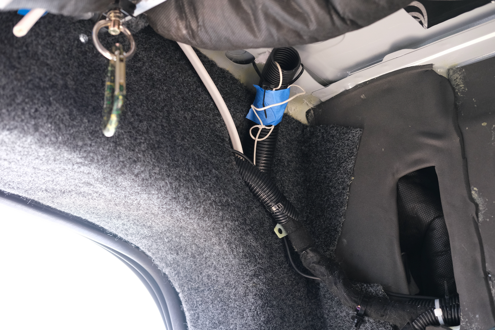
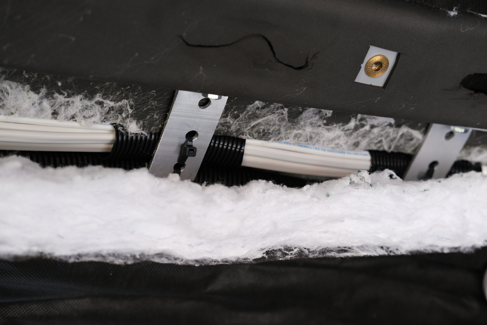

**We measured, planned, and ran all of our branch circuit wiring.  We also ran conduit for future expansion.**<!--excerpt-->

Van 1.0 gave us a pretty good feel for what we needed in terms of electrical circuits.  Many are dictated by major loads (fridge, lights, etc).  Others are dictated by personal choices like number of AC circuits and plug locations, USB charging locations, and switch locations.

The rationale for our circuit design and layout is captured in [this article](/van/electrical/circuits/circuits).

There are many guides out there on how to wire a van, but here is our general method:

1. Settle on the number of circuits, appliance locations, switch locations, and outlet locations.
2. Lay out the notional routes for the circuits.  This step is informed by the van structure and tolerance for exposed wire.  The ideal areas to run fore-aft are in the lower van walls and the upper van walls.  The ideal areas to route wires from the low areas to high areas are the C-pillar and D-pillar.  Those are also ideal places to cross from passenger to driver side against the roof.  The driver side B-pillar doesn't have a path from the low areas to upper areas.
3. Measure/estimate segments of the circuit routes (e.g., electrical panel to driver C-pillar base length, driver C-pillar base to passenger C-pillar base, etc).
4. Add up the segments of each circuit to get a one-way circuit length.
5. Double each circuit length to get the round-trip circuit length.
6. Based on the load/loads current, round-trip length, and a circuit calculator (there are many on-line or you can make your own), identify the minimum wire gauge that will support the circuit in terms of ampacity AND voltage drop.
7. Tally up the required lengths and gauges place an order for marine wire.  We highly recommend springing for Ancor wire.  We made the mistake of ordering some off-brand, and while it is electrically fine, the jacket around the duplex wire is really tough and difficult to strip.
8. Make the runs....Easier said than done.

Steps 1-7 are mostly covered in the article mentioned at the top.  The remainder of this post is about step 8.  

## Tools and Materials

Aside from wire, the following are helpful: 
* a fish-tape (Klein's are good)
* split conduit (Del City)
* zip ties
* really strong string (We strongly recommend spectra)
* non-split conduit is also nice to have depending on your approach (Del City)
* wire-gel lubricant (Amazon)

## Method

### Conduit
To maximize future flexibility we ran a lot of (non-split) 1.5 inch diameter conduit through the key route segments:

* Electrical Panel location to the top of the driver C-pillar (2 runs)
* Electrical Panel location to forward of the driver C-pillar (1 run)
* Electrical Panel location to the bottom of the driver D-pillar (? run)
* Top of driver C-pillar to Top of passenger C-pillar (2 runs)
* Bottom of passenger C-pillar to the top of the passenger C-pillar (2 runs)
* Bottom of driver D-pillar to top of the driver D-pillar (? runs)
* Bottom of passenger C-pillar to the passenger wheel well (? runs)

To make the runs, we: 
1. Passed the fish tape though the route segment.  
2. Passed a length of spectra back through the segment by retracting the fish tape.
3. Tied the spectra through a hole punched near the end of the conduit(s).
4. Tied second piece of spectra near the end of the conduit to trail (for future pulls).
5. Taped up the leading end to shape it into something less likely to catch on the way through.
6. Pulled the conduit(s) through while the other person pushed.

We found it was actually easier to pull two pieces at the same time rather than one after another for the vertical C-pillar runs.

_Empty conduit running through the D-pillar._

### Wire
For the wire, where possible we ran it outside of the conduit to leave the conduit open (future flexibility).  In some cases this would be difficult given the crowding from the conduit already run, so we would pull through the conduit.

To make runs outside the conduit, we:
1. Passed the fish tape though the route segment.  
2. Passed a length of spectra back through the segment by retracting the fish tape.
3. Attached the spectra to the wire(s) with an icicle hitch.
4. Tied a second piece of spectra to trail (for future pulls).
5. Taped of the hitch and shaped the leading edge into less likely to hang up.
6. Pulled the wire(s) through the route segment while the other person pushed.

To make runs inside the conduit, we:
1. Tied a piece of spectra to a cotton ball.
2. Sucked the spectra through with a vacuum.
4. Do steps 3-6 from the outside-conduit-case above.

The inside conduit case would benefit from lubricating the wires if you have the right lubricant.  We used spray teflon in some cases which seemed to help.  A proper cable lubricant would probably be best.

### Protection and Securing

For our circuit runs, we are only running sheathed duplex, triplex, and quadplex wire.  The outer sheath provide significant wire protection already.  We use split loom anywhere wire crosses over obvious sharp edges that we can reach.  In some cases we put split loom over a sharp edge itself to shield the wires nearby.  We also use insulation, and zip-tie wire to structure to limit motion.  Obviously wire run within conduit is well protected.

On Van 1.0 we used the plastic adhesive zip-tie anchors to secure wire.  We found the adhesives usually failed after a few hot-cold cycles if not sooner.  For this reason we fabricated some brackets and attached them to the ceiling rib between the C-pillars using factory holes.  These provide solid anchors to zip-tie wire and conduit.  All other wire is held fast inside van structure via ties or insulation.  Later we will use 8020 zip tie anchors, zip-tie anchors screwed to panels for wire running through that structure.

_Brackets to anchor wire and conduit running across the ceiling between the C-pillars._

## What We Would Change
We later pivoted to a lighting system that eliminated the need for much wiring ran for lighting and switching.  After six months of continuous use, we think the radio controlled lighting is the way to go.  If we were to do it again it would have saved us a fair amount of cost and effort to run that wiring.

## Timeline

* Wire length measurements (Thu 11-4-2021)
* Wire length measurements (Thu 11-5-2021)
* Ran MaxxFan wire, ran conduit from electrical panel location to driver D-pillar base, ran conduit from electrical panel area to forward of the driver C-pillar base, and ran 2 conduit from electrical panel to top of the driver C-pillar (Sun 11-21-2021)
* Ran 2 conduit from the passenger C-pillar base to top, and ran all wire that runs over the c-pillar beam in conduit (Mon 11-29-2021)
* Ran conduit from driver base D-pillar to top, ran conduit around passenger side, ran conduit across c-pillar beam, ran shore power wire, ran AC branch circuit wire, ran alternator inverter AC wire, and ran reading lights wire (Tue 11-30-2021)
* Ran LED Lighting 3-way switch wiring, ran fridge/freezer wiring, ran heater wiring, ran heater control wiring (Wed 12-1-2021)
* Ran two quadplex wires from pass bed to overhead for LED lighting and ran wire from aft driver wheel well (solar breaker location) to driver overhead as PV (Mon 12-6-2021)
* Ran wire for the aux solar PV and ran a short wire for the outside outlet (Wed 12-15-2021)

