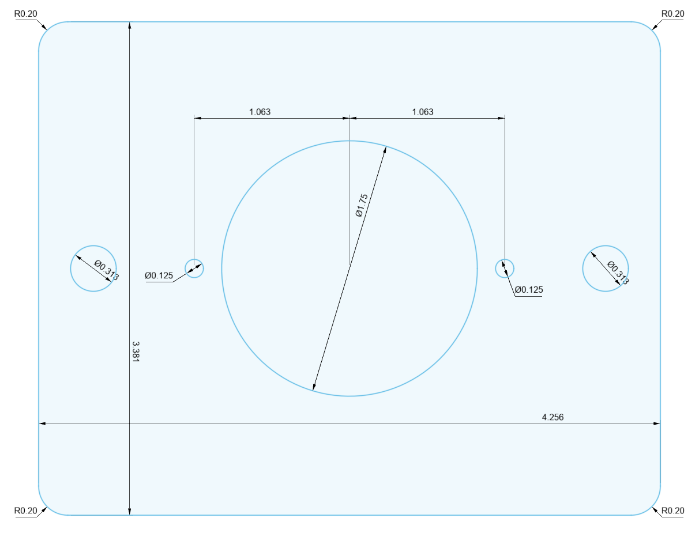
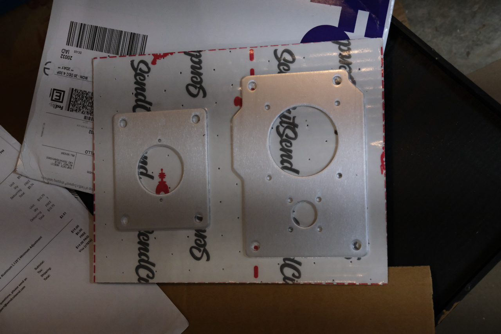
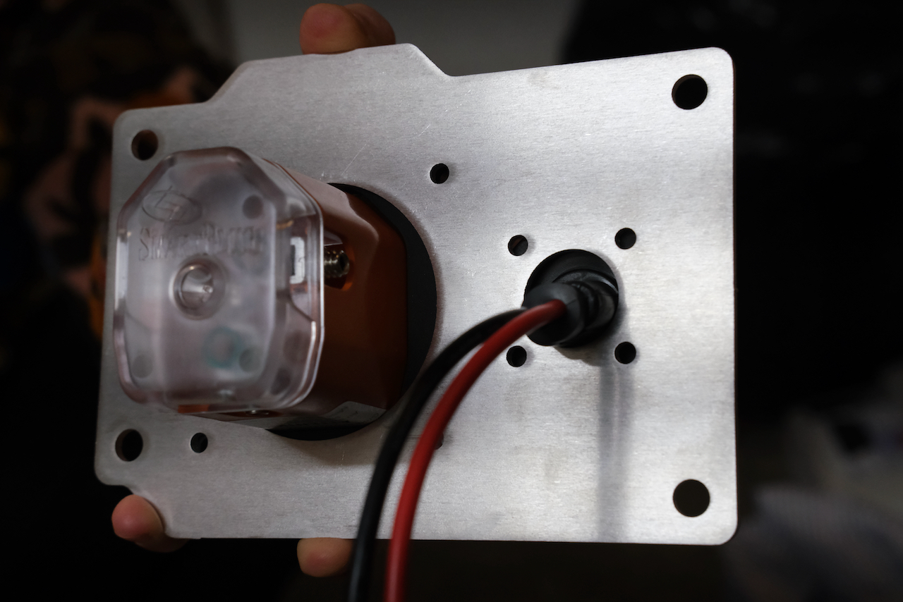
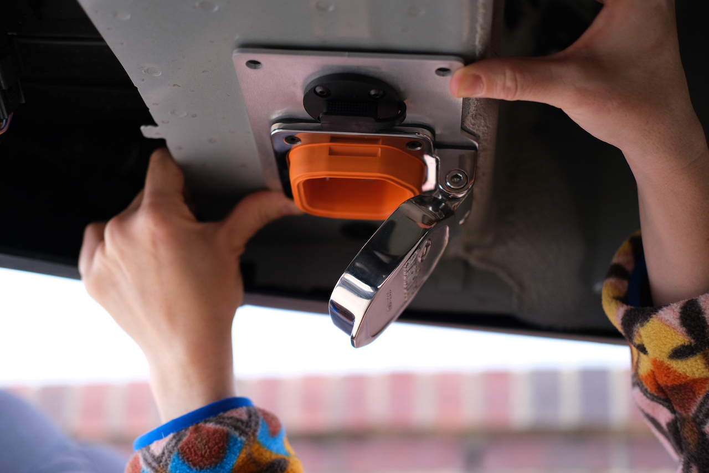

On Van 1.0 we installed a standard RV shorepower plug on the driver side of the van.  It worked fine, but it does involve putting a hole in the side of the van.  It also got damaged by an uncontrolled rear door opening while the cover was flipped up.  For Van 2.0, we have an opportunity to improve.

The transit has two rectangular ports underneath the bumper structure.  They are easy to get to, and out of the way of weather and doors.  [DaveInSeattle](https://www.fordtransitusaforum.com/members/daveinseattle.88366/) made brilliant use of one of these ports to install his shorepower and aux solar connection.  We decided to do the same.

_Dave's approach.  Image credit: Dave_

We'll be using a SmartPlug for our shorepower connection.  It allegedly improves on the standard screw lock plugs.  We'll see.  We opted for the shiny stainless variant.  Also like Dave, we'll use the same port for our aux solar connection (for a future moveable, ground based array).  We opted for [this SAE power socket](https://www.amazon.com/dp/B07XLK4CH3?psc=1&ref=ppx_yo2_dt_b_product_details).

Sophia spent some quality time crawling around under the van with cardboard and calipers.  She figured out a way to arrange the Smartplug, the power socket, and four future plusnuts in spite of Ford's constraints.  This freed up the second port for an exterior plug (more later).

_Cardboard is the true van conversion hero._

Once we were satisfied that everything fit, I finished the design in Fusion 360.

_The smartplug/aux solar dxf is [here](smartplug-plate-order.dxf)._

While I was at it, I when ahead and designed a second plate for the adjacent rectangular port that will house an [exterior plug](https://www.amazon.com/gp/product/B07SLM8LT5/ref=ppx_yo_dt_b_asin_title_o00_s00?ie=UTF8&psc=1), now that I knew it wouldn't be needed for the aux solar connection.  This was much more straight forward.  Update:  Oops, didn't take the time to do a physical sanity check, and there is an interference with the tow hitch stucture...so there will be another design iteration.  Repeat after me: All models are wrong.  Don't confuse the map for the territory.

_The outlet plate dxf is [here](outlet-plate-order.dxf). This is wrong!_

We sent the designs off to sendcutsend.  We ordered them in 1/8 aluminum which should be plenty stout and corrosion resistant.  The total for both plates was $19 even.  Not bad.

We received the plates and did a fit check.  There is, as was expected an interference on the outlet plate between the plusnut and the hitch structure.  We'll fix that and order a new plate.  The shorepower plate is fire.

_Pretty much my favorite company to get packages from._

_Front view with components._

_Back view with components._

_Fitup in place._

Next up is to trim some adhesive foam backing, install plusnuts, wire and bolt into place.

## Other Useful Things

Its always great when you can find dimensioned drawings from manuafacturers!

## Timeline
Note, this doesn't reflect full time effort. It's mostly evenings and partial days, limited by other work, life, etc.

* Templated/designed (Mon 12-13-2021)
* Made drawings and placed order (Tue 12-14-2021)
* Received plates and fit check (Sat 12-17-2021)