**TLDR: We designed and installed custom upholstered wall panels and panel stiffeners in our van, including fans and light switches.**

## Jargon

Stiffener Bracket: Acutely angled brackets that bolt to the underside of the upper wall voids. They are precisely angled so the exposed face matches the plane of the outward face above the wall void.

Panel Stiffener: A piece of 1/2" plywood that attaches to the 8020 structure at its bottom and to a stiffener bracket at its top. These bridge the wall void and provide stiffness and a fastening point for the wall panels to allow mounting fans and controls.

Wall Panel 8020 Bracket: Small, slightly angled brackets that are mounted to the backside of the upper 8020 structure. They provide a fastening point for the upholstered wall panels.

## Panel Design and Installation Process

We started by picking up six sheets of 1/4" PVC and cutting wall panel pieces. After designing the wall panel stiffener brackets and wall panel 8020 attachment brackets, we placed orders for them. Then, we cut two wall stiffeners and modified one with wood "wedges" to account for the angle. We test-fit the "wedged stiffener" but determined it had too much wedge and wasn't worth it.

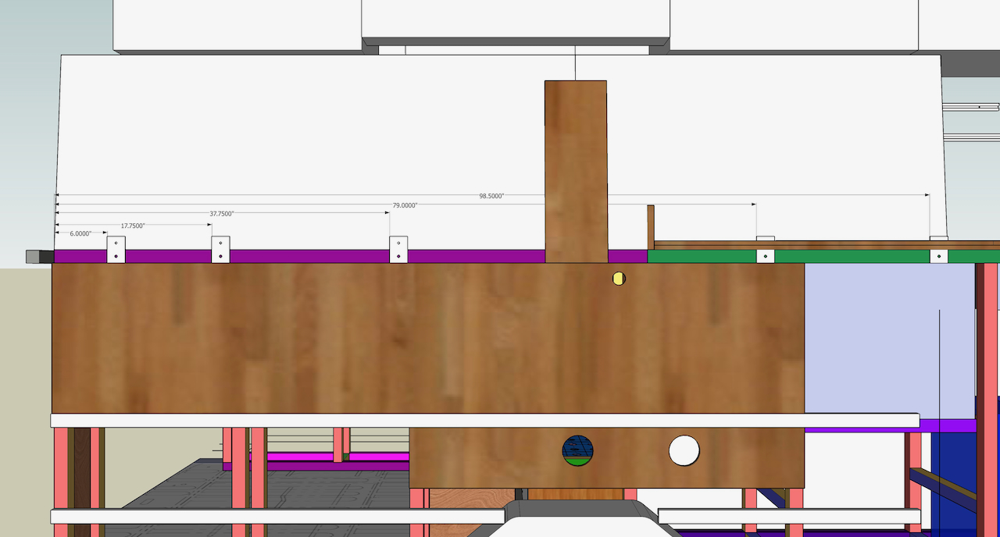
*A drawing that shows panel stiffener and panel bracket locations.*

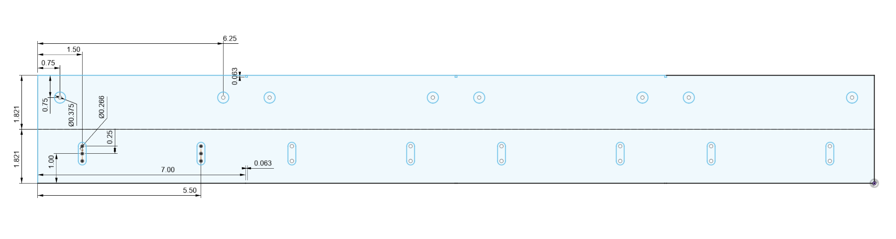
*A flat drawing of the stiffener brackets.*

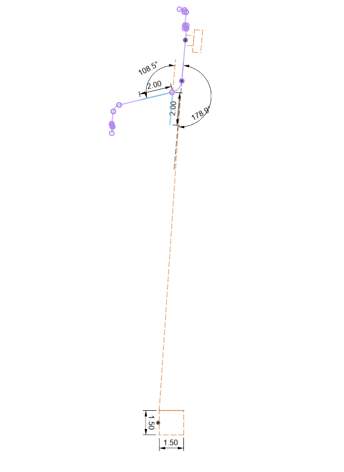
*A sketch showing the angle and placement of the stiffener brackets.*

In the meantime, we upholstered the sliding door panel as a trial and installed it.

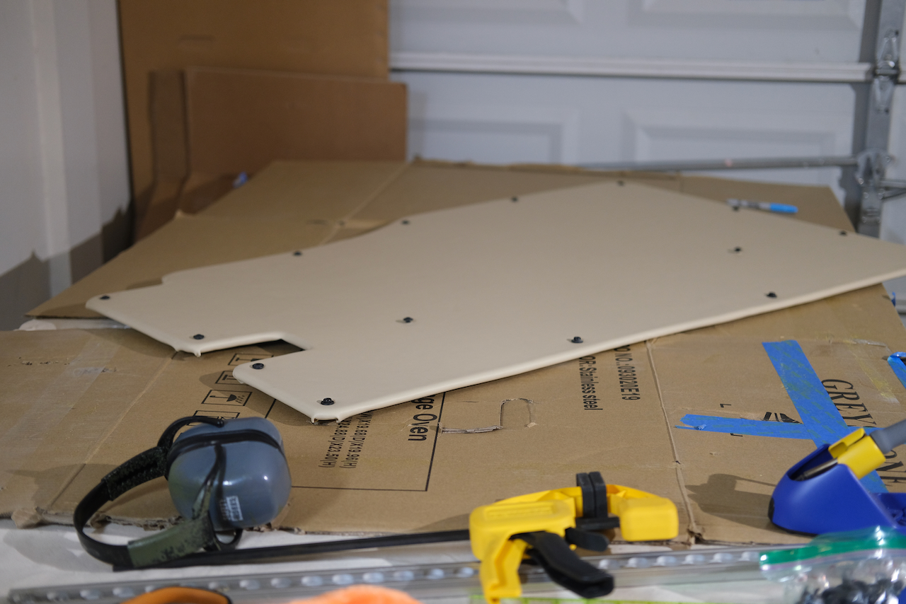
*Completed slider door panel.*

Next, we cut the wall panel 8020 brackets and wall stiffener brackets. We had ordered both designs in long lengths to minimize the cost of bending with the intention to cut them in house.  We also installed plus nuts in the wall stiffener brackets and wall panel 8020 brackets.

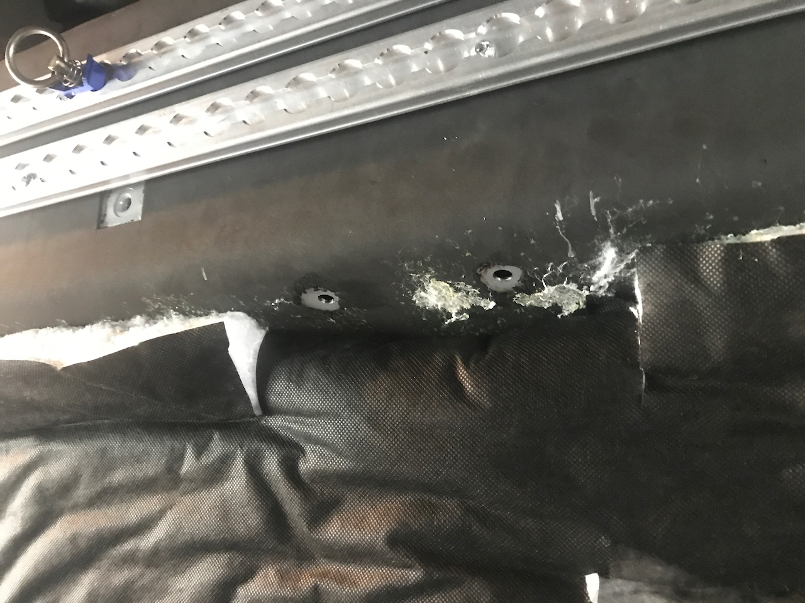
*Holes drilled for a stiffener bracket to fasten to.*

We marked, drilled, primed, and painted holes for the stiffener bracket plus nuts, and cut two additional stiffener panels. We also angle-drilled the 8020 through bolting holes in the stiffener panels to ensure flush/perpendicular bolting.

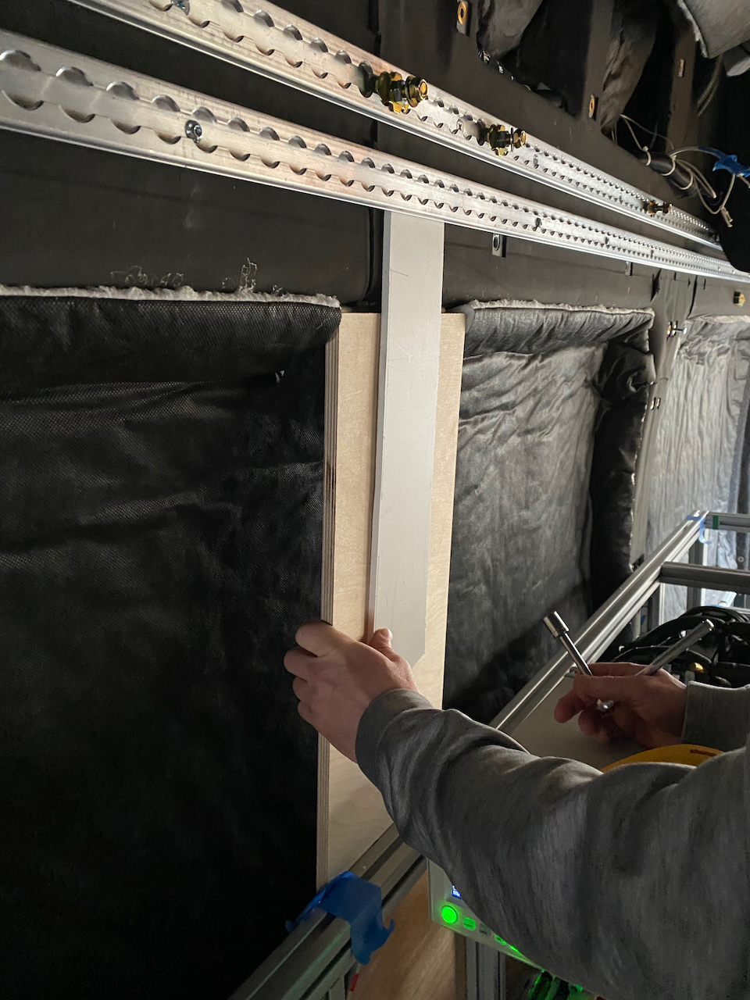
*Using a stiffener panel and bare panel material to correctly set the placement of a stiffener bracket (they are slotted to allow athwart positioning).*

After installing plus nuts for the angle stiffener brackets, we installed the stiffener brackets and locktited them, along with the wall panel 8020 brackets. We then temporarily installed the wall stiffeners for templating.

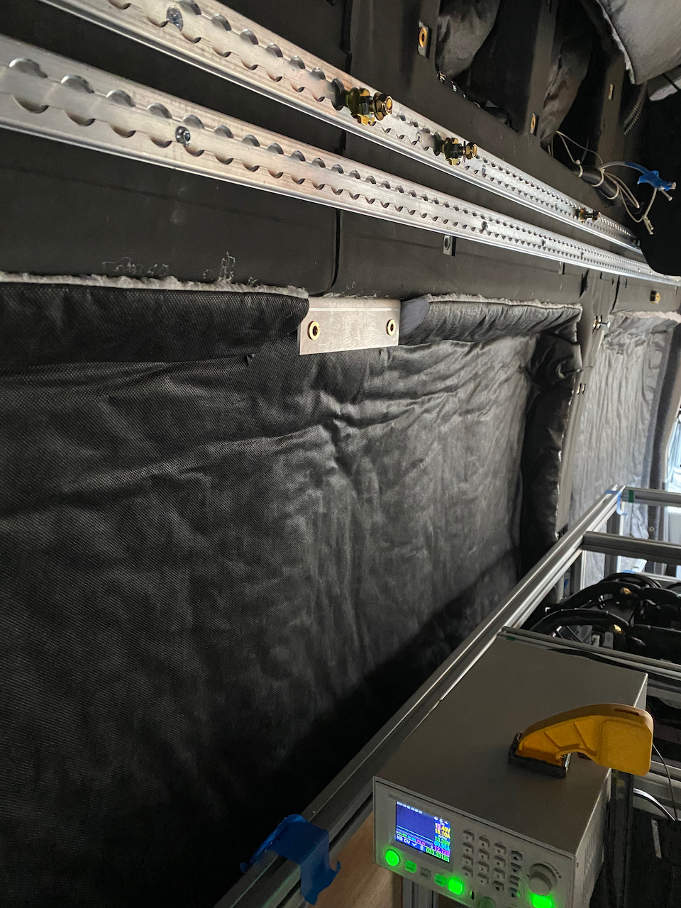
*A stiffener bracket installed.*

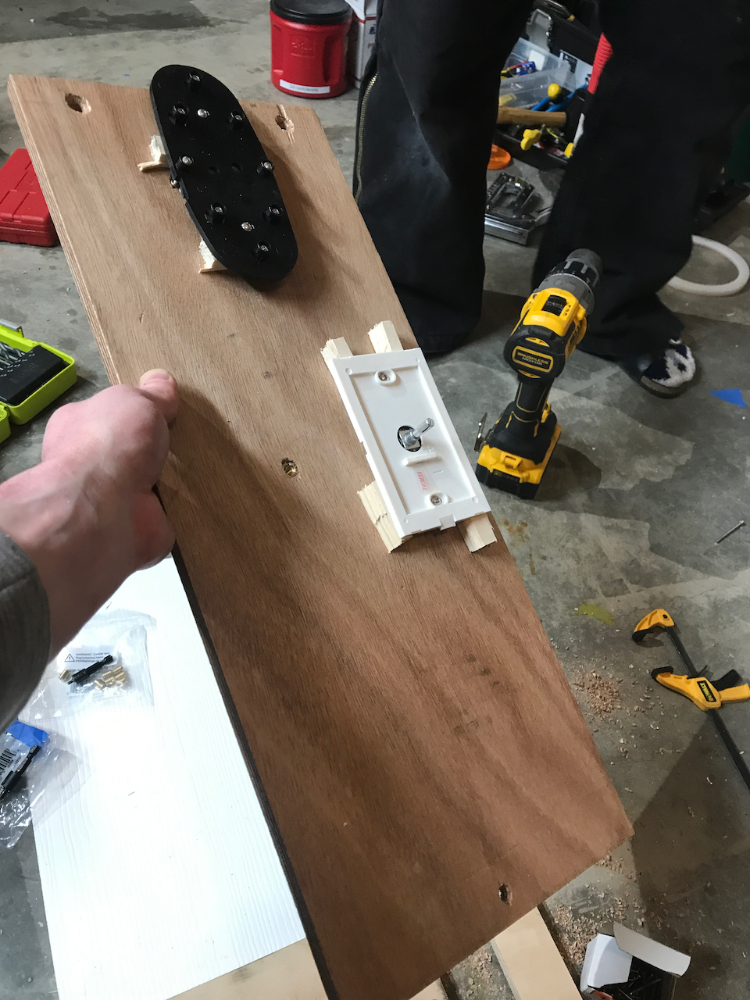
*A wall panel stiffener with the fan mount and light switch mount installed.*

We ordered fasteners and threaded inserts for the fan and light switch mounting. While waiting for the orders to arrive, we templated the wall stiffener panels with holes to mount fans, the Espar controller, and panel fasteners. We also picked up two more expanded PVC sheets at Home Depot.

Next, we finished templating the wall stiffener panels, drilled them, cut the wall panels to width and length (except for the forward panel), and fit them up to the wall panels, marking holes with transfer screws and impressions from fasteners we had on hand.

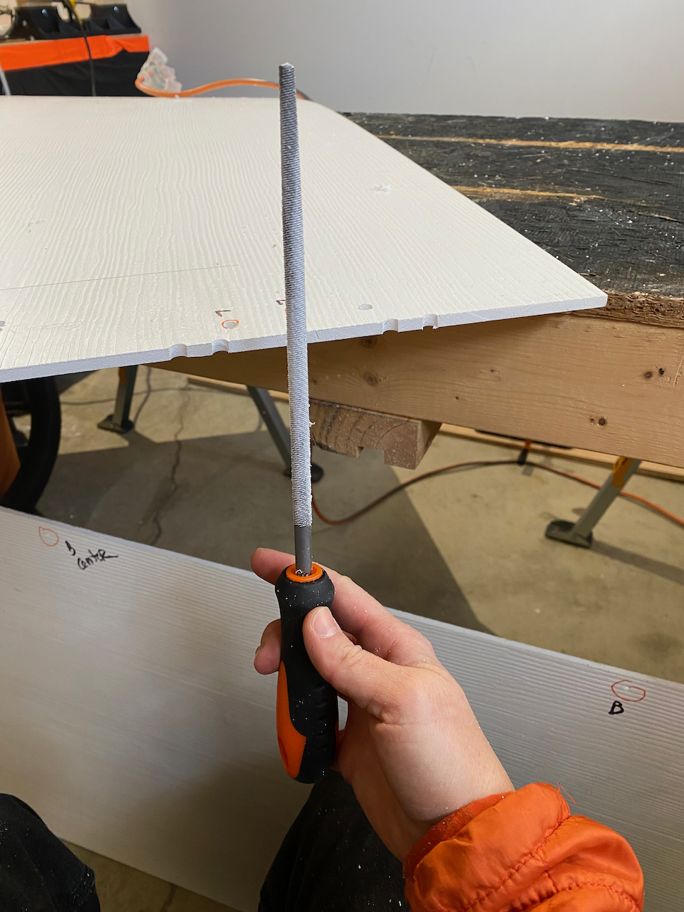
*Adding holes to the edge of a bare panel to matchholes in a stiffener panel.*

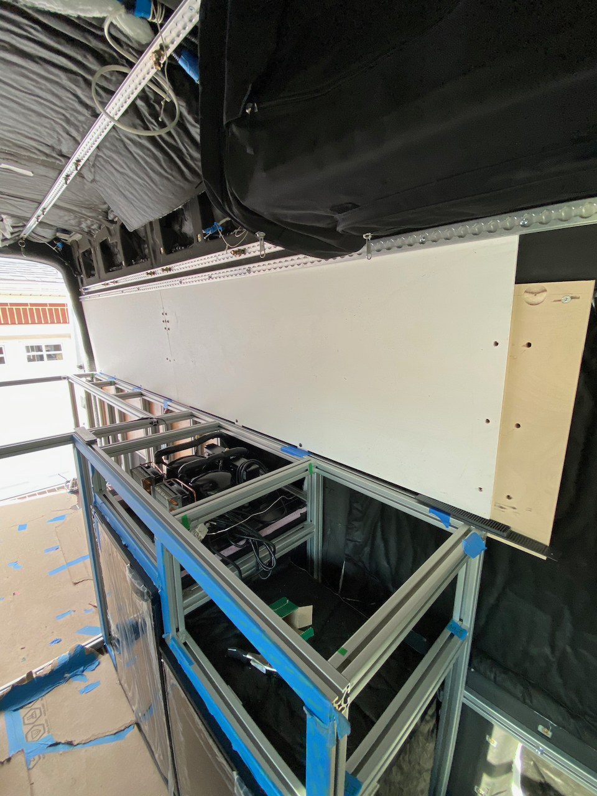
*Two bare panels with holes drilled matched to the stiffener panels.*

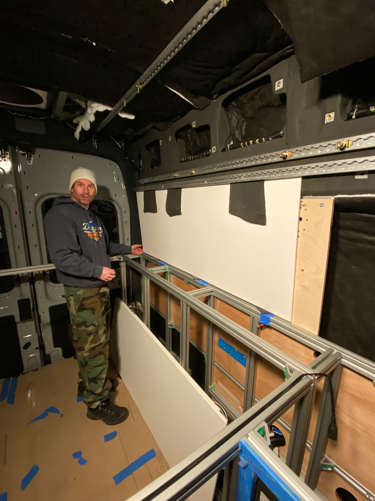
*Fitup of a bare panel to a stiffener panel using neoprene material as spacers to get correct placement.*

## Upholstering the Panels

We applied Weldwood Landau contact adhesive to the bare panel and large sheets of 1/8" thick neoprene to glue them together. The neoprene covered the face of the bare panel and wrapped around the edges. Then we repeated the process to glue marine vinyl to the neoprene. We used a soldering iron to add holes for fasteners.

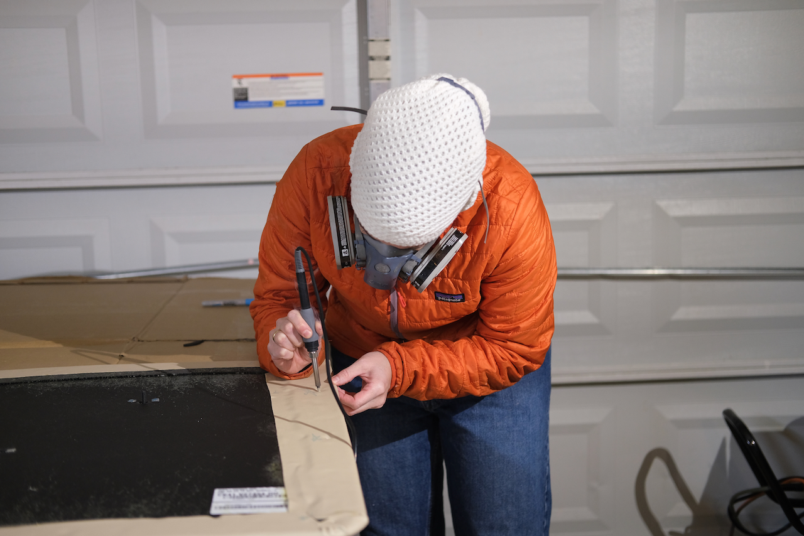
*Adding holes to a panel with soldering iron iterations.*

In general, the panel+neoprene+fabric approach was well proven on Van 1.0, and we stand by it still.  It provides a lot of additional acoustic and thermal insulation on top of our dedicated treatments.

The main departure from Van 1.0 was our choice of marine vinyl.  We see a lot of builds that use fabric.  We spend time in areas with mosquitos and it took one non-removable blood stain from a smashed mosquito to convince us to go with an easy to clean wipe-able surface.  We're honestly shocked that we don't see it in many more builds.

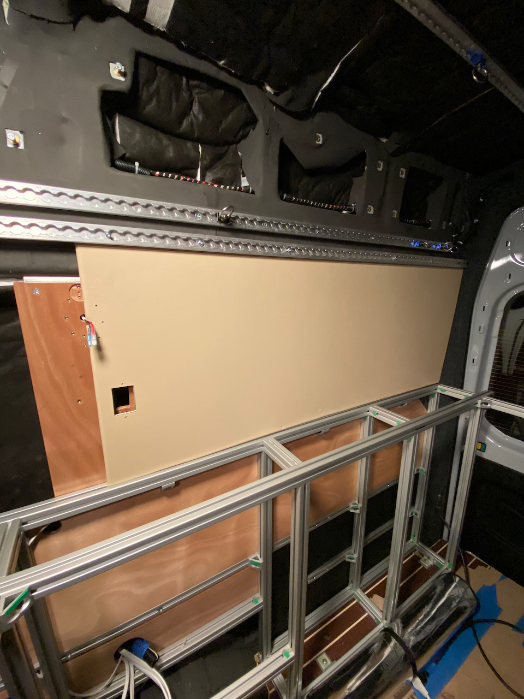
*Installation of the rear passenger wall panel.*

## Completed Installation

The finished panels are attached to the stiffeners both by dedicated fasteners, and by way of the fan mounts that bolt through them to the stiffeners.  They are also fastened at the bottom to the wall panel 8020 brackets.  Lastly, they are captured at the top by the lower run of L-track, which is mounted on 1/2 spacers out from the van wall.

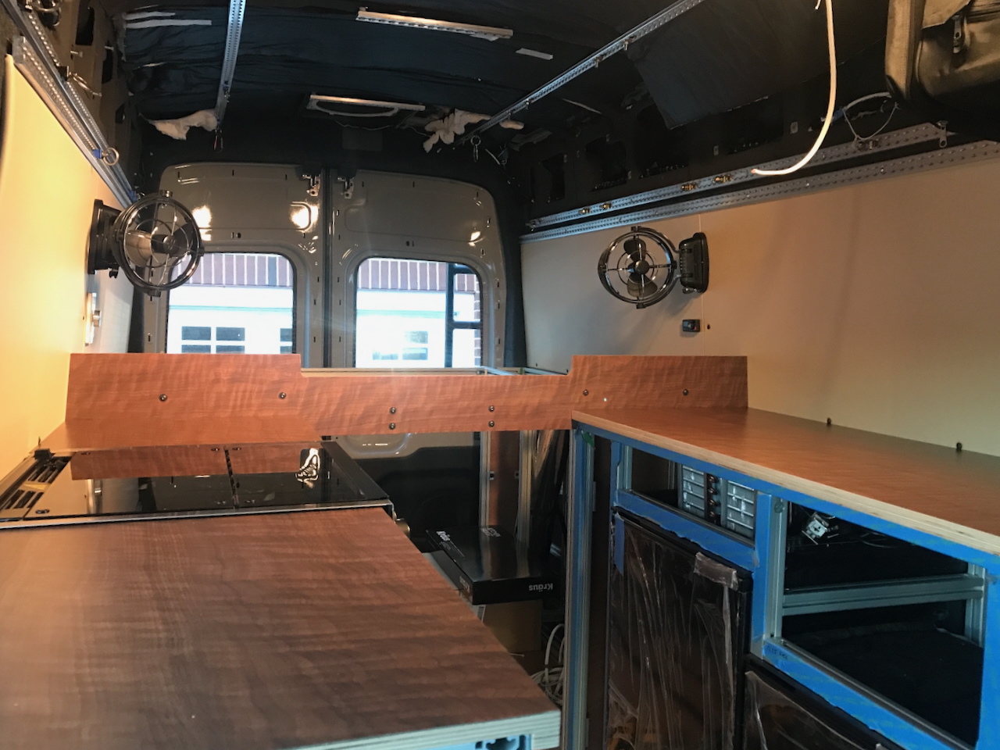
*Completed panels.  Fans, light switch, and Espar controller installed.*

## What We Would Change

Very little.  We would probably cut the bare panels a little shorter in the long dimension.  We accounted for the neoprene and marine vinyl wrapping the edges, but assumed more compression than we saw.  This mean a lot of force to get enough compression to align the all the holes with the stiffeners and wall panel 8020 brackets.

If we could get our hands on it, we would have used PennLight material for the wall panels (it is lighter than expanded PVC).  But, we couldn't afford the time to drive to NJ to pick it up, and shipping was not reasonable.

## Timeline

- Picked up 6 sheets of 1/4 PVC (Tue 2021-11-09)
- Cut wall panel pieces (Sat 2021-12-31)
- Confirmed upper factory holes are M8-1.25 and that thread starts ~ 1/2 below surface of wall/neoprene (Sat 2021-12-31)
- Confirmed lower strip of L-track will interfere with any bolt heads using those holes (Sat 2021-12-31)
- Designed and placed order for wall panel stiffener brackets (Mon 2022-01-03)
- Designed and placed order for wall panel 8020 attachment brackets (Tue 2022-01-04)
- Cut two wall stiffeners, modified one wall stiffener with wood "wedges" to account for angle (Thu 2022-01-06)
- Test fit "wedged stiffener, to much wedge, not worth it (Tue 2022-01-11)
- Upholstered sliding door panel as a trial and installed (Tue 2022-01-11)
- Cut wall panel 8020 brackets (Wed 2022-01-12)
- Cut wall stiffener brackets, installed plus nuts in wall stiffener brackets, installed puls nuts in wall panel 8020 brackets (Thu 2022-01-13)
- Marked, drilled, primed, painted holes for stiffener bracket plus nuts, cut 2 additional stiffener panels, angle drilled 8020 bolting holes to ensure flush/perpendicular bolting (Sat 2022-01-15)
- Installed plusnuts for angle stiffener brackets, installed stiffener brackets and locktited, installed wall panel 8020 brackets and locktited, temp installed wall stiffeners for templating, ordered fasteners and threaded inserts for fan and light switch mounting (Sun 2022-01-16)
- Templated wall stiffener panels with holes to mount fans, the Espar controller, and panel fasteners, picked up two more expanded PVC sheets at Home Depot (Mon 2022-01-17)
- Finished templating wall stiffener panels, drilled wall panel stiffeners, gun didn't work so couldn't urethane, cut wall panels to width and length (except fwd panel), fit up wall panels and marked holes with transfer screws and random fasteners (Tue 2022-01-18)
- Added holes to passenger and driver side mid and aft wall panels, fit checked holes in passenger and driver mid and aft wall panels, upholstered passenger and driver side mid and aft wall panels (Wed 2022-01-19)
- 4 coats of spar urethane on wall panel stiffeners, installed threaded inserts in passenger stiffener, added holes to the upholstered panels, added disconnects to Passenger Fan, added mating disconnects to Passenger Fan wiring (next time offset connectors for easier feed through), modified light switch to come apart easier, installed passenger wall panels (holes are tight), requires stove bracket loosening and sliding stove forward, installed light switch, installed passenger fan (Thu 2022-01-20)
- Installed threaded inserts on panels, swapped L-track spacers for 1/2 inch (Sun 2022-01-23)
- Added 5/16 plus nut for passenger fwd panel fastening, added through bolted passenger fwd panel in two more locations on fwd edge, increased hole size on driver side panel, installed driver mid panel (Wed 2022-01-26)
- Installed driver aft panel, installed driver fan, tested both fans SAT (Mon 2022-01-31)
- Cut forward driver panel (Mon 2022-02-28)
- Covered and installed forward driver panel (Tue 2022-03-01)
