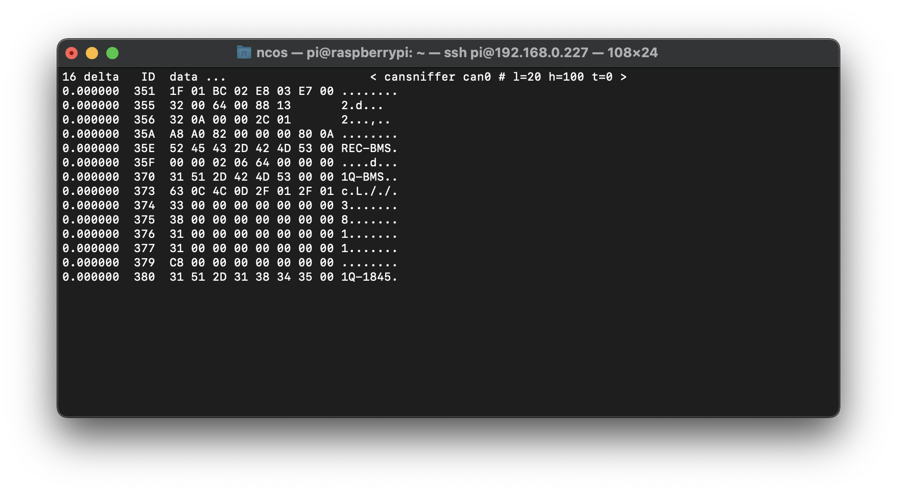
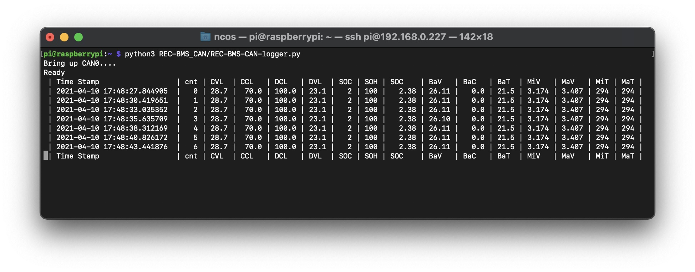

**TLDR: We setup an RPi to communicate over CAN with our REC Q BMS.  This will allow us to log BMS parameters during electrical system testing.It will also lay the ground work for interfacing our homebrew electrical monitoring and control functions with the BMS.**<!--excerpt-->

###  Getting an RPi talking to the REC Q BMS

I wanted to be able to wring out the protections and comms with the [REC Q BMS]() ahead of hooking it up to a large stored power source (and because I'm still awaiting delivery of said large stored power source).

Ultimately, I would like all the battery time series data to be logged by a [Signal-K]() database which will necessitate some device that can translate the information the REC Q relays via CAN to a format compatible with Signal-K's schema for battery data (under development at the time of this post).  That is the why.

Step one for the "How" is getting the RPi to receive the messages. Decoding, and doing something with those messages will be a step two thing.  I'm using a [PiCAN3](https://copperhilltech.com/pican3-can-bus-board-for-raspberry-pi-4-with-3a-smps-and-rtc/) left over from a ODBII project I was working on in conjunction with a RPi 4 that I'm using for logging and all the comms with the test equipment.  

What follows is pretty much verbatim from the PiCAN setup [instructions](http://skpang.co.uk/catalog/images/raspberrypi/pican/PICAN3_UGA_10.pdf):

1. `sudo apt-get update`

2. `sudo apt-get upgrade`

3. `sudo reboot`

4. `sudo nano /boot/config.txt`

5. Add these lines at the end of the file:

```bash
dtparam=spi=on
dtoverlay=mcp2515-can0,oscillator=16000000,interrupt=25
dtoverlay=spi-bcm2835-overlay
```

6. `sudo reboot`

7. `sudo apt-get install can-utils`

8. Start up the BMS.

9. Bring up the CAN interface to 250kbps ~~(The [REC Q manual](http://www.rec-bms.com/datasheet/UserManual_REC_Q.pdf) is wrong)~~:

`sudo ip link set can0 up type can bitrate 250000`

10. `candump can0`

Boom!

```bash
can0  380   [8]  31 51 2D 31 38 34 35 00
can0  351   [8]  1F 01 BC 02 E8 03 E7 00
can0  355   [6]  32 00 64 00 88 13
can0  356   [6]  32 0A 00 00 27 01
can0  35A   [8]  A8 A0 82 00 00 00 80 0A
can0  35E   [8]  52 45 43 2D 42 4D 53 00
can0  35F   [8]  00 00 02 06 64 00 00 00
can0  351   [8]  1F 01 BC 02 E8 03 E7 00
...
...
```

### Findings

The REC Q manual isn't wrong afterall.  Turns out I was using a manual that documents a different version of firmware that changes both the CAN baudrate, but also uses a completely different schema for CAN.  This can be seen from the CAN IDs that are reported from the RPi:



The IDs above don't match the IDs listed in [this version](http://www.rec-bms.com/datasheet/UserManual_REC_Q.pdf) of the BMS manual:

> 11-bit TX identifiers: 0x031, 0x032, 0x033, 0x034, 0x035, 0x036, 0x037 and 0x038.

But they do match the IDs listed in [this version](http://www.rec-bms.com/datasheet/UserManual_REC_Victron_BMS.pdf):

> 11-bit TX identifiers: 0x351, 0x355, 0x356, 0x35A, 0x35B, 0x35E, 0x35E, 0x370, 0x373, 0x374, 0x375, 0x376, 0x377, 0x379 and 0x380.

The bummer is that in the correct manual version, it doesn't provide any schema to interpret the CAN data beyond listing the IDs.  However, by leveraging a few different sources, I think it can be pieced together because it uses a CAN schema associated with a company called Sunny Island that makes inverters that several BMS's.

The most useful is another product [manual](http://www.rec-bms.com/datasheet/UserManual9R_SMA.pdf) from REC.  It covers CAN IDs:  0x351, 0x355, 0x356, 0x35A, 0x35B, 0x35E, 0x35F.  Some of the schema's it gives do not appear to match what my BMS is putting out however.  Note: Years ago a very helpful Victron engineer passed this additional detail along:

> There is a mistake in this document. It has max charging current twice in 0x351. The second one is actually the max DIScharge current.

[Elithion](https://www.elithion.com/lithiumate/php/controller_can_specs.php) covers CAN IDs: 0x351, 0x355, 0x356, 0x35A.

[SIMPBMS](https://github.com/Tom-evnut/SimpBMS/blob/master/Simp%20BMS%20Setup%20Manual%20V0.25.pdf) covers CAN IDs:  0x351, 0x355, 0x356, 0x35A, and 0x373.

[LiTerminal](literminal-docu-en-sm-sma-canbus.pdf) covers CAN IDs: 0x351, 0x355, 0x356, 0x35A, 0x35B, 0x35E, and 0x35F.

I've also got an email into REC.  So hopefully they can help in a more direct way.

### Update [2021-4-10]

I wrote a python script that parses/translates the IDs for which I have documentation for into something readable.  Script is here:

[https://github.com/natecostello/REC-BMS_CAN](https://github.com/natecostello/REC-BMS_CAN)

Sample Output:



### Update [2021-4-12]

Of the CAN-IDs not covered in the documents:

0x370 is a Model ID of sort.

0x380 is a unit serial number.

Speculation:

#### 35F

35F is listed in the LiTerminal Docs:

Bits 2 and 3 are listed as by LiTerminal as "BMS Version".  Bits 2 and 3 are listed by REC in the other manual as "Hardware Version" low and high byte. and currently are 0x02 0x06. If I used the same little endian format as most other parameters it resolves to 1538.  If I treat them as direct number, they are 2 and 6, which matches the BMS software version, "2.6", listed on via the wifi interface.  So that is that.

Bits 4 and 5 are listed as "Bat-Capacity".  and currently read 0x03 0x00.  if I used the same little endian format as most other parameters, it resolves to 3 right now.  Previously initially it was 100.  Based on this I think this value is remaining capacity in AH.  I reset the current SOC to 100, and bits 4 and 5 are now 0xFA and 0x00 which resolves to 250AH, which is where I set the capacity.  I changed capacity to 200AH, and these bits  are now reads 0xC8 0x00, which resolves to 200.  so that is that.

No other bits are used by the REC Q for 35F

#### 379

All zeros except first byte

Rated AH, calculated as LSB MSB for 0-250,  and LSB MSB + 1 for > 250AH (weird).  That is that.


#### 374

All zeros except first byte

0x33 (51)

#### 375

All zeros except first byte

0x38 (56)

#### 376

All zeros except first byte

0x31 (49)

#### 377

All zeros except first byte

0x31 (49)

#### 

