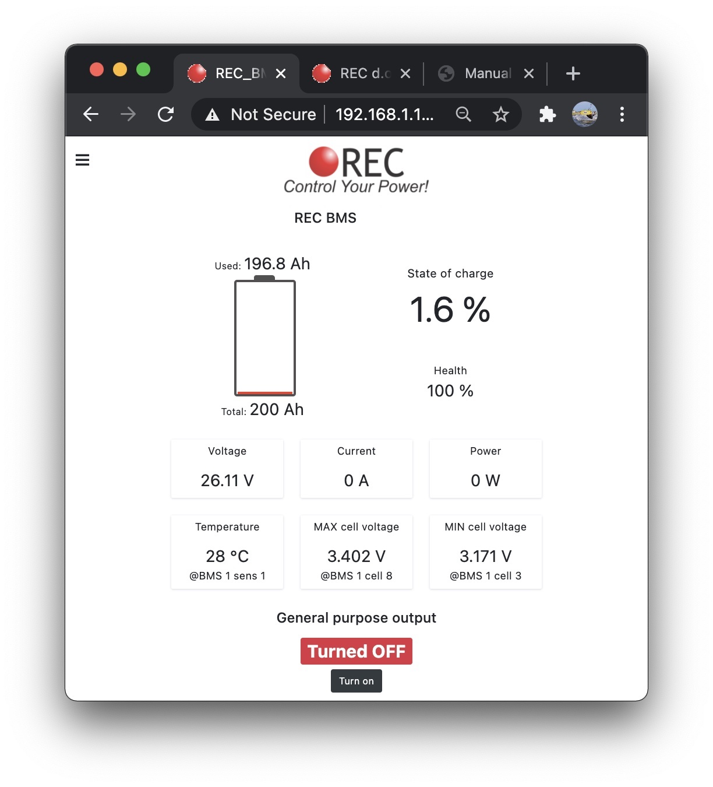
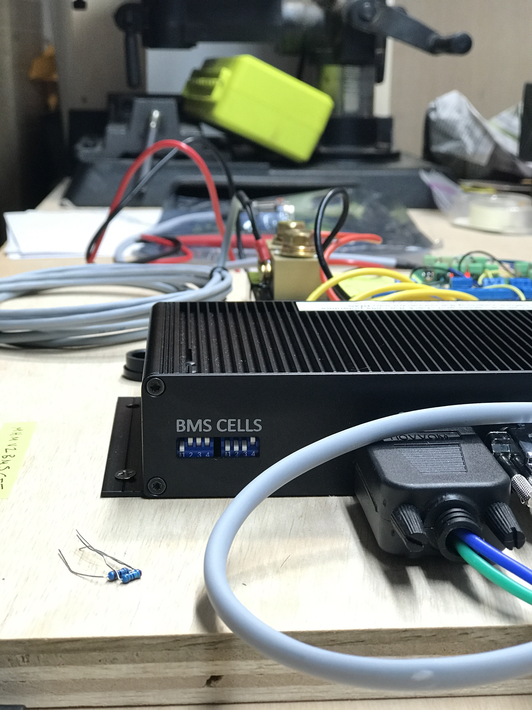
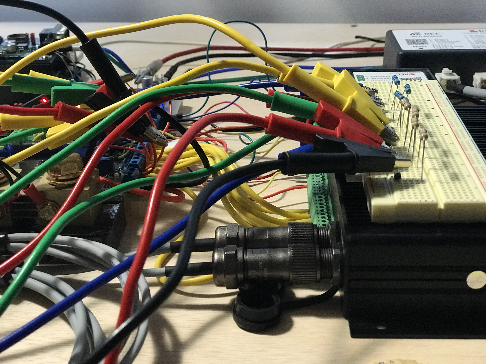
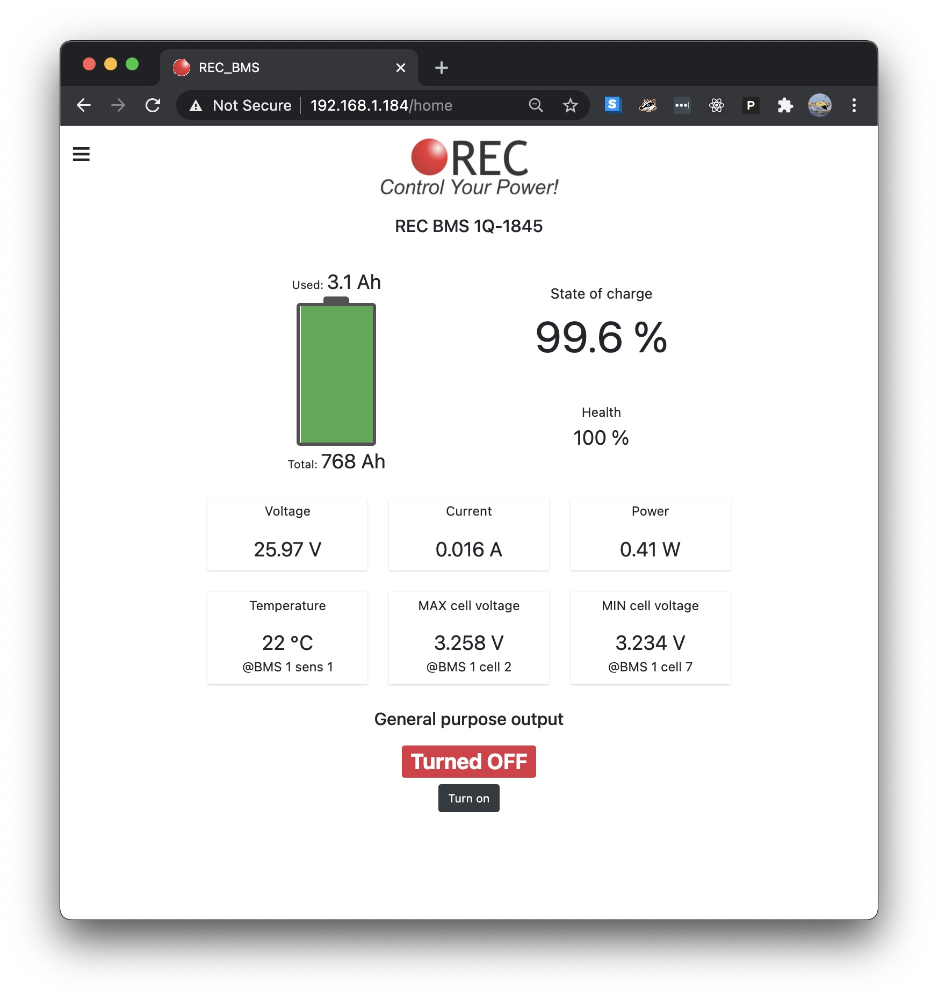

**TLDR: We discovered an anomaly with BMS cell voltage measurements during benchtop testing.  With the help of REC we found it was an issue with our battery simulator, which we resolved.**<!--excerpt-->

### Wringing out the REC Q BMS

I'm operating the BMS without a battery for now, and instead with something simulating a battery which I call a "battery simulator".  The primary reason is that my cells haven't arrived.  The secondary reason is it allows me to verify the protection setpoints and actions prior to hooking it up to cells and relying on those protections.  The tertiary reason is it allows me to work on decoding the CAN and RS-485 comms without it being hooked up to a real battery.

### The Battery Simulator

The battery simulator is simply a power supply and a voltage divider of 2.4kOhm resistors that simulate cells.  One of these is actually a potentiometer which allows simulation of a high or low voltage cell by changing the resistance.  Between at each resistor are taps that are used to wire up the BMS per the manual.  By applying ~26V to the voltage divider, the BMS is powered and sees 8 cells with a nominal LFP voltage.

### The Anomaly

When monitoring CANBus communications, I noticed that it was reporting a max cell voltage that was much higher than any direct cell measurement using a voltmeter.  By manipulation of the circuit I was able to verify that it is Cell 8 that the BMS is reporting high (individual cell voltages are not available over CAN at this point).  All other cells seem to track (CAN reported min cell voltage aligns with a DMM measurement and by making Cell 1 the high cell I can verify it tracks).  Likewise, the overall pack voltage reported by CAN is also higher than direct measurement, by about the same amount that Cell 1 reads high.

Specific Measurements:

| Cell 8 Voltage via CANBus | 3.411V |
| ------------------------- | ------ |
| **Cell 8 Voltage via DMM**  | **3.289V** |
| **Delta**                 | **0.122V** |
| **Design Accuracy**       | **0.003V** |

| Cell 3 Voltage via CANBus  | 3.171V     |
| -------------------------- | ---------- |
| **Cell 3 Voltage via DMM** | **3.185V** |
| **Delta**                  | **0.014V** |
| **Design Accuracy**        | **0.003V** |

| Pack Voltage via CANBus  | 26.1V      |
| ------------------------ | ---------- |
| **Pack Voltage via DMM** | **25.96V** |
| **Delta**                | **0.14V**  |
| **Design Accuracy**      | **0.006V** |

### Other observations of unknown relevance

Resistors read about 2.1KOhm with the BMS connected.

Current into Pack+ is 45µA with the BMS off.

Current into Pack+ is 7.9-8.8mA with the BMS on.

Current into Cell 8+ is 0µA with the BMS off.

Current into Cell 8+ is generally 0µA with the BMS on, 

Current into Cell 8+ reads 4.47µA every few seconds (86.04µA in peak mode) with the BMS on.

Current into Cell 1+ is 81.3µA with the BMS off (Assuming this is a low power sleep function).

Current into Cell 1+ is generally 0µA with the BMS on.

Current into Cell 1+ reads 0.54µA every few seconds (13.05µA in peak mode) with the BMS on.

### Conclusions

**All Good.  REC responded with good advice and the discrepancy is gone.  See update at the end for more.**

~~Not many at this point.  My primary concern is that this voltage discrepancy would also present with real batteries.  There's nothing I can think of with the approach of simulating that would make a difference.  **Such a large discrepency will hinder performance as the high cell would skew end of charge and balancing and could lead to spurious over voltage protections.  The BMS did take high cell actions based on the CAN indicated voltage vice actual voltage, so this is not just a reporting/indication problem.**~~

Next steps are to contact REC with all this information as well as working on RS-485 comms to see all cell voltages and get a broader sense of accuracy.

### Update 2021-4-11

I hooked up the REC Wi-Fi Module to get more granularity on cell voltages and see if it might provide some clues.  Note to future self, I changed the default IP to `192.168.2.99` in case forget.

The home page shows the same max cell voltage discrepancy as the CAN data.

~~The voltage (and impedance) page don't show cell 8 at all.  Only cells 1-7.  Whether this is related or a different problem I can not say.  The voltages that are shown do match the DMM measurement pretty closely.~~  It was just cut off in the webpage formating.  SMH.

Lastly, based on the 8th cell not showing up, I verified that the dip switch settings match the manual's instructions for a 8 cell battery.  They did, and do.

**Still a mystery.**

### Update 2021-4-11 - Anomaly No More!

REC responded and suggested that the high resistor values in the battery simulator might be interfering with the voltage measurements and suggested a lower resistance for the voltage divider components.  Before breaking out the soldering iron, I hacked together some components to reduce the voltage divider resistances down to ~90Ohms per cell.

**Problem solved.  All BMS measurements moved close in line with the DMM measurements.**

| Measurement | DMM [V] | BMS [V] | Delta [V] |
| ----------- | ------- | ------- | --------- |
| Cell 8      | 3.248   | 3.252   | -0.004    |
| Cell 7      | 3.229   | 3.234   | -0.005    |
| Cell 6      | 3.238   | 3.24    | -0.002    |
| Cell 5      | 3.231   | 3.234   | -0.003    |
| Cell 4      | 3.251   | 3.252   | -0.001    |
| Cell 3      | 3.243   | 3.246   | -0.003    |
| Cell 2      | 3.258   | 3.258   | 0         |
| Cell 1      | 3.254   | 3.255   | -0.001    |
| Pack        | 25.95   | 25.97   | -0.02     |

