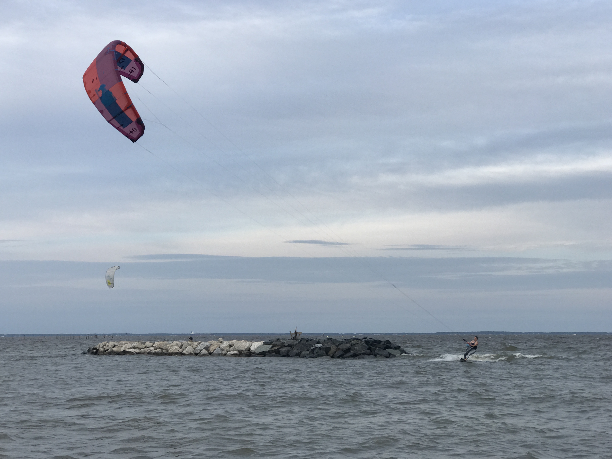
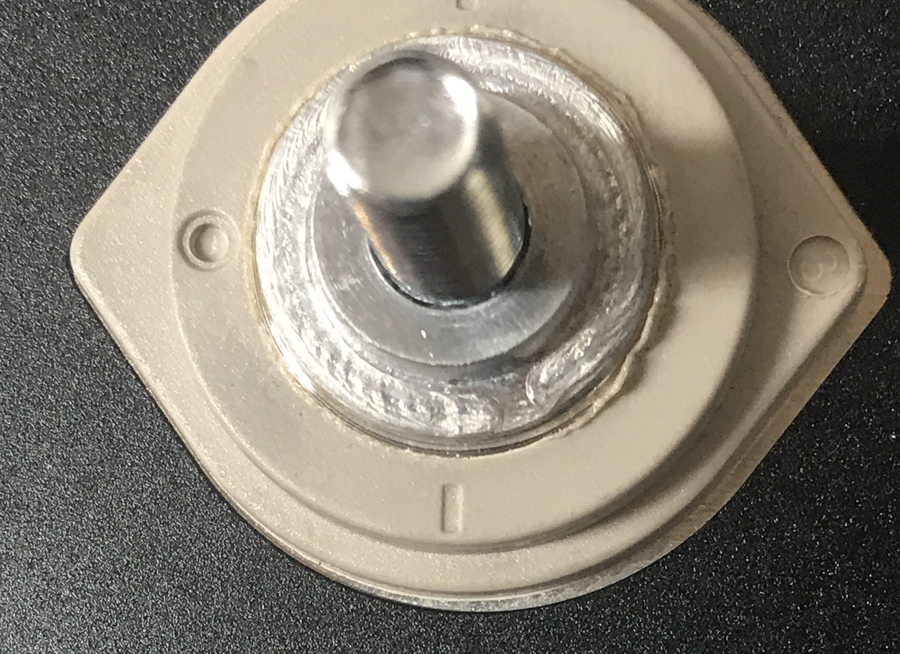

**TLDR: We unboxed and took physical measurements on our LFP cells that will form our battery.**<!--excerpt-->

We received our cells in late May, but haven't had a chance to actually open them.  Today was the day.

Physically they all look good.  My calipers needed new batteries, so we'll update this later once we can take detailed measurements.  One area of interest is the flat region around the studs as that will limit current flow area into/out-of the cells.

Also, you can hear the electrolyte moving around.  According to a moderator on the diysolarpower forum, this is normal for EVE cells.

Then we kited the Chesapeake Bay.

_Get Some_

Update: 2021-6-15

We ran a few dimensional checks on a couple cells.  All dimensions were found to be in spec with the EVE drawing.  We checked all voltages and found all cells read either 3.293V or 3.294V.

The supplier we chose, Luyuan uses laser welds terminals to the cells.  The design they use is results in a smaller terminal lug area than the stock cells, so we were anxious to get actual measurements on this area.  We found this area to be about 68 mm2, or the equivalent of a 2/0 cable.  This area is fine for the current each cell will see, but use of the this area must be maximized by avoiding oversized or excessively slotted cell-interconnects.

_Terminal lug area close up._

In the process of ordering, we did ask the supplier to use a longer terminal stud to provide more usable height.  They delivered as promised.

Cell 8B
- Positive Stud Diameter: 5.82mm
- Positive Stud Height: 14.57mm
- Positive Lug Diameter: 11.01mm
- Negative Stud Diameter: 5.83mm
- Negative Stud Height: 14.37mm
- Negative Lug Diameter: 10.97mm

Cell 5A
- Positive Stud Diameter: 5.83mm
- Positive Stud Height: 14.63mm
- Positive Lug Diameter: 10.73mm
- Negative Stud Diameter: 5.83mm
- Negative Stud Height: 14.43mm
- Negative Lug Diameter: 11.00mm

Factory Test Data:
Factory cell data provided by Luyuan is [here](cell-data.pdf).
[This google spreadsheet](https://docs.google.com/spreadsheets/d/19uenBrzUPy33vJrM-42OehlpF2azAMZ1MSor62qgmB0/edit?usp=sharing) has the same data in a more usable form.

TODO: Settle on bus bar design 1/8 is max thickness 1 and 1/8 width gets us 300A amapacity.  Need to pair up batteries, tape, put in fixture and measure, find tolerance, add growth allowance, and send of to send cut send....then need to plate.