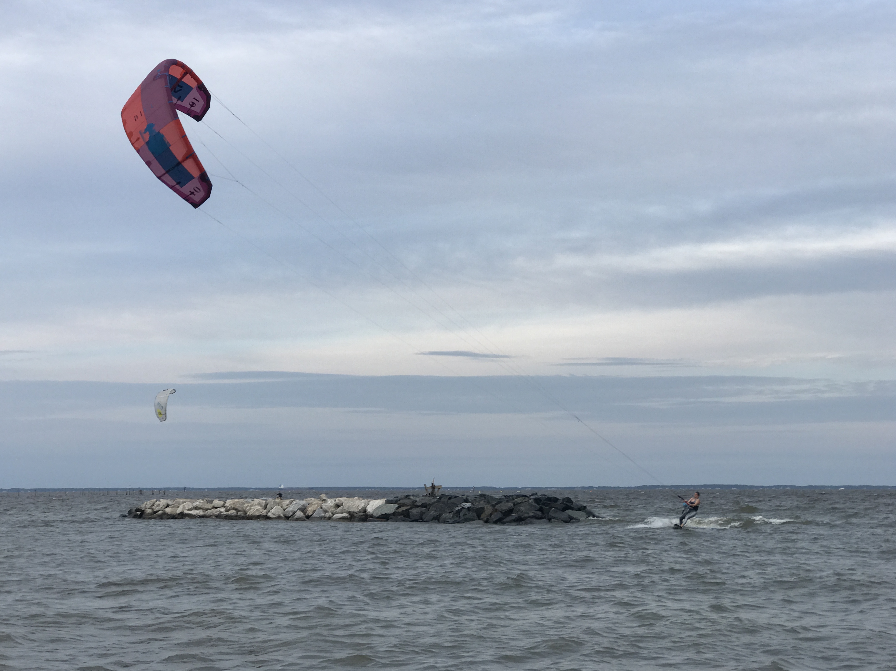

We recieved our cells in late May, but haven't had a chance to actually open them.  Today was the day.

Physically they all look good.  My calipers needed new batteries, so we'll update this later once we can take detailed measurements.  One area of interest is the flat region around the studs as that will limit current flow area into/out-of the cells.

Also, you can hear the electrolyte moving around.  According to a moderator on the diysolarpower forum, this is normal for EVE cells.

Then we kited the Chesapeake Bay.

_Get Some_

Update: 2021-6-15
I ran a few dimensional  and voltage checks:

Cell 8B
- Thickness: 72.23mm  (in spec)
- Width: 173.55mm (in spec)
- Height: 200.47mm (in  spec)
- Positive Stud Diameter: 5.82mm
- Positive Stud Height: 14.57mm
- Positive Lug Diameter: 11.01mm
- Negative Stud Diameter: 5.83mm
- Negative Stud Height: 14.37mm
- Negative Lug Diameter: 10.97mm
- Stud distance 89.86mm (in spec) (tricky measurement)

Cell 5A
- T: 71.84mm (in spec)
- W: 173.57mm (in spec)
- H: 200.55mm (in spec)
- Positive Stud Diameter: 5.83mm
- Positive Stud Height: 14.63mm
- Positive Lug Diameter: 10.73mm
- Negative Stud Diameter: 5.83mm
- Negative Stud Height: 14.43mm
- Negative Lug Diameter: 11.00mm

Lug area is about 68mm or the equivalent of a 2/0 cable.

Adjacent Parallel Terminals: 77.85-77.89 (od to od)
Adjacent Series Terminals 89.83-89.82 (od to od)

All cells read either 3.293V or 3.294V

Factory Test Data:
Factory cell data provided by Luyuan is [here](cell-data.pdf).
[This google spreadsheet](https://docs.google.com/spreadsheets/d/19uenBrzUPy33vJrM-42OehlpF2azAMZ1MSor62qgmB0/edit?usp=sharing) has the same data in a more usable form.

TODO: Settle on bus bar design 1/8 is max thickness 1 and 1/8 width gets us 300A amapacity.  Need to pair up batteries, tape, put in fixture and measure, find tolerance, add growth allowance, and send of to send cut send....then need to plate.