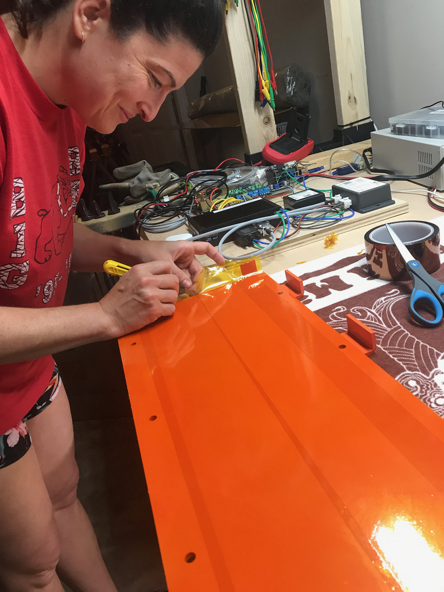
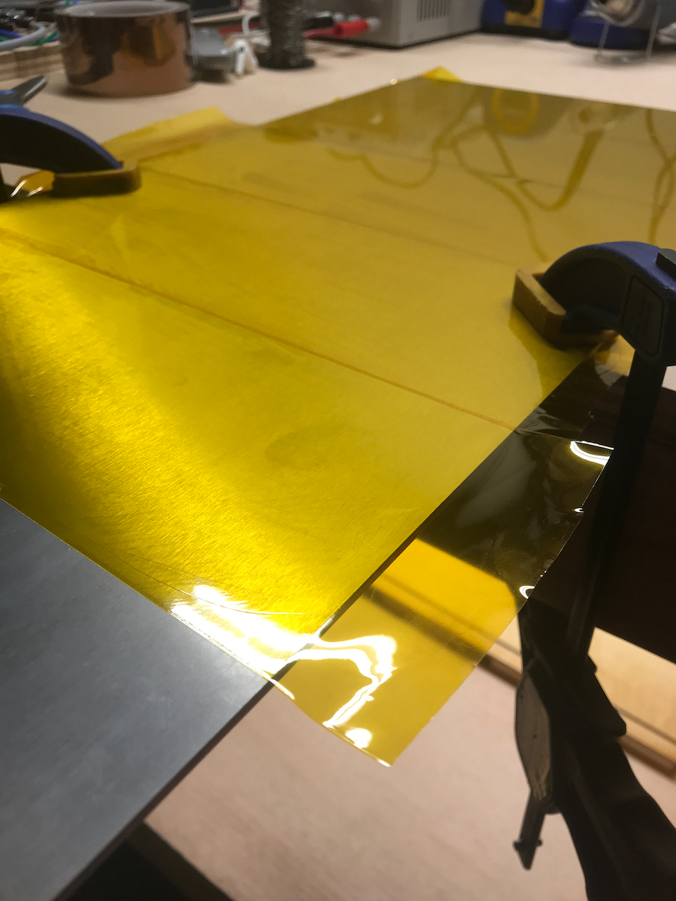
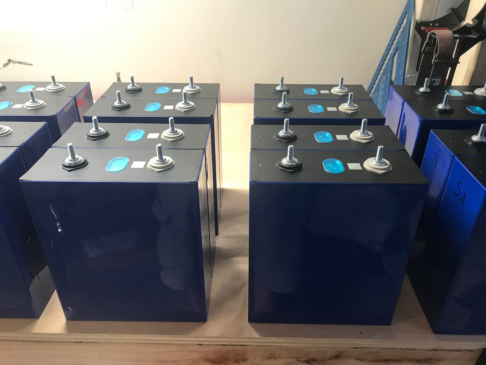
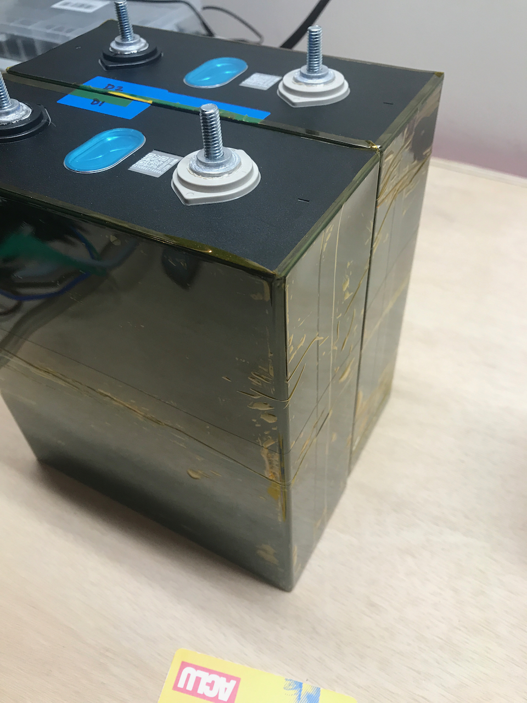
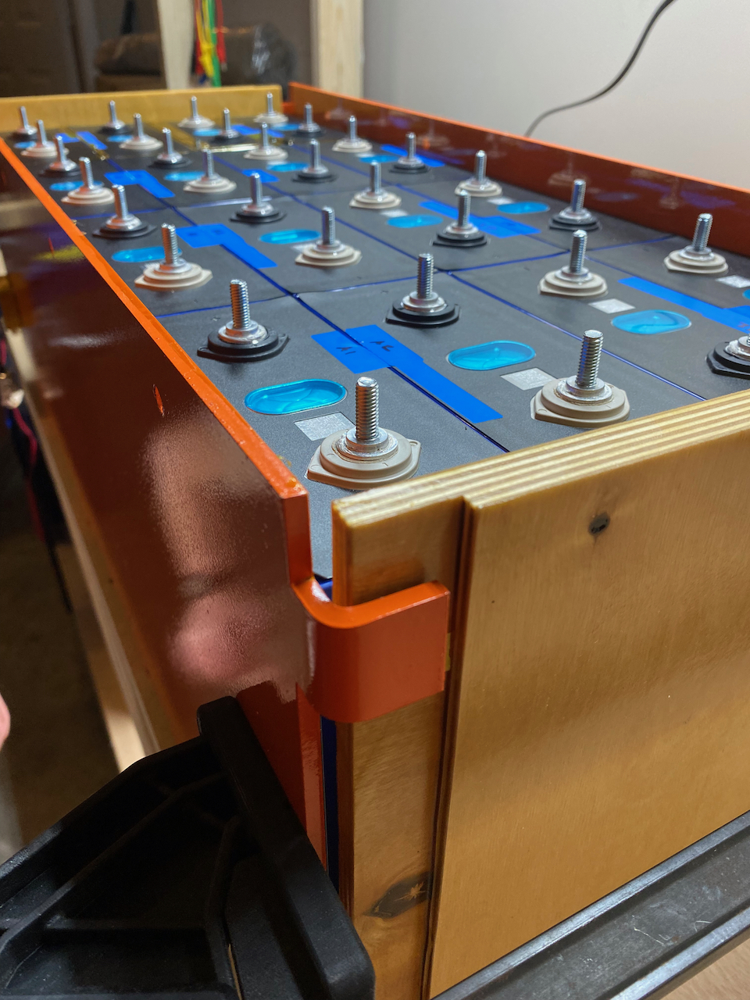
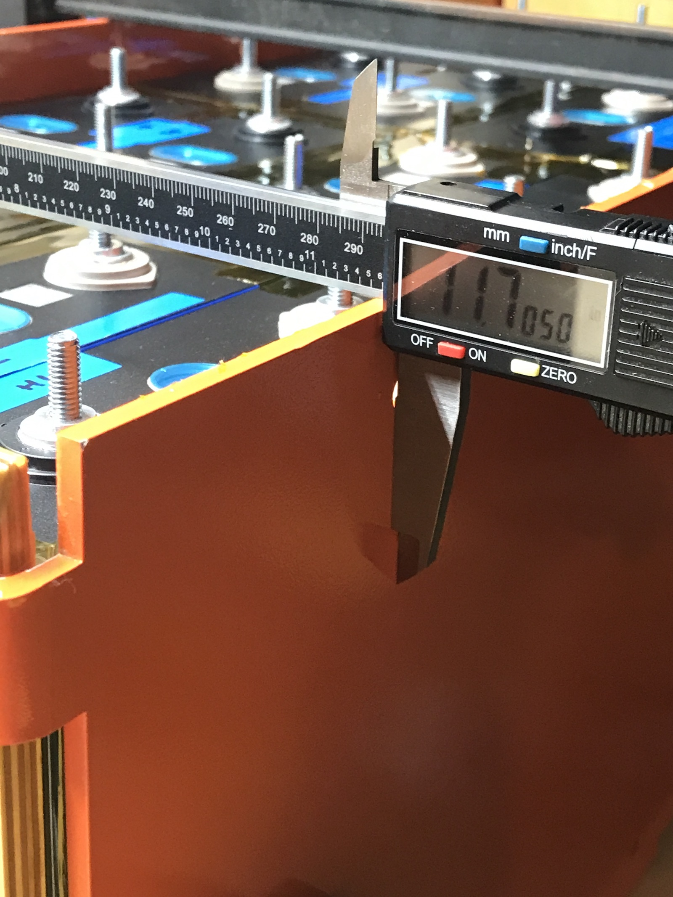
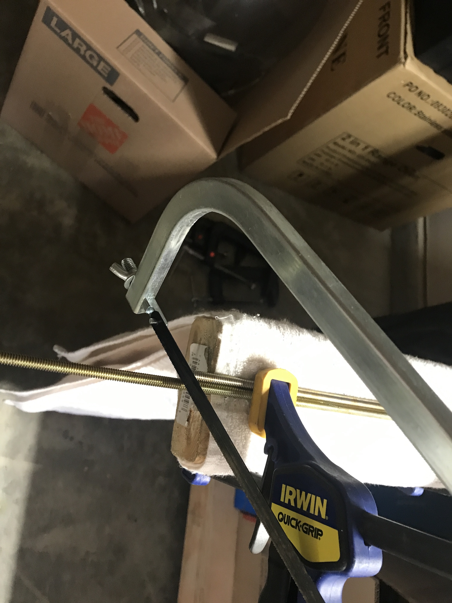
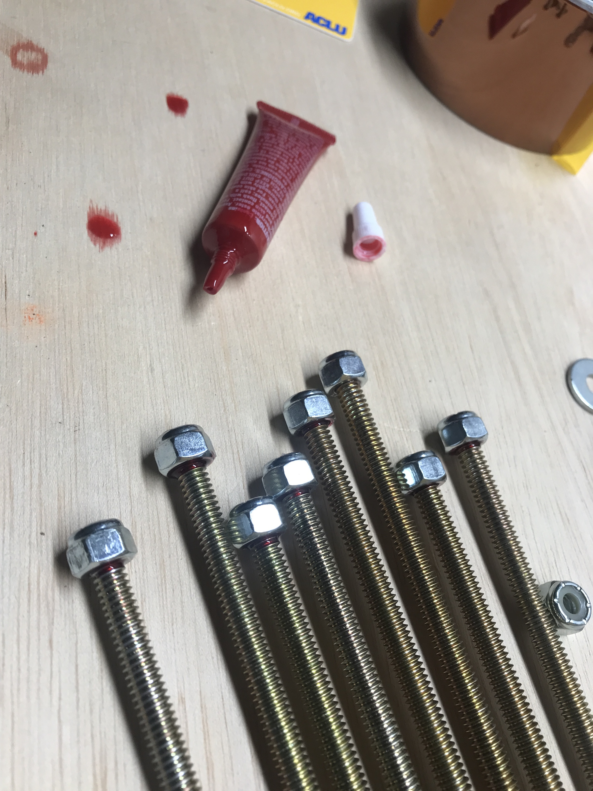
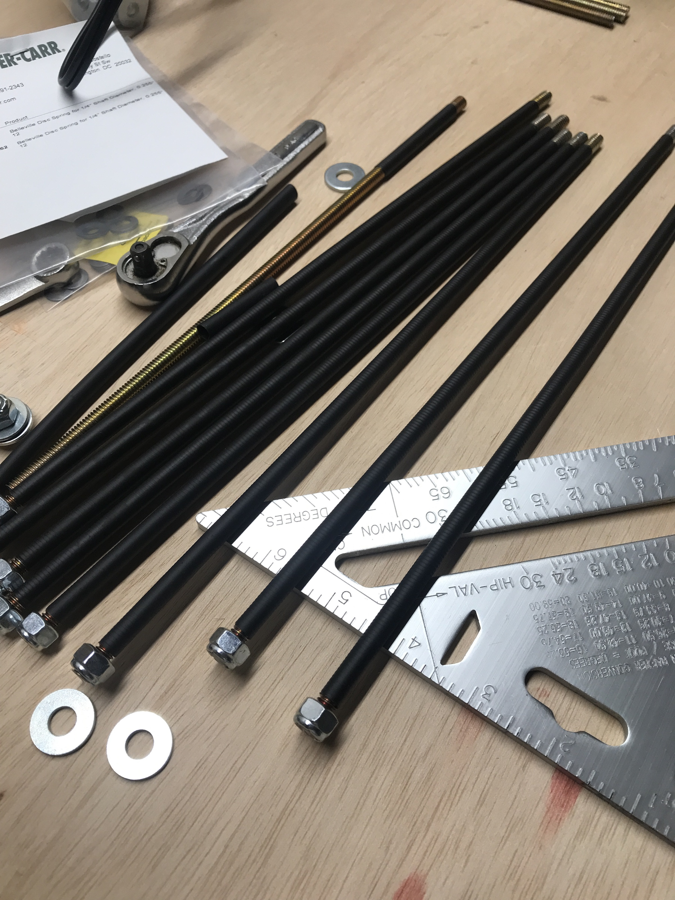
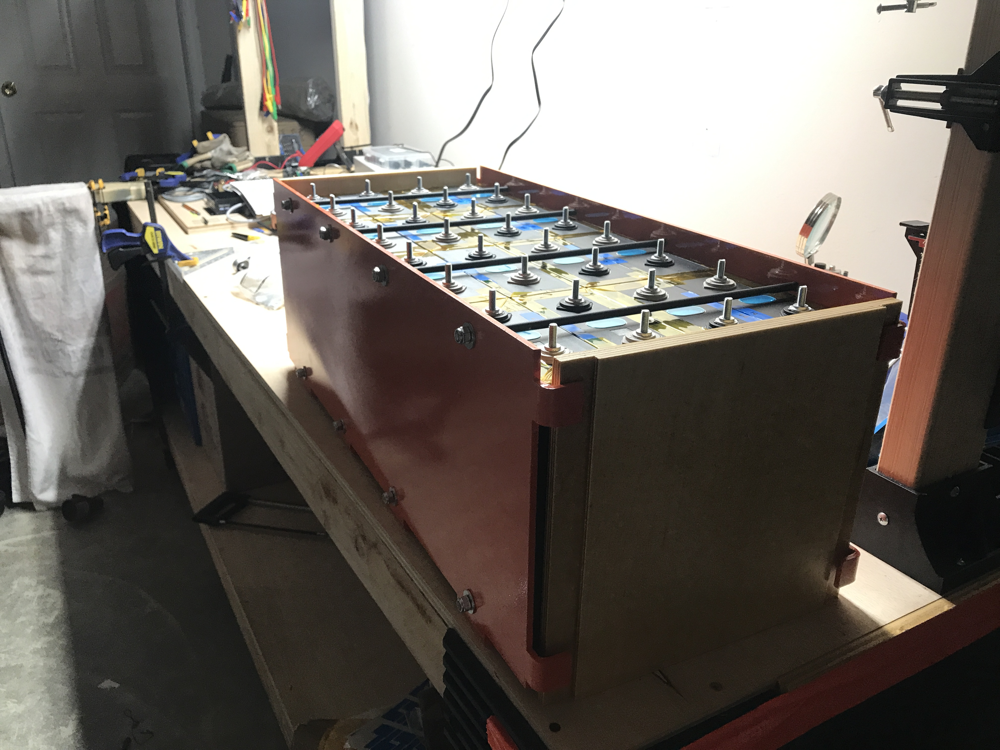

**TLDR: We assembled our LFP cells and other components to ensure everything fit up properly.  We verified our battery design was physically sound.**

We are doing a trial of the battery assembly to make sure we can get good final dimensions (primarily for cell interconnections) and verify the physical design works.

Step 1:  Cover the metal portions of the structure with kapton tape.

Step 2:  Pair the cells by thier internal resistance provided by the supplier.  Per X on the diysolarpower forum, we should use the "Ri1" values to do this.  We sorted the data and grouped them accordingly.

Step 3: Cover the outer sides of the paired cells with kapton tape.

Step 4: Rack 'em

Step 5: Measure battery width

Step 6: Cut the threaded rod

Step 7: Loc-tite nuts on one end

Step 8: Heat shrink

Step 9: Install and snug

## Findings
Our initial plan was to tighten the all-thread nuts to fully compress belleville washers in order to set a known compressive force on the batteries in the low SOC (and un-swollen) state.  We settled on [these](https://www.mcmaster.com/9712K62/) from McMaster which would provide 115lbf or 4.2 psi when compressed flat.  From the dry fit, it is clear that the displacement associated with the belleville washers is too small to allow for this approach (even when doubled up in series).  So we are going to pivot to using springs, compressed solid, to set the initial compression for the low SOC state.  Our first candidate is the [LHL 625B 01](https://www.leespring.com/compression-springs-hefty?search=LHL625B01) from Lee Spring which will provide 105 lbf or 3.8 psi when compressed solid.