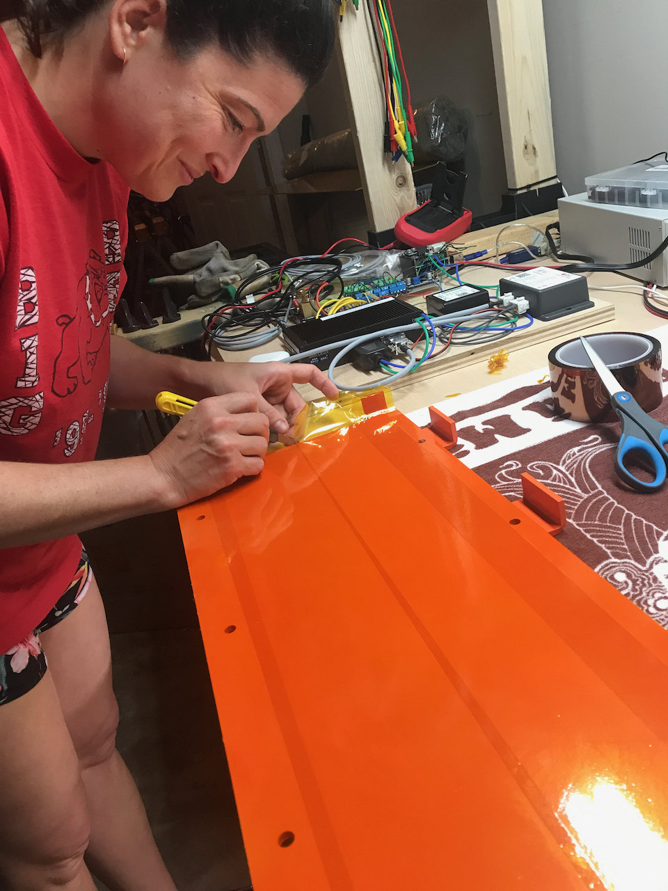
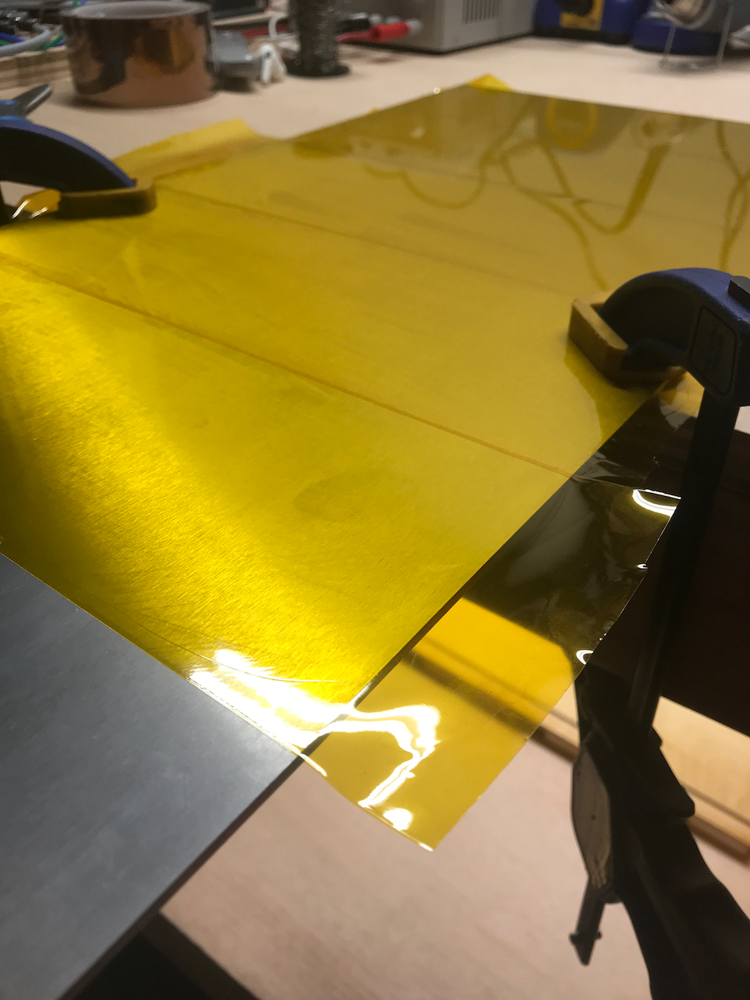
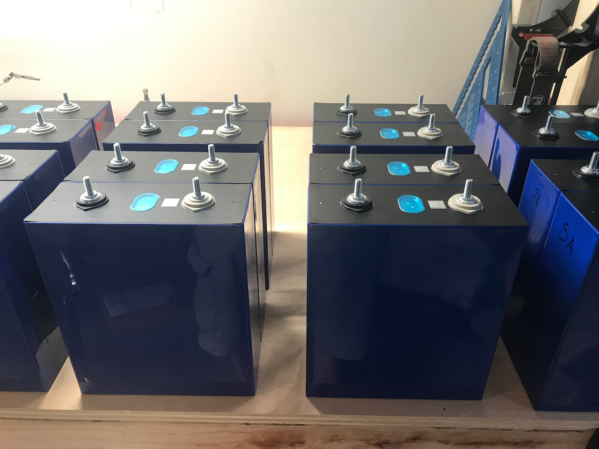
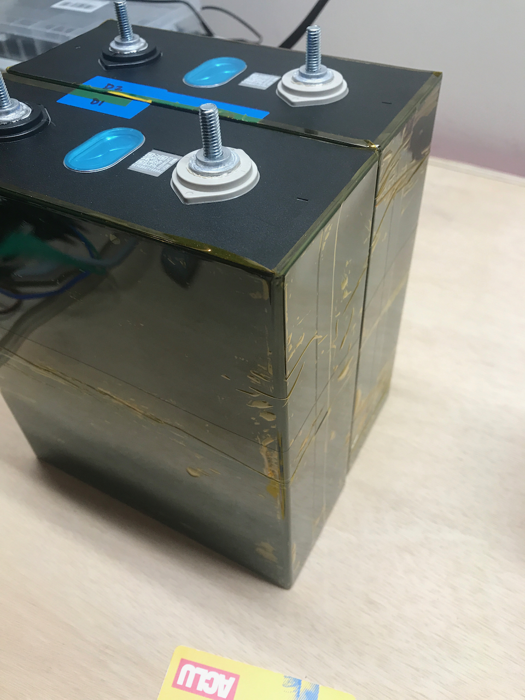
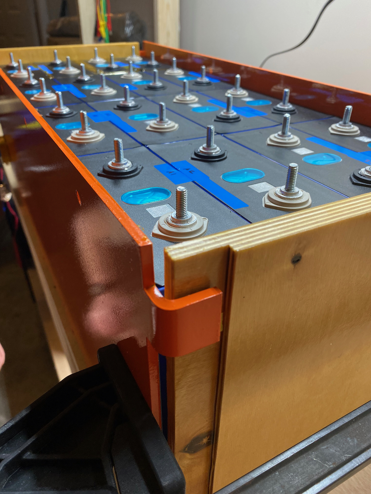

We are doing a trial of the battery assembly to make sure we can get good final dimensions (primarily for cell interconnections) and verify the physical design works.

Step 1:  Cover the metal portions of the structure with kapton tape.

Step 2:  Pair the cells by thier internal resistance provided by the supplier.  Per X on the diysolarpower forum, we should use the "Ri1" values to do this.  We sorted the data and grouped them accordingly.

Step 3:  Cover the outer sides of the paired cells with kapton tape.

Step 4:  Rack 'em

$$ E*V $$

$a^2+b^2=c^2$

P = R*I^2
P = hA(Ts-Tamb)
P = hATs - hATamb
C = 1/R
hATsC - hATambC = I^2
(W * T * C) + (W * C) = I ^ 2

Cover the jumper design in the battery article.

Cover the findings from the use of the belville washers, and the shift to springs.

Cover the terminal measurements.