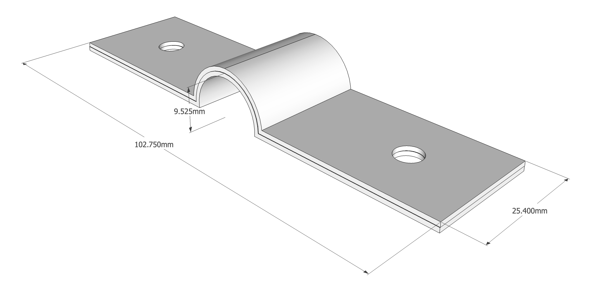
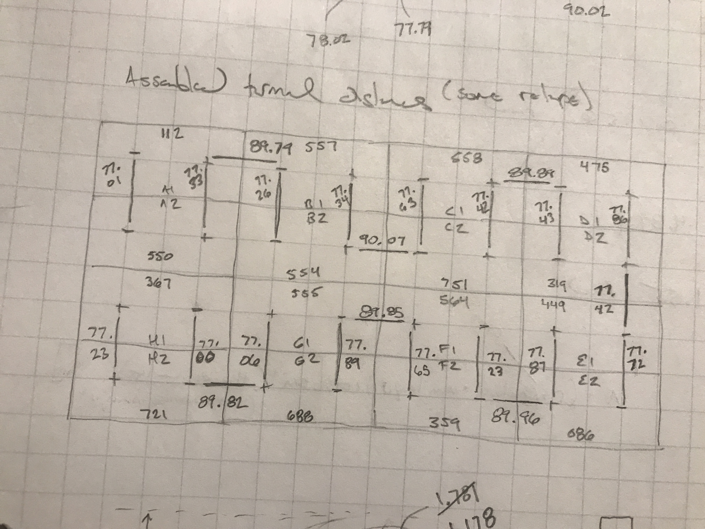
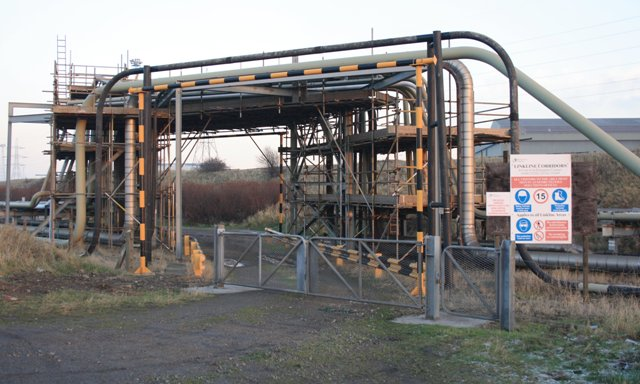

To make our cells function as a battery we have to connect them together in a specific pattern.  We take two cells, and connect the positive terminals together and connect the negative terminals together.  We're refering to the things that make these (parallel) connections as the "parallel" interconnets.  Those two cells in parallel for kind of an uber-cell.  We then connect 8 of those uber cells together in series, positive to negative and so on.  We're referring to the things that make these (series) connections as the "series" interconnects.  

The series interconnects carry the full current that flows into and out of the battery.  The parallel interconnects only carry half, so less copper is needed. 

Each parallel interconnect is composed of 1 mm thick, 25.4 mm wide,  copper bus bars stacked two high.  The interconnect will have a strain-relief arch of radius ~9.525 mm to minimize the force on cell terminals due to growth and movement.  In the final formed configuration they have a center-to-center distance of ~71 mm and a total length of ~103 mm.  In the ordered (flat) condition they have a center-to-center distance of ~80 mm and a total length of ~112 mm.  The two holes are 6mm in diameter.

_The parallel interconnects looks something like this.  The series interconnects are similar but a bit wider, a bit longer, and stacked higher._

One series interconnect shares identical dimensions as the parallel bus bars with the exception of a width of 31.75 mm and it is stacked 5 high.

Each other series interconnect is composed of 1 mm thick, 31.75 mm wide,  copper bus bars stacked five high.  The interconnect will have a strain-relief arch of radius ~9.525 mm to minimize the force on cell terminals due to growth and movement.  In the final formed configuration they have a center-to-center distance of ~84 mm and a total length of ~109 mm.  In the ordered (flat) condition they have a center-to-center distance of ~93 mm and a total length of ~118 mm.  The two holes are 6mm in diameter.

## Design Goals

Our design goals were to:

- Avoid oversizing or slotting interconnects directly against the terminal flats given the limited contact area.
- Avoid imparting large forces to the cell terminals due to cell growth or shrinking, or thermal growth of the interconnects.
- Maximize ampacity to keep the interconnects as cool as possible given they connect directly to the battery cells.

_That small flat area is why we don't want to oversize or slot our bus bar holes._

These, sometimes competing, goals led us to look at procuring laser cut interconnects from send cut sent.  By using the thinnest copper they offer (~1mm), we could easily shape the copper to make it "flexible" to terminal movement while keeping the holes tight toleranced to the terminal radii.  This accomplishes the first two design goals.  By stacking these "bars" and choosing thier width appropriately, we accomplish the third goal.

## Design Approach

Note: This [google spreadsheet](https://docs.google.com/spreadsheets/d/1Pt9gJuRe_mgjYMCVcGqAvc35JIKin3QtssmPnbjSTbU/edit?usp=sharing) contains all the calcs and data referred to in this section.

### Ampacity, Stack Height, and Width
To allow evaluating tradeoffs between custom bus bar widths and number of layers, we used [data](https://www.copper.org/applications/electrical/busbar/bus_table1.html) to find a good regression that tracked thier emperical data.  This is probably overkill, but it allows you to easily play with parameters and iterate quickly once you have it.  After trial and error we settled on a regression that tracked with low error in the ranges of width and thickness we were interested in.  The regression output drives a calculator on the "Ampacity Calculator" tab in the aformentioned spreadsheet.  That tab will also allow you to enter a "design current" higher or lower than the calculated ampacity to estimate the bar temperature rise above ambient for your operating current.  This is not regression based (it uses a simple physics approximation) but tracks copper-dot-org's data pretty well and conservatively.  All of this allowed us to evaluate bar widths and thicknesses that minimized temperature vice just meeting an ampacity limit.  

This led us to:
- parallel interconnects that are one inch wide and stacked two high (~2 mm).  
- series interconnects that are 1.25 inch wide and stacked 5 high (~5 mm).

These will run ~9C over ambient at 0.5C charge or dischage rates.

By the way, [copper.org](https://www.copper.org) is a phenomenal resource if you need to do anything with copper...highly recommend.

### Terminal Forces and Length

Once we had the cells and battery structure all kapton'd, assembled, and compressed, we took measurements between all terminals that would feature an interconnect.  The measurements in the "Cell Terminal Measurement Data" tab of the above spread sheet.

_Before spreadsheets we had to do everything with pencil and engineering graph paper._

Because we want to maximize terminal flat contect, we are looking at putting 6 mm holes over 6 mm terminals.  This means no sliding to relieve force imparted to the terminals.  From research and exprience of others, we know that we will likely have to acommodate up to 0.2 mm of terminal displacement.  You can calculate the associated forces and stress and you'll find that your are yielding copper and putting thousands of lbf on the terminals, or moving them (which is worse).  The "Battery Post Force Calculator" tab will give you forces for a given displacement.

_A feature like a pipe expansion loops will significantly reduce stress at the fixed ends. [© Mick Garret](https://www.geograph.org.uk/profile/343) [ CC BY-SA 2.0](https://creativecommons.org/licenses/by-sa/2.0/)_

So we didn't want to diminsion straight bus bars using terminal measurements we took above.  We wanted to make them longer and then bend a little "arch" into them to make them more compliant to axial movement.  The larger the radius of the "arch" the lower the force imparted on the terminals for a given displacement.  However, we have a few constraints.  We need the series bars to lay on the flat, non-arched, parts of the parallel bars.  We also want the tops of the arches to lay below the top of the battery side plates so the arches don't interfere with putting a lid on the battery down the road.

To this end, the "Interconnect Length Dimension Calculator" tab in the spreadsheet above figures this all out for us.  We put in some parameters like the bar width and stack height we already figured out, and our desired radius, and it spits out the final length dimensions.  

This all led us to:
- flat parallel bars that are 79.5 mm center-to-center that will be ~71 mm center-to-center with a 3/8 radius arch.
- flat series bars that are 92.5 mm center-to-center that will be ~84 mm center-to-center with a 3/8 radius arch.

The 3/8 radius meets our constraints, and reduces the terminal forces by a factor of ~40.  Most importantly, it is the radius of a 3/4 wooden dowell available from any hardware store.  Thats what we'll use to help bend/form the arches down the road.

## Final Design

Not final really, since we have work to do upon reciept, but this is what we ordered/will order from [sendcutsend.com](https://sendcutsend.com):

- Quantity 15: 31.75 mm x 111.25 mm, 79.5 mm on-center holes, 0.04 inch copper stock.  These are for the series connection between cell group 4 and 5, bending tests, electroplating tests, and proof of concept.

- Quantity 36: 25.4 mm x 111.25 mm, 79.5 mm on-center holes, 0.04 inch copper stock.  These are for the parallel connections with and extra 4 (2 connections) as production backups.

- Quantity 40: 31.75 mm x 117.9 mm, 92.6 mm on-center holes, 0.04 inch copper stock.  These are for the series connections with an extra 10 (2 connections) as production backups.

## Alternatives Considered

We looked at everything available on ali-express and domestic suppliers.  The CALB-style interconnects are hard to find at reasonable prices and at the needed dimensions for the EVE cells in our arrangement.  We considered the braided products out there but found them expensive, lacking in the right ampacity, or having flatness problems that would not guarentee good connections.  For these reasons we opted to design our own.

For our own designs we considered making our own braided interconnects using braid stock available from McMaster-Carr and copper pipe.  However, we would have needed to procure a press to do it well and I didn't want to buy one for such a limited and specific application.

