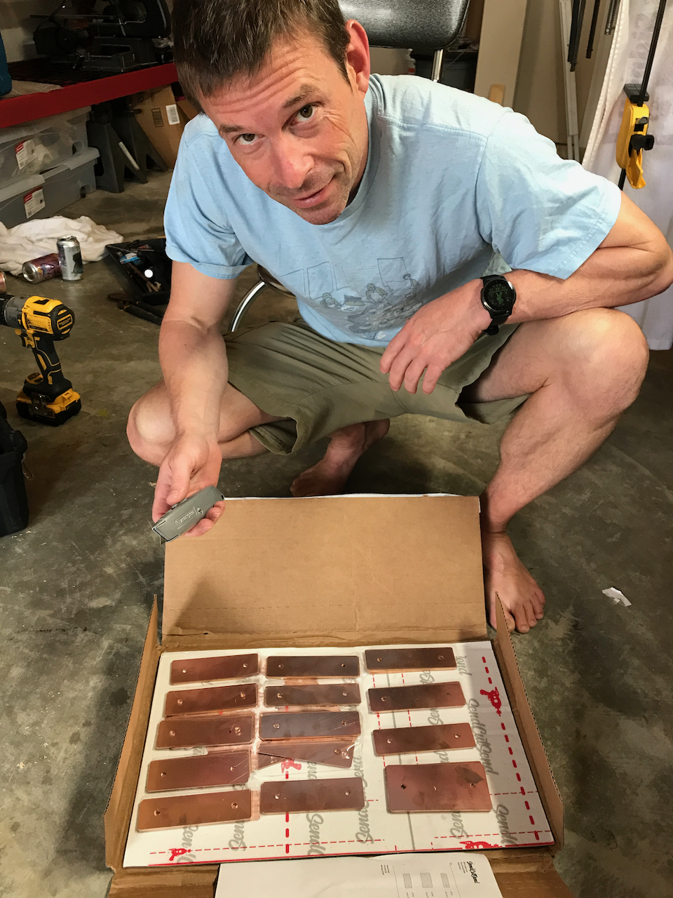
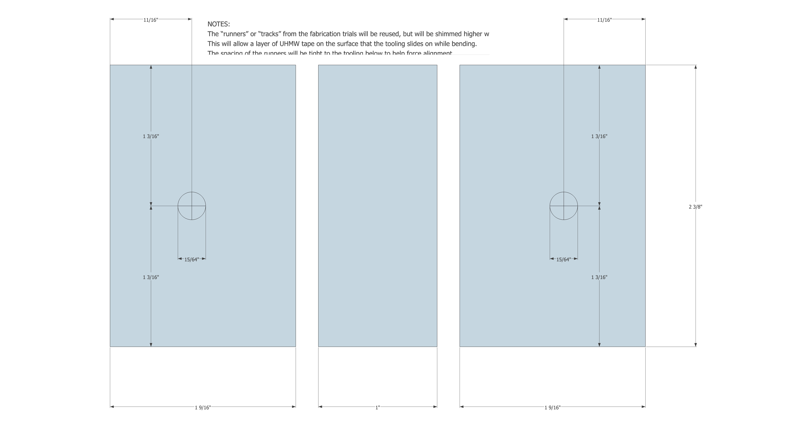
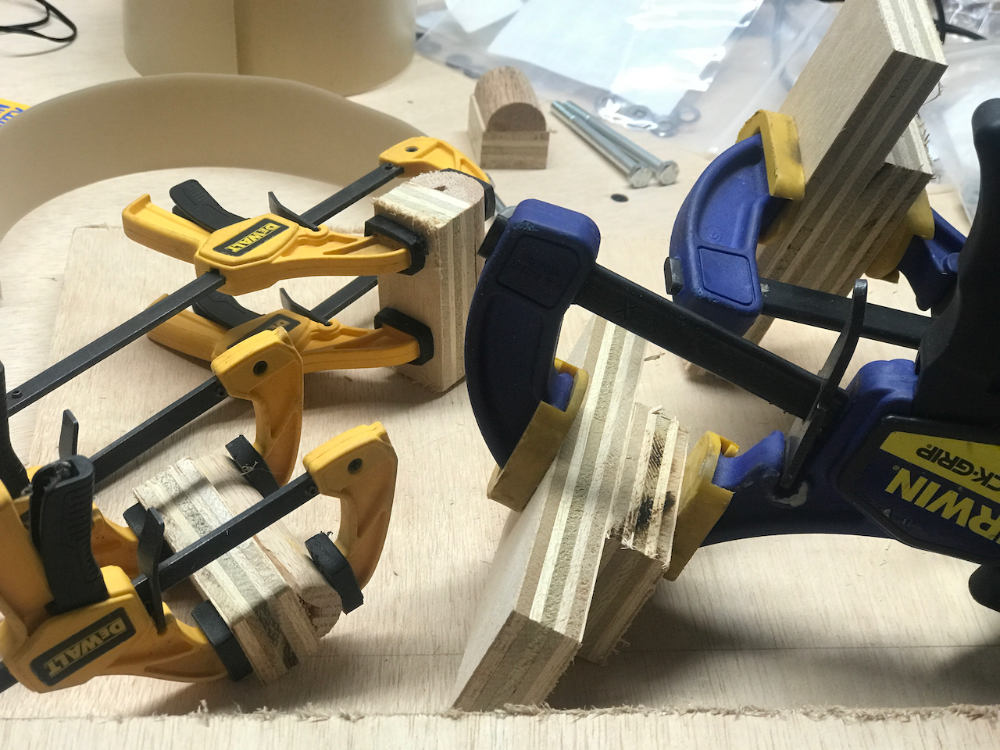
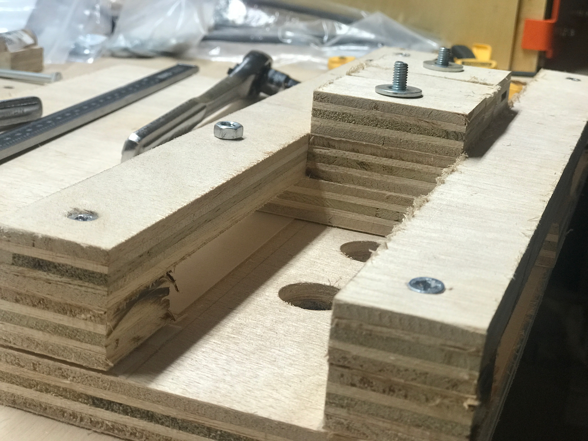
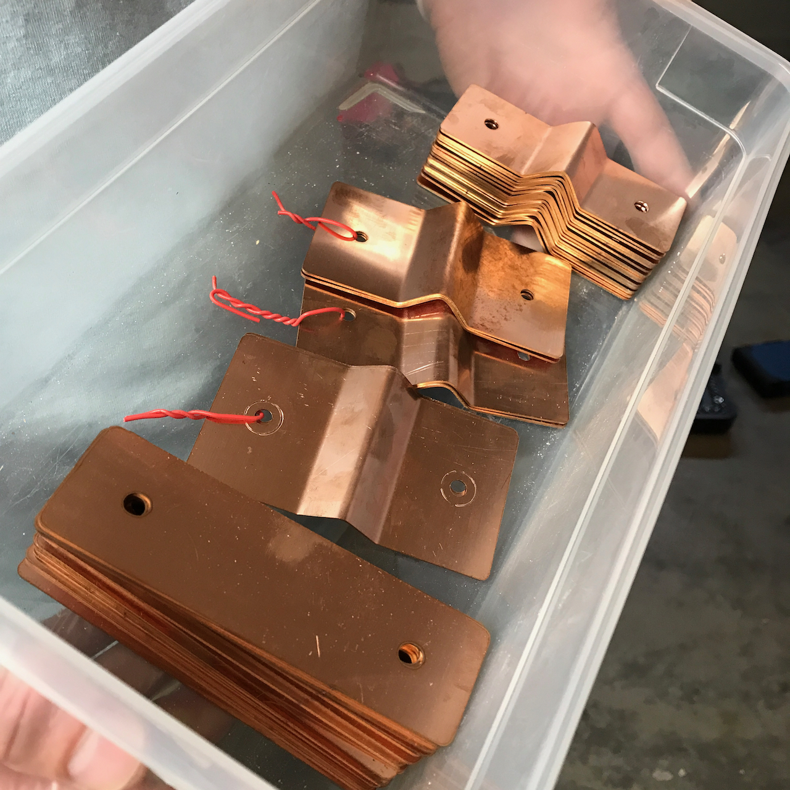
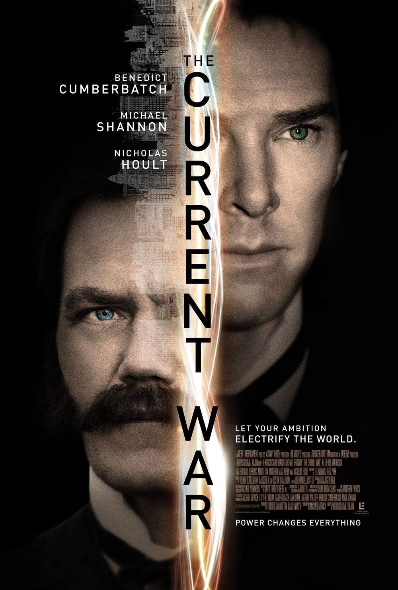
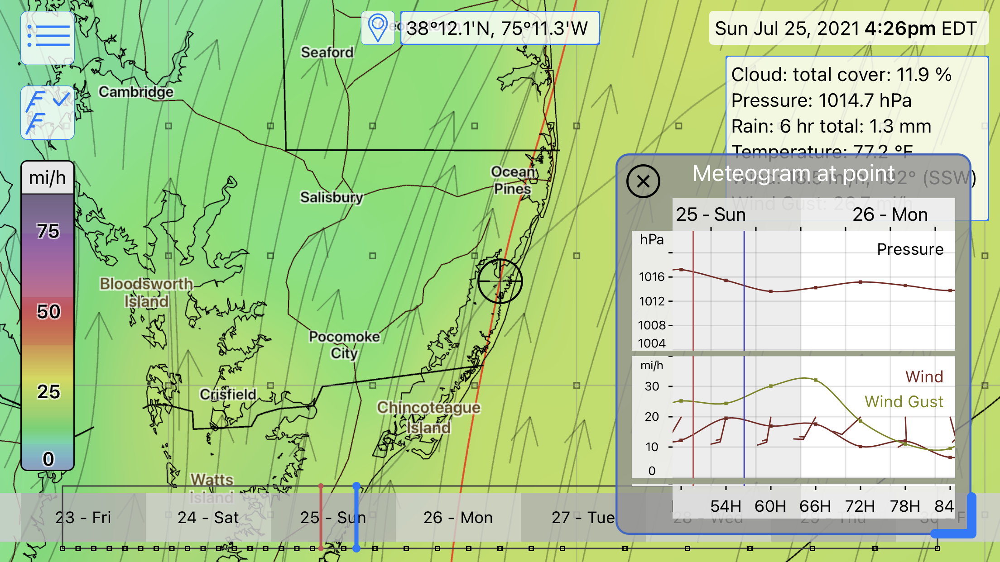
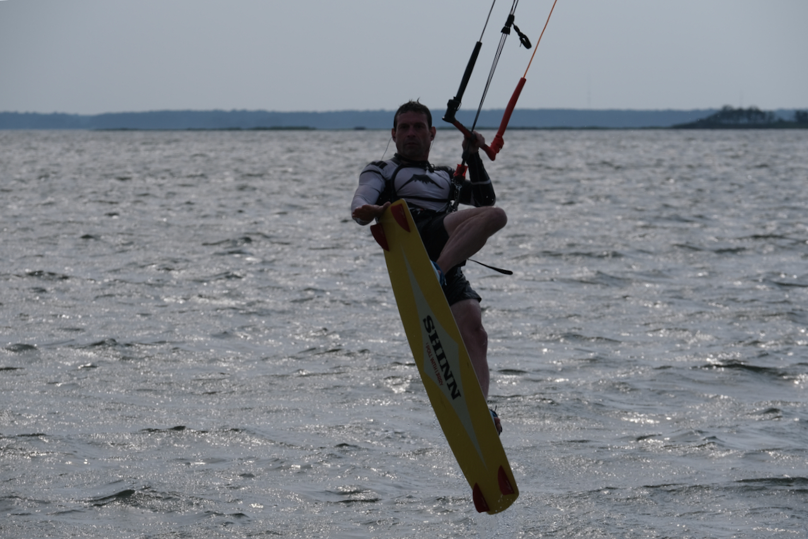

**TLDR: We successfully completed the fabrication of our battery interconnects.**

A very productive day.  Our final battery interconnect materials delivered from sendcutsend on July 12th.

_Six days from drawing submittal to delivered product!_

In the meantime, we made some improvements to our battery interconnect fabrication tooling based on our previous trials.  The dimensions of the tooling needed to change based on the [modifications](/blog/2021-7-5-battery-interconnect-redesign/battery-interconnect-design-v2) we made to the interconnect design after the initial [fabrication trials](/blog/2021-7-4-battery-interconnect-fab-trial/battery-interconnect-fab-trials).

_The bend tooling dimensions based on the final interconnect design._

_Glueing up the tooling._

We narrowed the "track" that the tooling slides in to aid in keeping everything parallel and perpendicular as needed.  We added some UHMW to improve sliding and minimize any binding under the clamping forces.

_UHMW tape FTW._

After two iterations, and filing about a millimeter off the center mandrel, we got the hole spacing perfect and were off to the races.  It took about and hour and a half to produce the 16 parallel interconnects and 3 pairs of the one bent series interconnect.  We opened up the holes length-wise on 8 of the parallels to account for the slightly wider terminal spacing on a handful of cell groups (like a fraction of a millimeter).

_All done._

`vimeo: https://vimeo.com/579063079`
_Clampy, clampy, clampy._

We stayed with the electrical theme and selected "The Current War" for our evening entertainment.  We would pay money to watch Michael Shannon wash dishes at this point.

_Suck it, Edison!_

And if bus bars and Michael Shannon wasn't enough, we've got some EPIC wind forecasted for Assateague tomorrow!  

_Baby Hatteras._

### Update: 7-25-21

_AZT Delivered_