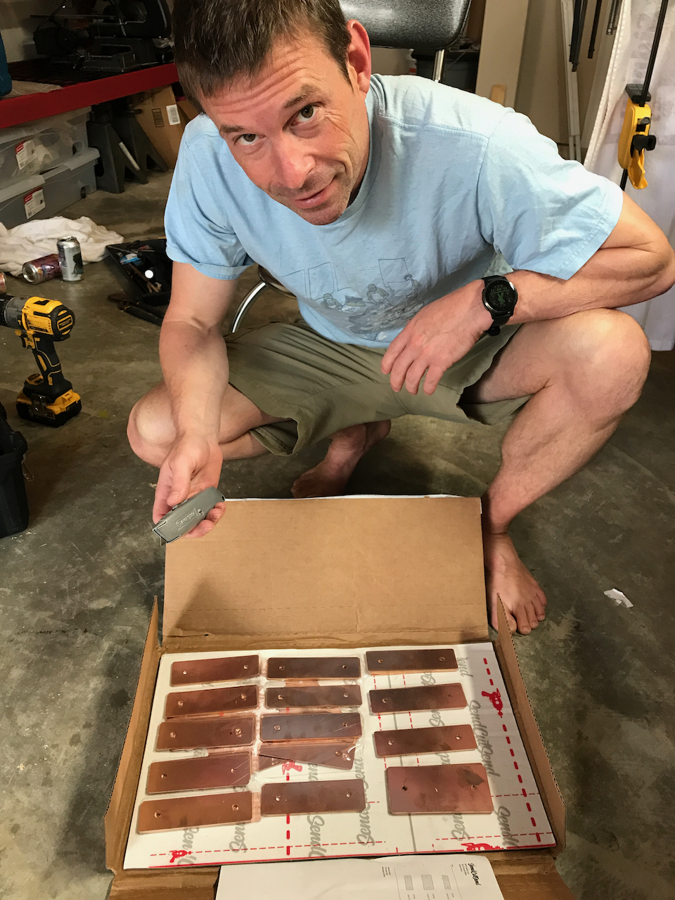
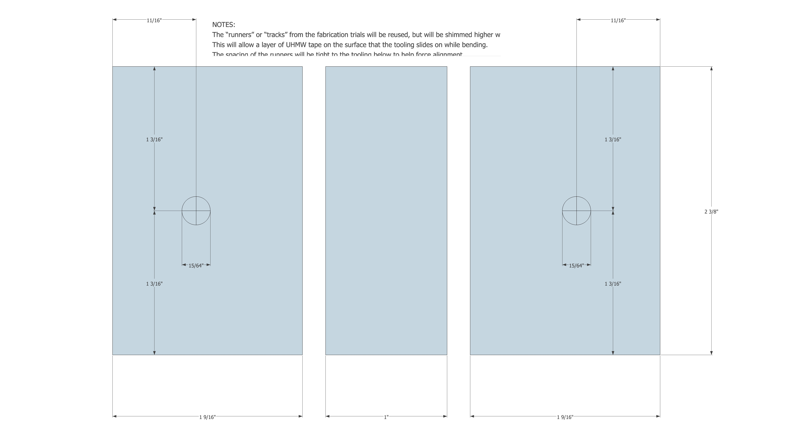
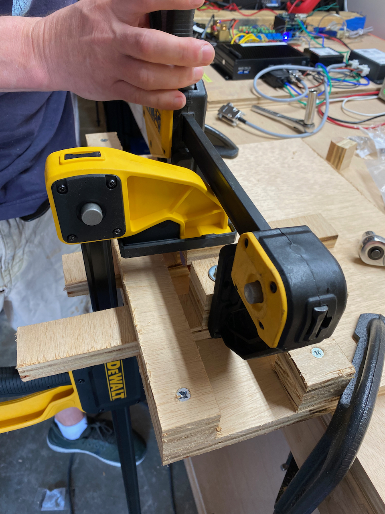
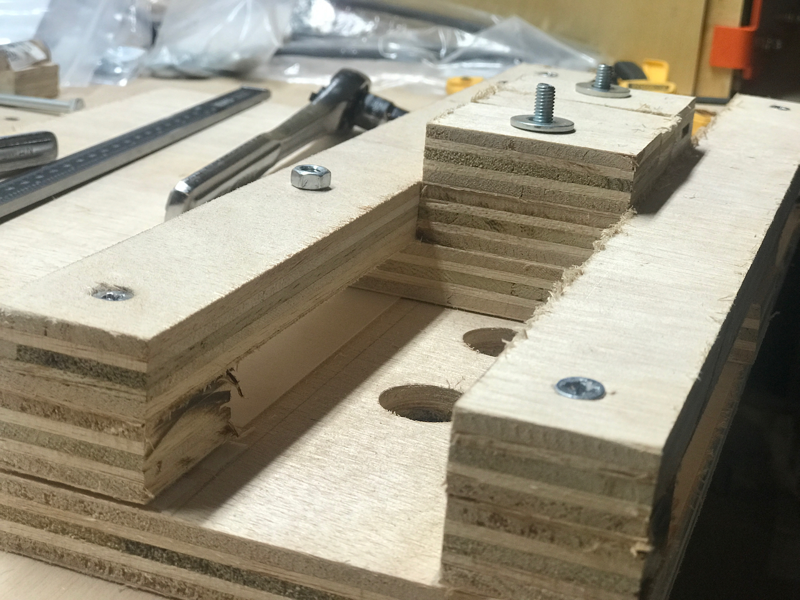
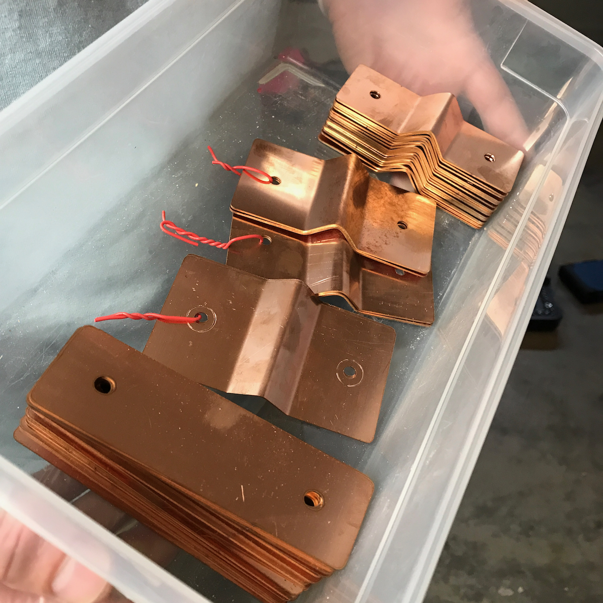
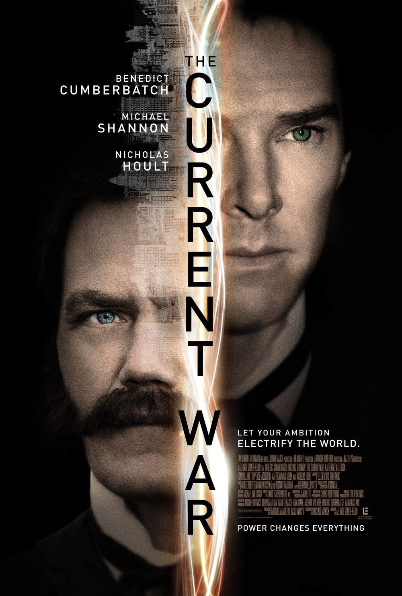

Birthday bus bars!  Our final battery interconnect materials delivered from sendcutsend on July 12th.

__Six days from drawing submittal to delivered product!__

In the meantime, we made some improvements to our battery interconnect fabrication tooling based on our previous trials.  The dimensions of the tooling needed to change based on the [modifications](/blog/2021-7-5/bettery-interconnect-design-v2) we made to the interconnect design after the initial [fabrication trials](/blog/2021-7-4/battery-interconnect-fab-trials).

__The bend tooling dimensions based on the final interconnect design.__

__Glueing up the tooling.__

We narrowed the "track" that the tooling slides to aid in keeping everything parallel and perpendicular as needed.  We added some UHMW to improve sliding and minimize any binding under the clamping forces.

__UHMW tape FTW.__

After two iterations, and filing about a millimeter off the center mandrel, we got the hole spacing perfect and were off to the races.  It took about and hour and a half to produce the 16 parallel interconnects and 3 pairs of the one bent series interconnect.  We opened up the holes length-wise on 8 of the parallels to account for the slightly wider terminal spacing on a handful of cell groups (like a fraction of a millimeter).

__All done.__

`vimeo: https://vimeo.com/579063079`

We stayed with the electrical theme and selected "The Current War" for our birthday evening entertainment.  We would pay money to watch Michael Shannon wash dishes at this point.

__Suck it, Edison!__

The three most important ladies in my life, Sophia, Mom, and Sharon combined forces like Voltron to get me THE BEST PRESENT EVER.
![oscope.jpeg]
__Siglent 4 Channel!!!__

And if bus bars, Michael Shannon, and a new o-scope weren't enough, we've got some EPIC wind forecasted for Assateague tomorrow!  

![azt.jpg]
__Giddy up.__
