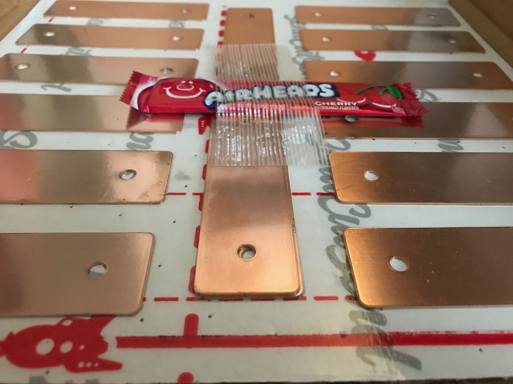
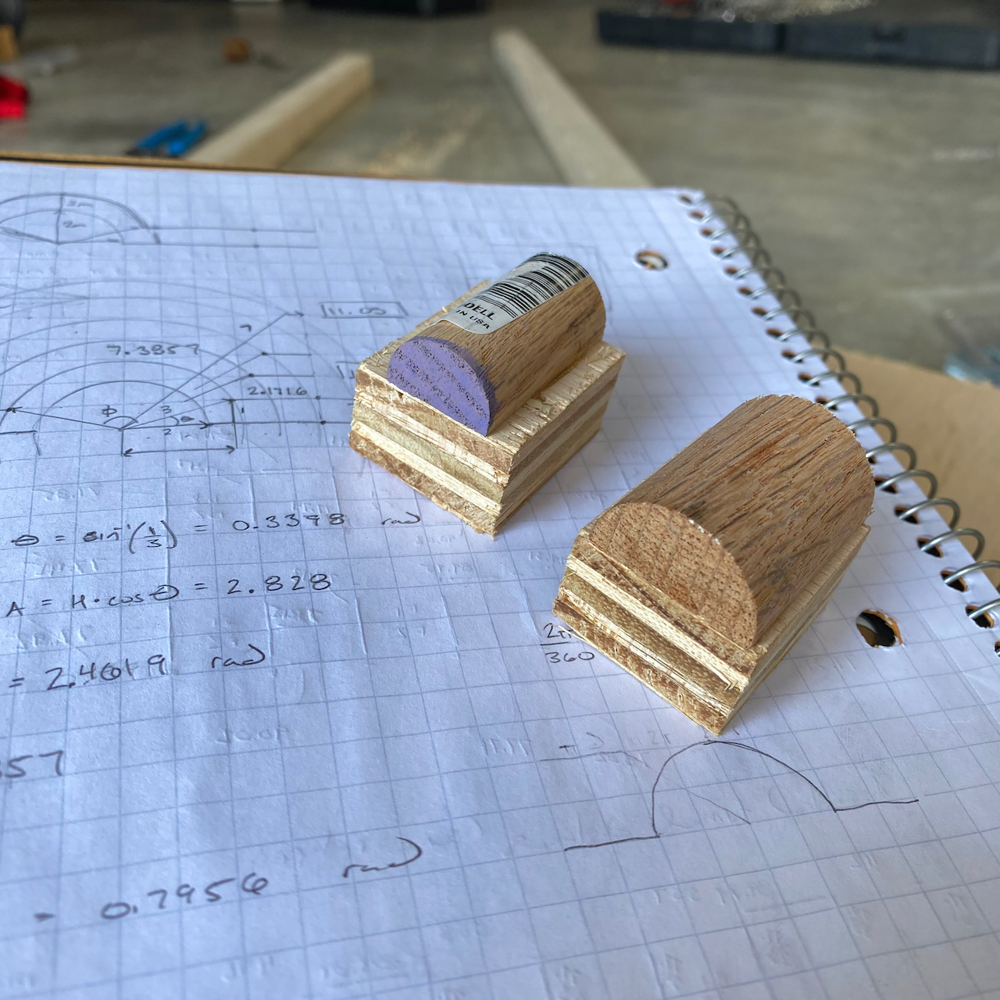
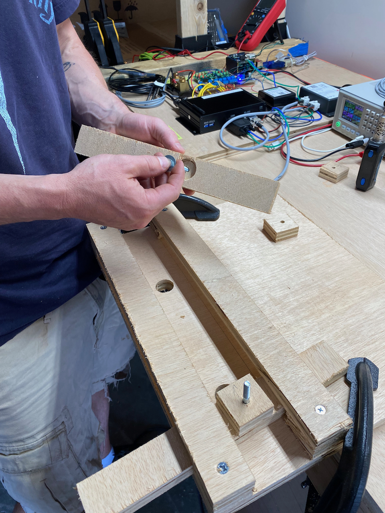
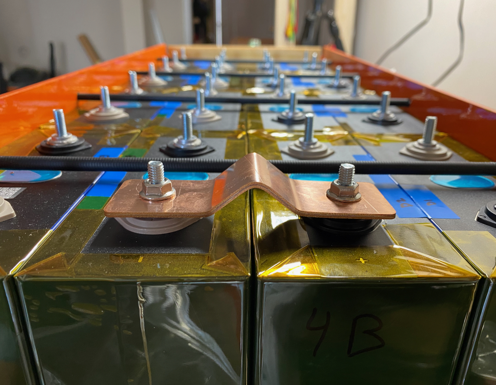

We laid out our plans and design for our battery interconnects in a [previous post](/blog/2021-6-26/bettery-interconnect-design).  Start there if you want some context.  This is post is about the difference between theory and practice.  Hah.  

## The Process

We received our initial (test) batch of flat copper bus bars from [sendcutsend.com](http://sendcutsend.com) on Friday, and got super excited.  We spend Saturday thinking about how we might actually form them into the desired shape.  Honestly, we'd been mulling that over since the design post or before, but nothing focuses the thought like the immediacy of a task.  Despite a lack of a final plan, we went to Home Depot to pick up some M6 bolts, nuts, wood dowels, and some bar stock that we figured would be useful in any case.

_These people rock.  Seriously.  Fast service, accurate tolerencing, and free airheads.  What!_

One of us awoke this morning with a vision for bending and set off for the garage and the table saw within it.  The sensible other joined later.

Our approach involved all wooden parts, except the bolts and nuts.  Basically, we use a short piece of dowel cut in half to start the bend.  We help that by driving the ends of the busbar inward.  The wood pieces are sized to fit together so that when everything is fully scrunched, the holes are in the right locations.  That was the idea at least.

_These are two mandrels, one for 3/4D bends, and one for 1"D bends (just in case).  They are siting on some bending math!_

The flat bus bar passes over two M6 bolts on two independent pieces of wood that can slide closer or farther from each other.  Those pieces of wood are kept from moving "out of plane" by two other pieces of wood that hold them down but let them slide.

Two more peices of wood go over the bolts and it all gets tightened down with nuts and washers.  Then come the "mandrel" and clamps.  We use one clamp to force the mandrel down into the bus bar.  Then we use the other clamp to push the two sliding pieces of wood toward each other.

We alternate the clamps until the two sliders are as close to each other as they can get.  At that point they are touching the mandrel which prevents further movement.  Thats it.  You have a fully formed busbar.  

I'm sure that all sounds confusing.  This time-lapse will make it more clear.

`vimeo: 571057210`

## The Learning

We learned a few things:

- We might want to go slightly larger on the holes.  Like 0.25 mm or something.  They are pretty tight on the posts.
- We are able to form a stack of two bars at once which is perfect for the parallel connections.
- We CANNOT form a stack of five bars at once.  We think we are at the limits of geometry and copper compliance.  But we think we have a solution with using multiple sets of sligher longer bars and different mandrels to make a stack of five stack tightly.  This is required for the endmost series connection which is in the athwart direction.
- Based on that last lesson, we may retreat to straight slotted bars for the other series connections due to the lower fore-aft cell growth and no concern about contact area for those connections.

## Fireworks

Then we watched fireworks.  Happy July 4th!
