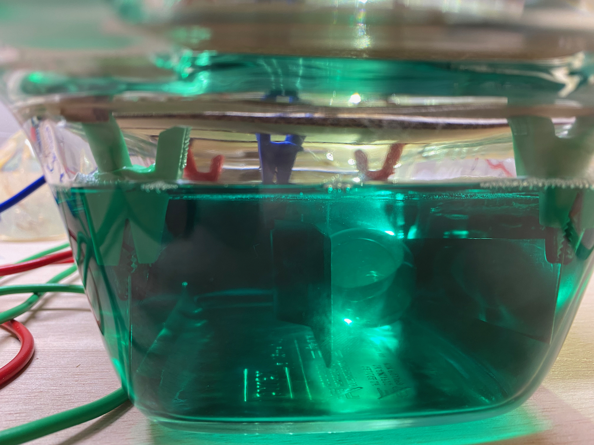
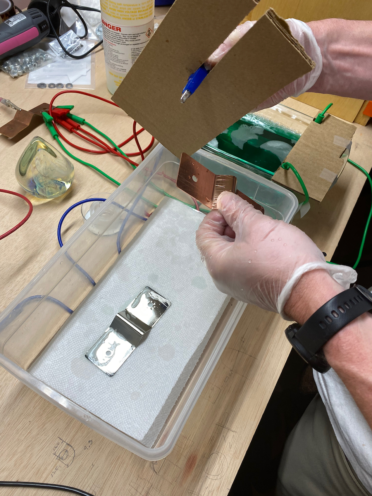
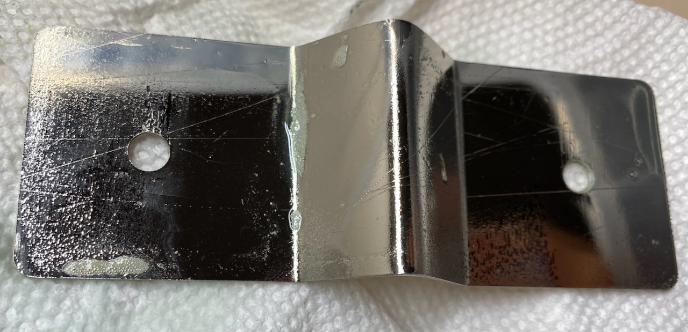
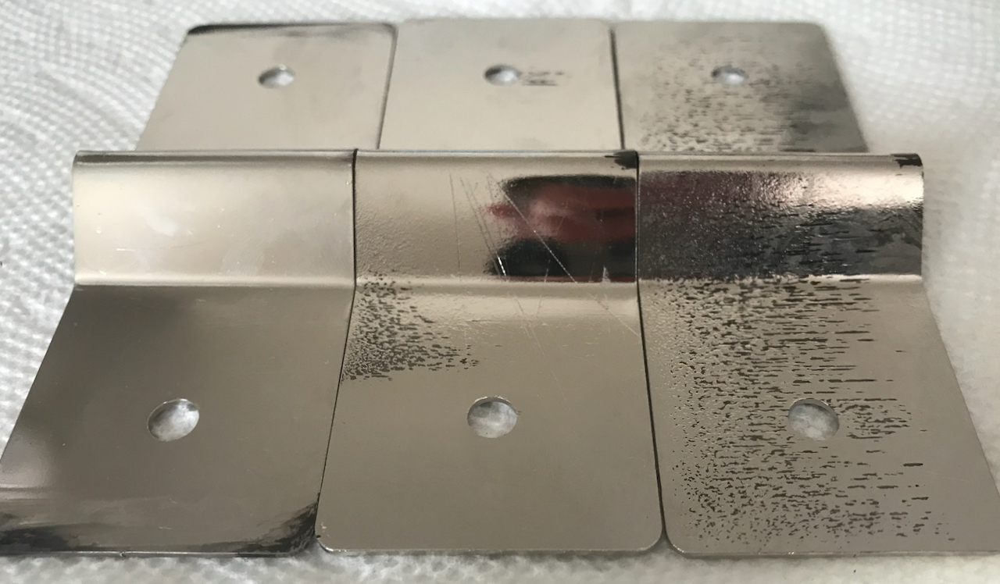

**TLDR: We are electroplating our battery interconnects with Nickel to provide corrosion resistance.  Our first attempt/protocol failed but we learned some valuable lessons.**

We are electroplating our battery interconnects with Nickel to provide corrosion resistance.  We spend a lot of time in highly corrosive salty air.  The [busbar design guide](https://copperalliance.org.uk/resources/pub-22-copper-busbars-guidance-design-installation-2/) from copperalliance.org.uk advises that it is a good idea in harsh high humidity environments.  We electroplated the connection points on Van 1.0 using tin, and a brush method.  It turned out ok, but opted to go with a bath this time around.

Nickel has its own fan club, the [Nickel Institute](https://nickelinstitute.org/), that has great information available about stuff pertaining to Ni.  We used their [Nickel Plating Handbook](nph_141015.pdf).  Its geared towards industrial applications, but has a wealth of relevant information.

We also referred to some threads and [resources](https://diysolarforum.com/resources/tin-plating-nickle-plating-or-solder-plating-bus-bars.163/) on the diysolarforum.

Lastly, we used the guidance from the Krohn electroplating solution.

On that subject, you will find lots of examples on the intertubes of people making their own Nickel electrolyte.  We opted to buy ours from Amazon.  At some point, we reach our DIY limit.  

Based on all the above sources, we set out with the following plan/goals:
* Clean the copper beforehand with a mixture of vineger, salt, and dawn dish soap per internet and Bob Villa.
* Use our power supply, in current source mode, to source the equivalent of 20 A/ft2 (ASF).  This number was based on the Krohn electrolyte label (it said 10-20 ASF).
* Plate for 30 minutes (at 20 ASF) which the Handbook would predict to yield a thickness of 25 um or ~1 mil.
* Try and keep the surfaces being plated equidistant and as far from the Nickel anode(s) as possible to get even plating, per the handbook.  This means two anodes, one per side.

Note, you end up geometry and fluid limited at some point.  And the fluid isn't cheap.  This is what our setup looked like:

_The Nickel electrodes are on the sides, the busbar is center.  The large egg thing is a glass paperweight we used as ballast to get the fluid level higher._

We fired up the power supply and set a timer.  We could see a small train of bubbles from the edges of the first busbar as the current was flowing.  Turns out that is a sign of something.

`vimeo: https://vimeo.com/580101503`

After 30 minutes, we swapped in a second, and inspected the first.  Hmm.  We found black deposits on the edges furthest from the center.  After some quick [interneting](https://asterionstc.com/2016/04/burning-plating-bath/) we decided to turn down the current density to 10 ASF, and double the time to get the same thickness.  This is a classic example of theory-to-practice.  We calculated our power supply current based on the 20 ASF upper limit.  However, the current density will not be uniform.  If you remember college or high school physics, electric fields concentrate around small radii (ie sharp edges).  Likewise, in those regions, you will have higher than average current density.  If you exceed the rate at which the Nickel can do its thing (I'm not a chemist), you get the black stuff.  Note: In [ye olde busbar design spreadsheet](https://docs.google.com/spreadsheets/d/1Pt9gJuRe_mgjYMCVcGqAvc35JIKin3QtssmPnbjSTbU/edit#gid=1914984917) there is a calculator to determine your power supply settings based on the busbar dimensions and ASF.

_Setting up for trial two.  If you look carefully at the plated bar you can see the black marks on the edges._

After 60 minutes, we paused the Woodstock 99 documentary on HBO (it was better in person).  And inspected.  Hmm.  We found some roughness and black pits on the surfaces in a few areas.  It looked worse than the first one.  Also, the electrolyte was looking cloudy.  Is that normal?  No idea.  Not a chemist.  We hypothesized that we hadn't cleaned this one well enough before the attempt.

_Worse than the first._

We cleaned the bejeezus out of the third bar.  Put it in, set at timer, watched Fred Durst incite a riot, and then...Things are getting worse, as you can see in the progression.

_First to last, left to right._

So we paused.  The electrolyte is now almost opaque.  There is some sort of precipitate settling in there.  That can't be normal...

We pulled out the Nickel electrodes and noticed that the alligator clips holding it had undergone a chemical change of their own.  No idea what it is, but we think that is the cause.  Those clips were probably tin plated.  In the electrolyte they would have also acted as tin anodes which probably contaminated the nickel solution and the plating process.  Maybe. We aren't chemists, but that is the working theory.

So....we will begin again on a new day...

### Lessons and Improvement

Failure is not an option, so we plan to incorporate the following improvements based on our trial:
* Clean with a boiled vinegar salt process, followed by dawn, and maybe an acetone wipe.
* Use new electrolyte and more of it, so we aren't as constrained on part spacing.
* Run a file over all busbar edges to blunt any sharpness.
* Employ a larger vessel so we can get better spacing between the parts.
* Uses square shot glasses for ballast to adjust the fluid level.
* Add additional anodes and change the orientation to make sure they can source as much Nickle as possible.
* Stick with the 10 ASF number.
* Ensure the clips that source current to the Anodes are ABOVE the electrolyte.  This is likely all that is needed.
* Use a small submersible aquarium pump to agitate the electrolyte and minimize bubbles that form from clinging to the busbar.
* Use a small aquarium heater to regulate the temperature.

