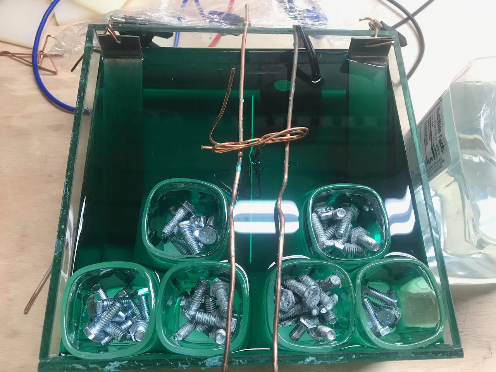
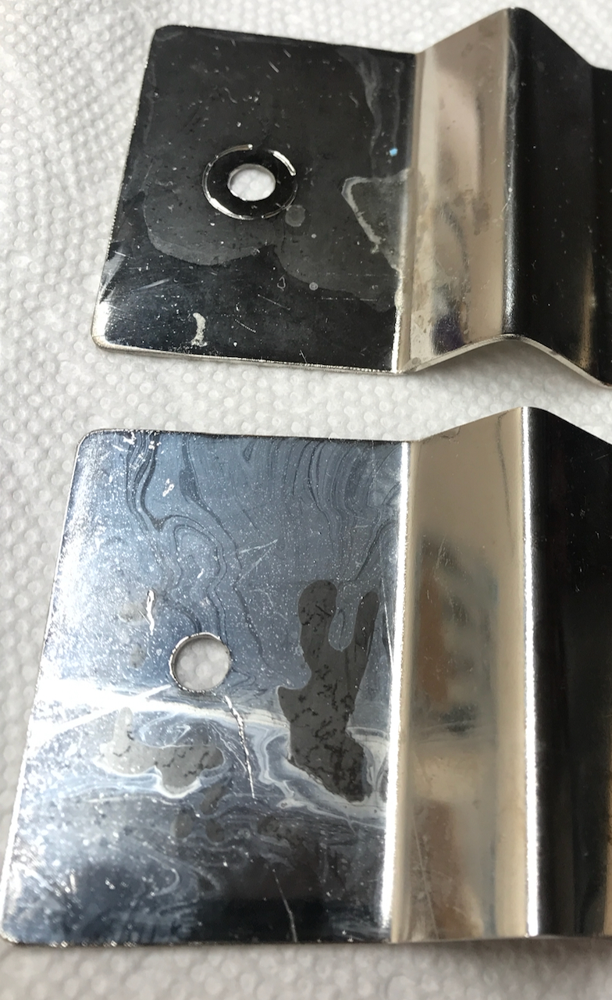
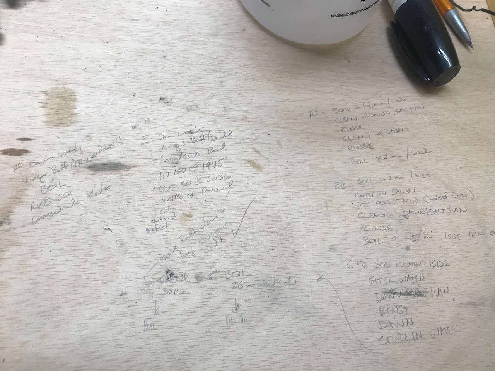
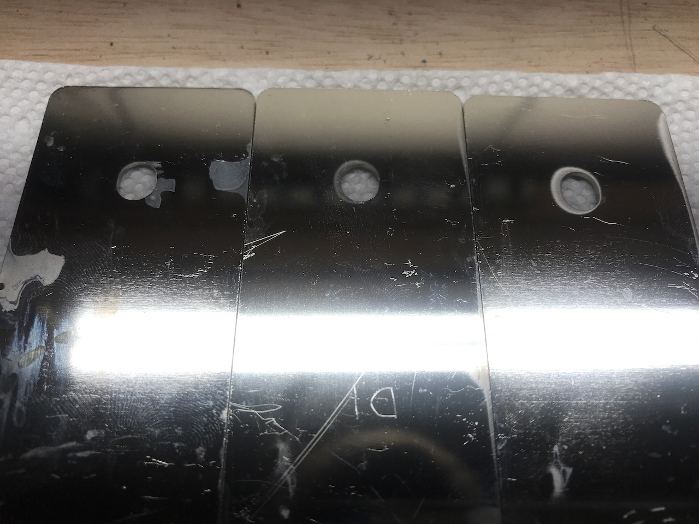
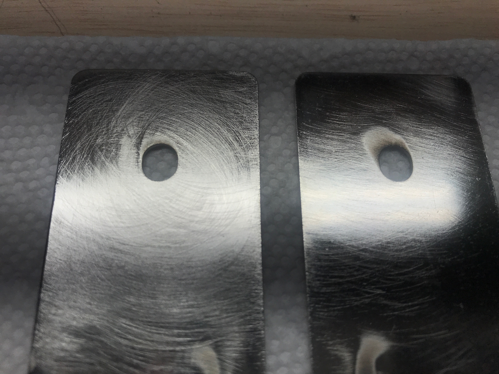
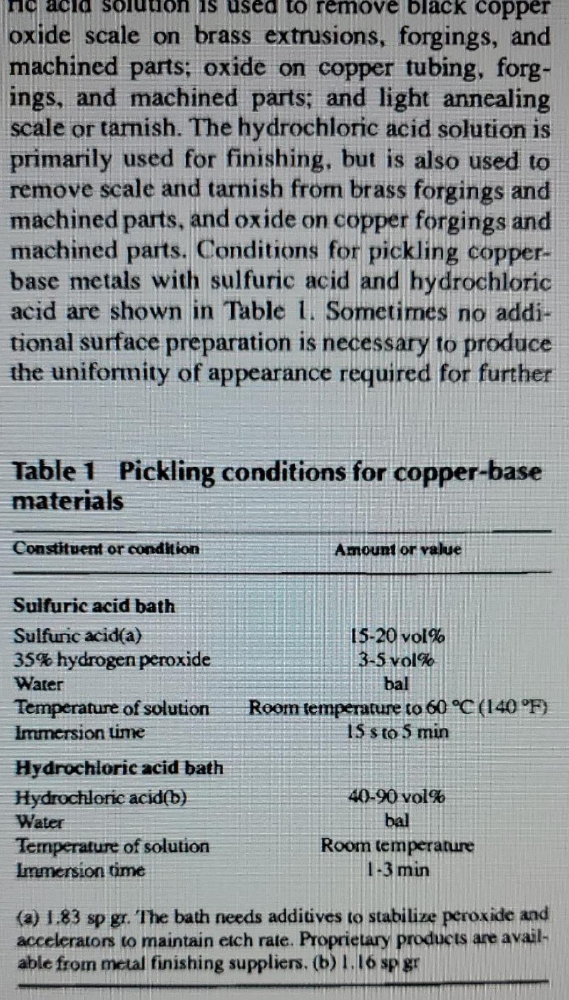
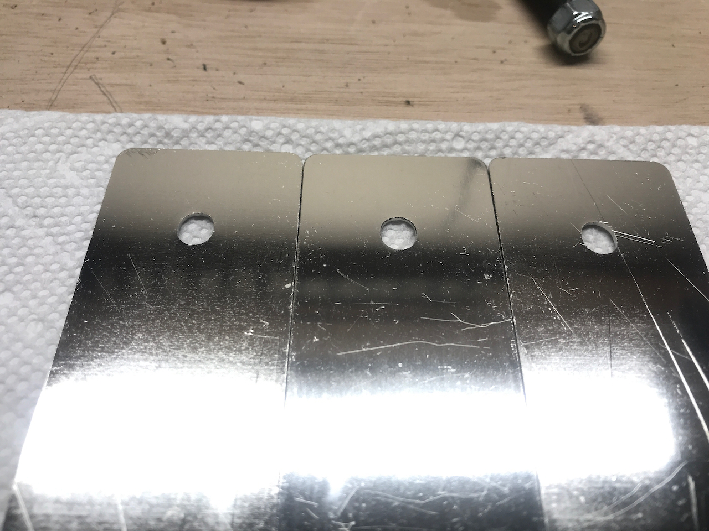

**TLDR: We are electroplating our battery interconnects with Nickel to provide corrosion resistance.  We upgraded our rig based on the lessons from our first failure.  We upgraded our protocol based on some advice from a chemically inclined friend.  The latter got us an acceptable result.**

We implemented several lessons learned based on the [first trial](/blog/2021-7-26-electroplating-part-i/electroplating-trials).  These included:

* A glass 4x8x8 inch glass vase from amazon to hold our plating bath and increase spacing between the parts and anodes.  
* Using shot glasses and a chopped up UHMW cutting board as ballast so we didn't have to use quite as much electrolyte to get the fluid level deep enough in the bath.   
* Keeping alligator clips out of the electrolyte. We formed some heavy gauge copper wire to make a "rack" to hold the bus bar being plated.  We bent the nickel anodes and made the electrical connection above the fluid level.  
* Doubling the area of the nickel electrodes.
* A cheap aquarium heater for circulation.  We bought a heater but didn't use it.

We ended up doing lots of experimentation on the prepping/cleaning front.  If you want the recipe that worked skip to the end.  If you want the full story, read on.

We started off using the following protocol:
* file edges to reduce sharp edges
* scrub with dawn dish soap and rinse
* boil in a salt and vinegar solution for a few minutes
* rinse
* plate

Initial results were an improvement, and consistent.  Clearly the alligator clip contamination theory holds.  However, we still saw a lot of variation and cloudy areas.  There always seemed to be some cloudy patches around the holes, where we are most concerned about good electrical contact.  We did find that filing the edges was not necessary (no evidence of excessive current density in those regions).

_That milky, cloudy appearance is IN the plated coating itself._

We embarked on many variations of the prep protocol including multiple boil stages, eliminating salt (residue being one theory for the cloudy patches), and insane 20-minute scrubs with dawn to degrease (another theory for the cloudy patches).

_Scratched out on our workbench, as one does._

_Cloudy holes.  No bueno._

No love.  We broke out our old Van 1.0 rust remediation drill/die-grinder scotchbrite pads to really scrub, and added some isopropyl.

_Even with all the abrasive cleaning, still cloudy holes._

Better but still seeing a bit of cloudiness around some holes. The working theory at this point was a very tough oxide layer was hanging on perhaps due to the heat of the laser cut.  So I called in a life-line.  A materials-science buddy consulted his alchemical texts.  

_TIL muriatic acid, which you can buy on Amazon, is just a weakened form of hydrochloric acid._

Below is the *E. Harms Centennial Nickel Plated Copper Preparatory Protocol* (EHCNPCPP):
* Dunk bus bar in hydrochloric (aka muriatic) acid
* Let sit for about 5 minutes, moving it around a few times
* Rinse
* Dunk and swirl in distilled water
* Dunk and swirl in de-ionized water

And then plate.  Better living through chemistry.

_Beautiful, perfect plating, brought to you by harsh chemicals._

Warning: You have to be safe with these stronger chemicals.  Ventilation!  Masks!  Glasses/Goggles! Gloves/Sleeves! Neutralizer! Etc. 