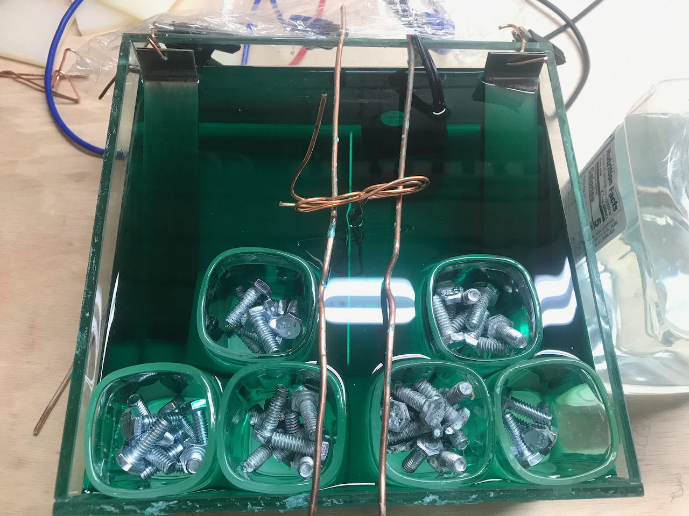
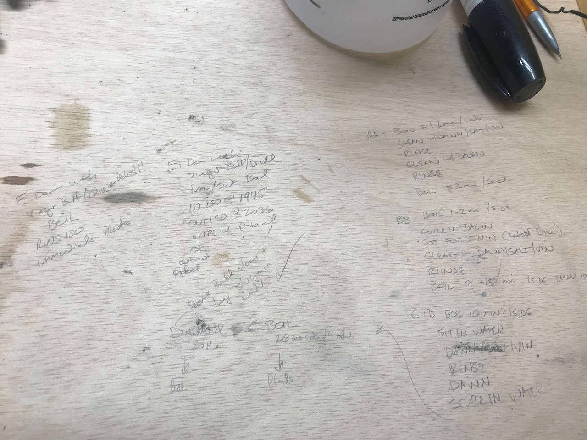
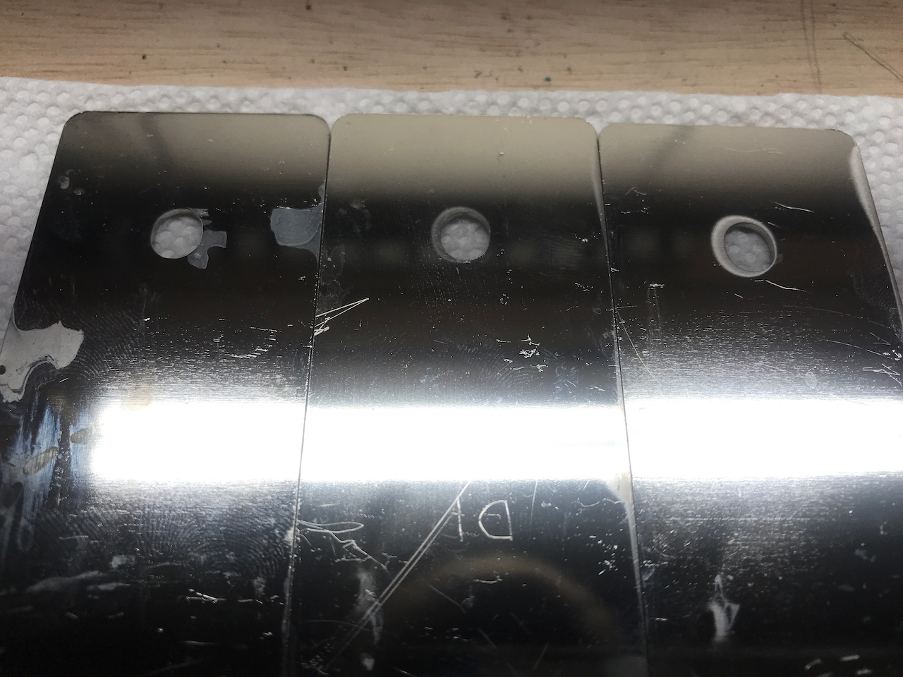
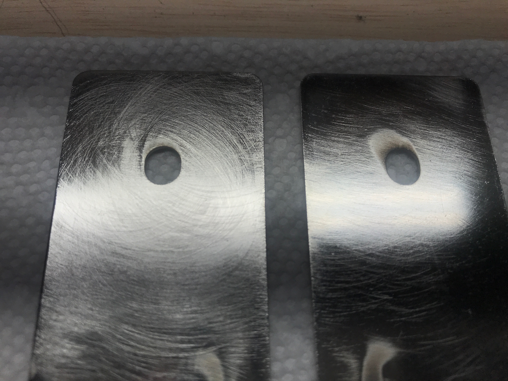
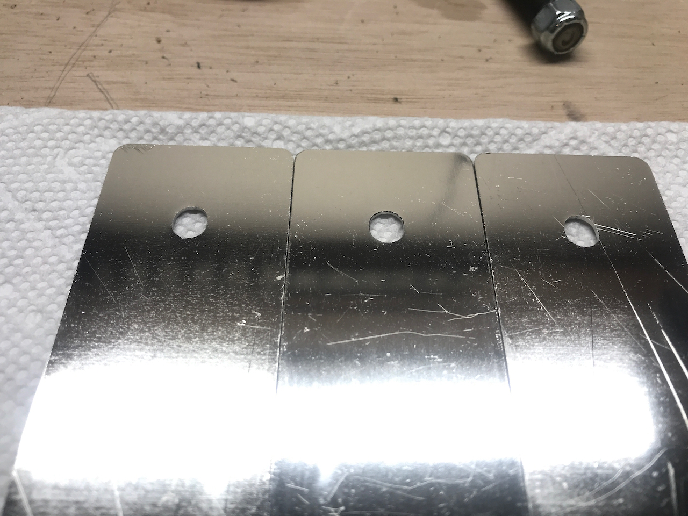

This just a skeleton for now.

We implemented several lessons learned after the last trial:

* We ordered a glass 4x8x8 inch glass vase from amazon to hold our plating bath.  
* We purchased some shot glasses to use as ballast so we didn't have to use quite as much electrolyte to get the fluid level deep enough in the bath.  
* We supplemented those shot glasses with a cut up UHMW cutting board to get the rims of the shot glasses higher.  
* We formed some heavy gauge copper wire to make a "rack" to hold the bus bar being plated.  
* We doubled the area of the nickel electrodes.
* We added a cheap aquarium heater for circulation (we didn't need the heater).

It would appear, however, there was more room for more improvement.

TODO: Insert image of first attempts.

