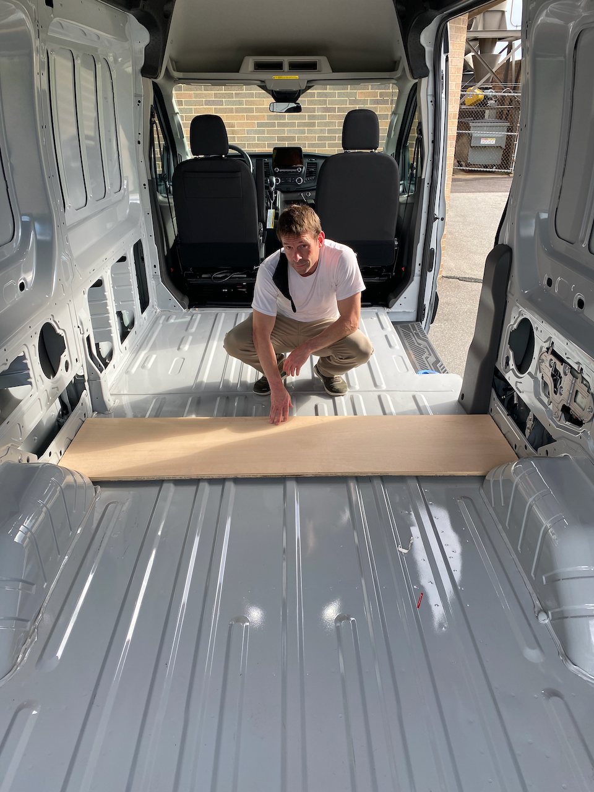
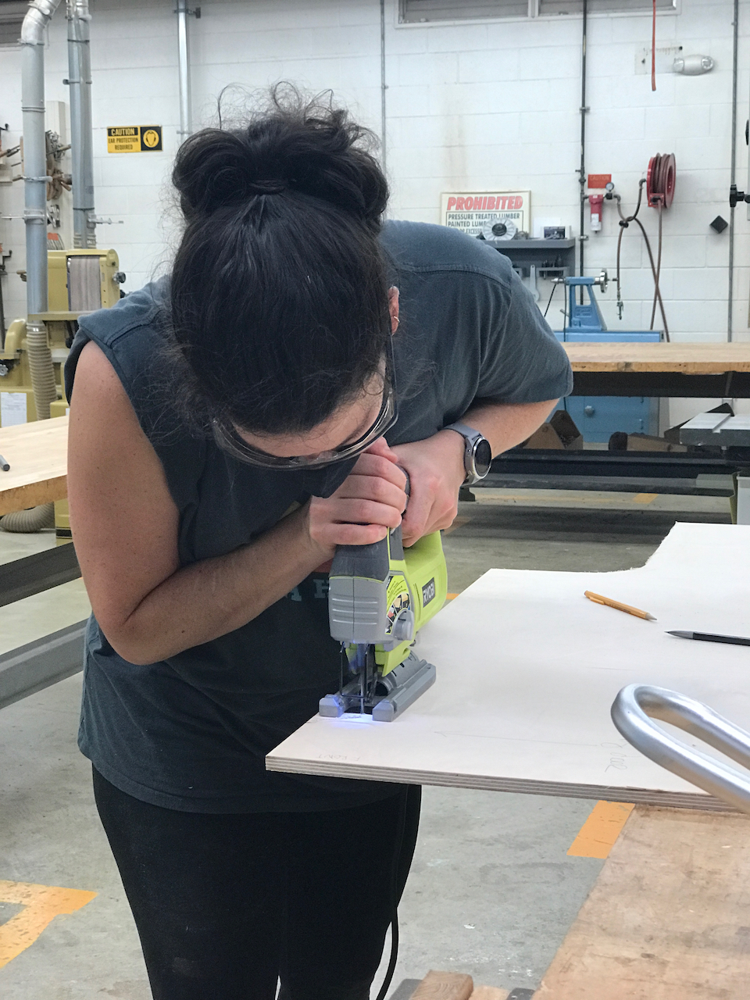

**TLDR: Our floor is an seamless, water proof, edge sealed layer composed of lonseal, 1/2" baltic birch, and minicell foam.**

You will find many many many approaches and strong opinions on how to do a van floor.  There is no real consensus on the forums.  We opted to heavily leverage the far-out-ride approach.

# Objectives (in no particular order)

1. Minimize area of strong thermal bridging with metal fasteners (i.e. bolting down the floor).
2. Minimize area of weak thermal bridging with wood or wood like supports between base metal floor and plywood subfloor.
3. One contiguous, seamless, waterproof top surface, fully sealed at all edges.
4. Silent
5. Solid

# Design

To accomplish these goals, our design consists of:
* 0.4 inch minicell foam cut to fill the factory corrugations
* 0.5 inch minicell foam over the first minicell layer and corrugations
* 1/2 baltic birch plywood, primed and sealed, on top of the minicell
* Lonseal marine flooring on top of the minicell
* Foam or caulk or something to fill the edges around the plywood
* Caulk or something to form a fillet between the top of the Lonseal and the van factory wall

More detail on how we ended up at this design can be found in our [article on flooring](/van/parietal/floor/floor).

# Concerns
* Keeping seams between plywood sheets from "popping" though the lonseal layer
* Keeping edges of the plywood from popping up.
* Taking care of the above concerns, while being reasonably easy to install, and not compromising on objectives 1 and 2.

# Installation

## Insulation Install and Subfloor Prep

We measured 3 times, and cut a test width of plywood to make sure it fit well at all locations along the van.  Once we were confident in that dimension we cut four sheets of plywood to the length.  

_68 7/8 inches_

We determined the optimal positions for the athwart seams and cut the four pieces to reflect that measurement.  We used ram-board to create a template for the driver side to cut around the wheel well and other protrusions in the van.  

_Check template against both sides!_

We then cut the final shape of the plywood pieces according to the template and did a round of iterative fit-checks and trims.  See related lesson below.  We then primed and painted the plywood to limit moisture absorption.

_Gettin jiggy with it_

We measured and cut the first layer of minicell using a box cutter and straight edge.  Easy.  We did try a leather strip cutter based on a facebook recommendation but it didn't work our for us.

We used weldwood landue to adhere the first layer of minicell strips to the van sheet metal.  This is somewhat necessary just to keep the pieces from flopping around during subsequent steps.  Easy.  We then laid in the top layer of mini-cell.  We didn't feel this layer required adhesive to stay in place.

_Filling corrugations, a contentious floor topic._

We dryfit the plywood pieces once the minicell was in place.  We found that with the plywood had some squeaks due to slight movement of the plywood when weighted near the edges, due to the minicell compression, in locations where it contacted the van wall.  Based on that discovery, we did another round of small cuts to ensure the plywood had a small clearance to the walls at the entire perimeter.  And of course we did another round of priming and painting on those fresh edges.

## Subfloor Install
The installation of the plywood subfloor was a war of attrition between us and the natural tendency of plywood to warp.  Even if you use the best (baltic birch).  Even if you seal all sides and edges to avoid asymmetric moisture uptake.  This section can be organized into what we planned to do, what we tried to do, and what we ended up doing after we started over and did it again.

### What we planned to do
Our first idea was to join the four pieces of plywood using biscuits.  This should keep the plywood edges aligned (in plane) at the seems.  However, to do this would require joining the pieces outside the van and moving in as a monolith.  The pieces couldn't be fit up in place because the wheel wells and other protrusions require the floor pieces to come in from above and drop straight down, preventing the insertion of the biscuits into the mating slots.

This is do-able, and we purchased some long 16ft 2x4s to help strong back the monolith for movement into the van.  However, as we got closer to this part of the build we got nervous about this approach.  We found that some pieces of plywood were cupped, or warped such that the edges were popping up.  We didn't think the biscuits would solve this problem completely.  Two, each piece of plywood has an optimal location that ensures clearance to the van walls.  If this clearance doesn't exist, the floor will squeak as it is loaded and unloaded.  Ensuring each piece will end up in its optimal locations when joining outside the van seemed challenging, if not impossible.

### What we tried to do

So we woke up with a new plan on subfloor install day:  
1. Fix small wooden blocks to the floor that cross the seams of the plywood pieces.  
2. Install the plywood and get each piece to its optimal position.  
3. Screw the plywood to these fixed blocks.  

This method should lay flat at the seams, and allow us to get the individual pieces where they needs to be to ensure no contact with the walls/squeaks.

We glued two 1/2 inch strips of baltic birch together.  We used a hand planer to plane the thickness of the glued strip down to about 7/8 inch.  This locates the top of the blocks just below the top layer of foam, which is what we want.

We cut the strips into 1.5 inch by 2.5 inch blocks.

We sealed the blocks on all but the bottom with two coats of Kilz primer.

While I fabricated the blocks, Sophia cut the bottom layer of minicell foam and cleaned off the contact cement in the areas we planned to mount the blocks.

Finally, we scuffed the factory paint in the mount locations and used J-B Weld 8276 KwikWeld to epoxy the blocks to the floor.  It advertises a strength of 3127 psi, an oddly specific number, but even a quarter of that would be more than enough.

We also took this opportunity to epoxy the step delete into place.  Like the blocks, it will also be used to anchor the plywood layer.

_All blocks epoxied in place._

Assateague delivered some wind the next day, so the epoxy had plenty of time to fully cure before we began installing the plywood.  We were only a few screws in when we heard a distinctive "Pop Pop", Magnitude style.  It was clear that the epoxy joint on some blocks had failed.  The blocks still functioned to hold seams in the plywood pieces in plane, so we decided to press on.  The step-delete epoxy also failed shortly after.  

Sophia filled the gaps between the plywood and the van wall with "Great Stuff Gaps and Cracks" as recommended by Far-Out-Ride and many other forum members.  The following day, we noticed squeaks where there were NO squeaks before.

_A grave mistake._

Best we can tell, the reason we had squeaks and others did not (e.g. Far-Out-Ride) is that the mini-cell is more compliant than materials like XPS foam.  This allows the wood subfloor too move/flex more when loaded.  The sprayfoam moves with the plywood and rubs against the van metal causing the squeaks.

Regarding the epoxy failure, we followed the application directions verbatim.  We suspect the joint is not ductile enough to acommodate the shear load imparted as the slightly cupped plywood is flattened.  This would explain the sudden failure during or shortly after screwing down the plywood.

Having a noisy floor is a dealbreaker, and since we still had the ability to reverse, we backtracked.  We removed the plywood and the step-delete.  We cleaned off the wood fill and touched up any areas with primer.  We used scotch-brite drill pads and other mechanical means to remove the residual epoxy from the van floor.

Meanwhile,  we did some life-choice questioning and [forum consulting](https://www.fordtransitusaforum.com/threads/psa-great-stuff-gaps-cracks-around-floor-perimeter-squeak-city.86820/#post-1132627).

### What we ended up doing after we did it again

We addressed the squeak risk on two fronts, the material that bridges the plywood to van wall, and limiting the flex/movement of the plywood edges.

It occurred to us that automotive body sealers, made to fill gaps between vehicle body parts might provide a good, silent alternative to the spray foam.  We ended up settling on 3M Urethane Seam Sealer.

To limit the movement of the plywood edges, we decided to add solid reinforcement at the driver and passenger side plywood edges.  This also addressed a nagging concern about loading the plywood at the edges, which we knew would occur based on our structural design.

We also decided to increase the size of the blocks that tie the plywood seams together to allow more surface area for adhesion to the van metal.  We made these blocks as large possible limited by the floor corrugations.

We opted to use expanded PVC as the block material VHB tape based on a [suggestion by Hein](https://www.fordtransitusaforum.com/threads/subfloor-attachment-methods.76490/post-1010572).  He specifically recommends 4611 VHB tape [here](https://www.fordtransitusaforum.com/threads/gluing-strapping-to-floor-and-ribs.10674/post-1010024).  VHB provides a very compliant/ductile joint which should accommodate any shear stress (e.g. from thermal growth) much better than the epoxy.  We also used VHB tape to adhere the step-delete in place.

We purchased expanded PVC boards that were 15/16 inch thick.  Which we planed them down to 13/16 inch which with the VHB thickness will sit just below the surface of the minicell.  

_Note the large block sizes and the long strip of expanded PVC at the top edge._

We gave the blocks 24 hours after install to develop max bond strength and then screwed down the subfloor.  We sealed the subfloor edges with the 3M seam sealer and used woodfill to smooth the seams between the plywood pieces.

_The seam sealer is very thick, similar to window weld.  We highly recommend a powered or pneumatic gun for application._

Sadly, but not too sad, we found the VHB did not hold up.  We noticed it separating after about 24 hours.  Oh well, the PVC pieces at the edge still limit flex, the PVC blocks in the middle still hold the plywood seams, and the seam sealer is squeak free.  We also know that when all the various components and structure are installed, the floor will be constrained flat.  So...we moved on.

## Lonseal Install

We made another ramboard template of the van floor to trace and cut the lonseal.  Unlike the subfloor template, we did a full width template of the van floor that captured both the driver and passenger side.

_Ramboard is the unsung hero of our build._

We transferred the template to the lonseal with a sharpie, and used a combination of box cutters and heavy duty siscors to make the needed cuts.  We highly recommend both [these](https://www.amazon.com/gp/product/B08SWHFD2M/) and [these](https://www.amazon.com/gp/product/B01N5M4SWD/) scissors.  They were both great for trimming lonseal but have also proven very useful during other aspects of the build.

_These scissors are fire._

We moved the lonseal into the van after trimming and performed the last few tweaks and then left it acclimate for a few days.

Based on some recommendations from the forum about edge curl, we cut some 2x4s sit on the edges of the lonseal.  This allowed us to use clamps to hold the lonseal down after gluing.  [@Maia's](https://www.fordtransitusaforum.com/members/maia.106950/) forum [posts](https://www.fordtransitusaforum.com/threads/build-thread-miracle-whip.86593/post-1136217) regarding her [install](https://www.fordtransitusaforum.com/threads/build-thread-miracle-whip.86593/post-1136206) were super helpful in planning and executing ours.

There are a three lonseal adhesive options.  In our opinion the two-part epoxy is the least worst option and really the only option worth considering.  Prior to our install, we spent a lot of time studying the [general](lonseal-instructions-general.pdf), [vehicle-specific](lonseal-instructions-vehicle.pdf), and [epoxy-specific](lonseal-instructions-epoxy.pdf) instructions.

We did multiple dry-runs to make sure we could execute cleanly under the time constraints, set a visible stopwatch, and went for it.

`vimeo: https://vimeo.com/644784122`

We did have one curveball:  Our van was parked on a very slight decline during the lonseal install.  With the lubrication of the epoxy, the flooring shifted about 1/8-1/4 inch between the start and when the epoxy setup enough to hold.  This required some tactical trimming around a few protuberances in the middle of the install.  

Other than that, it went as well as a complex, time constrained, first-of-a-kind  operation can be expected to go.  The floor looks great.  There are a few spots where the epoxy might be a little too thick, but nothing anyone will be able to see.

Much later, we did the final step of applying another bead of 3M Seam Sealer between edge of the lonseal and the van wall creating a truly waterproof/sealed floor (Objective 3).

# Timeline
* Picked up plywood, tested cut width, rough cut plywood to length and width (Thu 8-19-2021)
* Created floor maps, created ram-board template, cut plywood to shape, dryfit, primed plywood (Sat 8-22-2021)
* Painted plywood, cut bottom layer minicell strips, glued minicell in place (Sun 8-23-2021)
* Cut and laid-in top layer of minicell, dryfit plywood, final trim of plywood, repainted cut edges (Mon 8-23-2021)
* Fabricated wood blocks to join plywood seams, primmed blocks, scuffed and epoxied into place, epoxied step delete into place (Sat 9-4-2021)
* Kiting (Sun 9-5-2021)
* Installed plywood, "pop pop" epoxy fail, woodfilled seams, filled edges with "Gaps and Cracks" (Mon 9-6-2021)
* Discovered of "Gaps and Cracks" related squeaks ( Tue 9-7-2021)
* Floor Ripout/Removal, discovery of step expoxy fail (Wed 9-8-2021)
* Cleaned up residual epoxy from floor (9-X-2021)
* Cut/dimensioned PVC (Thu 9-16-2021)
* Minor fit adjustments on PVC (Tue 9-21-2021)
* Minor fit adjustments on PVC (Thu 9-23-2021)
* VHB'd PVC to floor, touched up subfloor primer, recut minicell top layer (Sat 9-25-2021)
* Screwed floor to pvc blocks (Sun 9-26-2021)
* Observed VHB separation at step and rear, sealed/filled edges with urethane seam sealer (Mon 9-27-2021)
* Woodfilled seams and screws (Tue 9-28-2021)
* Woodfill touch up and sanding subfloor, and unrolled Lonseal (Wed 9-29-2021)
* Created template and cut Lonseal (Thu 9-30-2021)
* Final trim after acclimation and roller rental (Fri 10-1-2021)
* Epoxied Lonseal (Sat 10-2-2021)
* Final seal of edges with urethane seam sealer (Tue 12-7-2021)
* Added edge trim to side door and rear door (Thur 1-27-2022) TODO: Describe and add pictures/link product.
* Siliconed edge trim on side door and rear door (Wed 2-16-2022)
* Added stair nosing and bodyseal to front edge of floor (Mon 3-7-2022)

# What We Would Change

We would consider going with a stronger adhesive for the firring strips/blocks if we were to do it again.  We might consider mechanically fastening them (compromising on objective 1).

We would do the lonseal install on a more level parking surface, or use leveling blocks.

We would purchase two batches of the smaller unit of lonseal epoxy and do the floor in two 30 minute segments, rolling each separately.  This would make the install much less rushed, and may eliminate any areas of excessive epoxy thickness.

We would do a separate template for the passenger and driver side for the initial subfloor cuts.  Our passenger side wheel well is shifted about 3/16 aft compared to the driver side.  This led to some small interferences and re-cutting of the plywood since we made a single template based on the driver side and used it to cut both sides of the plywood.

We would consider okoume plywood instead of baltic birch.  This is another marine grade plywood.  It would save about 30 lbs on the build.

# Random Notes, Tools, and References

[These scissors](https://www.amazon.com/gp/product/B08SWHFD2M/) are highly recommended.

[These scissors](https://www.amazon.com/gp/product/B01N5M4SWD/) are also highly recommended.

[Helpful thread on firring strip adhesive](https://www.fordtransitusaforum.com/threads/gluing-strapping-to-floor-and-ribs.10674/)

[Empirical testing on adhesives](https://www.practical-sailor.com/boat-maintenance/marine-sealant-adhesion-tests)

[Hein recommending VHB and expanded PVC](https://www.fordtransitusaforum.com/threads/subfloor-attachment-methods.76490/post-1010592)

[Removing factory step insert](https://www.fordtransitusaforum.com/threads/how-to-best-remove-the-plastic-step-liner-as-you-enter-thru-sliding-door.80619/post-1122672)
