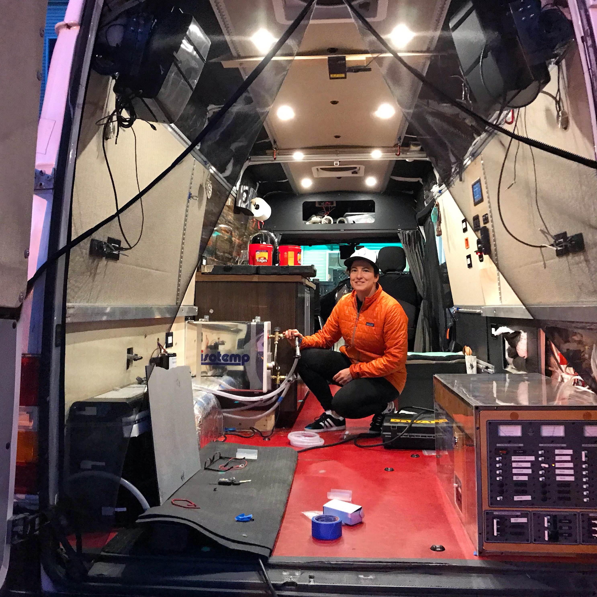
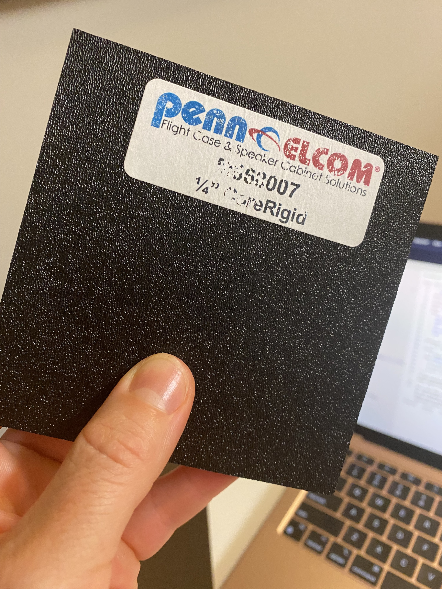
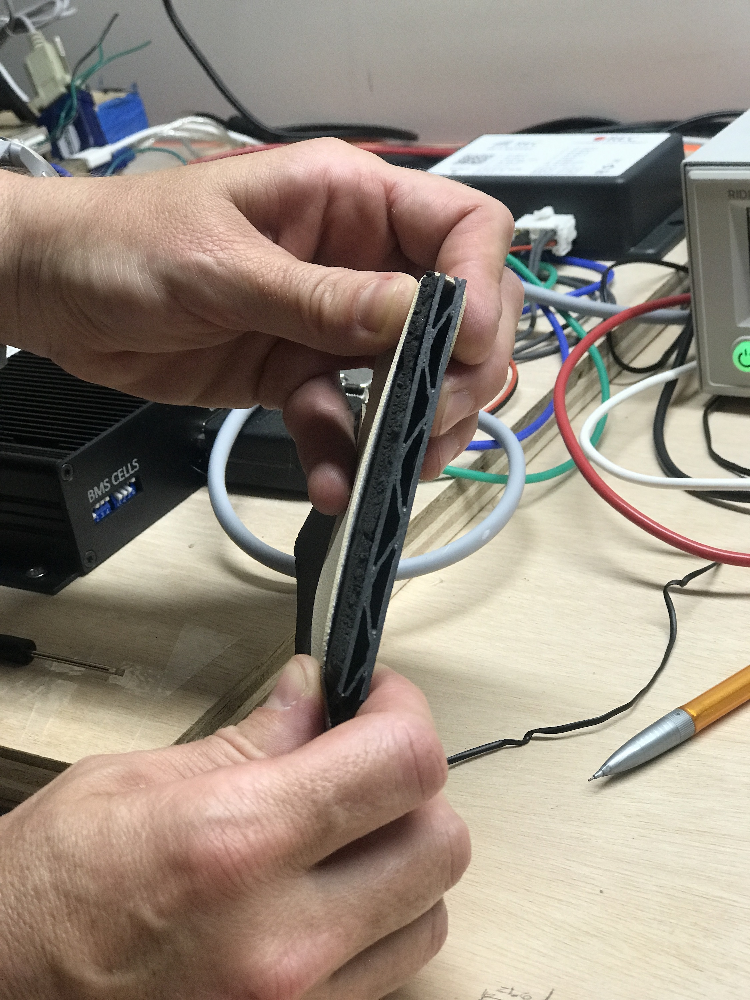
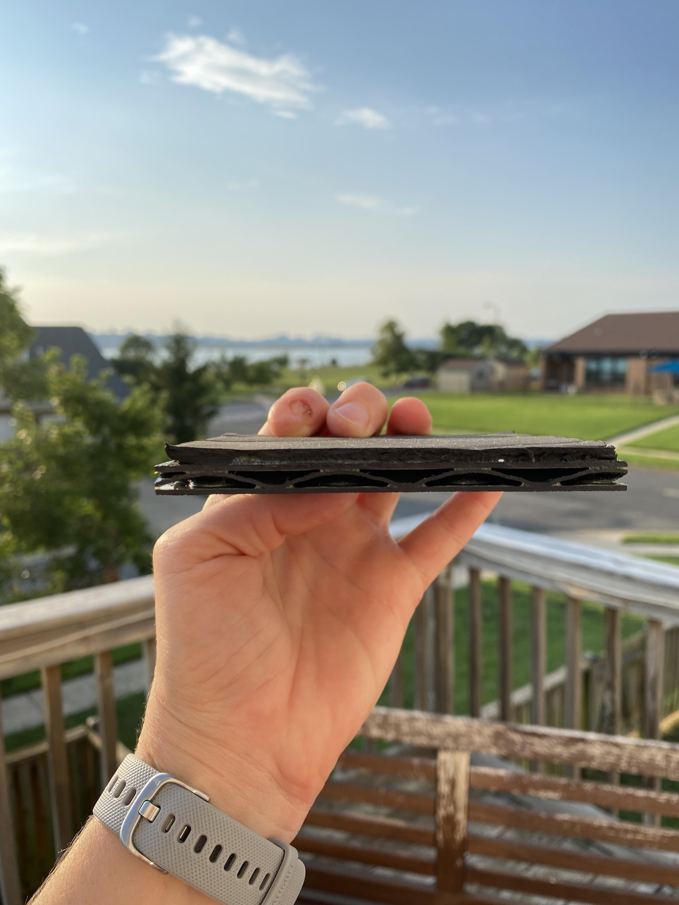

TL;DR: Weldwood Landau Top and Trim contact adhesive can be used to successfully stick neoprene to CoreRigid corrugated ABS panels.  This means we have identified a suitable alternative to plywood for our interior wall panels.

On a cool day in the fall of 2019 and four years into our first vanbuild, we were finally moved to install the plumbing in Van 1.0.  We removed the plywood panels of the bed platform to access the garage space below.  In the process we discovered little black constellations of mildew that had big-banged their way across the garage night sky / bottom side of the bed platform.  Based on this discovery and our proclivity for moist environments we resolved to limit organic materials in future builds.

_That fateful day that changed our lives forever._

Much like the last time around, our building envelope will consist of (from outside to inside): van wall, sound deadener, Thinsulate, and wall panel.  The wall panel itself will consist of (from outside to inside): rigid wall material glued to neoprene glued to a wall covering.  The objective has been to replace 1/4 inch plywood with corrugated plastic for the rigid wall material.  This design does not work if you can't stick the neoprene to the rigid wall material.  Some lovely, inorganic wall panel candidates, such as high density poly ethylene (HDPE), are too "low surface energy," meaning little sticks to them.  Think of this as the satisfying feeling you have when you easily pull a plastic label off a cutting board or plastic bottle vs. the mess and frustration of sitting alone at a bar picking a paper label off a glass beer bottle.  Let's just go with that.  You want that stick, and not all materials are gonna give you this.

As an alternative to HDPE, Nate found 4' x 8' sheets of acrylonitrile butadiene styrene (ABS) panels.  The brand name is [CoreRigid](https://www.penn-elcom.com/pdf/CoreRigid%20-%20Penn%20Elcom.pdf) and Penn Elcom sells them for building flight cases.  Here's a description of the material, "CoreRigid composite panels are a plywood alternative formulated to offer exceptional performance at high temperatures while delivering robust strength and stiffness properties.  Created by layering two tough ABS sheets around a semi-hollow inner core, they retain the performance of plywood while also resisting chemical splashes and thermal distortion."

_The plywood slayer_

The product looked and felt great, but its stickiness was unknown.  To test the material, I followed the instructions on our gallon of Weldwood, thinly coating a swatch of neoprene and the CoreRigid sample with glue.  I waited a few minutes, pressed these faces together, and waited an hour.  We had adhesion!  In trying to pick apart the neoprene from the CoreRigid, I was happy to discover the bond was stronger than the neoprene itself.  

_Moments after making the sandwich.  So exciting!_

The next day I subjected the little sandwich to the elements to see if heat would break the bond.  It didn't get quite as hot as I'd hoped, but still, no slip.  Several days later, and we still have a winner.  

_After days of anticipation...its solid!_

I am pleased to share we are one step closer to achieving an anti-mold mobile.  We have identified a plywood substitute for our wall panels and an adhesive that properly bonds it to the neoprene insulation we're using.  Next stop Jersey... shipping is no joke!