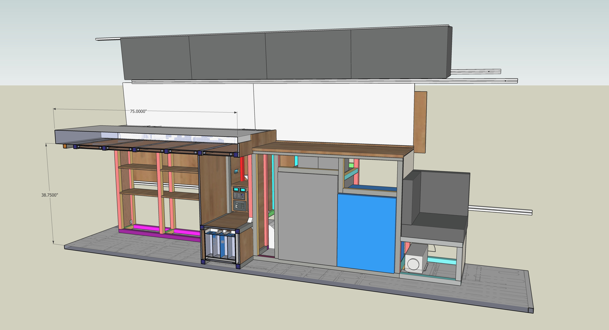
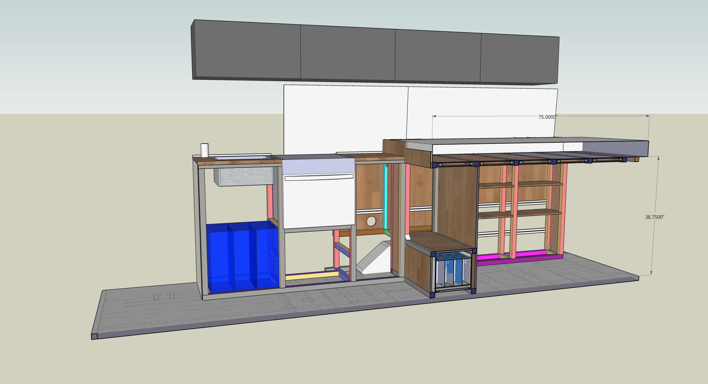

**TLDR: Van 2.0 features a fixed raised bed with substantial garage storage underneath, a split driver and passenger side galley with center aisle, a booth seat to support dining for three, and loads of soft overhead storage.**

If you want to read all the gritty details on how we ended up with our arrangement, access to useful resources on transit dimensions, and all of the SketchUp models we used, you can find that in [this article](/van/architectural/internal-arrangement/internal-arrangement).  This blog entry is just going to hit the high points.

_On the driver side we have the inverter/charger and MPPT (hidden by garage bulkhead, electrical controls and fuses, fridge, freezer, the espar heater, and a booth seat._

_On the passenger side we have the oven/range, water storage, the sink, and faucet._

The fixed raised bed configuration is about the best to maximize gear storage volume.  This was our Van 1.0 configuration as well.  We had a queen-width in Van 1.0 and decided to go with a full-size for Van 2.0.  Its a little tighter but we don't miss it.  In this and Van 1.0 the bed is "north-south".  We feel pretty strongly that this is optimal for two people.  Otherwise one person has to climb over the other if they need to get up.

Van 1.0 had a single side galley.  For Van 2.0, the port/starboard galley made sense for us given our appliance choices (freezer and an installed oven/range).  We also wanted clear "sight-lines" from the front to back (an aesthetic choice).  This meant no stacked fridge/freezer units or anything higher than the counter top.  We ended up with a 39.25" counter-top which, while not standard, we love.  The center aisle about 26.5", which is wide enough for us to get past each other, which becomes more important the longer you live in a van.

We wanted a booth seat to allow hosting an occasional friend for dinner or drinks inside.  We find its a good use of space.  Having a full height counter extend that close to the driver seat makes it feel odd to sit there with the seat swiveled around.

We were able to very closely balance weight from driver to passenger side for our major appliances.  The battery, our heaviest single component, is roughly centered between the wheel wells over the rear axle.  The propane tank was also centered and located just behind the rear axle (under the van).  These were all about balance and drivability.

## Timeline

Long! We'd been iterating our internal arrangement from like summer 2020 until locked down the structural design on 8-26-2021.  
