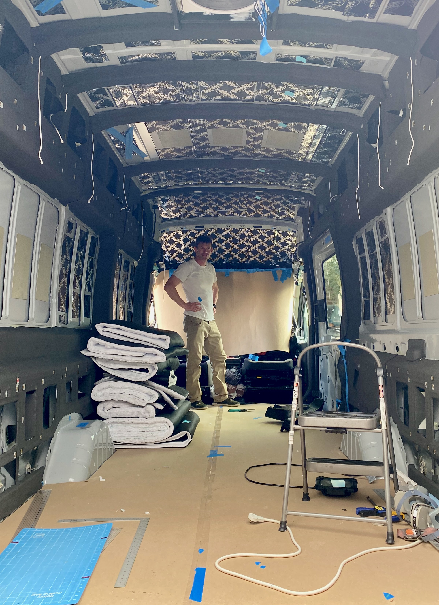

**TLDR: We used Dynamat Extreme for sound dampening.**

## Sound Dampening

All of the consumer damping products (dynamat, killmat, etc.) operate via the same mechanism and are also known technically as "[constrained layer damping](https://en.wikipedia.org/wiki/Constrained-layer_damping)":  

A thick flexible glue-like layer is sandwiched between two longitudinally stiff layers.  One of these stiff layers is the van sheet metal.  The other is a thin layer of aluminum foil/sheet.  

As the sheet metal panel attempts to vibrate, it is bending (like a drum head) and thus stretching.  The glue layer tries to bring the other stiff layer along for the ride.  That layer doesn't want to stretch.  

This puts the glue layer in shear, which dissipates some of the vibrational energy as heat.  Thus the vibration is damped.

A secondary affect, which is probably almost as responsible for the effectiveness of consumer products.

Given those mechanisms, one can see where it will be the most effective and least effective.  Large flexible panels subject to high displacement vibration will see a lot of benefit.  Stiff areas, like the floor with its stiffening corrugation will see little benefit.

On Van 1.0 we used a product distributed a local (and fantastic) Maryland company that operated a website called "sounddeadenershowdown.com" (SDS).  We were able to obtain large sheets that could double as a sort-of thermal break/condensation barrier for the internal sheet metal.  We used it to pretty much cover the walls and floor. The company ceased operations sometime between Van 1.0 and 2.0 so we had to pursue other products.

We decided to go with [Dynamat Extreme](/van/parietal/sound-deadening/sound-deadening).  Two [boxes](https://www.amazon.com/gp/product/B00020CB2S/) were enough to liberally hit all the vibration susceptible panels in the walls, roof, and doors with a little left over.  This included cutting smaller pieces to go against the outer sheet metal inside the structural bump-outs near the ceiling and floor.  Not much else to say on this front, pretty easy and nothing you wouldn't find in the majority of builds out there.

_This should give a sense of our liberal coverage with Dynamat Extreme.  We'll discuss all the other black stuff on the walls in a later post._

## Tips and Tricks

* [Maui the Van](https://mauithevan.com/2020/09/2020-ford-transit-headliner-removal-noico-havelock-install/) has a great guide for removing the headliner which allows you access to add sound dampening to a region that really needs it.
* A wooden roller is useful for installing the Dynamat.  

## What We Would Change

Nothing.  It's pretty hard to screw this part up.

## Timeline

Note, this doesn't reflect full time effort.  It's mostly evenings and partial days, limited by work, ambient temperatures, etc.

* Ordered one box of Dynamat Extreme (8-13-2021)
* Installed the bulk of our Dynamat (8-28-2021)
* Removed headliner (10-7-2021)
* Installed Dynamat in the headliner (10-8-2021)
* Ordered another box of Dynamat Extreme (10-10-2021)
* Installed Dynamat in slider and rear doors (Unknown)