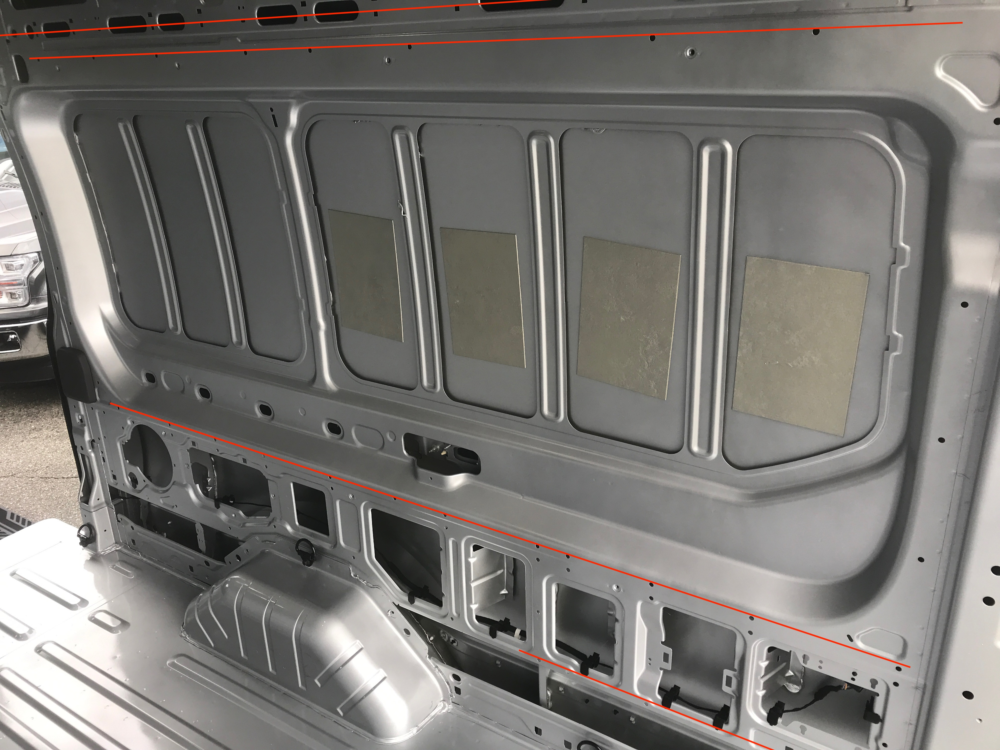
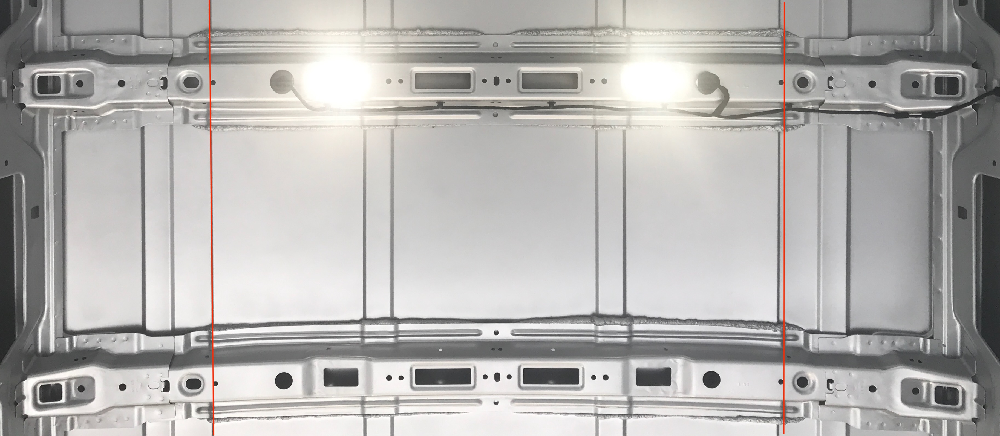
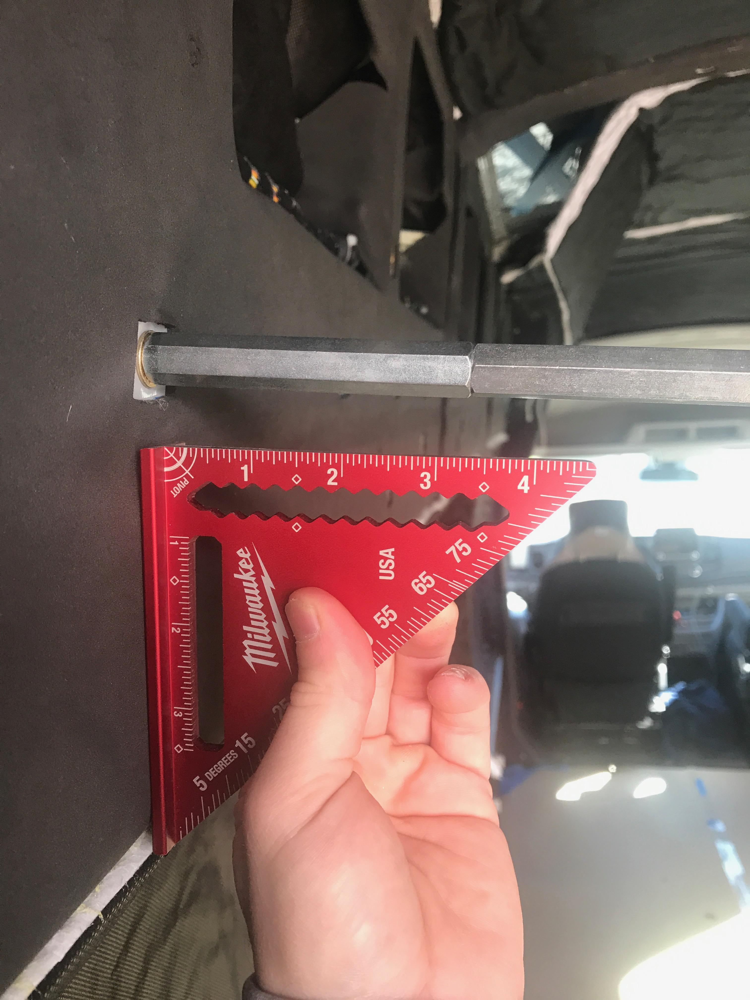

**TLDR: We used a pneumatic tool to install 1/4-20 plusnuts in about every compatible factory hole.  In hindsight we would have used the star-lock-washer approach to improve spin-out resistance.**<!--excerpt-->

Based on our positive experience with Van 1.0 we planned to use plusnuts extensively for Van 2.0.  Unlike Van 1.0 we planned to use existing factory holes to the maximum extent possible.  

Note: There is significant discussion and debates across van building forums and websites regarding plusnuts generally, installation specifically, and their merits vs alternatives like rivnuts.  Do you own research and testing.  A great place to start is the work done by [FarOutRide to compare products and installation techniques](https://faroutride.com/threaded-inserts/).

For this build we had access to an air compressor so we opted to purchase a pneumatic installation tool as we planned to install loads of plusnuts.  We selected [this tool](https://www.amazon.com/gp/product/B07Y73GDYW/) and used [these 1/4-20*](https://www.boltdepot.com/Product-Details.aspx?product=8034) and [these 5/16-18*](https://www.boltdepot.com/Product-Details.aspx?product=8061) fasteners as mandrels.  Plusnuts are technically off-label for this tool, but it worked just fine for 1/4-20 and 5/16-18 plusnuts.

\* _We ordered both 2-1/4 and 1-1/2 inch length of these fasteners and can't remember which ones we used, or if both worked fined. Its been too long.  To be safe just order several of each if you go down this path._

## Install Locations

Generally, if there was a factory hole that was suitable for a 1/4-20 or 5/16-18 plusnut, we installed one.  Like triple-digit plusnuts.  And we used most of them.

The most important install locations for us were four lines of factory holes in each wall, and two lines of factory holes in the ceiling, that are co-planer and run a significant length of the cargo area.  We used these resulting lines of threaded inserts attach long runs of L-track and half-height 8020 that become the fastening points of our structure and overhead storage, essentially the "bones" of our build.  

Because its not well documented anywhere else: one of these lines consists the row of square factory holes that run the entire length of the van at head height.  These are used by Ford to clip the main wire harness cover in place.  They also happen to accept a 1/4-20 plusnut just fine.

_The lower two lines were later used to install half-height 8020.  The upper two lines were later used to install to long runs of L-track._

_These two lines were used to run L-track that is used to attach our overhead storage, attach ceiling panels, and attach LED lighting._

## Installation Tips

* Irrespective of your install method, get some representative sheet metal and dial in your technique and installation torque prior to installing any in your van.
* If a factory hole is undersized, use a step bit to enlarge the hole.  Be sure to prime and paint after enlarging.
* Use a lubricant on your installation mandrel.  We used a dry teflon spray.
* Maintain the tool perpendicular to the installation surface.  If the orientation of the plusnut axis ends up askew, use a long bolt or similar to restore perpendicularity.  We used [1/4-20 long hex stand-offs from McMaster](https://www.mcmaster.com/93620A843/) to accomplish this.
* Chase the threads of the installed plus-nut with the correct sized tap

_To the extent possible we would verify/adjust each plusnut to ensure its thread axis was perpendicular to the bolting surface._

## What We Would Change

Later in our build we did end up with a few dreaded "spinners".  Most of these were in the roof ribs which (allegedly) has thinner sheet metal that plusnuts have difficulty gripping.  Based on forum discussions, we corrected these by removing and reinstalling plusnuts with these [tooth lock washers](https://www.mcmaster.com/catalog/128/3553).  The later work by Faroutride quantifies the benefits of this approach.  

**If we were starting from scratch, we would use these lock washers on all plusnut installs.**

## Timeline
* Purchased plusnut install tool and mandrels (8-13-2021)
* Installed plusnuts for the wall 8020 and l-track (8-29-2021)
* Installed like 100 1/4-20 plus-nuts including in the sliding door (10-10-2021)
* Installed plusnuts in forward-most ceiling rib, had no issues enlarging boron steel holes with an irwin step bit (10-16-2021)
* Installed a few plusnuts for reinstalling factory wall panels (12-14-2021)

