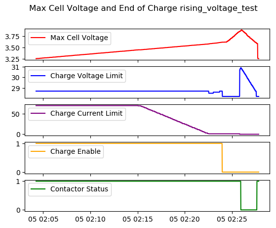
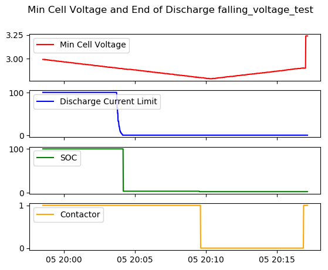
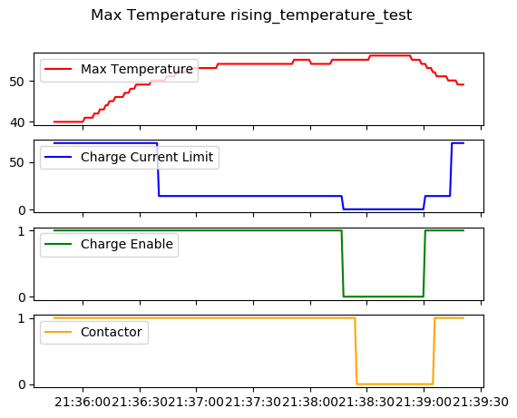
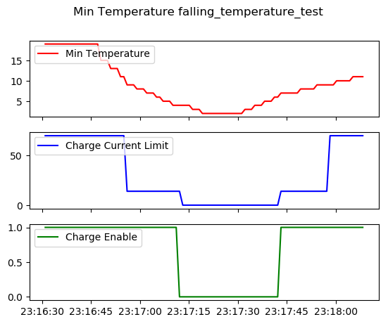
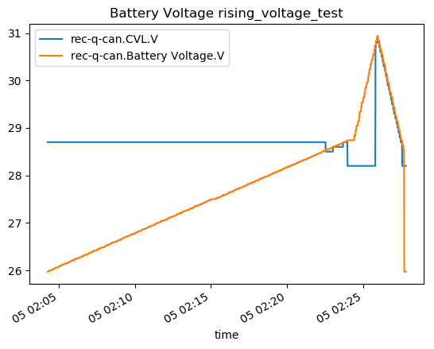
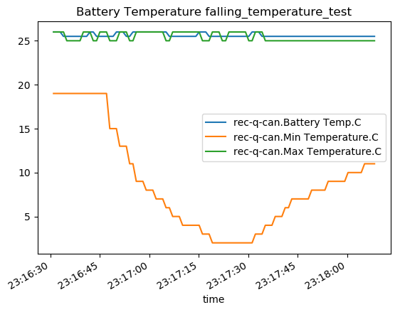

**TLDR: We tested and captured data to prove out and characterize the REC BMS protection and operation.  This was based on our previous work to get an RPi to communicate with our Riden power supply, our digital multimeter, and the BMS.**<!--excerpt-->

Its good practice to test equipment that you will depend on for protection.  Given the cost and stored energy in our battery system, we decided to exercise the key protections provided by the BMS before we hook it up for initial charge.  

We also thought this would be a good project to tie together some of our past code for control and monitoring.  We decided to explore Python's `unittest` suite as the tool to implement this testing, recognizing this application is not what that suite is meant for.

TLDR: The REC did fine and performs pretty much as described in the manual except for some minor findings.

## Supporting Code

The following dependencies are used by the test code:
* [ShayBox/Riden](https://github.com/ShayBox/Riden): A faster, improved, more-thread-friendly evolution of [Baldanos/rd6006](https://github.com/Baldanos/rd6006) used to control the DC power supply used for the test.
* [natecostello/instrument_logger](https://github.com/natecostello/instrument_logger):  This module provides an inherited `Instrument` interface for all instruments and devices in the testing and provides logging for them all.
* [natecostello/riden-status](https://github.com/natecostello/riden-status): This module provides monitoring for the DC power supply.  It inherits the `Instrument` interface and wraps Shaybox's class.
* [natecostello/rec_bms_status](https://github.com/natecostello/rec_bms_status): This module provides monitoring for the CANBUS and Binary outputs of the REC BMS.  It inherits the `Instrument` interface.

## Test Code

[natecostello/rec-bms-autotesting](https://github.com/natecostello/rec-bms-autotesting) contains all the test scripts.  It also includes a crude script that will produce readable plots from the CSV files generated by the test scripts.

There are four scripts that test the BMS response to the following conditions:
* Rising Cell/Battery Voltage
* Falling Cell/Battery Voltage
* Rising Cell/Battery Temperature
* Falling Cell/Battery Temperature

The voltage related tests are fully automated and vary the cell/battery voltage using the Riden.  The temperature test prompt the user to apply or remove heat or cold at points during the test.  We used ice water and a heat gun.

## Test Hardware

The hardware required for the testing, as we went about it, includes:
* Riden RD6018 DC Power Supply
* REC Q BMS
* Logging Raspberry Pi 4 with a CANBus hat (running all this code)
* Battery Simulator

Together, these parts combine like Voltron to form the *M. Henneberger Memorial Van 2.0 Battery Management System Compatibility Test Facility* or MHMV2BMSCTF for short.

## Results

### Rising Cell/Battery Voltage

The purpose of this test is to verify the BMS takes protective action to communicate via CANBus to stop charging, to communicate via the CHARGE ENABLE to stop charging, and finally open the main contactor as a last resort to stop charging.  Also, we care whether it does these things at the voltage thresholds it's supposed to.  It did. [CSV data](rising_voltage_test.csv)

_This plot shows the desired coordination of "soft" software controls acting (Charge Current Limit reduction), then "hard" software controls (Charge Enable low), and then hardware backup_

### Falling Cell/Battery Voltage
The purpose of this test is to verify the BMS takes protective action to communicate via CANBus to stop discharging and to open the main contactor as a last resort to stop discharging.  Also, we care whether it does these things at the voltage thresholds it's supposed to.  It did. [CSV data](falling_voltage_test.csv)

_Discharge current limit precedes the contactor as desired._

### Rising Cell/Battery Temperature
The purpose of this test is to verify the BMS takes protective action to communicate via CANBus to stop charging and discharging, communicate via the CHARGE ENABLE to stop charging, and finally open the main contactor as a last resort to stop everything.  Also, we care whether it does these things at the temperature thresholds it's supposed to.  It did. [CSV data](rising_temperature_test.csv)

_Beautiful coordinated control as in the other cases: least to most drastic._

### Falling Cell/Battery Temperature
The purpose of this test is to verify the BMS takes protective action to communicate via CANBus to stop charging, communicate via the CHARGE ENABLE to stop charging if temperature gets near freezing.  It did.  Note, the BMS does not open the main contactor on low temperature (nor would you want it to). [CSV data](rising_temperature_test.csv)

_The early and phased reduction in charge current limit was a surprise, but a good one.  LFP batteries do not like to be charged rapidly when cold._

### Additional Random Thoughts

The while not captured in the plots, the test scripts were closely comparing the voltages and temperatures when specific actions (e.g. open contactor) occurred to the settings in the BMS and manual.  In many cases, due to the time delay/hysteresis and logging delay they would be slightly and perhaps fail.  This is just a test artifact.  Even so, we found that if an action was supposed to occur at a specific cell voltage, it did within double-digit millivolts.  Good enough!  

Some behavior could not be observed because we don't have a way to simulate draw down of the battery via the shunt.  This means we could only test behavior driven directly by cell voltage, which is ok, as these are the bounding cases.

With the data we've acquired, we will be able to decode parts of the alarm/warning byte structure and improve our CANBus monitoring behavior.  We will need to do a little more testing to see if the alarm/warning bits are tied to specific cells or temperature sensors.

We were surprised to see that the Charge Voltage Limit rises to track pack voltage when the contactor opens due to high cell voltage.  Not sure why, and not sure if it matters at all since the contactor is open.

_It also wiggles a bit when it first lowers._

In addition to the report a max and min temperature, "battery" temperature is also reported over CANBus.  The "battery" temperature uses whatever of the three measured temperatures is highest.

_Was curious what they would do with multiple sensors.  This seems like the most practical thing._

We need to decide on our final protection parameters.  The default high cell voltage cutoff (3.85V) seems high, so we might back that down and lower the hysteresis accordingly.  The default low temperature charging cutoff (-10C) is also a low, and we might set slightly above freezing.