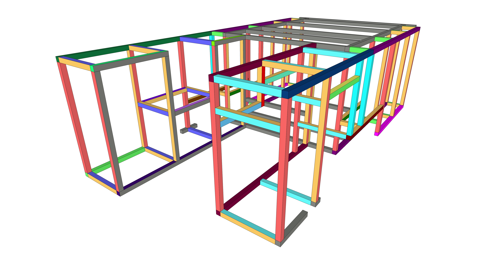
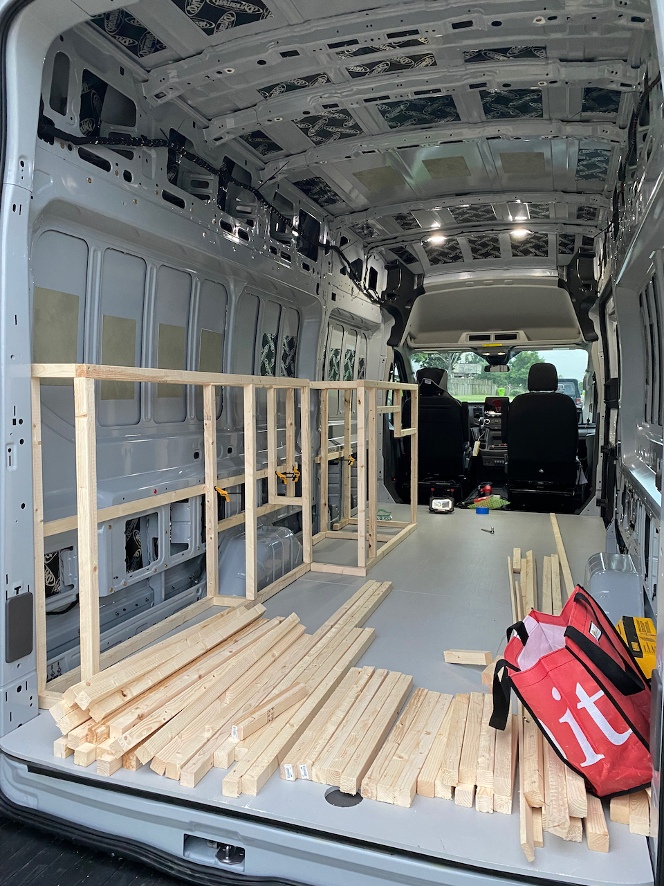
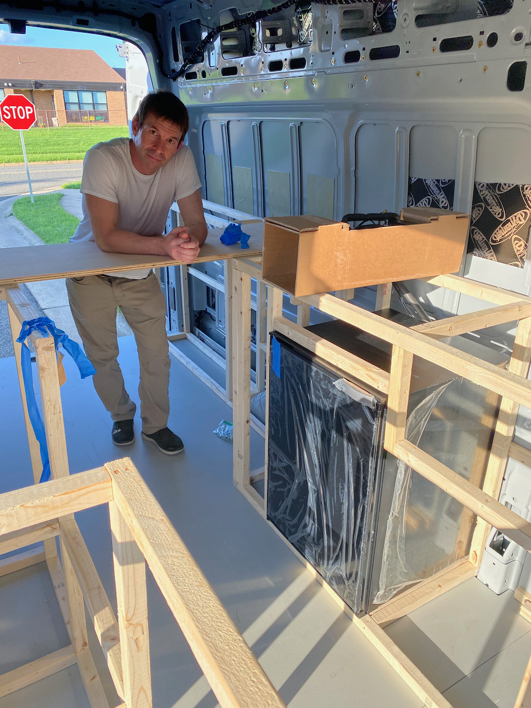
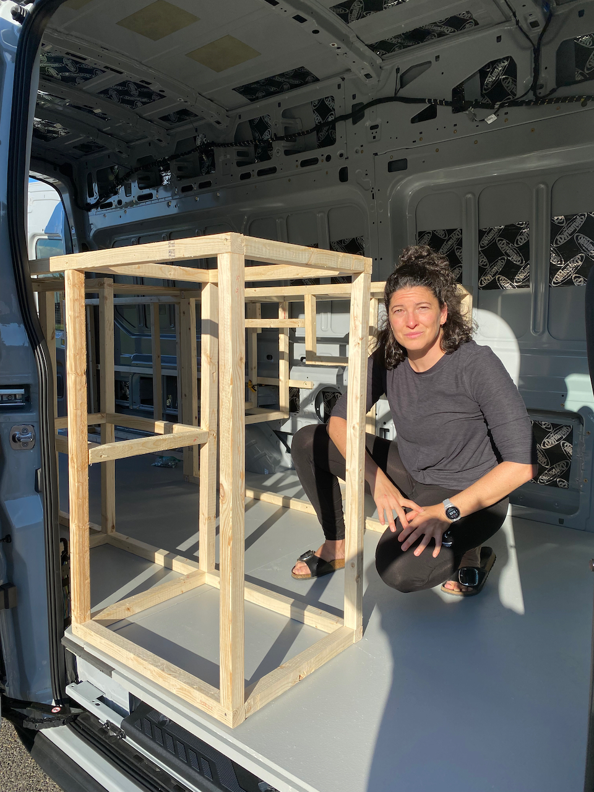

**TLDR: Van 2.0 is being built using 15 series 8020 extruded aluminum for its precision, strength, and popularity among DIY van conversion projects. To ensure accuracy, the design process included creating a 3D model in SketchUp and a full-size wooden mockup. If starting over, the we would use the 1515-ULS profile for weight savings.**

Van 2.0 is/will be framed almost entirely with 15 series 8020 extruded aluminum.  We decided on this route for several reasons:

* Lack of precision woodworking skills
* Lack of trust in wood joints under high dynamic load
* 8020 is a well trodden path for DIY van conversion

Once one decides on 8020, you then must decide on how much of the cutting/fabrication you want to do, versus how much you want them (the 8020 supplier) to do.  We decided to try the latter route.  Specifically we decided to have 8020 cut all pieces to length, and machine the counterbores to allow use of their internal anchors.

The implications of this choice are that mistakes are very costly both in dollars and in time (lead time on custom cut and counterbore'd 8020 is, at the time of this writing [40-60 business days](https://8020.net/shipping-information)).

So, mistakes are not an option.  We elected to do what submarine builders used to do: 
* Finish the design
* Build a full size wooden mockup
* Make any necessary changes
* (Order and) Build the real thing

## Design:
We use Sketchup for most of our arrangements and have since Van 1.0. Way back in September of 2020, months before we even ordered Van 2.0, we took a field trip to a local Ford dealer with cellphone cameras, paper, and a tape measure.  We measured, photographed, and took notes like crazy.  We then turned all that data into a sketchup model that captured those dimensions. 

Then we built our layout within those dimension using 1.5" x 1.5" rectangular prisms to represent the 8020.  Note, we began this process in September 2020, and iterated it all the way through September 2021.  Basically, as we received each new component (fridge, stove, etc) or finalized the design (battery), we added that to the model and made sure it all fit.  This was a two-way street, in many cases the model was used to help figure out what components (fridge) worked best with our arrangement.  So on and so on.

Once we had a solid model we took some time to figure out which sides and faces of the 8020 needed counterbores and which faces are smooth.

_Lengths are color coded.  Any face with a counterbore is yellow._

The last step was to produce a "bill of materials" or cut list that contained all the individual 8020 pieces.  This [google spreadsheet](https://docs.google.com/spreadsheets/d/1hqJElnqDAgyVD-M6ryy4JeQU1woKh2F8f8kn4qlit8s/edit#gid=1736038467) is that list (including the lessons learned discussed below).

## Mockup:
The mockup was much less effort than we expected and totally worth the piece of mind given our choice to have the 8020 supplier do all the cuts in advance.

Because we are using 1.5x1.5 inch 8020, we used standard 2x2 lumber for the mockup.  We spent a couple hours at the wood shop on the table saw going down the cut list.

We borrowed an air-nail-gun from a friend and set to work with couple squares to nail it all together.

_Passenger side pieces and driver side structure._

We did a full fitup with the fridge as that is one of the tighter areas in the arrangement.  All good.

The face of success.

## Lessons Learned

We originally planned to assemble the 8020 in place in the van.  We realized from the mockup it would be much easier, and totally manageable to assemble outside in two parts (driver and passenger) and then move into the van.

We originally planned to assemble the garage/bed area and galley area's separately, and then join.  We found that was not needed and altered the design so the outboard top 8020 is a single continuous piece that runs fore-aft on each side.

We found that adding a few "extra" pieces made the structure easier to build.  While not needed once the bed athwart support are installed, they made life easier before that.

## Order
We factored the two above design changes into the design and placed an order with PennAir, one of 8020's preferred suppliers.  Note:  Highly recommend working with them if you are within a few hours of York, PA.  Fantastic experience.

## What We Would Do Differently

We primarily used the 1515-S ("normal weight smooth") profile in our design, but if we were starting over, we would use the 1515-ULS ("ultra light smooth") profile to save 84 lbs or 25% on the total extrusion weight. According to the 8020 deflection calculator, this would have a negligible impact on strength or deflections.

## Timeline 
Note, this doesn't reflect full time effort.  It's mostly evenings and partial days, limited by work, wood shop availability, etc.
* Finished structural design (Thu 8-26-2021)
* Create BOM (Thu 8-26-2021)
* Wood Cuts (Tue 8-31-2021)
* Mockup (Tue 8-31-2021, Thu 9-2-2021, Fri 9-3-2021)
* Refine structure (Sat 9-4-2021)
* Finalize BOM (Sat 9-4-2021)
* Place Order (Thu 9-9-2021)