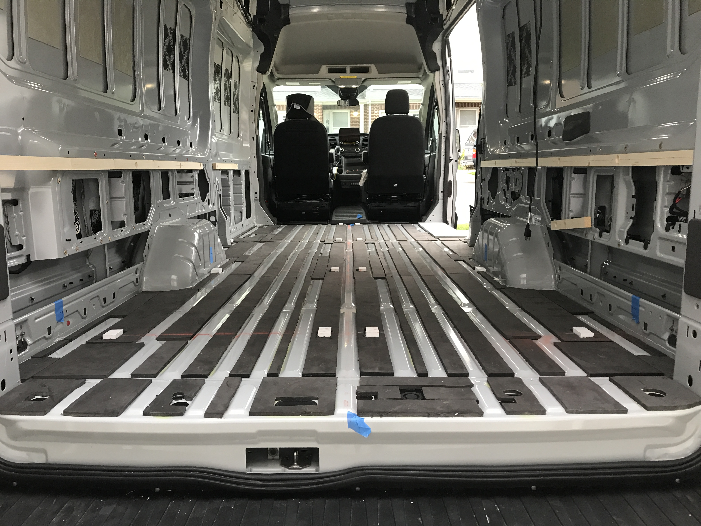

To keep the edges from popping and increase ease and flexibility of install, we pivoted from our original plan.

We originally planned to biscuit the four plywood sections together and install as a monolithic piece.  However, during our trial fit we discovered a few things that challenged this approach.  One, we found that some pieces of plywood were cupped, or warped such that the edges were popping up.  We didn't think the biscuits would solve this problem completely.  Two, each piece of plywood has an optimal location that ensures clearance to the van walls.  If this clearance doesn't exist, the floor will squeak as it is loaded and unloaded.  Ensuring each piece will end up in its optimal locations when joining outside the van seemed challenging, if not impossible.

So we woke up with a new plan.  Fix small wooden blocks to the floor that cross the seams of the plywood pieces.  Install the plywood and get each piece to its optimal position.  Screw the plywood to these fixed blocks.  Everything should lay quite flat at the seams, and sit right where it needs to.

We glued 1/2 strips of baltic birch together.  We used a hand planer to plane the thickness of the glued strip down to about 7/8 inch.  This locates the top of the blocks just below the top layer of foam, which is what we want.

We cut the strips into 1.5 inch by 2.5 inch blocks.

We sealed the blocks on all but the bottom with two coats of Kilz primer.

While I fabb'd the blocks, Sophia cut the bottom layer of minicell foam and cleaned off the contact cement in the areas we planned to mount the blocks.

Finally, we scuffed the factory paint in the mount locations and used J-B Weld 8276 KwikWeld to expoy the blocks to the floor.  It advertises a strength of 3127 psi, an oddly specific number, but even a quarter of that would be more than enough.

We also took this opportunity to epoxy the step delete into place.  Like the blocks, it will also be used to anchor the plywood layer.

Next up, plywood install.