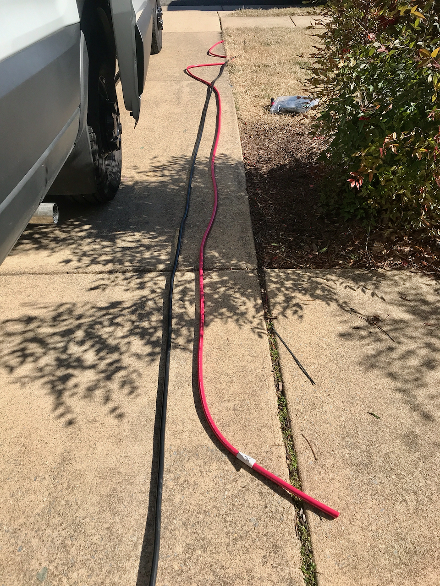

**TLDR:** The alternator install was a bit of a challenge due to the tolerancing of the bracket and the incorrect length of the supplied belt.  If you have the right length belt and some basic power tools (if needed), the physical install should only take about 4 hours for two people.

For the reasons identified [here](/van/electrical/electrical_overview/electrical), we opted to install a dedicated 24V alternator.  As documented [here](/van/electrical/alternator_charging/alternator_charging), we selected a 185A alternator kit for the transit sold by American Power Systems.

## Physical Install

Before the alternator arrived, we used an extension cord to map out the high power cable run between the battery and the alternator install location.  For our layout, we found 25 feet was sufficient with a little extra on each end for termination and margin.  We planned, and did, run a return cable to the alternator rather than rely on the chassis.  It's not clear this is necessary, but is strongly advised by both Nations, and APS.  Alternatively one could reinforce the engine to chassis ground strap/cable to ensure it has sufficient ampacity.  One other benefit of running a return cable adjacent to the source cable is minimization of the loop area which reduces the risk of any electromagnetic interference.  

With a 50 ft round trip conductor path, we could then determine the required cable size.  More detail is [here](/van/electrical/wire_sizing/wire_sizing), but in short, 2/0 Ancor cable keeps the voltage drop below 3% and ampacity is not the limiting factor. 

Because we will run the Wakespeed control cables along the same route, this effort also verified that the van-specific wiring harness has sufficient length on the alternator connections.  These wires are 27 ft on our harness.

We ran the 2/0 cables and Wakespeed control cables from the battery compartment (located between the wheel wells), through the driver side wall interstitials, down through a hole cut in the "floor" of the interstitial forward of the c-pillar, out through factory openings in the inner side of the van wall, along the driver wall, over to the driver frame rail, and finally across to the forward frame cross member to the alternator install location on the passenger side.  This was accomplished primarily with generous use of zip ties.  In the future, after all planned suspension work is complete, we may add more robust wire management, but what we have currently is sufficient in our opinion.  While we were at it, we ran some spare duplex runs from the battery compartment to just aft of the driver seat.

_Ancor 2/0_

After carefully reviewing the [installation instructions](24v-alterator-installation-instructions.pdf) I reached out to an auto-mechanically inclined friend to provide help and moral support for the actual install.  I also purchased a temporary subsrciption to Ford's online service manual to get better detail on the interference removal.  Worth it.  There is nothing more scary than disassembling a perfectly running new engine except doing it within a few weeks of liftoff.

_[@albatrossprintworks](https://www.instagram.com/albatrossprintworks/?hl=en) is a legend.  Couldn't have gotten through this without him._

It took us an hour or so to remove the turbo-related interferences, the main serpentine belt, and secondary belt (snip snip).  We then unbolted the AC compressor and tied it back out of the way.  So far so good.  Alignment bushings for the new bracket seemed to go into the AC compressor mounting holes easily with a few light taps.  

The new bracket provided some resistance.  The bracket mates in three locations, over two alignment bushings (later bolted through), and is bolted in through a thick boss in the bracket to a third AC compressor mount point.  Try as we might, we could not meet all constraints at the same time.  If we managed to get it on the alignment bushings, the third hole was eclipsed.  If we aligned the third hole, alignment with the upper alignment bushing wasn't possible.  Putting my full faith in the more experienced wrencher, we first chamfered the upper mounting hole on the bracket, and ultimately hogged the hole out by a few mils on one side with the side of a drill bit.  Ideally we would have modified the non-alignment-critical hole, but the thick boss the hole passes though made this impossible without significant effort and tooling.  With those modifications, the bracket install proceeded smoothly.

We reinstalled the AC compressor and bolted up the 24V alternator easily.  The hard part was over...or so we thought.

Try as we might, we could not install the new belt.  Not even close.  We used a taut string to measure the distance around the belt path and arrived at 51.5 inches with the tensioner fully "tensioning".  The belt supplied with the kit is 47.8 inches.  While troubleshooting we did identify an interference with the bracket alternator slide-bushings that prevent the tensioner from fully "relaxing".  This would certainly contribute to the problem getting the belt on, but I don't think a 47.8-inch belt was ever in the cards.  By this time it was getting late, so we had defeat-beer and called it for the day, with a partially disassembled engine.  

_We measured 51.5 inches.  General rule of thumb if you have a tensioner is to take this value and subtract and inch or so and that is the right belt sized_

Given it was Friday evening, I wasn't expecting much in terms of immediate tech support, but to my pleasant surprise, Jim from APS did respond that night, followed up on email on Saturday and promised to engage with the bracket manufacturer first thing on Monday.  Both APS and CW Mill were very responsive in helping work the problem.  As this was really a bracketry issue, most of that fell to CW Mill.  They confirmed the interference, but agreed it probably wouldn't make that much difference.  Many photos were exchanged, multiple belts of various lengths were provided.  In the end, the shortest belt I was able to install was 50-inch. **Real-time Update:** I was going to list all the details of the belt that ultimately worked for me.  However, upon checking the CW Mill website while writing this up months later, they appear to have [revised the instructions in April 2022](24v-alterator-installation-instructions-v2.pdf) to specify a 50-inch belt, which is provided with the kit.  Here's to being the first!

The belt related delay provided some side benefits.  It provided time to order some longer alternator bolting hardware to facilitate a place to land the negative cable.  I ordered these [nuts](https://www.mcmaster.com/96194a150/) and [bolts](https://www.mcmaster.com/95327A647/).  They are the same diameter/thread and grade as the kit hardware but are long enough to allow landing a terminal and nut on the backside of the bracket on the protruding threads of the now longer bolt.  I also sanded the paint off the bracket in those locations (manageable in place) to ensure a good electrical connection.  I highly recommend this same approach to anyone else installing this bracket/alternator.

We buttoned up the engine and crossed our fingers...success.  Everything appeared normal, including AC which runs of the new belt/tensioner.  Note, at this point the 24V alternator was spinning, but fully disconnected.

Add wakespeed physical install.

## Electrical/Control Install

As we progressed the battery install, we completed the initial electrical install of the alternator and Wakespeed.  We terminated and landed the 2/0 cables on both ends.  The alternator negative return also functions as the main chassis ground tie for the rest of the house electrical system and is thus is required to operate the system irrespective of the alternator status.  We also physically installed the Wakespeed.

_Big Crimp'in, Spend'n Gs!_

For future proofing, installed a shunt between the alternator positive cable and the main positive bus bar.  Its not doing anything now, but we may elect to have the Wakespeed sense that shunt to give it accurate alternator output and receive battery current data exclusively over CANbus from the BMS.

_Wakespeed mounted towards upper left.  Alternator positive is landed to a shunt installed 2nd from the left on the main positive bus._

Then we hit the road without any alternator charging.

Fast-forward 3 months and about 7000 miles.  During a couple of short breaks from van life, we had some time and availability to "open up the patient".

The Wakespeed harness has a DTM style connector that connects to the same CANBus as its RJ-45 connectors.  We wanted to take advantage of that CANBus access to allow for monitoring and data collection on all things BMS and Wakespeed related.  So we took our old friend the loggingPi from the MHMBMSCTF, terminated connections with the mating Deutsche style connector and mounted the loggingPi in the "network" cabinet.  We then verified we had access to all the same BMS CANBus data as before.  TODO: Add the specific connector type for this guy.

_When I asked which wire was CAN-High and CAN-Low, Wakespeed responded, "Yellow for the sun high in the sky, Green for grass below"._

We opened up the aft side of the battery compartment.  We used VHB tape to mount three opto-isolators to that aft panel.  The optos will be used to split and buffer the CHARGE-ENABLE signal from the REC BMS.  This is basically a hardware backup that prevents over-charging in the event that CANbus communication among the BMS, Victron, and Wakespeed is down.  We went ahead and wired a 24V source through an opto to drive the Wakespeed Feature-In port.  The logic is "charging is allowed" => CHARGE-ENABLE = HIGH => Feature-In = HIGH.  This logic will disable all Wakespeed charging in the event of a broken wire.  TODO: Insert link to BMS Wiring Logic Article.

_Hardware backup FTW!_

While we had the rear battery panel off, we terminated and landed the Wakespeed positive, ground, and shunt connections.

_We reserve the right to relocate these wires to the alternator positive power shunt._

The Wakespeed needs to know if the engine is actually running before it applies field current to the alternator's rotor.  We mostly followed [@Maia's documentation](https://www.fordtransitusaforum.com/threads/tiny-watts-installation-experience-initial-review.87174/post-1140295) on the forum.  We removed a wall panel to access one of the "spare" duplex runs from the battery compartment to behind the driver seat.  We used methods described by Maia and the owners's manual to access the C33-E connector, without removing the seat!  We wired a [pigtailed relay socket](https://www.amazon.com/gp/product/B01KVZ2MCW/) to the duplex prewire and to a [pigtailed C33-E connector](https://www.amazon.com/gp/product/B07W99QSCD/) as follows:

* Relay Pin 85 Coil+ (BLACK) TO C33-E Pin 6 Ignition
* Relay Pin 86 Coil- (WHITE) TO C33-E Pin 2 Engine Run
* Relay Pin 87 Normally Open contact (BLUE) TO 24V source duplex prewire (RED)
* Relay Pin 30 Return contact (RED) TO "ENG RUN" signal return duplex prewire (BLACK)

We noticed that pins 4 and pins 9 were connected together (load shed ground in and load shed ground signal out) in the dummy C33-E connector that we removed, so we connected those to wires on the pigtailed connector just in case that important.  It has no bearing on what were doing for the wakespeed.

After a last minute measurement of coil resistance to make sure it doesn't violate the BEMM, we then plugged a normal [Bosch 12V automotive relay](https://www.amazon.com/gp/product/B004Z0U1IW/) into the relay connector.

Back in the battery compartment we:
* Wired a 24V source to the prewire duplex (RED)
* Wired Wakespeed IGN (BROWN) to our new ENG RUN signal on the prewire duplex (BLACK)

Following all that we started the engine and listened for the click of the relay: Click.  The proper test would have been to verify the signal with a meter, but I had already closed the patient.

The alternator has a water-resistant 4-pin connector that mates with a provided connectorized 4-wire pigtail.  The connections are for the stator sense (allows speed and presumably voltage determination), rotor field excitation, and supply and return to a temperature sensor.  The wakespeed van-harness has wires matching these functions with connectors installed.  After some research, discussions with wakespeed, and trial and error, the connector types are a superseal for the blah, and a DT06-2S.  Thus you need install a mating [superseal](https://www.amazon.com/gp/product/B014IU2EE2/ref=ppx_yo_dt_b_search_asin_title?ie=UTF8&th=1) and a [DT04-2P connector](https://www.northeastdirect.com/collections/deutsch-connectors/products/2-pin-deutsch-dt04-2s-dt06-2s-waterproof-electrical-connector) on the alternator pigtail.  We also strongly recommend a pin crimper for this job and any other connector pinning job.  We've been able to make [this one](https://www.amazon.com/gp/product/B00OMM4YUY/) work for every connector we've built.

_Connectorized alternator connector._

Lastly, we installed a [Stirling Alternator Protection Device](sterling-alternator-protection-device.pdf) to act as the backup to the backup to the primary protection against uncoordinated load disconnect transients.  More details are at the bottom of this article.  We installed this device physically with VHB and a zip tie on one of the bumper structural supports adjacent to the alternator.  We terminated and landed its wires at the same locations as the alternator positive and negative cable.

With that, the electrical and mechanical install was complete.  This post documents light off and initial testing. TODO: Link to testing post.

## Future Work

We plan to implement Ford's SEIC capability to allow high idle charging.

We plan to wire one of the dash upfitter switches to allow turning on and off alternator charging.  It's currently controlled completely by the BMS or pulling a fuse if we want disabled.

## Timeline

Note: This doesn't reflect full time effort.  Its sporadic and limited by work, other projects, supply chain, and van availability.

* Prototyped power cable runs to obtain lengths, determined gauge based on lengths (Sun 1-23-2022)
* Ordered the alternator and bracket (Mon 1-24-2022)
* Routed and secured power and control cable runs, alternator and bracket delivered (Wed 2-9-2022)
* Started install but hung up with belt length issue (Fri 3-11-2022)
* Confirmed 51" belt too long (Tue 3-15-2022)
* Confirmed 49.5" belt too short, 50" belt feels ok (Wed 3-16-2022)
* Sanded the bracket for landing terminals, swapped in 90mm bolts, reinstalled engine interferences, restarted engine and idled through normal range - all good, terminated alternator side of power cables and landed. (Fri 3-18-2022)
* Terminated and landed battery side of power cables and landed (Sun 3-20-2022)
* Terminated the loggingPi with a DTM connector to interface with BMS/Victron/Wakespeed CANBus, added ring terminals for 12V power (Fri 5-27-2022)
* Connected the loggingPi to power, and verified CANBus access and that BMS-Cerbo comms were still functioning (Sun 5-29-2022)
* Installed and wired optos for CHARGE-ENABLE, connected CHARGE-ENABLE to Wakespeed feature-in, terminated and landed Wakespeed positive, ground, and shunt wiring (Sat 6-4-2022)
* Installed the "engine run" relay and C33-E connector, connected to prewire, wired to Wakespeed ignition, pinned connectors on alternator connector, installed battery temperature sensor, mounted and wired Stirling alternator protection device (Wed 6-15-2022)