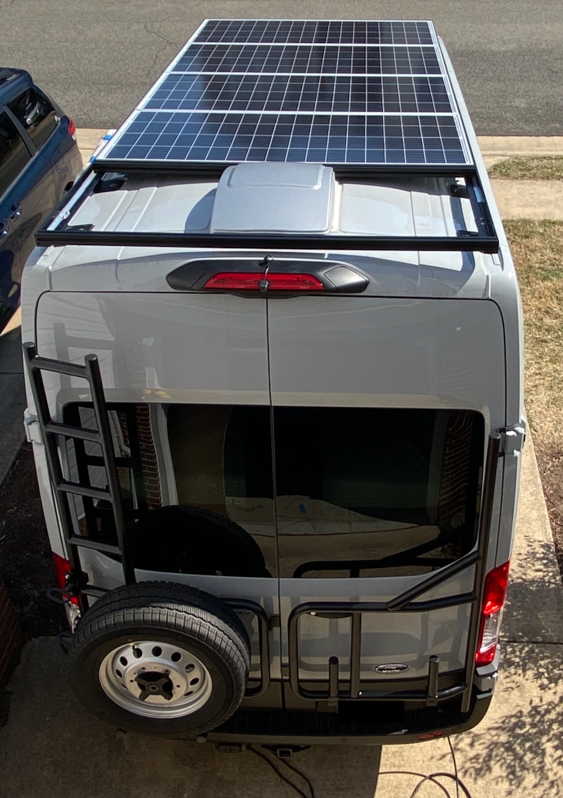
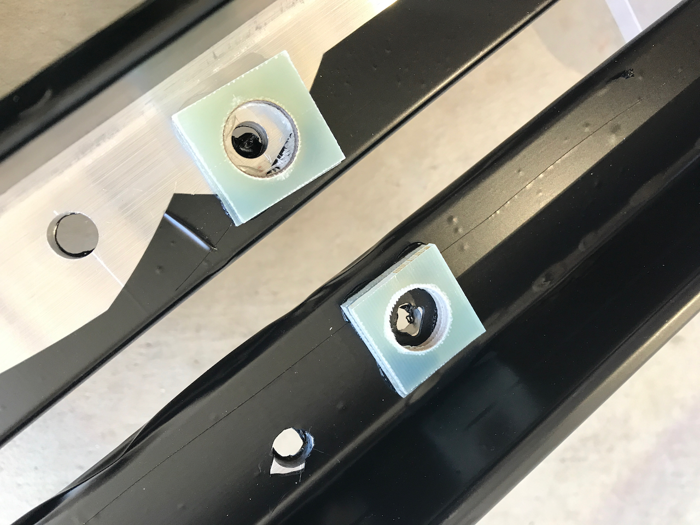
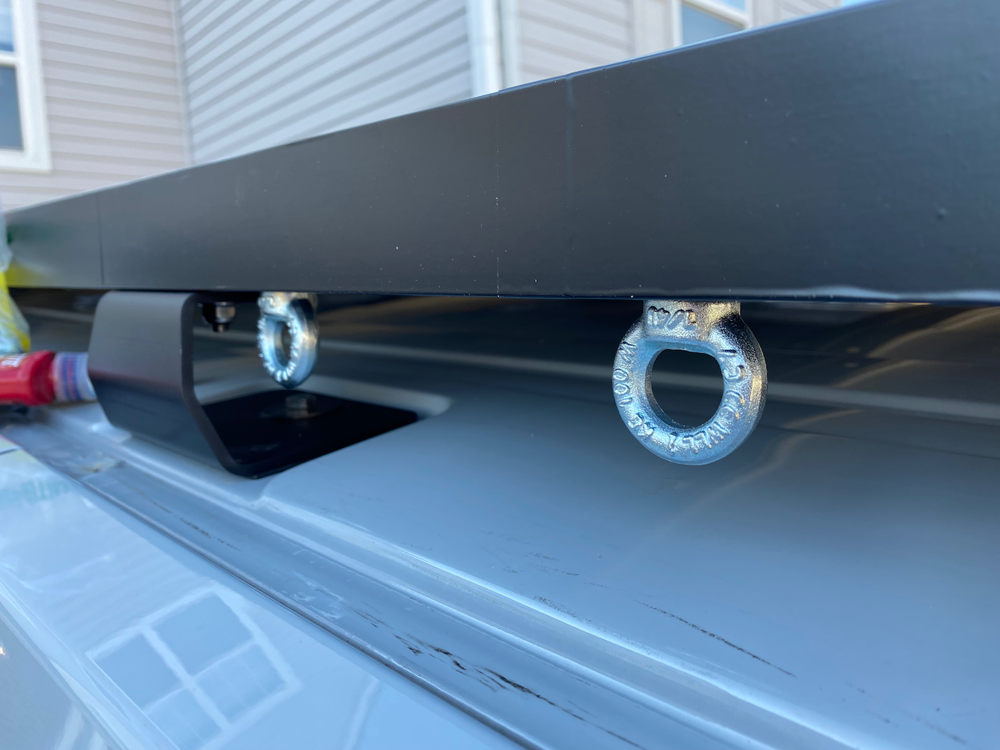
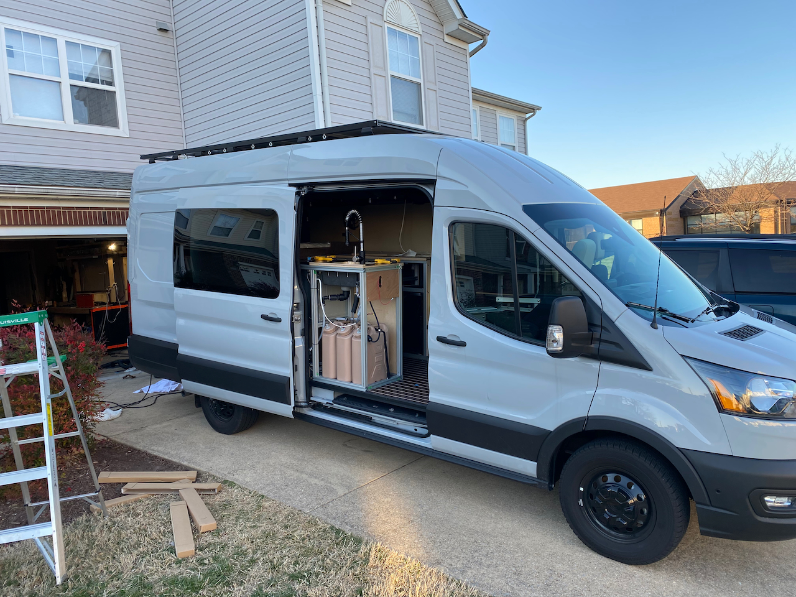

**TLDR: We installed a 137-inch roof rack and 800 watts of solar panels on Van 2.0.  The rack is composed of angle aluminum, 15 series 8020, and Hein's roof rack mounts.**  

If you want to see the design iterations and thought process for our layout, it can all be found in [this article](/van/vehicular/roof_arrangement/roof_rack_and_arrangement_notes).

### Planning and Measurements
Precise measurements were taken to ensure proper fitment of the solar panels and roof rack on the van. After assessing the dimensions of the solar panels and the distance from the forward mounting slot of the bracket-to-angle joint back to the Maxfan, we determined that the first hole in the two angle side rails needed to be positioned at least 2.5 inches (on center) from the forward edge of the angle.

We didn't want to move the front edge of the rack too far forward due to proximity to the factory antenna (and aero concerns).  Ultimately, we settled on positioning the front edge of the rack 3 inches from the center of the forward slot of the bracket-to-angle.

We then measured from this front position of the rack back to a distance that would clear the Maxfan when it is stowed.  Based on this, we settled on overall length of 137 inches for the roof rack.

_The view from the top._

### Drilling and Assembly
After measuring and creating a mock-up in the garage, drill locations for the solar and roof brackets were marked on the angle. All holes were drilled, excluding the aft brackets and aft cross beams.

Subsequently, the cross beams were modified with a chamfer on the end to clear the radius of the angle and a partial fit check was performed.

_We are still finding uses for our 1/8" FR4 spacers a year after we finished this van build.  This image also shows the crappy edge of the wrap that is not normally visible._

### Wrapping and Installation
The rails were wrapped, and the installation of the rails, cross beams, and solar panels followed. The solar panels were connected, and all fasteners were secured with lock-tite and torqued. Upon completing the installation, wire management was addressed, and unused factory plugs were eternabonded to prevent future leaks (there is some history on that).

_When possible, always go for dual or more function on a van build.  These provide shade structure anchor points as well as fastening solar panels._

### Random Details
We used black vinyl wrapping for the rails, which has held up great.  We would certainly repeat this.

We used Eye-nuts where the solar panels are bolted through the angle.  This provides an attachment location for tarps and shade structures.

The angle is 6061-T6 1.75"x1.75".  The 8020 cross members are attached via 5/16 bolts (we ordered the 8020 with the ends tapped).  The solar panels are bolted through the angle with zinc plated 1/4-20 hardware.

We used 1/8" FR-4 spacers to raise the panels flush with the top edge of the angle and to clear the radius on the inner corner of the angle.

_The view from the bottom.  This wide and at some distance.  In real life this rack is about as low profile as is possible with 8020 cross members._

### What We Would Change
Probably Nothing.  We've got a year on this and its been solid.  No complaints.  Its cheap, light, functional, and adaptable.

Ok.  Maybe one thing.  We might consider using Hein's rails instead of the angle, now that those are available.  

### Conclusion
The installation of a roof rack and solar panels on the van involved overcoming challenges and learning experiences. Ultimately, the project was successful, enhancing the sustainability and functionality of the vehicle. For those considering similar projects, this technical overview can serve as a reference, emphasizing the importance of meticulous planning, accurate measurements, and attention to detail for a successful installation.

### Timeline
This does not reflect full-time effort.  Order times, weather, work, etc are all factors.
* Installed roof brackets (Mon 2022-01-24)
* Measured and mocked up drill locations (Sun 2022-02-20)
* Drilled holes and modified cross beams (Mon 2022-02-21)
* Wrapped rails and installed cross beams (Sat 2022-02-26)
* Installed solar panels and connected wiring (Sun 2022-02-27)
* Completed wire management (Mon 2022-02-28)
* Eternabonded plugs (Wed 2022-03-16)
