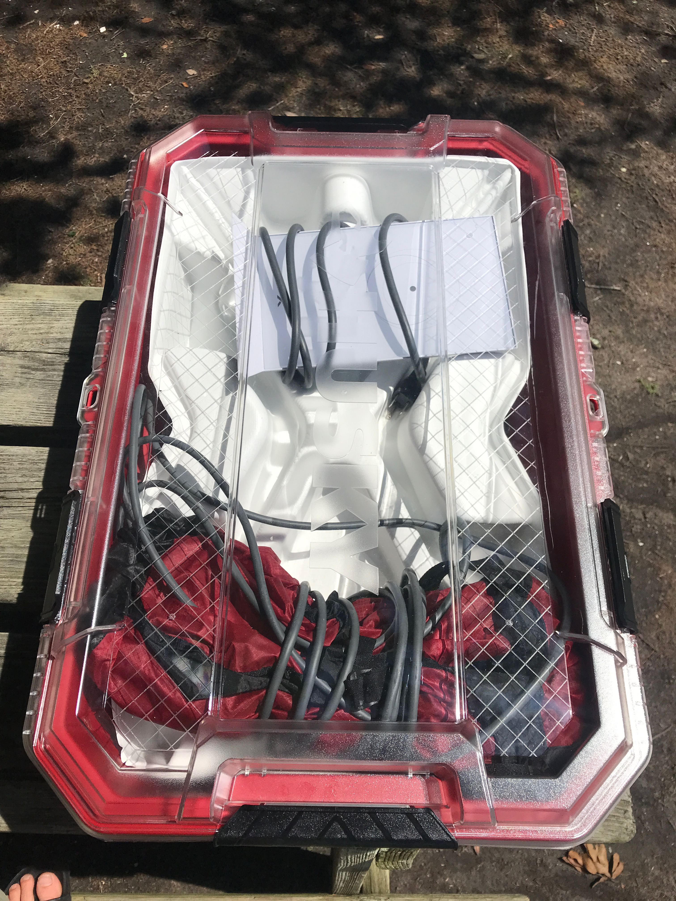
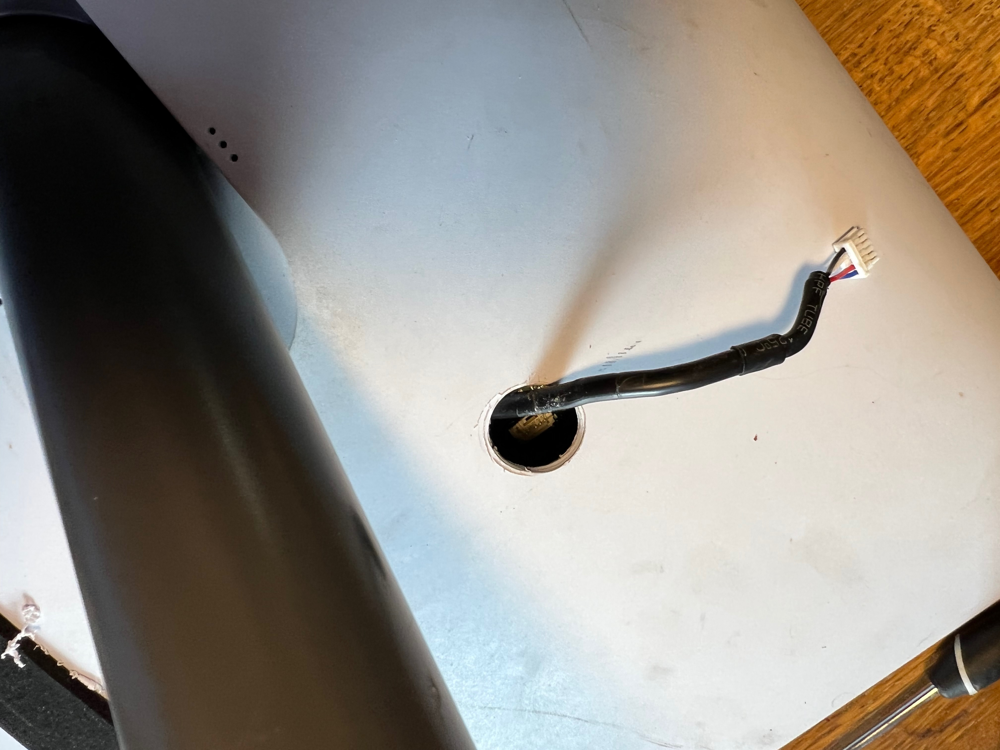

**TLDR: After using Starlink "on-label" seven months, we modified it for DC power and flat roof mounting.  For full-timers that work out of a van or RV, Starlink is a game changer.**<!--excerpt-->

## Impressions and Experience

We hooked up our Starlink for the first time on Hatteras Island in mid April of 2022.  We changed our service address to Hatteras (a generic address) and it connected immediately.  Starlink had just started rolling out roaming capability recently and after that first change in service address we never had to change it again (including two trips across the country).

For us service has been pretty amazing from the beginning.  The only time we've had trouble connecting is in heavy tree cover in the Pacific Northwest, and unless its very heavy there is often still enough connectivity to stream.  However, for VOIP, Zoom, or anything realtime, you do need a fully unobstructed view of the Northish sky.

Power usage isn't too bad but does add up: Running a Multiplus just for Starlink (our only semi-continuous AC load) costs you ~20 watts at zero load. Add in the Starlink and you're probably burning 80-100 watts total, 24/7.  It was not negligible in our daily energy balance (and we have a big system).  This can be improved, as discussed below.

### Story Time: 

We were on Hatteras during a gnarly Nor'easter in early May that swept two houses out to sea and cut off access to the island for 5 days or so when the dunes on Hwy 12 collapsed.  At some point during reconstruction, the "hardline" to the island got cut.  This takes out everything: cell, internet, and land lines (including 911).  The local radio station was telling people to head to the local fire department in case of emergency.  Meanwhile, we're streaming Netflix and making wifi calls off island.  Game changer.

## Phase 1 Use

For the first 7 months, we used Starlink "on label".  When camping we'd put dishy on the stand it came with and either throw it up on the roof (on a towel) or somewhere in a clear area within the 75ft limitation of the included cable.  We'd usually place the router in our garage area (under bed) and fish the wire from the dish through the square hole under the passenger rear corner.  

After a few months of this, we got tired of fishing the cable into the van.  We'd just place the router outside of the rear windows and plug it into the outlet we have under the rear of the van (highly recommend - our favorite outlet).  Plenty of Starlink router signal would penetrate the doors/windows to give a very solid internet connection to our internal network.

A few notes related to this approach:  

* The router, dish, and cabling are designed for outdoor use.  Anything short of submersion or water jets is fine I'd bet.

* Our internal network would auto connect to the Starlink router's wifi and use that as its internet source.  If this sounds interesting to you look into openwrt and a package called travelrouter.  If you aren't afraid of a linux command line its pretty straight forward.

### Story Time:

This method works pretty well until you accidentally drive off with a dish connected.  Which we did in Oregon. The dish got pulled 20 ft up a rocky embankment along the Hood River at which point it anchored itself in some roots.  The cable let go from the dish and the router and cable trailed the van dragging down a gravel road for another 200 yards.  The cable was toast, but surprisingly the dish and router worked fine with a new cable that we had on hand.  A testament to luck and the product construction.

## Phase 1 Storage

Since we stowed our system while mobile (except that one time) we needed a storage solution.  Based on some useful facebook groups and subreddits we settled on this [Husky 12 Gal container](https://www.homedepot.com/p/Husky-12-Gal-Professional-Duty-Waterproof-Storage-Container-with-Hinged-Lid-in-Red-248921/313861297) which happens to fit a dish, stand, router, and cable quite well with 1/2" leftover minicell on the interior bottom and sides to give its innards a soft ride.

That container also functions well as a step for about a week if you are under 175 lbs.  After that it will no longer function as a step, but will will store a Starlink system fine, but with a cracked lid.  

We highly recommend this box for storage.  There are some pelican cases that allegedly fit well, but there's probably more interesting things to spend that kind of money on.

_Maybe don't use as a step._

## Phase 2 Use and Storage

After six months of watching the hacking groups figure out the best ways to mount, disable motors, delete the router, and power from DC, we elected to do those all those things.

**Requirements:**

1. We wanted to eliminate the work to deploy and undeploy the system for 90% of our campsites.  Flat mounting on the roof accomplishes this.  However, we wanted to preserve the dish stem and motor function to orient the dish when mounted normally on a raised pole, or away from the van for the remaining 10% of our campsites.

2. We wanted to eliminate the Starlink router.  The first reason was to have Starlink hardwired into our network to eliminate unnecessary power and bandwidth loss associated with an unwanted extra wireless network.   The second, and more import reason was eliminate the the need for constant AC power and associated losses.

## Flat Mounting

For our roof design, the dish had to mount at the rear of the van.  This presented an opportunity for a lower profile mount while leaving the stem of dishy intact to satisfy our first requirement.  We found that we could take advantage of the roll off of the van roof to accommodate the angled stem.  This was somewhat dependent on our roof rack design and dimensions, but allows us to flat mount a "stowed" Starlink dish only 2 inches above the surface of our roof rack which is already pretty low.  It also meant we could use easily procured standard 6063 aluminum angle to build the mount (cradle) out of the limited tools we have at our disposal these days (drill, hacksaw, and a clamp).

The cradle consists of two pieces of 30.75" long 2x1x0.125" angle running fore-aft and two pieces of 11.75" long 1.75"x1.75"x0.125" angle running athwart.  The parts are bolted together to form a rectangle with an outer dimension that perfectly matches the edge of the dish.  There are 1/8" FR4 spacers (left over from the build) under the athwart angle to so that all edges of the rectangle are in plane.  Note, the 30.75" dimension was based on hitting a roof rack cross-member while allowing enough cradle overhang so the dish stem drops below roof level as the roof rolls off.  All metal was purchased cut from metal's supermarket, a fantastic source if you have a location near you (inquire about their cut tolerance though).  We also cut a 22.5 degree angle on the structure's edge that mounts near our solar panels to minimize any shading while the sun is a decent power producing angle.  If its helpful, [here is a basic Sketchup model](Starlink-mount.skp).

  
_To verify our design worked we put it together with small amounts of VHB._

_We also put this prototype up on the van rack, but neglected to take pictures._

To match our rack and not have to deal with paint or powder coat, we [vinyl wrapped](https://www.amazon.com/gp/product/B07R53LJLL/) the cradle the same way we did our roof rack angle (which has held up fantastically). 

To secure the dish in the cradle we installed two [webbing guides](https://www.mcmaster.com/8030T11/) on each long side of the cradle and sewed some 2 ft long 1" wide webbing/velcro straps with one side anchored to a webbing guide and doubled back over the dish.  As far as we can tell velcro is transparent to dish waves, unlike old growth forest canopy.

To give the dish a softer ride we added some 1/4" thick adhesive foam strips to the dish's underside where it rests on the cradle.

_Cradle mounted with dish installed._

## Alternate Mounting

To provide an option to get better visibility with trees around we decided to go with the [Flagpole Buddy Starlink kit](https://flagpolebuddy.com/ols/products/httpsflagpolebuddycomolsproductshttpsflagpolebuddycomolsproductsstarlink-kit-2nd-generation).  We considered a Harbor Freight telescoping flag pole but read to many complaints about them breaking.  Flagpole buddy was awesome to work with.  I reached out to them because their kit isn't compatible with the larger diameter tubing used in Aluminess products.  They had me send dimensions and within days notified me that they had printed compatible parts, and just to specify "Need Aluminess ladder modification caps" in the order notes.  Install was a breeze.  The kit ships with two pole segments that gets you about 13 ft off the ground depending on how you mount it.  We plan to order two more segments to get us over 20ft.  Highly recommend this product if you are looking for a similar mounting method.

_Appears to be a solid well thought out product._

## Motor Disable

To make use of our new mount, we needed a way to disable the motors that control the stem of the dish during power up and initial positioning.  The "Starlink To Go" facebook group has a [decent post](https://www.facebook.com/groups/Starlinktogo/permalink/409284207818149) detailing how to do this.

We placed our hole 5" from each side, along the contour of the back of the dish.  I'd recommend marking some paper as a template that you can lay over the back to mark your drill point.  This puts the connector in reach while dodging two internal structural reinforcements.

We used a standard 3/4" hole saw.  If you are really concerned about punching through, you can build up a thickness of duck tape (or any tape) around the hole saw to act as a drill stop.  In this location the connector and circuit board are probably 1.5-2" below the back surface of the dish.

We thankfully (maybe) had a spare broken dish on which to practice the surgery. 

Once you drill the hole there will be a black cable connected to the circuit board.  It is pretty easy using curved tweezers or a curved hemostat to compress the connector to release the clip.  On dish number one, we were able to fish out about 3 inches of cable.  On dish number two, we had to carefully pass the connector around a nearby internal stiffening feature to get a few inches.  We were able to do so by feel and reaching a finger though the hole.  Others have had to drill a second hole to aid with this.

_This is what you are working with._

We used [this allegedly waterproof double pole toggle switch](https://www.amazon.com/dp/B008DG86SQ) for our disable/enable switch.  We used these [pigtails](https://www.amazon.com/dp/B08F784R9W) to make our life easier.

We trimmed back all the jackets and cut the red and black wires about halfway down the slack.  Beware, these wires are tiny.  Probably 22 or 24 AWG.  We used crimped butt connectors and heat shrink to join our pigtails.  We found later that we had crushed/severed the black connection with this method.  For that repair we used a soldered western union splice with heat shrink.  If we had to do it all over again, we use that same method on all four joints.

Reconnecting the motor plug was quite difficult.  We'd say curved stout tweezers or hemostats are required.  There is not enough room or the right orientation for straight tweezers or needle nose pliers.  Also the clip on that connector is fragile.  We broke it on the first test dish such that it wouldn't lock in place.  Avoid grasping the connector in a way that puts force on the clip/tab.

We connected pig tails to the switch and tested.  Do not seat the switch into the hole until you have fully tested!

As I mentioned, we had severed the black wire without knowing.  That resulted in what looked like normal behavior at first but a stuck motor warning after a few minutes during final positioning.  No idea why that is, but our repeated testing/troubleshooting showed clearly the black wire is not involved in initial dish angle and rotation movement, but is critical later.  After the stuck warning, the dish is able to automatically return to the stowed position with the black wire disconnected upon reboot.  Maybe its a sensor feedback wire...not sure.  The dish will not move at all if the red wire is disconnected.  If you attempt this modification, hopefully none of this information will matter.

After we got that all sorted, we used some 3M 5200 we had on hand to properly seal the switches boot to the back of the dish.  Without doing this water could easily ingress into the hole.

If we did it again, we would consider going with a larger hole, using a rubber grommet/disk to fill the larger hole, and install the switch into the grommet/dish.  That might make things less fucky.

_We're past pretty at this point._

## Router Delete

To delete the Starlink router, we needed to deal with the non-standard Power Over Ethernet (POE) used by the Starlink dish.  If you go the full DIY route this means crossing some ethernet strands, passing them through a POE injector powered at 48V, and then crossing them back.  This [guide](Starlink-12-or-120-volt-and-wifi-router-delete-ver2) by Jim Taylor of the [Starlink for RVers and other mobile users facebook group](https://www.facebook.com/groups/Starlinkrv/) goes into good detail on that approach. 

Instead, we elected to make use of a board that does both of these things called the [DishyPowa](https://DishyPowa.com/) made by a small business in Australia.  We highly recommend going that route as it keeps the RJ-45 terminations standard.  They also sent candy treats and nice adhesive mounts that the board screws to.

We took the DishyPowa board, [this 24-48V converter](https://www.amazon.com/dp/B089M7FVLJ), [this blue sea terminal board](https://www.amazon.com/dp/B0000AZ6TZ), and [this rocker switch](https://www.amazon.com/dp/B08R5PLDBP), and packaged them into [this project box](https://www.amazon.com/dp/B09T6NFRXH).  We did some fairly crude modifications and strain relief, used a little VHB here and there, and arrived at a completed POE Box.

_POE box internals._

_POE box exterior view._

For our chosen router delete method using the DishyPowa board, we need to cut off the proprietary connector and re-terminate the Starlink cable to RJ-45 per T568B. The supplied Starlink cable is actually CAT5E dressed up these special proprietary waterproof connections.

We used [these shielded RJ-45 terminations](https://www.amazon.com/dp/B07K6DDVV1) because they are shielded, support 25-26AWG CAT5E cable, and we already had a standard RJ-45 crimper on hand.  It was fussy and difficult to verify the correct locations of the individual wires.  If we had to do it again we'd pickup a pass-through connector crimper and pass-through connectors.  We'd also have an independent triple check on that the terminated wire locations were correct.  If you get this wrong you can smoke both your DishyPowa board AND your Starlink dish, don't ask how we know.  I'd also recommend you go ahead and terminate the left-over end that connects to the Starlink router.  This lets you use one of [these shielded couplers](https://www.amazon.com/dp/B071NVVB6M) to test that everything still works properly and that the terminations are good.

We used [these shielded waterproof RJ-45 panel mount couplers](https://www.amazon.com/dp/B09XM37H79) for our new roof pass through box.  These are actually shielded.  Choose wisely and test: [These couplers](https://www.amazon.com/gp/product/B08CDD2BRF) claim to be shielded but were not based on a DMM check.  We used [this box](https://www.amazon.com/dp/B08K79YJNJ).  The key characteristic was the side with no preexisting cable glands.  That gave us space to install three of the ethernet couplers.  We used [this hole saw](https://www.amazon.com/dp/B0B467X2B2) to make the holes for the couplers.  The extra two couplers are for future flexibility (e.g. an outdoor wifi AP).  We'll document the other details of this pass through elsewhere but in short it uses a 1" bulkhead fitting and closed cell foam to create the seal.  That approach has worked leak-free for 7 months on the road though all kinds of driven rain.

_We can't imagine needing to bring more wire/cable to the roof than this thing will allow._

Lastly, we ran 3 of [these 25ft shielded ethernet cables](https://www.amazon.com/dp/B0714FJBTW) from the "network closet" inside the van up to the roof passthrough box and connected them to the inside-side couplers.  The key characteristics of those cables are they are shielded, CAT5E or better, and 23AWG.  Many cables have thinner gauge wire that can result in too much voltage drop to properly power the dish.

## Fin

Thats it.  We flipped off the dish motors, mounted the dish in its cradle,  plugged it into a rooftop coupler, plugged the corresponding interior cable into the POE box, plugged a data cable from our own router to the POE box, and fired everything up.  Everything worked (the second time - after we fried our first dish and DishyPowa board).  All phase two requirements satisfied.  Lastly, to use the Starlink App after the router delete, you may need to setup some static routes on your router. Refer to google.

## Misc

### Useful links

Starlink Motor Mod:
[This page has good info](https://www.facebook.com/groups/Starlinktogo/permalink/409284207818149).  The author suggests 5" x 5" for hole location for a 3/4" hole.  He also suggests using red and black wires to wire in the switch.

[This video](https://youtu.be/kCOgG6daDVE?t=187) goes with a hole located 5" x 5" along contour from edges with 1" hole.

[This comment](https://www.facebook.com/photo.php?fbid=10158932786661334&set=p.10158932786661334&type=3) suggests connector is located 4" from bottom and 4.75" from edge.

### Troubleshooting Initial Motor Disable Issue (for posterity)

Dish moves out of stowed position (can move at angle) and rotates (can rotate).  Upon reaching full extent of angle motion, it gives motor stuck warning.  Will not respond to stow commands once warning is given.  After placing face down and cycling power, it moves into stowed position and gives mast not vertical warning.  Upon restoring to proper orientation it moves back into "flat" position - actually just past flat at extent of travel allowed by body, and gives stuck motor warning.

The first power up after mod, it seemed to "wiggle" angle-wise when it tried to move into final position before it gave motor stuck warning.  Have not seen that since.

Inserted ammeter on black line and never saw any current during startup or stow.

No change in behavior with black wire disconnected completely.  Also clearly driving hard into limit of travel by body.  Perhaps black wire is encoder or limit switch signal.

Based on this black wire must have been severed during the crimping process.  Cut one side of black connection and found continuity through the other black splice (so good).  Repaired broken connection with western union splice, soldered, and heat shrunk.  This solved the problem.

## Timeline

Note: This doesn't reflect full time effort.  Its sporadic and limited by work, other projects, supply chain, and van availability.

* Setup and used Starlink for the first time (4-19-2022)
* Obtained Husky Box for storage (5-15-2022)
* Notified of availability and ordered DishyPowa POE injector (8-6-2022)
* Ordered angle, Flagpole Buddy, roof gland box, POE box, rocker switch, fake shielded couplers, terminal block, Cat6 cable, and a 24-48V converter (10-17-2022)
* Test fit with angle, concept works.  Ordered waterproof switch and pigtails.  Ordered webbing anchors. (10-19-2022)
* Test fit structure on van, works.  Trimmed angle to prevent shadowing solar panels. (10-20-2022)
* Ordered new shielded couplers.  Ordered new rooftop box to allow drilling for ethernet ports.  Ordered shielded RJ45 terminations. (10-21-2022)
* Vinyl wrapped structure (10-24-2022)
* Built POE box. Broke Starlink and DishyPowa (incorrect T568B wiring). Ordered new DishyPowa. Re-terminated ethernet onto dish and triple checked. (10-25-3022)
* Terminated ethernet onto Starlink router and triple checked.  Confirmed Starlink dish broken assuming terminations good.  Ordered refurbished Starlink. (10-26-2022)
* Re-confirmed with brand new stock cable that old dish is dead.  Confirmed with new dish that ethernet splices are SAT. Routed ethernet from roof penetration to network closet. Tested roof penetration ethernet connections and runs with dish and Starlink router, all SAT. (10-30-2022)
* Drilled and wired in switch, observed incorrect behavior (see above).  Determined bad connection on black wire. (10-31-2022)
* Repaired black wire and heat shrank, all tests SAT. Sealed waterproof switch with 5200. Replaced DishyPowa. Installed on van and tested all mods, all SAT. (11-1-2022)

