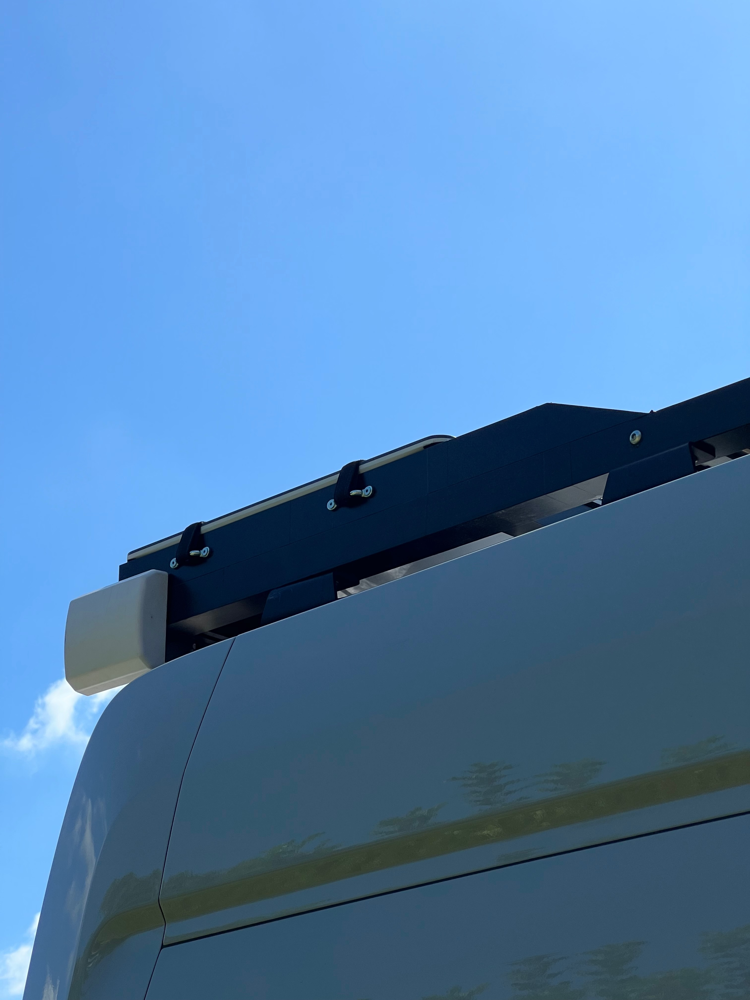

Notes:

## General Thoughts and Experience

We hooked up our Starlink for the first time on Hatteras Island in mid April of 2022.  We changed our service address to Hatteras (a generic address) and it connected immediately.  Starlink had just started rolling out roaming capability recently and after that first change in service address we never had to change it again (including two trips accross the country).

For us service has been pretty amazing from the beginning.  The only time we've had trouble connecting is in heavy tree cover in the Pacific Northwest, and unless its very heavy there is often still enough connectivity to stream.  However, for VOIP, Zoom, or anything realtime, you do need a fully unobstructed view of the Northish sky.

Power usage isn't too bad but does add up: Running a multiplus just for Starlink (our only semi-continuous AC load) costs you ~20 watts at zero load. Add in the starlink and you're probably burning 80-100 watts total, 24/7.  I never bothered to suss it out exactly but it was not negligable in our daily energy balance (and we have a big system).  This can be improved, as discussed below.

### Story Time: 

We were on Hatteras during a gnarly Nor'easter in early May that swept two houses out to sea and cut off access to the island for 5 days or so when the dunes on Hwy 12 collapsed.  At some point during reconstruction, the "hardline" to the island got cut.  This takes out everything: cell, internet, and land lines (including 911).  The local radio station was telling people to head to the local fire department in case of emergency.  Meanwhile, we're streaming Netflix and making wifi calls off island.  Game changer.

## Phase 1 Use

For the first 7 months, we used starlink "on label".  When camping throw dishy on the stand it came with and either throw it up on the roof (on a towel) or somewhere in a clear area within the 75ft limitation of the included cable.  We'd usually place the router in our garage area and fish the wire from the dish through the square hole under the passenger rear corner.  

After a few months of this, we got tired of fishing the cable into the van.  We'd just place the router outside of the rear windows and plug it into the outlet we have under the rear of the van (highly recommend - our favorite outlet).  Plenty of starlink router signal would penetrate the doors/windows to give a very solid internet connection to our internal network.  

A few notes related to this approach:  

* The router, dish, and cabling are designed for outdoor use.  Anything short of submersion or water jets is fine I'd bet.

* Our internal network would auto connect to the starlink router's wifi and use that as its internet source.  If this sounds interesting to you look into openwrt and a package called travelrouter.  If you aren't afraid of a linux command line its pretty straight forward.

## Phase 1 Storage

Since we stowed our system while mobile (except one unfortunate time) we needed a storage solution.  Based on some useful facebook groups and subreddits we settled on this [Husky 12 Gal container](https://www.homedepot.com/p/Husky-12-Gal-Professional-Duty-Waterproof-Storage-Container-with-Hinged-Lid-in-Red-248921/313861297) which happens to fit a dish, stand, router, and cable quite well with 1/2" leftover minicell on the interior bottom and sides to give its innards a soft ride.

That container also functions well as a step for about a week if you are under 175 lbs.  After that it will no longer function as a step, but will will store a starlink system fine, but with a cracked lid.  

We highly recommend this box for storage.  There are some pelican cases that allegedly fit well, but there's probably more interesting things to spend that kind of money on.

# Phase 2 Use and Storage

After six months of watching the hacking groups figure out the best ways to mount, disable motors, delete the router, and power from DC, we elected to do those all those things.

## Requirements

1. We wanted to eliminate the work to deploy and undeploy the system for 90% of our campsites.  Flat mounting on the roof accomplishes this.  However, we did want to preserve the motor functions to orient the dish when mounted normally on a raised pole, or away from the van for the remaining 10% of our campsites.

2. We wanted to eliminate the router.  The first reason was to have starlink hardwired into our network to eliminate unnecessary power and bandwidth loss associated with an unwanted extra wireless network.   The second, and more import reason was eliminate the the need for constant AC power and associated losses.

## Implementation

### Mounting

For our roof design, the dish had to go at the rear of the van.  This presented an opportunity with a lower profile while leaving the stem of dishy intact to satisfy our first requirement.  We found that we could take advantage of the roll off of the van roof to accomadate the angled stem.  This was somewhat dependent on our roof rack design and dimensions, but allows us to flat mount a "stowed" starlink dish only 2 inches above the surface of our roof rack which is already pretty low.  It also meant we could use easily procured standard aluminum angle to build the mount (cradle) out of the limited tools we have at our disposal these days (drill, hacksaw, and a clamp).

The cradle consists of two pieces of 30.75" long 2x1x0.125" angle running fore-aft and two pieces of 11.75" long 1.75"x1.75"x0.125" angle running athart.  The parts are bolted together to form a rectangle with an outer dimension that perfectly matches the edge of the dish.  There are 1/8" FR4 spacers (left over from the build) under the athwart angle to so that all edges of the rectangle are in plane.  Note, the 30.75" dimension was based on hitting a roof rack crossmember while allowing enough cradle overhang so the dish stem drops below roof level as the roof rolls off.  All metal was purchased cut from metal's supermarket, a fantastic source if you have a location near you (inquire about their cut tolerance though).  We also cut a 22.5 degree angle on the structure's edge that mounts near our solar panels to minimize any shading while the sun is a decent power producing angle.  If its helpful, [here is a basic sketchup model](starlink-mount.skp).

  
_To verify our design worked we put it together with small amounts of VHB._

_We also put this prototype up on the van rack, but neglected to take pictures._

To match our rack and not have to deal with paint or powder coat, we [vinyl wrapped](https://www.amazon.com/gp/product/B07R53LJLL/) the cradle the same way we did our roof rack angle (which has held up fantastically). 

To secure the dish in the cradle we installed two [webbing guides](https://www.mcmaster.com/8030T11/) on each long side of the cradle and sewed some 2 ft long 1" wide webbing/velcro straps with one side anchored to a webbing guide and doubled back over the dish.  As far as we can tell velcro is transparent to dish waves, unlike old growth forest canopy.

To give the dish a softer ride we added some 1/4" thick adhesive foam strip to the dish's underside where it rests on the cradle.

_Cradle mounted with dish installed._

### Router Delete

To replace the router, we needed to deal with the non-standard Power of Ethernet used by the starlink dish.  If you go the full DIY route this means crossing some ethernet strands, passing them through a POE injector powered at 48V, and the crossing them back.  This [guide](starlink-12-or-120-volt-and-wifi-router-delete-ver2) by Jim Taylor of the [Starlink for RVers and other mobile users facebook group](https://www.facebook.com/groups/starlinkrv/) goes into good detail on that approach. 

Instead, we elected to make use of a board that does both of these things called the [dishypowa](https://dishypowa.com/) made by a small business in Australia.  We highly recommend going that route as it keeps the RJ-45 terminations standard.  They also sent candy treats and nice adhesive mounts that the board screws to.

We took the dishypowa board, [this 24-48V converter](https://www.amazon.com/dp/B089M7FVLJ), [this blue sea terminal board](https://www.amazon.com/dp/B0000AZ6TZ), and [this rocker switch](https://www.amazon.com/dp/B08R5PLDBP), and packaged them into [this project box](https://www.amazon.com/dp/B09T6NFRXH).  We did some fairly crude modifications and strain relief, used a little VHB here and there, and arrived at a completed POE Box.

_POE box internals._

_POE box exterior view._

To delete the router, first we replaced our previous rooftop penetration box with a larger box fitted with shielded ethernet couplers.  

According to the hacking groups, maintaining a connected shield over the entire wire run is important.  Our approach involved cutting of the proprietary connector on the starlink router-side and reterminating with a shielded RJ-45 per T568B.  

We used [these shielded RJ-45 terminations] because we already had a normal RJ-45 crimper.  It was fussy, and difficult to verify the individual wiers  

Deployed:
Dishy will sit atop a [Flag Pole Buddy](https://flagpolebuddy.com/ols/products/httpsflagpolebuddycomolsproductshttpsflagpolebuddycomolsproductsstarlink-kit-2nd-generation).  The lowest element of the flag pole will be mounted to the vertical element of the aluminess passenger door carrier.  Flag Pole Buddy doesn't have an off-the-shelf adapter to mount to a the aluminess tubing (1.625").  Based on a call they asked that I email the dimensions (sasia@flagpolebuddy.com) and they'd pass them to thier designer and get back to me. Flag Pole Buddy reached out on 10-14-2022 and stated that the designer made custom "caps" suitable for the Aluminess tube dimensions.  Place order, in the "special instructions" section add: "Need aluminess ladder modification caps". (Ordered)

We considered the Harbor Freight telescoping flag pole but have decided against it based on reported failures of the telescoping mechanism.

Dishy's cable, left long enough to fully extend the flagpole and use the original stand, will be reterminated with a shielded RJ45 connector.  This will plug into a waterproof RJ45 shielded coupler installed in the roof pass through box.  A shielded 23AWG cable will run from the inside of the roof pass through box to the POE box located in the "network closet".

Deployed Components:
* [Flag Pole Buddy Starlink Kit](https://flagpolebuddy.com/ols/products/httpsflagpolebuddycomolsproductshttpsflagpolebuddycomolsproductsstarlink-kit-2nd-generation).
* [~~roof-pass-through box~~](https://www.amazon.com/gp/product/B089LLX8RK/) - Gland holes too large for ethernet couplers.
* [roof-pass-through box](https://www.amazon.com/gp/product/B08K79YJNJ/)
* [Shielded 25ft 23AWG CAT6 run from POE Box to roof pass-through x3](https://www.amazon.com/Ethernet-IMONTA-Resistant-Waterproof-Buried-able/dp/B0714FJBTW/).  The extra two runs will be used for other applications (e.g., wifi-as-wan, external wifi AP).

POE Box:
The POE box will receive 24V power via a #8 terminal block.  It will contain a 24-48V (or 24-56V) boost converter.  It will have a rocker switch to cut power to the boost converter and all downstream components.  The boost converter will provide 48V (or 56V) to a [DishyPowa POE injector](https://dishypowa.com/).  The DishyPowa POE injector within the box contains two RJ45 sockets, one for the router, and one for data + POE to dishy.  The DishyPowa injector will perform wire swaps needed for dishy power.  

I was unable to find a 24V-56V converter with decent efficiency (>90%).  There are several 24-48V options available.  We'll try that and see if we have any problems.

POE Box to Roof Gland:
* [23AWG shielded ethernet cable 25ft](https://www.amazon.com/GearIT-Cat6-Outdoor-Ethernet-Cable/dp/B0874799NB?th=1). Ordering alternative from above.

POE Box Components:
* [Project box](https://www.amazon.com/LeMotech-Stainless-Waterproof-Electrical-Electronics/dp/B09T6NFRXH/?th=1).  This box is large enough to contain all components (with converter and switch mounted on lid).  68mmx99mm Internal.
* [DishyPowa](https://dishypowa.com/). 51mmx72mm
* [24-48V converter](https://www.amazon.com/gp/product/B089M7FVLJ/).  This converter can supply sufficient power. 74mmx72mm.  Mounted (VHB) to lid of box.
* [Rocker switch](https://www.amazon.com/gp/product/B08R5PLDBP/?th=1). 20AWG pigtails which are sufficient. 20mm diameter.
* [Terminal Block](https://www.amazon.com/Blue-Sea-Systems-Circuit-Terminal/dp/B0000AZ6TZ/ref=sr_1_1?crid=6CQF0J3PKDX9&keywords=2502%2Bblue%2Bsea&qid=1665509883&qu=eyJxc2MiOiIwLjg4IiwicXNhIjoiMC4wMCIsInFzcCI6IjAuMDAifQ%3D%3D&s=industrial&sprefix=2502%2Bblue%2Bsea%2Cindustrial%2C138&sr=1-1&th=1&psc=1).  #8 terminals 54mmx34mm.  Mounted (VHB) to underside of lid of box.

Roof Gland Box:
* [Shielded RJ45 couplers](https://www.amazon.com/gp/product/B09XM37H79/)
* [~~Alternate RJ45 couplers~~](https://www.amazon.com/gp/product/B08CDD2BRF) - Ordered due to long delay on first choice.  Some comments report not waterproof and some report not shielded.  We'll see.  NOT SHIELDED based on DMM measurement.

Starlink Mounting:
The stem can tuck under/behind the rear crossbeam to minimize the height of the antenna.  With this arrangement, the surface of the unit need only rise 2" above the top of the rack sides and crossbeams.  This can be accomplished by building a rectangle with aluminum angle with dimensions that match the outline of the antenna (12" by 20.25").  6063 angle is available from metals supermarket in 2x1x0.125" (30.75" long) and 1.75x1.75x0.125" (11.75" across).  The cross pieces would bolt to the long with 1/8" spacers to flush the top edges.  Estimated weight using 1/8" is 3 ~lbs (7.3' x 0.42).  See sketchup model.  (Material ordered cut to length from Metals Supermarket at 4901 W. Rio Vista Ave. Suite A, Tampa, 33634)

We'll cover with the same vinyl wrap as roof rack. (Ordered from Amazon)

Plan to use velco straps to fasten.  Anchor velcro webbing with [these](https://www.mcmaster.com/8030T11/).

Starlink Hack:
We'll drill the hole, pull the motor power plug, and splice in a water proof switch.
* [This waterproof switch](https://www.amazon.com/dp/B008DG86SQ) was recommended in the facebook group.
* [These pigtailes](https://www.amazon.com/dp/B08F784R9W) fit the switch terminals and will add extensions to make the connections.
* [These RJ45 connectors](https://www.amazon.com/gp/product/B07K6DDVV1/) should work with the starlink cable (24AWG CAT5E).

Starlink Motor Mod:
[This page has good info](https://www.facebook.com/groups/starlinktogo/permalink/409284207818149).  The author suggests 5" x 5" for hole location for a 3/4" hole.  He also suggests using red and black wires to wire in the switch.

[This video](https://youtu.be/kCOgG6daDVE?t=187) goes with 5" x 5" along contour from edges with 1" hole.

[This comment](https://www.facebook.com/photo.php?fbid=10158932786661334&set=p.10158932786661334&type=3) suggests connector is located 4" from bottom and 4.75" from edge.

Troubleshooting:

After initial wiring, we found that the dish would move to the horizontal position but would issue a stuck motor fault prior to moving into the final position.  Afterwhich it wouldn't respond to a stow command.

Dish moves out of stowed position (can move at angle) and rotates (can rotate).  Upon reaching full extent of angle motion, it gives motor stuck warning.  Will not respond to stow commands once warning is given.  After placing face down and cycling power, it moves into stowed position and gives mast not vertical warning.  Upon restoring to proper orientation it moves back into "flat" position - actually just past flat at extent of travel allowed by body, and gives stuck motor warning.

The first power up after mod, it seemed to "wiggle" anglewise when it tried to move into final position before it gave motor stuck warning.  Have not seen that since.

Inserted ammeter on black line and never saw any current during startup or stow.

No change in behavior with black wire disconnected completely.  Also clearly driving hard into limit of travel by body.  Makes me wonder if black wire is encoder or limit switch signal.

Based on this we guessed that the black wire must have been severed during the crimping process.  We cut one connection, and found continuity through the other.  Based on this we decided to go with a western union splice, soldered, and heat shrunk.  This solved the problem.

XX-XX-2022
setup and used starlink for the first time

8-6-2022
Notified of availability and ordered DishyPowa POE injector.

10-17-2022
Ordered Angle, FlagPoleBuddy, Roof Gland Box, POE Box, Rocker Switch, Alternate Shielded Couplers, Terminal Block, Cat6 Cable, and 24-48V converter.

10-19-2022
Test fit with angle, concept works.  See photos from this date.
Ordered waterproof switch and pigtails.
Ordered webbing anchors.

10-20-2022
Test fit structure on van, works.  Just need to trim angle to lower the width by 1/8" and angle the ends to prevent shadowing solar panels.

10-21-2022
Retured Alternate Shielded Couplers, Ordered other shielded couplers.  Verified couplers will not work with rooftop box.  Ordered new box with fewer glands and will drill new holes for ethernet ports.
Ordered shielded RJ45.

10-24-2022
Wrapped structure

10-25-3022
Built POE box
Broke starlink (incorrect wiring)
Ordered new dishypowa
Spliced ethernet onto dishside

10-26-2022
Ordered new starlink
Spliced ethernet onto routerside

10-30-2022
Confirmed with new cable that old dish is dead
Confirmed with new dish that ethernet splices are SAT
Routed ethernet from roof pen to network closet
Tested roof pen ethernet connections and runs with dish and router, all SAT

10-31-2022
Drilled and wired in switch, incorrect behavior (see above).  Ultimately determined bad connection on black wire.

11-1-2022
Soldered black wire and heat shrank, all tests sat.
Sealed waterproof switch with 5200.
Replaced dishypowa
Installed on van and tested SAT

