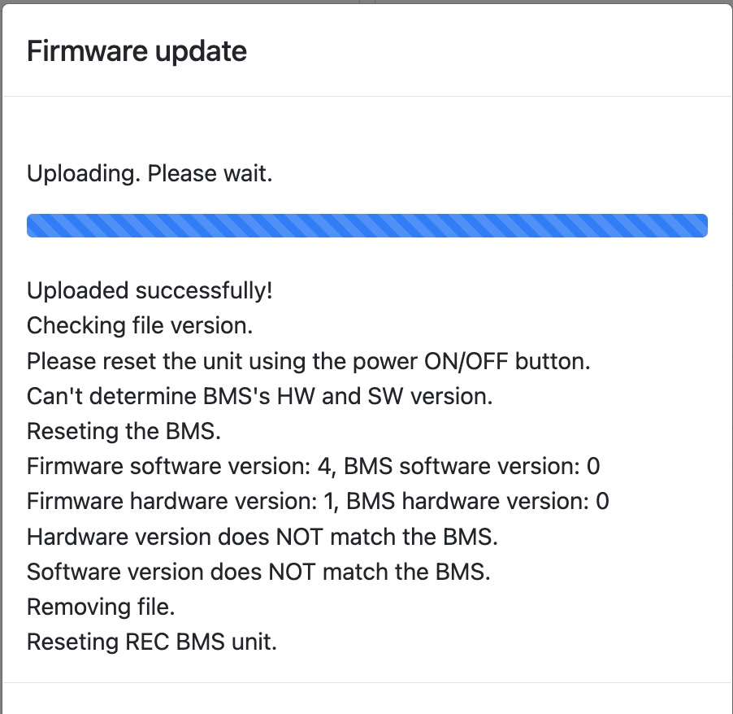
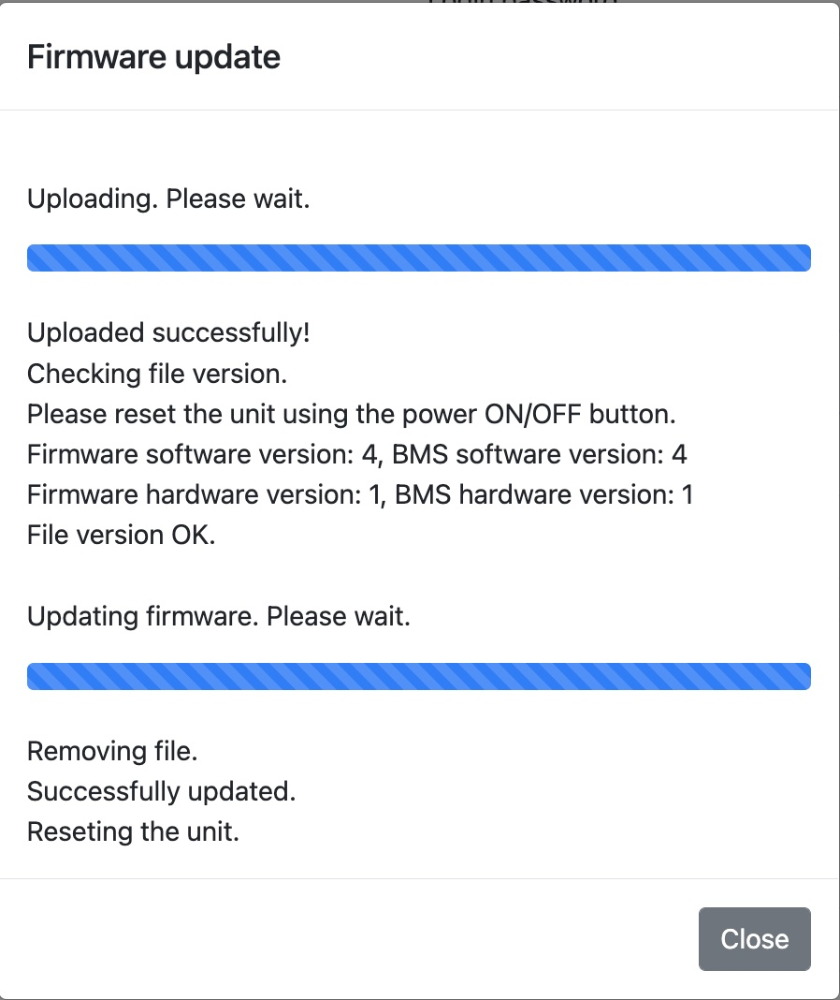

REC provided a [firmware update](bms_1Q_1845_end_voltage_drop_zero_curent.bin) that should provide the cycling behavior we desire.  Specifically, once the battery is full, all charging should stop and the battery should discharge until a given point until charging reverts to bulk.

Got a hardware/software mismatch message when resetting BMS.

Will try to reset with shorepower applied so router remains powered and connection to wifi module is maintained in case this is the problem.

This worked and update occurred successfully.

BMS Software version is now 2.8 (was 2.6).

Will run a shorepower charge to observe behavior at end of charge.  Recall SOCH is 0.15 so it should cycle down to 85% SOC prior to resuming a bulk charge.

2022-5-19
Based on emails from Tine, begrudginly set CHAR to 3.5V and MAXH to 0.15 (MAXC-CHAR).

5-27-2022
Terminated logging pi with a DTM connector to interface with wakespeed CAN and ring terminals for 12V power.
Unsolderd/Soldered logging pi for standard vs OBD2 can.

2022-5-29
Connected loggingPi to power, and verified accessible over SSH.

Connected wakespeed to Victron CERBO, removed Victron CAN terminator, and added wakespeed CAN terminator at wakespeed.

Connected loggingPI to wakespeed CAN via harness DTM connector.

Verified REC was still communicating with CERBO via the local web interface.

Verified loggingPI can read REC data over CAN using this script: https://github.com/natecostello/REC-BMS_CAN

