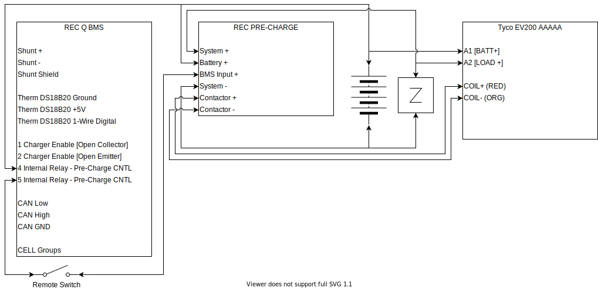

# REC Q BMS Wiring Logic

## Operation

**ON**

[REC Q BMS](http://www.rec-bms.com/datasheet/UserManual_REC_Victron_BMS.pdf) is always attached, Internal relay is normally closed. When Remote Switch (RS) is closed, Vbat is applied through internal relay, through RS, to [REC PRE-CHARGE](http://www.rec-bms.com/datasheet/UserManualPrechargeNew.pdf) (RPC) BMS+ Input. RPC Applies VBat via 66 ohm relay to load side of contactor via System + connection for a preset delay. After the preset delay, RPC energizes the main contactor coil continuously to close the main contactor. After one second, application of power via System+ is removed and all power flows to the system via the main contactor. 

**OFF**

When the RS is opened, or the REC Q internal relay is opened*, Vbat is removed from the RPC BMS+ input. The RPC will float its Contactor- output continuosly which deenergizes the main contactor coil and opens the main contactor.

**\*The following events result in the REC Q Internal Relay opening**

Cell Voltage High (cell over voltage switch-off + hysteresis)

Cell Voltage Low (cell under voltage protection switch-off + hysteresis)

Cell Temp High (cell over temp switch-off + hysteresis) 

Number of cells or BMS address is not set properly

Temperature sensor error (connection problem)

Cell Short Circuit or BMS measurement error

Main Relay is in short circuit

Current measurement disabled or > 2x shunt max current

Wrong Cell Chemistry Selected

Cell balancing or measurement failure

BMS internal comm failure

**Note:** The internal relay is NOT opened under Temperature Low (under temperature charging disable + hysteresis) conditions.  We will use charger enable signal to provide hardware backup protection of low temperature charging under loss of CAN conditions.

## Over Voltage Backup Protection

This is accomplished by opening the main contactor by the BMS via its internal relay.

## Under Voltage Backup Protection

This is accomplished by opening the main contactor by the BMS via its internal relay.

## Low Temp BackUp Protection

This is accomplished by disabling each charging source by the BMS via its charger enable opto-coupler.  The REC documentation describes the charger enable as open collector and open emitter, and also as an opto-coupler.  While this could be directly connected to a single component (e.g. MPPT), because it has to control mutliple devices, this signal should drive a relay or relays that will intern signal the component.

[These relay pcbs](https://www.amazon.com/HiLetgo-Channel-Module-Isolation-Support/dp/B00LW2H5GC?ref_=ast_sto_dp) could be used to drive the MPPT and Multiplus from the BMS charge enable opto-coupler.

### MPPT

From the 150/XX MPPT Manual

> **3.5 Remote on-off** 
>
> The left terminal is connected to the internal 3,3V supply, with a resistor in series for short circuit protection. The right terminal (marked as + or marked as H) will switch the controller on if >3V is applied, and will switch the controller off if <2V is applied or if the terminal is left free floating. The recommended use of the remote on-off is: 
>
> a. A switch wired between the left and right terminal 
>
> b. A switch wired between battery plus and the right terminal. 
>
> c) A switch between the right terminal and the charge disconnect terminal of a VE.Bus BMS

Connecting a NO relay between the left and right terminal that is energized (CLOSED) when the charger enable signal is provided by the BMS will provide low temp backup protection that is also protected from a broken wire.

### Multiplus

One possibility is to use the Charge current control assistant

**Another possibility is to use the Two-signal BMS support assistant.**   Select "The BMS has one contact which which switches only on a high-cell condition".   Then "The battery is full when [Aux_X] is [open/closed]".  Lastly "[Disable Charger] and [do not adapt SOC] when battery full."  Selecting "battery is full when [Temp_Sense] is [**open**]" and connecting [Temp_Sense] to a NO relay that is energized (CLOSED) when the charger enable signal is provided by the BMS will provide low temp backup protection that is also protected from a broken wire.

Note: The Multiplus Compact only has a temperature sense input, no aux inputs.  Low Temp BackUp protection will depend on being able to use this temperature sense input to support a charge enable control via the assistant.  I have [asked the question here](https://community.victronenergy.com/questions/76757/can-the-multiplus-compact-temperature-sense-input.html).  If the response is negative, I will likely shift the 3KVA Multiplus inspite of its additional parasitic load (20W vs 11W) and slightly higher cost.

### Alternator/Wakespeed

The wakespeed does have its own battery temperature sense that can be used to limit low temperature charging with programmable setpoints.  Importantly, it will override any outside direction based on its own sensor.  From the [Wakespeed WS500 Communication and Configuration Guide](http://wakespeed.com/Wakespeed%20%20Communications%20and%20Configuration%20Guide%20v2.3.0.pdf):

>**Min Charge Temp:**  If the battery drops below this temperature, charging will be disabled. Once temperature rises above Min Charge Temp, a new charge cycle will start. 

>**Max Charge Temp:**  If the battery reaches this temperature, the system will be disabled to protect it. If the battery temperature continues to rise, the system will eventually FAULT when battery temperature exceeds Max Charge Temp by 20%. 

>Note that Min and Max Temp limits will override any outside direction the WS500 regulator received; even if a CAN connected BMS is asking for charging, if either of these hard stop limits are exceed the regulator will enter Disabled mode.

Also important is its response to loss of sensor and loss of comms:

> **BTemp:** Measured temperature of NTC sensor attached to B-port in degrees C or battery temperature received via external CAN sensor. -99 indicates temperature has not been measured, NTC sender has failed, not attached, and there is no remote temperature information available via the CAN connection.

However, if backup protection coordinated by the BMS is desire, the method below could also be used.

From the [Wakespeed WS500 Quickstart Card](http://wakespeed.com/Quick%20Start.pdf):

> **Feature In Wire (White)** Can be connected to a voltage source greater than 8.5 VDC to enable a range of selectable optional capabilities as detailed in the User’s Guide

From the [Wakespeed WS500 Quickstart Guide](http://wakespeed.com/WS500quickstartguide.pdf):

>**Function In –** The white 16-gauge Function In can be configured to provide a number of custom controls which can be activated by connecting the wire to >8.5VDC+ via a toggle or other ON/OFF type switch. In default mode, the Function In mode will enable equalize mode when the regulator is configured for lead acid batteries. When the WS500 is configured for LiFeP04 batteries (see DIP switch instructions), Function In will force the system to float.

The wakespeed in stand-along mode can be made to enter a Post-Float mode in which the charger is off but monitoring or a return to bulk.  In the [Wakespeed Configuration Utility Guide](http://wakespeed.com/CU/ConfigurationUtilityGuideWeb.pdf) by configuring the "Exit Duration" of the $CPF entry to a small non-zero number like '1' (looks like minutes), the WS500 will quickly exit float.  By configuring the "Exit Duration" of the $CPE entry to zero, equalization will be disabled.  The $CPP entry is used to configure Post-Float behavior.  Fully disabling the charger, and setting a Battery Voltage corresponding to a return to Bulk is possible. 

In any case, it will be desirable to implement safe behavior that occurs on a loss of CAN.  We will want a fall back standalone profile that eliminates float, and utilizes a very conservative charge profile (low bulk cutoff), if any charging at all.

TODO: This needs verification, but it appears that by custom configuring the Custom Profiles as identified above, on loss of CAN, that profile, selected by DIP switches, is used.  That behavior in conjuction with the **Feature In** would allow the BMS charger enable signal to disable alternator/Wakespeed charging.

TODO: Determine if **Function In** is active high or low.  Specifically, if >8.5V is present, does it force to float, or force to float when >8.5V is not present.  Based on a close read, and the github issue below, I believe this is active high, and will force to float when it is high.  

TODO: Determine which ground the **Function In** is referenced to.  Determine max input current draw of **Function In**.

NOTE: [This Github Issue related to Victron-Wakespeed integration is relevant to **Feature In.**](https://github.com/victronenergy/venus/issues/779)

### All Together

TODO: Since we need separate dry contacts or opto-couplers for two components, we will need a "splitter".  A starting place would be [this sparkfun opto-isolator breakout](https://www.sparkfun.com/products/9118).  TODO: Since we need a >8.5v DC 'wet' signal we will also need some conditioning.  Could possibly use the RBSLD inverter.

