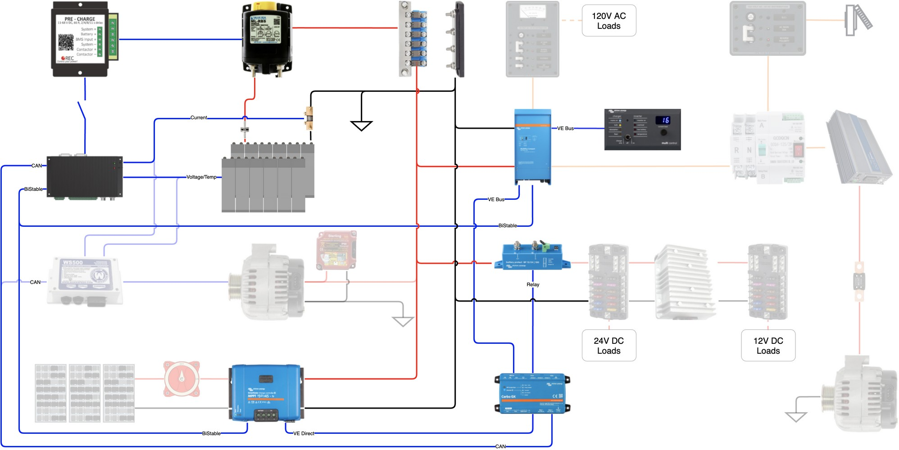

Compatibility testing consists of all testing that occurs prior to installation of the electrical system in the van.  Due to the methods used for initial battery charge and cell balancing, it includes those operations as well.

### High Cell Voltage Protection Checkout

#### Required Equipment

RIDEN 6018 Power Supply or Equivalent

UNI-T UT61E+ Digital Multimeter or Equivalent

Battery Cell Simulator (7 equal resistors and a pot in series, with taps around each)

#### Prequisites

None

#### Procedure

- [ ] Match the potentiometer value to equal the values of the 7 resistors.
- [ ] Connect the BMS to the Battery Cell Simulator treating each resistor and the pot as a cell.
- [ ] Attach the Digital Multimeter acrss the potentiometer to measure voltage.
- [ ] Apply 26V to the Battery Cell Simulator using the power supply.
- [ ] Turn on the battery by closing the switch between the BMS and the Precharge Unit
- [ ] Slowly increase the potentiometer resistance while monitoring voltage and the status of the BMS controlled main contactor and charge enable signal.
- [ ] Record the potentiometer voltage when the charge enable signal is removed.
	- Potentiometer Voltage: 
	- BMS Cell Low Voltage Setpoint:
	- Date/Time:
- [ ] Record the potentiometer voltage when the main contactor is opened.
	- Potentiometer Voltage:
	- BMS Cell High Voltage Setpoint:
	- Date/Time:

#### Acceptance Criteria

Potentiometer Voltage = BMS Cell High Voltage setpoint +/- 0.1V

### Low Cell Voltage Protection Checkout

#### Required Equipment

RIDEN 6018 Power Supply or Equivalent

UNI-T UT61E+ Digital Multimeter or Equivalent

Battery Cell Simulator (7 resistors and a pot in series, with taps around each)

#### Prequisites

None

#### Procedure

- [ ] Match the potentiometer value to equal the values of the 7 resistors.
- [ ] Connect the BMS to the Battery Cell Simulator treating each resistor and the pot as a cell.
- [ ] Attach the Digital Multimeter across the potentiometer to measure voltage.
- [ ] Apply 26V to the Battery Cell Simulator.
- [ ] Turn on the battery by closing the switch between the BMS and the Precharge Unit
- [ ] Slowly increase the potentiometer resistance while monitoring voltage and the status of the BMS controlled main contactor.
- [ ] Record the potentiometer voltage when the main contactor is opened.
	- Potentiometer Voltage:
	- BMS Cell Low Voltage Setpoint:
	- Date/Time:

#### Acceptance Criteria

Potentiometer Voltage = BMS Cell Low Voltage Setpoint +/- 0.1V

### Initial Battery Charge

#### Required Equipment

Multiplus Compact with 120VAC Power

UNI-T UT61E+ Digital Multimeter or Equivalent

Logging R-Pi

#### Prequisites

[High Cell Voltage Protection Checkout](#High-Cell-Voltage-Protection-Checkout)

[Low Cell Voltage Protection Checkout](#Low-Cell-Voltage-Protection-Checkout)

#### Procedure

- [ ] Verify all cells are within X volts of each other.
- [ ] Assemble the cells into the normal 2P8S configuration.
- [ ] Connect the BMS system including the precharge unit and main contactor.
- [ ] Connect the Multiplus Compact Inverter/Charger.
- [ ] Turn on the battery by closing the switch between the BMS and the Precharge Unit.
- [ ] Turn the Multiplus Compact on in Charger Only Mode.
- [ ] Configure the Multiplus Compact as follows:
	- Absorbtion Voltage = 
	- Maximum Charging Current = 
	- Float Voltage = 
	- BMS Assistant that secures charging upon removal of charge enable.
- [ ] Connect the Digital Multimeter across the battery to measure voltage.
- [ ] Connect the Logging R-Pi to log the Digital Multimeter and BMS CANBUS data
- [ ] Initiate Logging
- [ ] Apply 120VAC Power to the Multiplus
- [ ] Charge battery until the BMS interrupts charge
- [ ] Save all log files

### Initial Cell Balance

#### Required Equipment

RIDEN 6018 Power Supply or Equivalent

UNI-T UT61E+ Digital Multimeter or Equivalent

Logging R-Pi

#### Prequisites

[Initial Battery Charge](#Initial-Battery-Charge)

#### Procedure

Complete initial battery charge

Disconnect the BMS, precharge unit, and main contactor.

Remove all battery busbars.

Reconfigure the battery in the 16P1S configuration.

### Initial Battery Capacity Test

#### Required Equipment

#### Prequisites

#### Procedure

- [ ] Verify all cells are within X volts of each other.
- [ ] Assemble the cells into the normal 2P8S configuration.
- [ ] Install the BMS system including the precharge and main contactor.
- [ ] Connect the Multiplus Compact Inverter/Charger.
- [ ] Power and configure the Multiplus Compact.
- [ ] Charge battery until the BMS interrupts charge.
- [ ] Load the Multiplus to achieve a <= 1C discharge rate
- [ ] Discharge the battery until the BMS interrups discharge.

