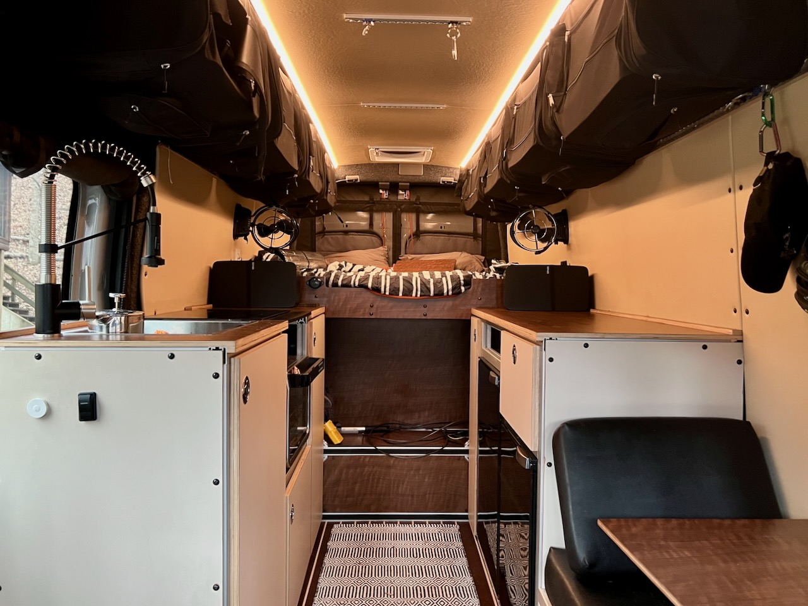

Welcome to another Greenstello production.  This website documents our design and build of Van 2.0 a.k.a. [Rusalka](https://en.wikipedia.org/wiki/Rusalka).

## Some History

Rusalka started as a dream sometime around 2015.  We  started looking at vehicle types that would allow us to spend more time, cheaply, at places that supported the outdoor activities we loved.  Potential vehicles were teardrops, scamps, casitas, and vans.

Over time, we gravitated towards a van as our ideal escape pod.  In 2017 we gave the idea a trial run.  We rented a Sportsmobile Sprinter conversion in Seattle and spent a week exploring the Columbia River gorge.  That experience convinced us that a van-based existence was right for us.  It also convinced us that we could probably do our own build.

We purchased a beater 2006 T1N the fall of 2017.  We spent about a year remediating rust and building it out.  We spent a few months after that bulletproofing the engine.  This was Van 1.0.  We spent the next few years as weekend warriors using the van at every opportunity.  Van 1.0 allowed us to develop the skills to convert a van and gave us a great sense of what sort of build works for us.  Unfortunately, Van 1.0's reliability (the engine - not the build) always left us anxious and limited our enjoyment.  It would never be the van that we could depend on for extended full-time living.

The design of Rusalka began as a Covid lockdown project in the Spring of 2020.  The van was ordered on 20 Janurary 2021 and delivered on 14 August 2021.  The primary build ran from delivery to the end of March 2022. We hit the road full time on 1 April 2022.

## Vehicle

* 2021 Ford Transit 148" EB HR 350 Cargo AWD (Body Code W3U)
* 3.5L EcoBoost Engine

This corresponds to the longest, tallest, highest load capacity, single rear wheel Transit available.

## Design Requirements

**Rusalka needs to comfortably accommodate two adults and two cats full time in primarily moderate climates punctuated by four season extremes.**  

Several requirements derive from this high level objective:

* Insulation.  We employ thinsulate, minicell, and neoprene
* Heat.  We use an Espar B4L
* Forced ventilation.  We installed a MaxxAir fan and two Sirocco internal fans
* Natural ventilation.  We have rear and slider Bug Wall screens and use [van upgrades window vents](https://vanupgrades.com/products/transit-van-cab-window-air-vent-inserts).
* Air conditioning.  We plan to install the Undermount AC system.
* Range and oven cooking.  We had a gas oven/range and then replaced it with an induction cooktop and Ninja Foodie XL.
* Refrigerator and freezer.  We installed a Vitrifrigo refrigerator and freezer.
* Water storage and dispensing.  We currently use two 5 gallon jerry cans and a 24V water pump.

It needed to support all of the above goals primarily off-grid.  We satisfied this goal with a 24V 560AH LFP electrical system with 800W of roof solar and a dedicated 24V alternator for rapid charge capability.

Additional requirements include:

* Adequate internet and communications capability to allow two adults to work remotely.  This was satisfied by a wifi-as-wan source, vehicle hotspot, and starlink.
* Ability to carry recreational gear for two recreational gearheads.  Substantial gear storage led us to a fixed raised rear bed as the optimal configuration.
* Capable of sand/beach and snow driving.  This means AWD. This also led to a lift and larger tires for both the large contact patches and ground clearance.  It also means carrying an air compressor and recovery boards.
* Resistant to oceanside environments.  This led to urethane coatings on all wood, corrosion resistant fasteners, and marine-rated active electrical components and tin or nickel plated passive electrical components.
* Capable of transporting a "dinghy" vehicle(s) like e-bikes.  Our solution for this is Aluminess rear door carriers plus two 1-up bike racks. 

Lastly, some things that we don't need:

* An internal shower.  We positioned the sink faucet adjacent to the sliding door to allow outdoor showering.  Otherwise paid/campground showers would be used.
* A dedicated toilet.  We use portable urinals, campground facilities, and cat holes when in the backcountry.  An emergency toilet is carried for emergencies.  

_This is a completed shot of Rusalka's interior.  Someday we'll replace this with a proper tour video._

## About This Site

The "Blog" section of this site is primarily concerned with the actual build process and implementation of our design.  

All other categories/sections are generally focused on design.  

That "other" content began as design musings captured in markdown format, sketchup, and drawio schematics contained in a github repo starting in the spring of 2020.  Much later we worked to finesse that information into a website form.  As a result pockets of information no longer accurate or badly organized, a problem we're working to correct over time.  If you see something confusing, inconsistent or incorrect, let us know and we'll prioritize fixing it.

There is also information not captured in the site at all.  We'd encourage you to looked at the github repo itself if you want to see it all.

We never intend to use affiliate links to avoid any conflict on recommending or sourcing products.  If you see what looks like one, it was accidentally copied from another source.  Point it out and we'll fix it.

