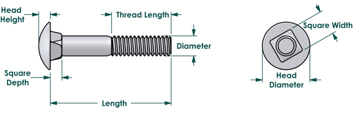

Most builds use 15 series 8020, however 10 series would provide benefits to cost, arrangable volume, and weight if acceptable.  Areas that require evaluation are floor mounting feasibility, deflection of unsupported bed spans, catalog fastener compatibility, and cabinetry compatibility.  Also should consider pull-out for joints as the ligaments are much thinner with 10 series.

### Weight Comparison

### Cost Comparison

### Bed Span Deflection

The unsupported span under the bed is 50.6 inches.  The following design worst case will be used: One 175 lb person sitting on the edge of the bed in the center of the span, applied as a point load.  Ends of 8020 are "fixed".

For 10 series (1010), deflection is 0.2651 inches.

For 10 series (1020), deflection is 0.0384 inches.

For 15 series (1515), deflection is 0.0441 inches.

the following nominal case will be used (considering some sharing among the multiple beams):  One 175 lb person with thier load split between two beams, applied as point load.  Ends of 8020 are "fixed".

For 10 series (1010), deflection is 0.1342 inches.

For 15 series (1515), deflection is 0.0242 inches.

All of these cases are conservative as the mattress, and underlayment would do a fair amount of load distribution.  Even so, I believe the displacements above are acceptable.

### Catalog Fastener Compatibility

The 8020 Drawing for 10 series shows a slot opening of 0.256 inches.  Based on fastenal and some other sources, 1/4-20 carriage bolts have min and max square width of 0.245 inches and 0.260 inches respectively.   Therefore an interference of 4 mils is possible (literally a hair too big).  A prototype will be used to see if this is a problem and how difficult any workarounds are.

Just for comparison:

