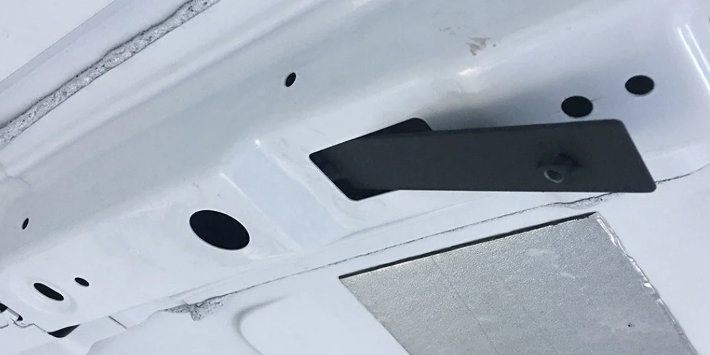
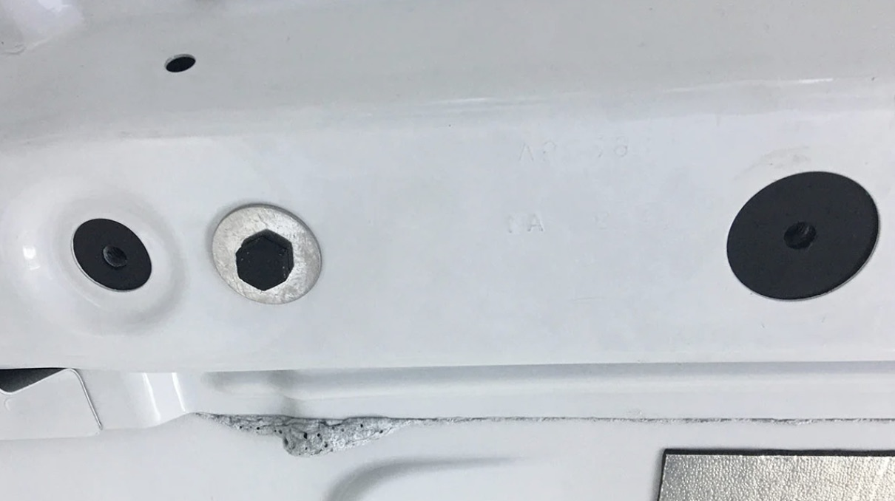
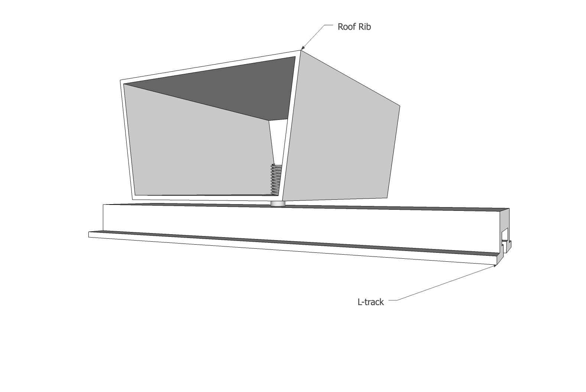
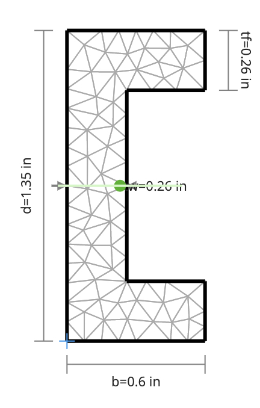

# Ceiling L-Track Mounting

Following are design concepts for mounting the L-Track to the ceiling ribs.

## Carryingforks Method

User [carryingforks](https://www.fordtransitusaforum.com/members/carryingforks.91576/) on the transit forum used the following method to mount his ceiling L-track: 

[https://www.fordtransitusaforum.com/threads/poll-adventure-wagon-l-track-mounting-kit.82035/post-1066928](https://www.fordtransitusaforum.com/threads/poll-adventure-wagon-l-track-mounting-kit.82035/post-1066928).

Of note is the use of a captive-nut-bar used inside the ribs.  This is an enabler in some of the options below.

## L-Track Only

This option borrows from the method used by Carryingforks described in the link above.  Specifically it uses the captive-nut-bar inserted into the ribs.  This will allow use of the large hole at 11" from the wall which otherwise would not support a fastening point.  Unlike the Carryingforks method and the channel steel method used in Van 1.0 no intermediate structural element is used.  At the rib the L-track is bolted to the captive-nut-bar inside the rib.  A FR4 spacer (minimum 1/8") will provide a thermal break between the L-Track and the rib.  Thin flat aluminum will be fastened to the back of the L-Track to provide a channel to retain the roof panel edges.

### Negatives

This is the weakest method evaluated.  We also must evaluate how will will join L-track if pieces of sufficent length are not available to span the entire ceiling length.  This may necissitate using one of the alternative methods at least in part.  TODO: EVALUATE JOINING/REQUIRED LENGTH (129ish inches).

### Positives

This is the simplest method.  This is the lightest method.  Based on the analysis below, this method is probably sufficient.

### Analysis

Calculations used [clearcalcs.com](https://clearcalcs.com/freetools/free-moment-of-inertia-calculator/us).  The moment of inertia used below is conservative.  It approximates the L-Track as a peice of channel and doesn't take into account the flanges on the face.

Iyy = 0.0143 in4

E = 10000 ksi

Max Span = 39"

​	Point Load of 75 lbf at half span

​	Pinned, Max Deflection = 0.648 in

​	Clamped, Max Deflection = 0.162 in

​	Point Load of 50 lbf at half span: Assume 50 lb load in each duffle, 1/2 load on ceiling L-track, 1/2 load on wall, load on ceiling falls at center of longest span, 2G vertical for bumps.

​	Pinned, Max Deflection = 0.432 inc

​	Clamped, Max Deflection = 0.108 in

Bed Area Max Span: 22.5"

​	Point Load of 75 lbf at half span

​	Pinned, Max Deflection = 0.125 in

​	Clamped, Max Deflection = 0.0311 in

​	Point Load of 50 lbf at half span: Assume 50 lb load in each duffle, 1/2 load on ceiling L-track, 1/2 load on wall, load on ceiling falls at center of longest span, 2G vertical for bumps.

​	Pinned, Max Deflection = 0.083 in

​	Clamped, Max Deflection = 0.0207 in

## Rectangle Under Rib Mount

This option builds on the method used by Carryingforks described in the link above.  Specifically it uses the captive-nut-bar inserted into the ribs.  This will allow use of the large hole at 11" from the wall which otherwise would not support a fastening point.  Also like the Carryingforks method and the channel steel method used in Van 1.0 it will use a structural interface between the L-Track and the rib/captive-nut-bar.  Distinct from those two methods, it will use 1/8" wall rectangular tube.  In the locations of the ribs, three sides of the tube will be machined away.  At the rib the L-track and tube (bar at that location) are bolted to the captive-nut-bar inside the rib.  A FR4 spacer (minimum 1/8") will provide a thermal break between the tube and the rib.  In non-rib areas the L-track will bolt to the aluminum tube.

### Negatives

The weakness of the aluminum tube in the rib region must be evaluated.  While the tube provides significantly more structure in all other regions, the 1/8" ligament near the rib is weaker and more flexible than the 1/4" flat bar used by carryingforks.

### Positives

By using the captive-nut-bar which will be indexed to other tighter tolerance holes in the rib, the location of the mounting point for the L-track/tube are fairly tightly controlled compared to marking/punching/drilling new holes in the ribs.  This could be somewhat mitigated by the appropriate jig.

This method avoids and need to work around the sloping faces of the rib that face fore and aft.

## Rectangle Side Rib Mount

This option uses obtuse angle brackets that mount to the sides of ceiling ribs.  Lengths of rectangle are fastened to the brackets and span the length betwen the ribs.  L-Track is fastened to plus-nuts installed in the rectangle.  An FR4 spacer will proved a thermal break between the bracket and rectangle.

### Negatives

This is the most difficult to install mounting method.  Fabrication of the brackets with the precise obtuse angle to match the faces of the ribs will be difficult.  Precisely locating the brackets will also be difficult and will require some sort of jig indexed off other features in the rib.

### Positives

This is likely the strongest mounting method.

