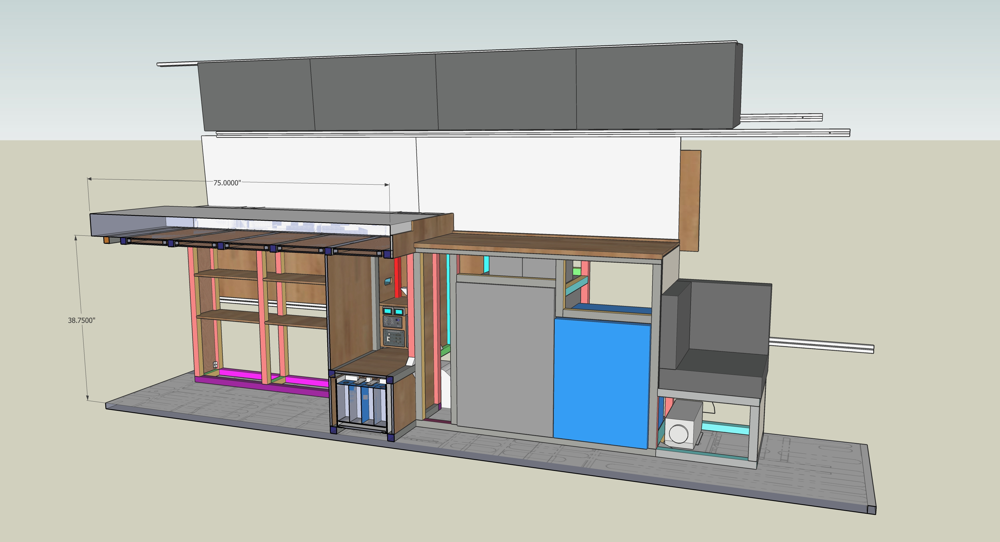
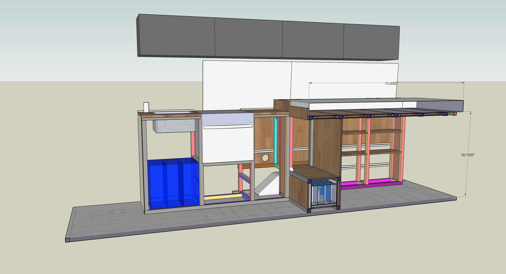

Our internal arrangement went through 12 major concepts and more minor iterations than we can count.  These changes were painless to implement because of the tool we employed.

Our primary tool for arrangement was SketchUp Make 17 (the free version), a carry over from Van 1.0.  We highly recommend a digital model based approach but it is critical to be disciplined about accuracy.  Once you have an accurate model, that becomes your reference for future panel cuts, structure, etc.  It's a fantastic way to work.

Early in 2020, we scoured the internet for transit cargo dimensions for our initial concepts.  In September of 2020 we went to a dealer and spent an afternoon with a tape measure, note pad, and camera phone to record all the relevant dimensions of the interior and underbody.  There is a link to all of these resources at the end of this article.  

We translated these dimension into a blank SketchUp Transit model and then verified that our concept fit.  There are links to the blank transit model and the full model with our interior design at the end of this article.

The most important vehicle datums for doing the layout are the the B-Pillar bump outs, the sliding door opening, the C-Pillar bump outs, the D-Pillar bump outs, and the rear door position.  If you have these dimensions, you can design a driver side and passenger side arrangement with confidence.  Cross members between these two structures can then be determined/cut to length in situ.

We had a pretty good idea from Van 1.0 what we wanted.  This dictated the general layout.  As we settled on specific equipment (e.g. the brand and model of the refrigerator), those constraints were factored in.  Specifically we'd create models for each appliance and introduce those into the existing concept and modify as necessary.  Upon physical receipt of the components we'd carefully measure, and update the component model overall arrangement model as needed.

We think the easiest way to describe where we ended up is to state our initial characteristics/requirements and then develop the arrangement as a constraint propagation problem.  So starting with the easiest constraint, we wanted a design with:

1. A platform bed, full size width or larger, in a north-south rear-of-van arrangement.  Acceptable designs will feature a mattress surface low enough to allow us to sit upright in bed comfortably.

To satisfy "1", a natural place to end the bed/garage structure was at the forward edge of the flat top of the wheel well "trapezoid".  This yields a bed length that can accommodate a full-size mattress or queen-size with some trimming.  This set the rear boundary of the galley area.

Adding a few more constraints related to the Galley:

2. A port and starboard galley with a center isle.  Each galley side width will be dictated by the deepest component on that side.  Acceptable designs will have a center wide enough for the two of us to move past each other and to move in and out any components for install/replacement/service.

3. A booth seat on the driver side that sits opposite the driver seat in its swiveled position.  Occasionally we host a fellow camper for meals or drinks in rough weather so we wanted to comfortably seat three for food and drink.  

4. The passenger side galley would be built overlapping the sliding door opening but had to leave room for a "reasonable" opening. We didn't have a hard number for how much, but knew we needed at LEAST 24" to comfortably enter and exit through the slider.

To achieve "2", "3", and "4", we knew we needed to keep the length and depth of both sides of the galley as short and shallow as possible while accommodating the appliances and structure.

Adding constraints/requirements:

5. A sink with a sprayer faucet located on the passenger side in the area where the counter overlaps the sliding door opening.  The intent is to allow the faucet to double as an outdoor shower.  We selected the Ikea NORRSJON Small sink based on Van 1.0 and our desire to keep a full size sink.

6. A simple "cold" only water system that will be housed under the sink, and will be accessible from the outside with the sliding door open for filling.  We selected three 5-gallon jerry cans as the "tank".  This is a significant simplification from Van 1.0 which featured hot water and a rear outdoor shower.  We decided those features were unneeded (we really never used any of that) and resulted in more plumbing and failure points.

7. All structure would be fabricated from 15 series 8020.

"2", "5", and "7" combine to set the end of the passenger side galley.  Specifically, we take the sink width and locate the faucet/sprayer adjacent in order to minimize depth to satisfy "2".  We add structure on either side as this section will contain heavy stuff per "6".  We note this structure has to sit forward of the C-Pillar bump out to satisfy "2" and "5".  We add some margin to make sure our counter, with holes for the sink and faucet, has decent ligament.  We also add 0.25" and for skin on the forward side.

All this yields a slider opening of 29" meaning we can satisfy "4" and have margin.  The resulting cabinet also has room for the three jerry cans (19.5") inside satisfying "6".

Adding more constraints:

8. The galley will include a propane oven/range as close to the slider as possible for ventilation while cooking.  All the products we were considering (dometic, greystone, furrion) had similar install width (20.25") and depth (17.75") dimensions.  We ultimately selected the Greystone as discussed [here](/van/functional/cooking/oven).

This one is easy.  The oven's height will allow it to sit adjacent to the sink cabinet and clear the C-Pillar bump out (only present in the lower 18" or so).  The oven will have 8020 behind it forming a continuous long structural member.  We did this since the 8020 on the interior passenger side had to be broken to accommodate the oven.  This structure plus the oven depth sets the depth of the passenger side galley.  Placing the oven here gives room for a healthy sized drawer or cabinet under it, and a decent width cabinet aft of it.  It also keeps the range as far from the bedding as possible.  It also means the fridge and freezer have to go on the driver side.

9. The galley will include a fridge and freezer.  The fridge would be at least 130L matching what we had for Van 1.0.  We ultimately selected a Vitrifrigo 130L fridge and 55L freezer for reasons discussed [here](/van/functional/refrigeration/refrigerator).

With the sink and stove arranged, the fridge and freezer must go on the driver side.  There is only one place for the fridge to go to satisfy "2" and minimize depth.  It can tuck between the driver side C-Pillar bump out and the forward edge of the wheel well with just enough room for a vertical 8020 member adjacent.  Thus the fridge sets the depth of the driver side galley.  To minimize the driver galley length, the 8020 vertical support is located on the forward side of the fridge.  Because the freezer isn't as deep as the fridge it can sit directly adjacent on the forward side of the fridge without interference from the C-Pillar bump out or the 8020 vertical piece.  Adding the required 8020 structure on the forward side of the freezer sets the driver side galley structure length at 50.75".

We can now revisit the booth design and constraint "3".  We did some googling on booth dimensions and dining seating and found that the average depth of a dining seat is 16-18".  We set our booth seat structure depth at 18.5" which allows for a back cushion to brings us into the normal range.  This also puts the area between the edge of the booth seat and the B-Pillar (roughly the edge of the driver seat when swiveled) at 19.75" which we concluded is enough knee room for two adults sitting facing each other.  Thus constraint "3" is satisfied and the driver and passenger galley are arranged and their lengths are set.

[introduce constraint on unbroken 8020 lengths. and how that sets height of counter and garage/bed structure].

10. To the maximum extent practical, heavy fixed components/appliances would be arranged such that the port and starboard weights are equal.

[discuss how this sets battery and electrical arrangement]

"4", "5", "6", and "10" combine to set the location of the forward edge of the passenger side galley.  We take the dimensions of 3 jerry cans side by side, with 1.5" structure on either side and note that this has to sit forward of the C-Pillar bump out to satisfy "4".  This with some skin and bolt heads on the forward side (0.25") gives a slider opening

The booth seat will house the Espar heater and additional general storage.  Acceptable designs will all two average height adults to sit opposite of each other without too much knee knocking.

* Overhead storage would be slightly modified duffle-bags attached to wall and ceiling L-track, similar to what we did with Van 1.0.

* The electrical system will include a 16x280AH cell lithium battery that will be positioned as close to the long centerline and to the rear axle as practical.

* Electrical controls like breakers, inverter mode, and meters would be accessible from the interior but not prominent.  This was a departure from Van 1.0 that required opening the rear doors to access the electrical system.

  

 
Maximizing ease of assembly and free standing integrity of the 8020 led to some subtle additional constraints:

First, a continuous length of 8020 at the interior base of the port and starboard galley was desirable since the exterior base would be broken up to vehicle interferences.  Second, a continuous length of 8020 at the exterior top structure that runs from the bed area to the end of the galley sides was desirable since the interior top would be broken up do to arrangement limitations.

These two constraints dictated both the counter and bed structure height.  Specifically, the stackup of the base 8020, the fridge, and the fridge compressor set the height of the galley structure.  Since the top of the galley structure shares its top exterior piece of 8020 with the bed/garage, the bed/garage structure height is set also. 

