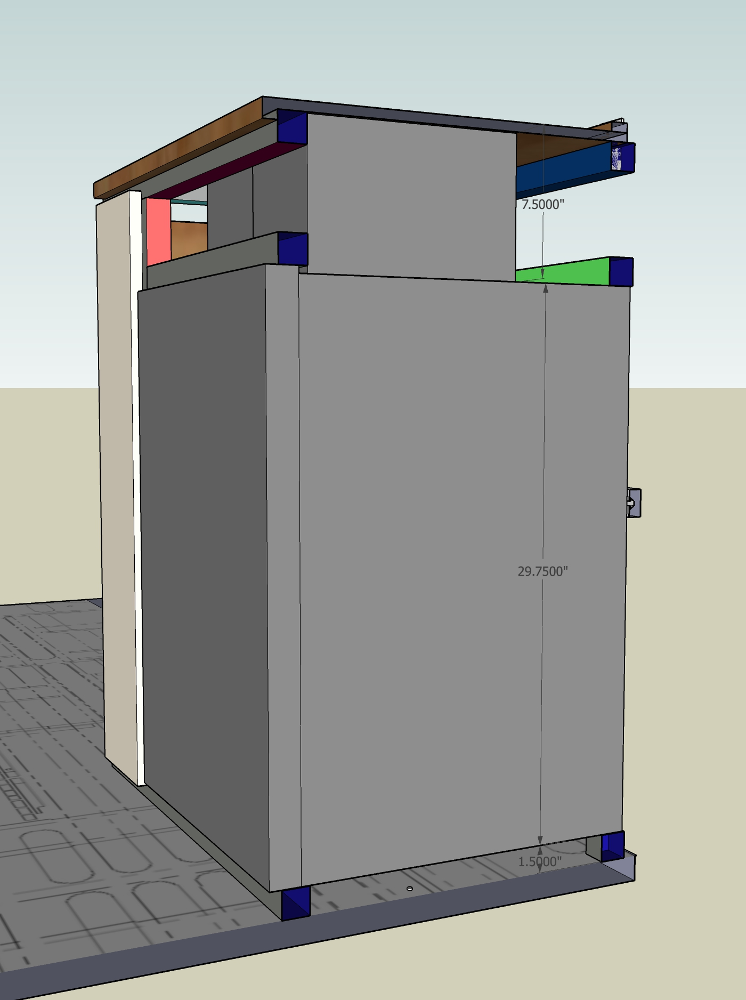

This is going to be way too detailed for the casual reader but we did want to capture our process and logic as it may help others.  If you are designing a van read on, if you aren't, maybe look at the pictures and move on.

Our internal arrangement went through 12 major concepts and more minor iterations than we can count.  These changes were painless to implement because of the tool we employed.

Our primary tool for arrangement was SketchUp Make 17 (the free version), a carry over from Van 1.0.  We highly recommend a digital model based approach but it is critical to be disciplined about accuracy.  Once you have an accurate model, that becomes your reference for future panel cuts, structure, etc.  It's a fantastic way to work.

Early in 2020, we scoured the internet for transit cargo dimensions for our initial concepts.  In September of 2020 we went to a dealer and spent an afternoon with a tape measure, note pad, and camera phone to record all the relevant dimensions of the interior and underbody.  There is a link to all of these resources at the end of this article.  

We translated these dimension into a blank SketchUp Transit model and then verified that our concept fit.  There are links to the blank transit model and the full model with our interior design at the end of this article.

The most important vehicle datums for doing the layout are the the B-Pillar bump outs, the sliding door opening, the C-Pillar bump outs, the D-Pillar bump outs, and the rear door position.  If you have these dimensions, you can arrange each side with confidence.  Cross members joining the two sides can then be determined/cut to length in situ/as built.

We had a pretty good idea from Van 1.0 what we wanted.  This dictated the general layout.  As we settled on specific equipment (e.g. the brand and model of the refrigerator), those constraints were factored in.  Specifically we'd create models for each appliance and introduce those into the existing concept and modify as necessary.  Upon physical receipt of the components we'd carefully measure, and update the component model overall arrangement model as needed.

_On the driver side we have the inverter/charger and MPPT (hidden by garage bulkhead, electrical controls and fuses, fridge, freezer, the espar heater, and a booth seat._

_On the passenger side we have the oven/range, water storage, the sink, and faucet._

## Arrangement

We think the easiest way to describe where we ended up is to state our initial characteristics/requirements and then develop the arrangement as a constraint propagation problem.  So starting with the easiest constraint, we wanted a design with:

1. A platform bed, full size width or larger, in a north-south rear-of-van arrangement.  Acceptable designs will feature a mattress surface low enough to allow us to sit upright in bed comfortably.

To satisfy "1", a natural place to end the bed/garage structure was at the forward edge of the flat top of the wheel well "trapezoid".  This yields a bed length that can accommodate a full-size mattress or queen-size with some trimming.  This set the rear boundary of the galley area.

Adding a few more constraints related to the Galley:

2. A port and starboard galley with a center isle.  Each galley side width will be dictated by the deepest component on that side.  Acceptable designs will have a center wide enough for the two of us to move past each other and to move in and out any components for install/replacement/service.

3. A booth seat on the driver side that sits opposite the driver seat in its swiveled position.  Occasionally we host a fellow camper for meals or drinks in rough weather so we wanted to comfortably seat three for food and drink.  

4. The passenger side galley would be built overlapping the sliding door opening but had to leave room for a "reasonable" opening. We didn't have a hard number for how much, but knew we needed at LEAST 24" to comfortably enter and exit through the slider.

To achieve "2", "3", and "4", we knew we needed to keep the length and depth of both sides of the galley to be as short and shallow as possible while accommodating the appliances and structure.

Adding constraints/requirements:

5. A sink with a sprayer faucet located on the passenger side in the area where the counter overlaps the sliding door opening.  The intent is to allow the faucet to double as an outdoor shower.  We selected the Ikea NORRSJON Small sink based on Van 1.0 and our desire to keep a full size sink.

6. A simple "cold" only water system that will be housed under the sink, and will be accessible from the outside with the sliding door open for filling.  We selected three 5-gallon jerry cans as the "tank".  This is a significant simplification from Van 1.0 which featured hot water and a rear outdoor shower.  We decided those features were unneeded (we really never used any of that) and resulted in more plumbing and failure points.

7. All structure would be fabricated from 15 series 8020.

"2", "5", and "7" combine to set the end of the passenger side galley.  Specifically, we locate the sink width-wise with the faucet/sprayer adjacent and forward in order to minimize depth to satisfy "2" and provide the shower function of "5".  We add structure on either side as this section will contain heavy stuff per "6".  We note this structure has to sit forward of the C-Pillar bump out to satisfy "2" and "5".  We add some margin to make sure our counter, with holes for the sink and faucet, has decent ligament. 

All this yields a slider opening of 29" meaning we can satisfy "4" with margin.  The resulting cabinet also has room for the three jerry cans (19.5") inside satisfying "6".  We ultimately consumed some of the margin to allow us to tuck the water pump forward of the sink directly under the counter top to maximize useful space in this cabinet.

Adding more constraints/requirements:

8. The galley will include a propane oven/range as close to the slider as possible for ventilation while cooking.  All the products we were considering (dometic, greystone, furrion) had similar install width (20.25") and depth (17.75") dimensions.  We ultimately selected the Greystone as discussed [here](/van/functional/cooking/oven).

This one is easy.  The oven's height will allow it to sit adjacent to the sink cabinet and clear the C-Pillar bump out (only present in the lower 18" or so).  The oven will have 8020 behind it forming a continuous long structural member.  We did this since the 8020 on the interior passenger side had to be broken to accommodate the oven.  This structure plus the oven depth sets the depth of the passenger side galley.  Placing the oven here gives room for a healthy sized drawer or cabinet under it, and a decent width cabinet aft of it.  It also keeps the range as far from the bedding as possible.  It also means the fridge and freezer have to go on the driver side.

9. The galley will include a fridge and freezer.  The fridge would be at least 130L matching what we had for Van 1.0.  We ultimately selected a Vitrifrigo 130L fridge and 55L freezer for reasons discussed [here](/van/functional/refrigeration/refrigerator).

With the sink and stove arranged, the fridge and freezer must go on the driver side.  There is only one place for the fridge to go to satisfy "2" and minimize depth.  It can tuck between the driver side C-Pillar bump out and the forward edge of the wheel well with just enough room for a vertical 8020 member adjacent.  Thus the fridge sets the depth of the driver side galley.  To minimize the driver galley length, the 8020 vertical support is located on the forward side of the fridge.  Because the freezer isn't as deep as the fridge it can sit directly adjacent on the forward side of the fridge without interference from the C-Pillar bump out or the 8020 vertical piece.  Adding the required 8020 structure on the forward side of the freezer sets the driver side galley structure length at 50.75".

We can now revisit the booth design and constraint "3".  We did some googling on booth dimensions and dining seating and found that the average depth of a dining seat is 16-18".  We set our booth seat structure depth at 18.5" which allows for a back cushion to brings us into the normal range.  This also puts the area between the edge of the booth seat and the B-Pillar (roughly the edge of the driver seat when swiveled) at 19.75" which we concluded is enough knee room for two adults sitting facing each other.  Thus constraint "3" is satisfied and the driver and passenger galley are arranged and their lengths are set.

One final constraint/requirement:

10. To the maximum extent practical, heavy fixed components/appliances would be arranged such that the port and starboard weights are equal.

So far we had similar structural weight on each side of the van.  On the passenger side we had about 170 lbs between the water and stove/oven.  On the driver side we had 120 lbs for the fridge and freezer.  Remaining heavy items were the battery (218 lbs), a full propane tank (70 lbs), and the inverter/charger and MPPT (50 lbs).  We centered-ish the battery between the wheel wells (aside from balance, over the rear axle is a really good location for something this heavy).  We also centered the propane tank under the van.  By installing the inverter/charger and MPPT on the driver side we balanced things about as good as one can, satisfying "10".  It was the inverter/charger (Multiplus 3000) that set the depth of the shelf/structure on the driver side of the garage area.  We carried that dimension to the passenger side so the 8020 structure was identical.

## Structural Optimization

As we began to design the structure to support the arrangement outlined above, a few problems reared.  On the driver side galley, we did not like the structure that resulted with the fridge and freezer adjacent and sitting directly on the floor while accommodating all the van constraints (wheel wells and C-Pillar bump out).  It wasn't structurally robust without being fastened to the van walls and floor in many locations.  We raised the fridge and freezer 1.5 inches to allow for a continuous piece of 8020 along the bottom, as well as some additional reinforcement.  This resulted in a structure that was more rigid free standing, rather than depending on fastening to the van for its strength.  This made assembly and squaring outside of the van much easier.  It also provided more flexibility on locations to through bolt to the van floor.

_The left image is what we did.  The right is what the structure would have looked like if we didn't raise the fridge and freezer._

The fridge position also set the overall galley and counter top height.  We positioned the compressors for the fridge and freezer on top of the fridge as this was the most efficient use of volume and would allow a large deep drawer on top of the freezer.  The lower structure, the fridge, and the compressors set the galley structure height at 38.75".  This meant our counter top, which would use 1/2" plywood was 39.25" high.  We debated this a fair amount.  Standard counters are 36".  We did some mockups to get a feel for a workspace at that height.  It felt comfortable.  Almost a year in we are convinced that the world is wrong, and counter tops should be about 3" higher everywhere.

It turns out 38.75" also satisfied our bed height requirement from constraint "1" with the mattress thicknesses we were looking at (6-8").  By using the same height in the galley and bed/garage area had some pretty solid benefits:

* The vast majority of vertical 8020 elements would be the same length.

* We could employ long single pieces of 8020 that run the entire length of the bed/garage and galley structure at the upper out-board edge of the structure.  This tied each side of the structure together and made assembly and movement into the van much easier.

_By setting the bed/garage structure height to match the galley we could use a single long piece of 8020, shown in teal, to tie the structure together on both the driver and passenger side._

Thats it.  Arrangement done.

## Secondary Factors

There were a other goals/design/features that we had in mind but they didn't drive the arrangement explicitly, but for completeness we'll list them:

* We wanted unbroken sight lines from the front to back.  This meant no appliance or structure poking above the bed/counter (e.g. a stacked fridge/freezer).  This was similar to our Van 1.0 arrangement, and we liked it.  It also allows a good sound stage from our sonos speakers siting on the counters.  It was primarily an aesthetic choice.  We'd revisit it if we were working in a shorter length van.

* Overhead storage would be slightly modified duffle-bags attached to wall and ceiling L-track, similar to what we did with Van 1.0.

* Electrical controls like breakers, inverter mode, and meters would be accessible from the interior but not prominent.  This was a departure from Van 1.0 that required opening the rear doors to access the electrical system.

## Useful Resources

[This section of our github repository](https://github.com/natecostello/van_two_point_oh/tree/master/van/reference/vehicle_dimensions) contains several cargo dimension related documents we found on the internet and proved useful for initial arrangement.

[This subdirectory](https://github.com/natecostello/van_two_point_oh/tree/master/van/reference/vehicle_dimensions/manual_measurements) of the above repo area has all of our dimension notes from our manual measurements we did at a dealer on a 2020 extended high roof transit.  It also includes a subdirectory of all of the photos we took (most featuring a tape measure for scale).

The empty model based on our manual measurements is available [here](https://github.com/natecostello/van_two_point_oh/blob/master/van/architectural/Transit_Dimensions_measured.skp).

Our full model, which we still use and modify to this day, is available [here](https://github.com/natecostello/van_two_point_oh/blob/master/van/architectural/Transit_Layout_3D_2.0.skp).

## Closing Thoughts

One of us spent two decades doing submarine design.  Arrangements were a big part of it.  The process of iterating a 3D model with increasingly defined models for components and structures, punctuated by design reviews with all stakeholders and physical mockups, is pretty much the same.  Its a tried and true method that we'd recommend.