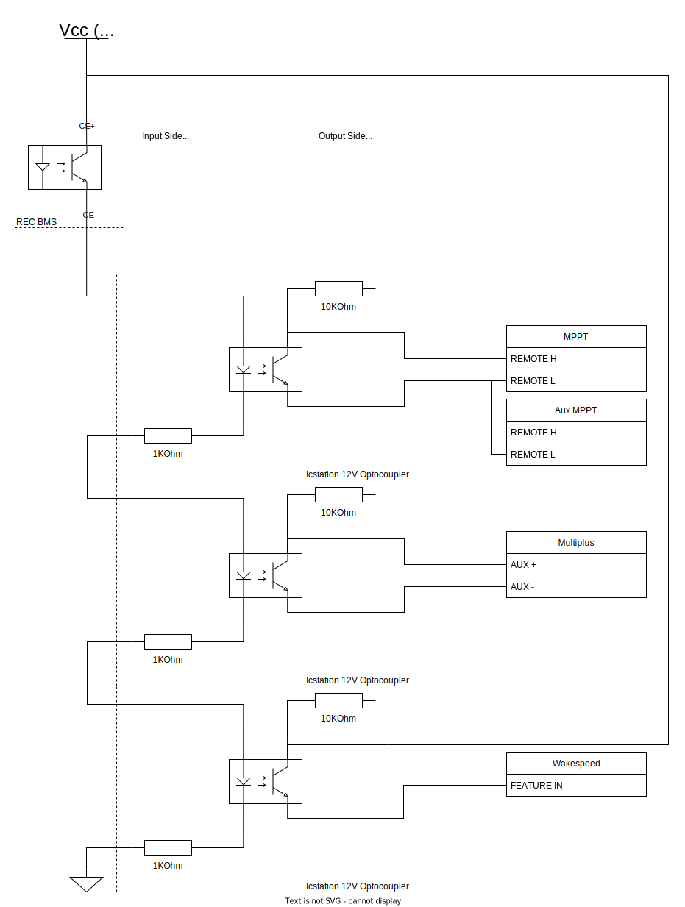

**This is our third revision of the BMS Wiring and Logic.  It reflects our pivot to the TYCO Tyco EV200HAANA as our Main Contactor.  It also reflects our selection of the Multiplus 3KVA inverter charger.**


## Operation

**ON**

[REC Q BMS](http://www.rec-bms.com/datasheet/UserManual_REC_Victron_BMS.pdf) is always powered, Internal relay is normally closed*. When Blue Sea 2155 Remote Control Switch (RS) is closed (PIN 2 connected to PIN 3), Vbat is applied through the RS, through the internal relay, to [REC PRE-CHARGE](http://www.rec-bms.com/datasheet/UserManualPrechargeNew.pdf) BMS+ Input. REC PRE-CHARGE Applies VBat via 66 ohm internal resistor to the load side of the Tyco EV200HAANA (Main Contactor) via System+ connection for a preset delay. After the preset delay, REC PRE-CHARGE energizes the Main Contactor control inputs causing it to close. After one second, application of power via System+ is removed and all power flows to the system via the Main Contactor.  

Note, REC PRE-CHARGE [manual](usermanualprechargenew_timeset.pdf) states:
>At system start up the REC Q BMS activates the charging procedure by powering the pre-charge unit. The pre-charge unit closes the power circuit through its internal relay (RELAY ON). The inrush current flows entirely through the precharge 66 Ω internal resistor. After set delay the transient current should be decrease to a safe value. The pre-charge energizes the contactor coil through open collector circuit and after 1 second opens the internal relay (RELAY OFF). All of the system current now passes through the contactor. Normal system operation is achieved. 

**OFF**

When the RS is opened, or the REC Q internal relay is opened*, Vbat is removed from the REC PRE-CHARGE BMS+ input. The REC PRE-CHARGE will float its Contactor- output (it powers the Main Contactor coil via an open collector configuration) which deenergizes the Main Contactor coil and opens the Main Contactor.

**\*The following events result in the REC Q Internal Relay opening:**
* Cell Voltage High (cell over voltage switch-off + hysteresis
* Cell Voltage Low (cell under voltage protection switch-off + hysteresis)
* Cell Temp High (cell over temp switch-off + hysteresis) 
* Number of cells or BMS address is not set properly
* Temperature sensor error (connection problem)
* Cell Short Circuit or BMS measurement error
* Main Relay is in short circuit
* Current measurement disabled or > 2x shunt max current
* Wrong Cell Chemistry Selected
* Cell balancing or measurement failure
* BMS internal communication failure

**Note:** The internal relay is NOT opened under Temperature Low (under temperature charging disable + hysteresis) conditions.  We will use charger enable signal to provide hardware backup protection of low temperature charging under loss of CAN conditions.

## Over Voltage Backup Protection

This is accomplished by opening the main contactor by the BMS via its internal relay.

## Under Voltage Backup Protection

This is accomplished by opening the main contactor by the BMS via its internal relay.

## Low Temp BackUp Protection

Under a low temperature condition, the main contactor remains closed, but the ```CHARGE ENABLE``` signal is removed.  Because we have multiple charging sources, we need to reproduce the ```CHARGE ENABLE``` signal in the proper form to each source to disable charging under low temp conditions.  This will also provide an intermediate level of over voltage protection (acting after CAN communication but prior to Main Contactor opening).

TODO: Update this section to 
* identify the opto-isolators and configuration we used.
* capture our final design (vs "its possible to...")

Before we can design a method for distributing the ```CHARGE ENABLE``` signal, we need to understand the limits of the BMS hardware related to this signal.  We also need to know the input characteristics of each charging source related to this signal.

### REC BMS ```CHARGE ENABLE``` Limits

The REC documentation describes the charger enable as open collector and open emitter, and also as an opto-coupler, but this doesn't provide all the required information.  REC responded to my questions via an email in April 2021:

>What are the ratings/limitations of the ```CHARGE ENABLE``` ports.  Specifically, can I provide a 24V Vcc?  And what are the limitations of current (so I can correctly design/select the impedance of the output side)?  

>From specification:  
>Max DC current @ optocoupler 15 mA  
>Max DC voltage @ optocoupler 62.5 V  

### MPPT ```REMOTE ON-OFF``` Input Characteristics
The ```CHARGE ENABLE``` signal will be fed to the ```REMOTE ON-OFF``` input on the MPPT.

From the 150/XX MPPT Manual

> **3.5 Remote on-off** 
>
> The left terminal is connected to the internal 3,3V supply, with a resistor in series for short circuit protection. The right terminal (marked as + or marked as H) will switch the controller on if >3V is applied, and will switch the controller off if <2V is applied or if the terminal is left free floating. The recommended use of the remote on-off is: 
>
> a. A switch wired between the left and right terminal 
>
> b. A switch wired between battery plus and the right terminal. 
>
> c) A switch between the right terminal and the charge disconnect terminal of a VE.Bus BMS

<details>
<summary>MPPT Remote on-off Testing Details </summary>
On our MPPT, facing it from the front, the 'H' terminal is on the left, the 'L' terminal is on the right.

Testing:
1. Temporarily disconnect the left and right terminals from each other.
2. With a voltmeter measure voltage between the 'L' terminal and 'VBatt-' to determine 'L' terminal output voltage [measured +4.85V]
3. With an ammeter measure current between the 'L' terminal and VBatt-. [measured 0.1mA / 106.3 microA]
4. Based on 2. and 3., determine in line resistance on the 'L' terminal.
R = V/I = 4.85V / 0.0001063A = 45.626KOhm
5. With a voltmeter measure voltage between the 'H' terminal and 'VBatt-' to determine 'H' terminal voltage [measured -3 milliV]
6. With a voltmeter measure voltage between VBatt+ VBatt- (at the MPPT inputs) [measured +26.1V]
7. With an ammeter measure current into the 'H' terminal when VBatt+ is applied to it [ 0.1 milliA / 96.0 microA]
8. Based on 5. and 6., determine input resistance of the 'H' terminal.
R = V/I = 26.1V / 0.0000960A = 271.875KOhm
9. With an ammeter measure current between the 'H' and 'L' terminal [measured 0.1 milliA / 77.3 microA]
10. Based on 2., 5., and 9., determine resistance in the current flow path from 'L' to 'H'
R = V/I = 4.85V / 0.0000773A = 62.743KOhm

Note, this R doesn't equal the sum of the other two measurements.  However, it does show that current will not exceed max collector current when an opto-isolator is fully conducting.  

</details>

Our testing showed that the current flowing out of the 'L' terminal into the 'H' is 77 uA when shorted (configuration 'a' above).  When 26V is applied directly to the 'H' terminal the current is flowing is 96 uA (configuration 'b' above).


### Multiplus ```AUX``` Input Characteristics
In this [discussion](https://community.victronenergy.com/questions/29518/opto-isolator-for-two-signal-bms-assistant.html) a user discusses using an opto-isolator with a 50 mA limit across a Multiplus ```AUX``` input.

This [victron document](manual-connecting-other-lithium-battery-systems-to-multis-and-quattros-en.pdf) states that a small ~1 mA signal is enough for the Multiplus ```AUX``` input to register a high signal.

This [victron document](multiplus-ii-to-multigrid-and-multiplus-comparison-en.pdf) states that the Multiplus II ```AUX``` inputs have a 10KOhm pullup to a 5V source.  It also states that the MultiGrid has the same "FIO" for its ```AUX``` inputs.  This suggests that the ```AUX+``` on the Multiplus has the same arrangement.

These data suggests connecting the output stage of an opto-isolator across the Multiplus ```AUX+``` and ```AUX-``` inputs would draw well below the opto-isolators max collector current (e.g. 50mA).


One possibility is to use the Charge current control assistant.

Another possibility is to use the ```Two-signal BMS support assistant```.   
1. Select "The BMS has one contact which which switches only on a high-cell condition".   
2. Select "The battery is full when [```AUX_X```] is [```OPEN```]".  
3. Select "[```Disable Charger```] and [```do not adapt SOC```] when battery full".   
4. Connect an opto-isolator across the Multiplus ```AUX_X+``` and ```AUX_X-``` inputs.

If the opto-isolator is wired such that its output is "CLOSED" when the ```CHARGE ENABLE``` signal is present,  this configuration will provide low temp backup protection and fails conservatively in the case of a broken wire.

TODO: With ammeter measure current between left and right terminals to determine in line resistance value.


### Wakespeed ```CHARGE ENABLE``` Input Characteristics

The FEATURE IN input on the wakespeed can be configured to stop charging when a High or Low is applied to it.  They took a lookup during a phone call when asked about the input characteristics for the FEATURE IN signal.  Wakespeed support responded to my question via an email in March 2022:

>Just got off the phone with the engineer.  
>Current draw at 24V is <3mA.  
>Hope that helps.  

This places its input impedance at 8KOhm.

### ```CHARGE ENABLE``` Design

Based on the BMS ```CHARGE ENABLE``` limits and the and charging source characteristics, we elected to use four (one is a spare) of [these ICStation 12V boards](https://www.amazon.com/dp/B01L1OI1HC/ref=emc_b_5_t?th=1) wired as shown below.  

These boards use and 817 opto-isolator with max input-side LED limits of 15mA and 62V.  

With the 1KOhm resistors in series with each input-side LED, placing four boards in series will limit the input-side LED current to < 7.2mA satisfying the limits of the opto-isolators and the BMS ```CHARGE ENABLE``` optocoupler.



_This is our desire distributing the BMS ```CHARGE ENABLE``` signal to the charging sources._

### Alternator/Wakespeed

The wakespeed does have its own battery temperature sense that can be used to limit low temperature charging with programmable setpoints.  Importantly, it will override any outside direction based on its own sensor.  From the [Wakespeed WS500 Communication and Configuration Guide](http://wakespeed.com/Wakespeed%20%20Communications%20and%20Configuration%20Guide%20v2.3.0.pdf):

>**Min Charge Temp:**  If the battery drops below this temperature, charging will be disabled. Once temperature rises above Min Charge Temp, a new charge cycle will start. 

>**Max Charge Temp:**  If the battery reaches this temperature, the system will be disabled to protect it. If the battery temperature continues to rise, the system will eventually FAULT when battery temperature exceeds Max Charge Temp by 20%. 

>Note that Min and Max Temp limits will override any outside direction the WS500 regulator received; even if a CAN connected BMS is asking for charging, if either of these hard stop limits are exceed the regulator will enter Disabled mode.

Also important is its response to loss of sensor and loss of comms:

> **BTemp:** Measured temperature of NTC sensor attached to B-port in degrees C or battery temperature received via external CAN sensor. -99 indicates temperature has not been measured, NTC sender has failed, or is not attached, and there is no remote temperature information available via the CAN connection.

However, if backup protection coordinated by the BMS is desired, the method below could also be used.

From the [Wakespeed WS500 Quickstart Card](http://wakespeed.com/Quick%20Start.pdf):

> **Feature In Wire (White)** Can be connected to a voltage source greater than 8.5 VDC to enable a range of selectable optional capabilities as detailed in the User’s Guide

From the [Wakespeed WS500 Quickstart Guide](http://wakespeed.com/WS500quickstartguide.pdf):

>**Function In –** The white 16-gauge Function In can be configured to provide a number of custom controls which can be activated by connecting the wire to >8.5VDC+ via a toggle or other ON/OFF type switch. In default mode, the Function In mode will enable equalize mode when the regulator is configured for lead acid batteries. When the WS500 is configured for LiFeP04 batteries (see DIP switch instructions), Function In will force the system to float.

The wakespeed in stand-along mode can be made to enter a Post-Float mode in which the charger is off but monitoring or a return to bulk.  In the [Wakespeed Configuration Utility Guide](http://wakespeed.com/CU/ConfigurationUtilityGuideWeb.pdf) by configuring the "Exit Duration" of the $CPF entry to a small non-zero number like '1' (looks like minutes), the WS500 will quickly exit float.  By configuring the "Exit Duration" of the $CPE entry to zero, equalization will be disabled.  The $CPP entry is used to configure Post-Float behavior.  Fully disabling the charger, and setting a Battery Voltage corresponding to a return to Bulk is possible. 

Alternatively, by setting the voltage parameter in $CPF to 0.0, the charger will remain in "float" but with charging disabled until it is triggered back into a bulk charge state (e.g. by low battery voltage).  This would only be applicable in a loss of CAN situation.  Need to consider how coordinated with BMS ```CHARGE ENABLE``` by way of Feature-In.

In any case, it will be desirable to implement safe behavior that occurs on a loss of CAN.  We will want a fall back standalone profile that eliminates float, and utilizes a very conservative charge profile (low bulk cutoff), if any charging at all.

TODO: Review documentation and notes, and if so, make the below paragraphs definitive statements.

TODO: This needs verification, but it appears that by custom configuring the Custom Profiles as identified above, on loss of CAN, that profile, selected by DIP switches, is used.  That behavior in conjuction with the **Feature In** would allow the BMS charger enable signal to disable alternator/Wakespeed charging.


NOTE: [This Github Issue related to Victron-Wakespeed integration is relevant to **Feature In.**](https://github.com/victronenergy/venus/issues/779)

### All Together

Regarding Wakespeed-REC-Victron Comms.  [Rick at OGSS](https://www.offgridsoftwaresolutions.com/ws500-user-forum/topic/victron-ve-can-and-canbus-to-ws500/#postid-434https://www.offgridsoftwaresolutions.com/ws500-user-forum/topic/victron-ve-can-and-canbus-to-ws500/#postid-434) says:
>You should be able to connect your Multi to a VE.bus

>Connect your REC BMS to the VE.CANBus port 1

>Connect your WS500s in series to VE.CANBus port 2, with a terminator plugged into your last WS500

This suggest that REC has a terminator resistor in it.  This also means we need a WS500 Victron Crossover Cable (WS-VE-CABLE), and a REC to victron CAN adapter cable.  We have both of these. 