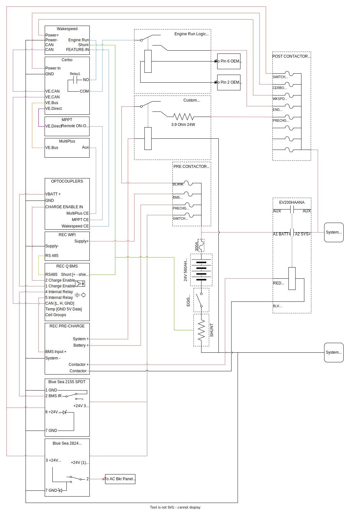

**This is our third revision of the BMS Wiring and Logic.  It reflects our pivot to the TYCO Tyco EV200HAANA as our Main Contactor and the addition of an Egis XD 500 manual cutoff switch.  It also reflects our selection of the Multiplus 3KVA inverter charger.  Lastly, it includes a lot of cleanup.**



## Operation

**System SECURED**

With the Egis XD 500 switch open, all power is secured to the system with the exception of the REC Q BMS which derives power from its cell connections.  This is mode is for long term storage and maintenance.

**Manual ON**

[REC Q BMS](http://www.rec-bms.com/datasheet/UserManual_REC_Victron_BMS.pdf) is always powered, Internal relay is normally closed*. When the Blue Sea 2155 Remote Control Switch (RS) is closed (PIN 2 connected to PIN 3), Vbat is applied through the RS, through the internal relay, to [REC PRE-CHARGE](http://www.rec-bms.com/datasheet/UserManualPrechargeNew.pdf) BMS+ Input. REC PRE-CHARGE Applies VBat via 66 ohm internal resistor to the load side of the Tyco EV200HAANA (Main Contactor) via System+ connection for a preset delay. After the preset delay, REC PRE-CHARGE energizes the Main Contactor control inputs causing it to close. After one second, application of power via System+ is removed and all power flows to the system via the Main Contactor.  

Note, REC PRE-CHARGE [manual](usermanualprechargenew_timeset.pdf) states:
>At system start up the REC Q BMS activates the charging procedure by powering the pre-charge unit. The pre-charge unit closes the power circuit through its internal relay (RELAY ON). The inrush current flows entirely through the precharge 66 Ω internal resistor. After set delay the transient current should be decrease to a safe value. The pre-charge energizes the contactor coil through open collector circuit and after 1 second opens the internal relay (RELAY OFF). All of the system current now passes through the contactor. Normal system operation is achieved. 

**Manual OFF**

When the RS is opened, Vbat is removed from the REC PRE-CHARGE BMS+ input. The REC PRE-CHARGE will float its Contactor- output (it powers the Main Contactor coil via an open collector configuration) which deenergizes the Main Contactor coil and opens the Main Contactor.

**Protective OFF**

When the REC Q internal relay is opened, Vbat is removed from the REC PRE-CHARGE BMS+ input. The REC PRE-CHARGE will float its Contactor- output (it powers the Main Contactor coil via an open collector configuration) which deenergizes the Main Contactor coil and opens the Main Contactor.

The following events result in the REC Q Internal Relay opening:
* Cell Voltage High (cell over voltage switch-off + hysteresis
* Cell Voltage Low (cell under voltage protection switch-off + hysteresis)
* Cell Temp High (cell over temp switch-off + hysteresis) 
* Number of cells or BMS address is not set properly
* Temperature sensor error (connection problem)
* Cell Short Circuit or BMS measurement error
* Main Relay is in short circuit
* Current measurement disabled or > 2x shunt max current
* Wrong Cell Chemistry Selected
* Cell balancing or measurement failure
* BMS internal communication failure

_Note: The internal relay is NOT opened under Temperature Low (under temperature charging disable + hysteresis) conditions.  As discussed below, we will use charger enable signal to provide secondary protection of low temperature charging under loss of CAN conditions._

## Protections

### Primary Over Voltage Protection

This is accomplished by CANBUS communication of the Charge Current Limit and Charge Voltage Limit from the BMS to the Wakespeed and the Victron Cerbo (that coordinates charging from the MPPT and Multiplus). From the Victron Cerbo [manual](https://www.victronenergy.com/media/pg/Cerbo_GX/en/dvcc---distributed-voltage-and-current-control.html):
> If a CAN-bus BMS is connected and the BMS requests a maximum charge current that is different from the user-configurable setting, the lower of the two will be used.

From the REC-Q BMS [manual](usermanual-rec-q-bms_victron-compatible-v_2.8-06-2022.pdf):

>When the highest cell reaches the End of charge CHAR voltage setting, charging current starts to ramp down to 1.1 A x Number of Inverter/Charger Devices SISN until the last cell rises near the End of Charge Voltage CHAR (CC/CV). At that point the Maximum charging voltage allowed is set to Number of cells x (End of Charge Voltage per cell CHAR– Maximum Cell Float Voltage Coefficient CFVC x End of charge hysteresis per cell). End of Charge SOC hysteresis SOCH and End of charge cell voltage hysteresis CHIS is set to prevent unwanted switching. SOC is calibrated to 100 % and Power LED lights ON 100 % Charge optocoupler is turned off. 

### Secondary Over Voltage Protection

This is accomplished by removal of ```CHARGE ENABLE``` signal by the BMS, which is provided separately to the Wakespeed, the MPPT, and the Multiplus and does not rely on CANBUS communication.

### Tertiary Over Voltage Protection

This is accomplished by opening the Main Contactor by the BMS via its internal relay.  It does not rely on any signals to any charge devices.

### Primary Under Voltage Protection

This is accomplished by CANBUS communication between the BMS and the Victron Cerbo (that coordinates/inhibits discharging by the Multiplus).  From the Victron Cerbo [manual](https://www.victronenergy.com/media/pg/Cerbo_GX/en/dvcc---distributed-voltage-and-current-control.html):
 >Multis and Quattros will shut down when the max discharge current is zero. They will automatically start again as soon as either AC mains returns or when the BMS increases the max discharge current again.

From the REC-Q BMS [manual](usermanual-rec-q-bms_victron-compatible-v_2.8-06-2022.pdf):
>When the lowest cell open circuit voltage is discharged bellow the set threshold CLOW maximum discharging current starts to decrease down to 0.02 C (5 % of Capacity in A). After decreasing down, maximum allowed discharging current is set to 0 A. SOC is reset to 3 % and Discharging SOC hysteresis is set to 5 %.

_Note:_ 
* _"max discharge current" == "discharge current limit" == "maximum allowed discharging current"_
* _CLOW == "cell under-voltage discharge protection"_

For DC loads there is no Under Voltage Primary Protection.  We will explore means to implement a cutoff for these later.

### Secondary Under Voltage Protection

This is accomplished by opening the Main Contactor by the BMS via its internal relay.  It does not rely on any signals to any load devices.

### Primary Low Temperature Protection

This is accomplished by CANBUS communication between the BMS to the Wakespeed and the Victron Cerbo (that coordinates/inhibits charging from the MPPT and Multiplus). From the REC-Q BMS [manual](usermanual-rec-q-bms_victron-compatible-v_2.8-06-2022.pdf):
> Charging current is limited to 30% of the maximum charging current, but more than 5 A near both ends of temperature (Max cell temperature TMAX and Min temperature for charging TMIN).

### Secondary Low Temp Protection

This is accomplished by removal of ```CHARGE ENABLE``` signal by the BMS, which is provided separately to the Wakespeed, the MPPT, and the Multiplus and does not rely on CANBUS communication.

### Tertiary Low Temperature Protection (Wakespeed Only)

The Wakespeed has its independent battery temperature sense that can be used to limit low temperature charging with programmable set points.  Importantly, it will override any outside direction based on its own sensor.  This signal does not rely on CANBUS communication or any signals from other components.

<details>
<summary>Wakespeed Independent Low Temperature Protection Details</summary>
From the [Wakespeed WS500 Communication and Configuration Guide](http://Wakespeed.com/Wakespeed%20%20Communications%20and%20Configuration%20Guide%20v2.3.0.pdf):

>**Min Charge Temp:**  If the battery drops below this temperature, charging will be disabled. Once temperature rises above Min Charge Temp, a new charge cycle will start. 

>**Max Charge Temp:**  If the battery reaches this temperature, the system will be disabled to protect it. If the battery temperature continues to rise, the system will eventually FAULT when battery temperature exceeds Max Charge Temp by 20%. 

>Note that Min and Max Temp limits will override any outside direction the WS500 regulator received; even if a CAN connected BMS is asking for charging, if either of these hard stop limits are exceed the regulator will enter Disabled mode.

Also important is its response to loss of sensor and loss of comms:

> **BTemp:** Measured temperature of NTC sensor attached to B-port in degrees C or battery temperature received via external CAN sensor. -99 indicates temperature has not been measured, NTC sender has failed, or is not attached, and there is no remote temperature information available via the CAN connection.

</details>


## CANBUS Distribution

The REC BMS CANBUS output is connected to the Cerbo VE.CANBUS port 1.  The Cerbo VE. CANBUS port 2 is connected to the Wakespeed CANBUS port 1.  A 120 Ohm terminator is plugged into the Wakespeed CANBUS port 2.  The other end of the CANBUS is terminated by the REC BMS.  

The Wakespeed also includes a DUETCH connector terminated CANBUS connection as part of the Van Wiring Harness.  We use this CANBUS connection to drive our Logging PI which can be used to record and decode CANBUS data.

<details>
<summary> Additional Notes </summary>
Regarding Wakespeed-REC-Victron Comms.  [Rick at OGSS](https://www.offgridsoftwaresolutions.com/ws500-user-forum/topic/victron-ve-can-and-canbus-to-ws500/#postid-434https://www.offgridsoftwaresolutions.com/ws500-user-forum/topic/victron-ve-can-and-canbus-to-ws500/#postid-434) says:
>You should be able to connect your Multi to a VE.bus  
>Connect your REC BMS to the VE.CANBus port 1  
>Connect your WS500s in series to VE.CANBus port 2, with a terminator plugged into your last WS500

This suggest that REC has a terminator resistor in it.  This also means we need a WS500 Victron Crossover Cable (WS-VE-CABLE), and a REC to victron CAN adapter cable.  We have both of these. 

</details>

## ```CHARGE ENABLE``` Signal Distribution

The design for distributing the ```CHARGE ENABLE``` signal must account for the limits of the BMS hardware and charging source hardware related to this signal.

* The BMS ```CHARGE ENABLE``` Optocoupler has a collector-to-emitter voltage rating of 62.5V and a collector current rating of 15mA.
* The MPPT has a ```REMOTE ON-OFF``` 'H' and 'L' inputs.   The 'L' input will source about 5V (and has a short circuit protection resistor).  The 'L' input will sink about 80uA when the 'L' input is directly shorted to it.
* The Multplus has ```AUX``` '+' and '-' terminals.  The '+' terminal is connected to an internal voltage sensor with an internal 5V source applied through a 10KOhm pullup resistor.  The '-' terminal will thus sink about 500uA when the '+' terminal is directly shorted to it.
* The Wakespeed ```FEATURE-IN``` input will sink about 3mA when full VBatt is applied to it.

Based on these limits, we elected to use [these ICStation 12V optocoupler boards](https://www.amazon.com/dp/B01L1OI1HC/ref=emc_b_5_t?th=1).  

These boards use an 817 optocoupler with maximum input-side LED current of 50mA and maximum output collector current and collector-emitter voltage of 50mA and 80V.

We apply VBatt to the ```CHARGE ENABLE``` input on the REC BMS.  The ```CHARGE ENABLE``` output drives the four optocoupler boards in series.  With the 1KOhm resistors in series with each input-side LED, placing three boards in series will limit the input-side LED current to ~9.6mA satisfying the limits of the 817 optocouplers and the BMS ```CHARGE ENABLE``` optocoupler.

The outputs are wired depending on the equipment each is driving but in all cases the limits of the 817 optocouplers and the charge equipment being driven are met.


_This is our design for distributing the BMS ```CHARGE ENABLE``` signal to the charging sources._


The gritty details for the CHARGE ENABLE characteristics and settings are available by expanding the summaries below:

<details>
<summary>REC BMS <code>CHARGE ENABLE</code> Limits</summary>

The REC documentation describes the charger enable as open collector and open emitter, and also as an opto-coupler, but this doesn't provide all the required information.  REC responded to my questions via an email in April 2021:

>What are the ratings/limitations of the ```CHARGE ENABLE``` ports.  Specifically, can I provide a 24V Vcc?  And what are the limitations of current (so I can correctly design/select the impedance of the output side)?  

>From specification:  
>Max DC current @ optocoupler 15 mA  
>Max DC voltage @ optocoupler 62.5 V  

</details>

<details>
<summary>MPPT <code>REMOTE ON-OFF</code> Input Characteristics</summary>

The ```CHARGE ENABLE``` signal will be fed to the ```REMOTE ON-OFF``` input on the MPPT.

From the 150/XX MPPT Manual

> **3.5 Remote on-off** 
>
> The left terminal is connected to the internal 3,3V supply, with a resistor in series for short circuit protection. The right terminal (marked as + or marked as H) will switch the controller on if >3V is applied, and will switch the controller off if <2V is applied or if the terminal is left free floating. The recommended use of the remote on-off is: 
>
> a. A switch wired between the left and right terminal 
>
> b. A switch wired between battery plus and the right terminal. 
>
> c) A switch between the right terminal and the charge disconnect terminal of a VE.Bus BMS

**MPPT Remote on-off Testing Details:**
On our MPPT, facing it from the front, the 'H' terminal is on the left, the 'L' terminal is on the right.

Testing:
1. Temporarily disconnect the left and right terminals from each other.
2. With a voltmeter measure voltage between the 'L' terminal and 'VBatt-' to determine 'L' terminal output voltage [measured +4.85V]
3. With an ammeter measure current between the 'L' terminal and VBatt-. [measured 0.1mA / 106.3 microA]
4. Based on 2. and 3., determine in line resistance on the 'L' terminal.
R = V/I = 4.85V / 0.0001063A = 45.626KOhm
5. With a voltmeter measure voltage between the 'H' terminal and 'VBatt-' to determine 'H' terminal voltage [measured -3 milliV]
6. With a voltmeter measure voltage between VBatt+ VBatt- (at the MPPT inputs) [measured +26.1V]
7. With an ammeter measure current into the 'H' terminal when VBatt+ is applied to it [ 0.1 milliA / 96.0 microA]
8. Based on 5. and 6., determine input resistance of the 'H' terminal.
R = V/I = 26.1V / 0.0000960A = 271.875KOhm
9. With an ammeter measure current between the 'H' and 'L' terminal [measured 0.1 milliA / 77.3 microA]
10. Based on 2., 5., and 9., determine resistance in the current flow path from 'L' to 'H'
R = V/I = 4.85V / 0.0000773A = 62.743KOhm

Note, this R doesn't equal the sum of the other two measurements.  However, it does show that current will not exceed max collector current when an optocoupler is fully conducting.  

Our testing showed that the current flowing out of the 'L' terminal into the 'H' is 77 uA when shorted (configuration 'a' above).  When 26V is applied directly to the 'H' terminal the current is flowing is 96 uA (configuration 'b' above).

</details>

<details>
<summary>Multiplus <code>AUX</code> Input Characteristics</summary>

In this [discussion](https://community.victronenergy.com/questions/29518/optocoupler-for-two-signal-bms-assistant.html) a user discusses using an optocoupler with a 50 mA limit across a Multiplus ```AUX``` input.

This [victron document](manual-connecting-other-lithium-battery-systems-to-multis-and-quattros-en.pdf) states that a small ~1 mA signal is enough for the Multiplus ```AUX``` input to register a high signal.

This [victron document](multiplus-ii-to-multigrid-and-multiplus-comparison-en.pdf) states that the Multiplus II ```AUX``` inputs have a 10KOhm pullup to a 5V source.  It also states that the MultiGrid has the same "FIO" for its ```AUX``` inputs.  This suggests that the ```AUX+``` on the Multiplus has the same arrangement.

These data suggests connecting the output stage of an optocoupler across the Multiplus ```AUX+``` and ```AUX-``` inputs would draw well below the optocouplers max collector current (e.g. 50mA).

One possibility is to use the Charge current control assistant.

Another possibility is to use the ```Two-signal BMS support assistant```.   
1. Select "The BMS has one contact which which switches only on a high-cell condition".   
2. Select "The battery is full when [```AUX_X```] is [```OPEN```]".  
3. Select "[```Disable Charger```] and [```do not adapt SOC```] when battery full".   
4. Connect an optocoupler across the Multiplus ```AUX_X+``` and ```AUX_X-``` inputs.

If the optocoupler is wired such that its output is "CLOSED" when the ```CHARGE ENABLE``` signal is present,  this configuration will provide low temp backup protection and fails conservatively in the case of a broken wire.

</details>

<details>
<summary>Wakespeed <code>FEATURE-IN</code> Input Characteristics</summary>

The FEATURE-IN input on the Wakespeed can be configured to stop charging when a High or Low is applied to it.  They took a lookup during a phone call when asked about the input characteristics for the FEATURE-IN signal.  Wakespeed support responded to my question via an email in March 2022:

>Just got off the phone with the engineer.  
>Current draw at 24V is <3mA.  
>Hope that helps.  

This places its input impedance at 8KOhm.

From the [Wakespeed WS500 Quickstart Guide (9-30-2022)](ws500-quick-start-guide-09-30-2022-V3.pdf):

> **FEATURE-IN Wire (White)** Can be connected to a voltage source greater than 8.5 VDC to enable a range of selectable optional capabilities as detailed in the User’s Guide

From the [Wakespeed WS500 Manual (9-30-2022)](ws500-product-manual-09-30-2022-V2.pdf):

>**Function [sic] In –** The white 16-gauge Function In [sic] can be configured to provide a number of custom controls which can be activated by connecting the wire to >8.5VDC+ via a toggle or other ON/OFF type switch. In default mode, the Function In mode will enable equalize mode when the regulator is configured for lead acid batteries. When the WS500 is configured for LiFeP04 batteries (see DIP switch instructions), Function In will force the system to float.

By setting parameter 4 in $SCO to '1', ```FEATURE-IN``` will force-to-float and is active 'LOW' meaning the system will behave normally when ```FEATURE-IN``` is >8.5V and will force-to-float when <8.5V.

By setting the voltage parameter in $CPF to 0.0, the charger will remain in "float" but with charging disabled until it is triggered back into a bulk charge state (e.g. by low battery voltage or ```FEATURE-IN``` >8.5V).  This low battery voltage trigger would only be applicable in a loss of CAN situation. 

NOTE: [This Github Issue related to Victron-Wakespeed integration is relevant to **FEATURE-IN.**](https://github.com/victronenergy/venus/issues/779)

</details>

