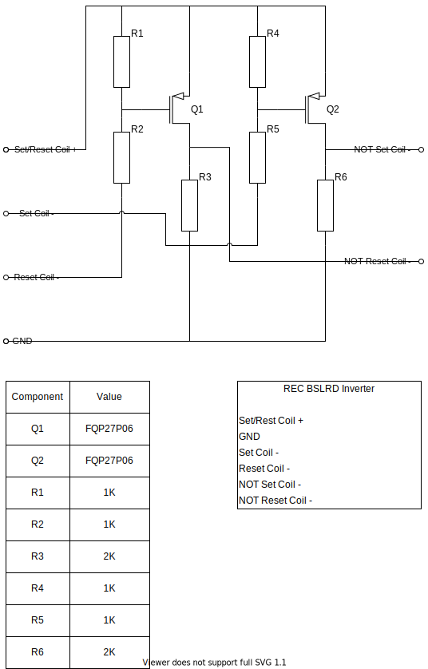

# REC Bi-Stable Latching Relay Driver Inverter

For the design application, inverting the REC BSLRD outputs: 

24V will be applied to the Set/Reset Coil + input.

When Set Coil -, or Reset Coil - is driven low, Q1 and Q2 will see -12 Vgs, which is well within the +/- 25 Vgs limit, and turn on fully.  For details on Q1 and Q2 ratings refer to the [datasheet](https://cdn-shop.adafruit.com/datasheets/1794datasheet.pdf). 

This will apply 24V at the respective inverted output.

With the chosen resistor values and design application, for the duration of an active input, the circuit will draw 24mA + the output load.  The max resistor dissipation will be 0.29 watts [for the duration of the pulse].

The resistor values should be evaluated for other applications where continuous operation occurs in the event this circuit design is used for other applications.

Regarding connections:  PCB ring or spade connections are both possibilities.  However, I'm leaning towards PCB screw terminals given thier ubiquity.  On looking into ABYC, it appears it could be a gray area without the screw acting on a compression plate, but I will be using ferrules.  I'd note that the victron equipment (e.g., MPPT and Multiplus) uses them.  Here is one [perspective](https://www.proboat.com/2016/09/terminal-connector-compliance/).  Here is [another](https://www.practical-sailor.com/marine-electronics/out-out-brief-wiring-terminals).

