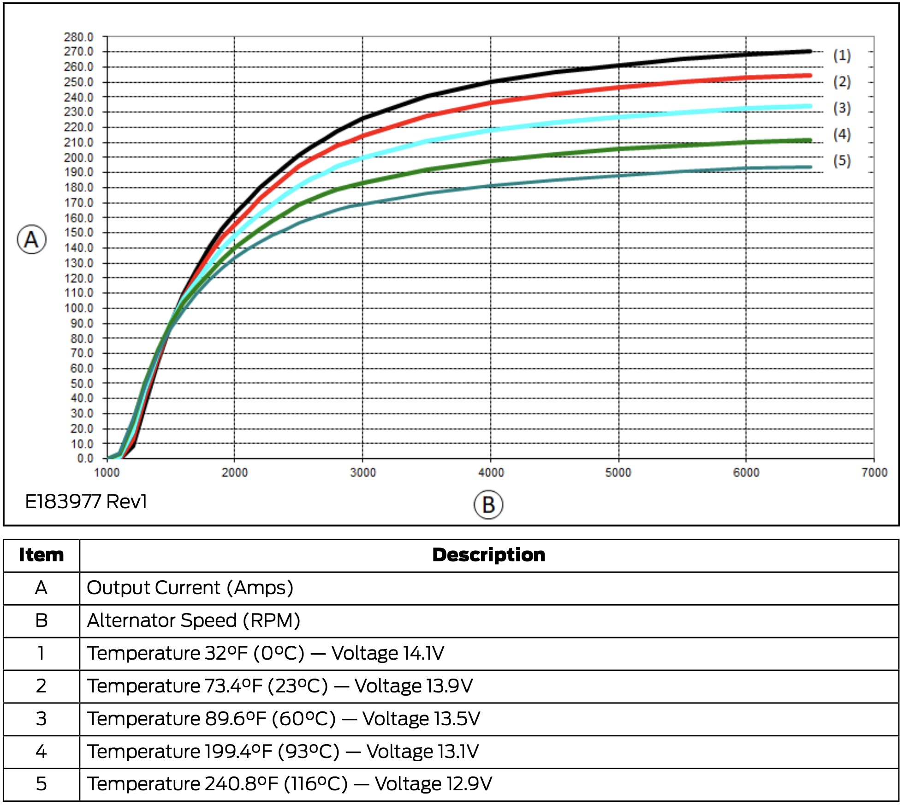

**DEPRECATED:** This article is deprecated and contains outdated design information and possible errors.

**TODO: Pull in detail from the 24V-48V study.**

**TLDR:** By using maximum idle and both alternators maximally, a charge rate of 1800W + 4968W under ideal/targeted conditions should be achievable.  Assuming 400W for AC, This equates to about 16 or 17 hours of air conditioning per hour of high idle or driving.

Alternator charging using the factory and second alternator will provide for rapid battery charging.  We plan to make use of Ford's Stationary Elevated Idle Control (SEIC) to maximize charge while parked and needing to charge.

## Factory Alternator Charging

Factory Alternator Charging will be accomplished by way of the "Orton method" advocated by Dave Orton on the ford and sprinter forums, and used by us on Van 1.0.  Specifically, this form of charging will be accomplished by the Multiplus 24/3000 via a Samlex PST-2000-24 inverter via the stock HD Alternator by way of CCP2.  

### Implementation of Limits

For Van 2.0, a [Digital Multi Control GX Panel](https://www.victronenergy.com/upload/documents/Manual-Digital-Multi-Control-GX-Panel-EN-NL-FR-DE-ES.pdf) (DMC panel) will be used to remotely control the Multiplus and set an input current limit.  The DMC panel includes a dry contact input that can be used to impose an alternate current limit when exposed to a closed external contact.  The DMC panel and these current limits will be used to ensure the factory alternator is not overloaded.

Current Limiting Details

Two potential control schemes for consideration:

1. When powered from the alternator-inverter, aux contacts from the transfer switch will be used to impose a current limit that is low enough that alternator temperatures will be maintained healthy under all conditions (e.g. hot ambient, idle).  This will probably be too limiting based on the alternator limitations described in the limitations section below.
2. When powered from the alternator-inverter, alternator temperature will be sensed and a control device (e.g. esp32, arduino, etc) will close a dry contact to impose a lower current limit upon reaching a factory alternator temperature limit.  Upon recovery from the high temperature condition, the contact would be opened allowing more rapid charge.

If case 2 is pursued, the higher current limit selected by the DMC panel must be within the capacity of the alternator and alternator-inverter.  This is probably not an issue as there is rarely a reason to ever set the DMC Panel current limit above 17.4 Amps: 

  1. A current limit of 17.4A will minimize shorepower trips when driveway surfing.  
  2. The max charge current of the Multiplus Compact is 50A which corresponds to 12.8A on the AC input side (50A * 27.6V/(0.9 * 120V)).
  3. The max charge current, in the case of the Multiplus 24/3000, will be limited to 68A due to factory alternator concerns which corresponds to 17.4A on the AC input side (68A * 27.6V/(0.9 * 120V)).

To maximize flexibility if using case 2, a 2000W alternator-inverter should be used.

Because the conservative current limit is imposed by a closed contact, a broken wire will prevent imposing a reduced current limit.  If case 2 is pursued, a secondary function of the control device would be to shutdown the alternator-inverter if the alternator reaches a temperature that warrants backup protective action.  Additional functionality that looks at RPM might be worth considering also.

### Limitations

#### Multiplus 24/3000 Limit
The Multiplus 24/3000 is limited to 70A charge.

#### Samlex Power Limit
The REC BMS begins to taper charging current at 27.6V.  At this voltage the 70A Multiplus current limit corresponds to 1932W.  Assuming [90% Multiplus efficiency](https://www.fordtransitusaforum.com/threads/sauntur-4-season-multi-sports-rig-2020-el-hr-awd-eb-raise-lower-bed-slide-out-garage-removable-full-galley-shower.86896/post-1136043), this corresponds to input power of 2147W supplied by the Samlex inverter.  Thus the Samlex is limiting at high battery voltages.  Capping Samlex inverter output power to 2000W, assuming 90% Samlex inverter efficiency, this corresponds to input power of 2222W supplied by the factory alternator.    

At minimum battery voltage 22.4V, the 70A Multiplus current limit corresponds to 1568W.  Assuming 90% Multiplus efficiency, this corresponds to 1742W supplied by the Samlex inverter.  For this case the Samlex inverter is not limiting.  Assuming 90% efficiency, the 1742W corresponds to input power of 1936W supplied by the factory alternator.

Based on these numbers, the maximum/default input current limit to the Multiplus should be set to 16.6A (2000W/120V)

#### CCP2 Fuse Limit
The Samlex is fed by CCP2 which is fused at 175A.  The factory HD alternator output voltage ranges from 12.9V-14.1V based on temperatures ranging from 240F to 32F per diagram E146660 Rev1 in the [BEMM](/van/vehicular/vehicular_overview/2020-12-bemm.pdf).  Assuming 2222W input power to the Samlex inverter, input current will range from 172.25A to 157.5A.  Thus the CCP fuse SHOULD not be limiting.  However, this doesn't account for voltage drop, and should be tested.

By inspection the low battery voltage case is not limiting from the CCP2 fuse perspective.

#### Factory HD Alternator Limit

The capability of the stock HD alternator and base vehicle load is unclear and the subject of much debate on the forum.  Assuming Hot (60C/13.5V-115C/12.9V) conditions, the BEMM suggests the stock alternator is capable of:

- ~115A/125A at 1755 RPM (base idle assuming 650 engine RPM)
- ~140A/155A at 2160 RPM (low SEIC)
- ~185A/225A at 4860 RPM (crusing assuming 1800 engine RPM)
- ~195A/235A at 6480 RPM (high SEIC)

The best data for baseline Transit current draw I have found is [here](https://www.fordtransitusaforum.com/threads/ammeter-for-alternator-output.65585/#post-891193).  In summary, just sitting idle with no AC, and no lights, the base load on the alternator is about 12A.  Idle with AC on high, the base load on the alternator is about 51A. Driving, with AC on high and headlights on high, the base load on the alternator is about 79A.  We will use the 51A and 79A values for determining useable amps from the factory alternator. 

For the very hot case (12.9V):
- ~64A (825W) at 1755 RPM (base idle)
- ~89A (1148W) at 2160 RPM (low SEIC idle)
- ~144A (1858W) at 6480 RPM (high SEIC idle)
- ~106A (1367W) at 4860 RPM (crusing)

For the hot case (13.5V):
- ~74A (999W) at 1755 RPM (base idle)
- ~104A (1404W) at 2160 RPM (low SEIC idle)
- ~184A (2484W) at 6480 RPM (high SEIC idle)
- ~146A (1971W) at 4860 RPM (crusing)

If a single temperature based reduced current limit is employed, based on these numbers, it should be set at 6.1A (825W*0.9/120V) triggered by and alternator temperature > ~100C to force alternator load below its minimal capability.

If a two temperature based reduced current limit/shutdown is employed, based on these number, consider setting the limit at 7.5A (999W*0.9/120V) triggered by an alternator temperature > ~60C to reduce alternator load.  Cut off the Samlex inverter at an alternator temperature > ~100C to eliminate charge load on the alternator.

## Second Alternator Charging

Two alternators are under consideration for the second alternator charging source.  Nations, per discussions via email, can provide a [24V 150A alternator](24v-150-specs.pdf).  American Power Systems, per telephone discussion, can provide a [24V 185A alternator](185-hpi-series-high-output-alternators.pdf).

_Note: 650 RPM is base idle, 800 RPM is the SEIC minimum, 1800 RPM is normal cruise, 2400 is the SEIC maximum._ 

Comparison Details

The details are in this [google spreadsheet](https://docs.google.com/spreadsheets/d/1PZ28vauZOBcX5VKHcEtaARwbSTpMoWLsqBCX2Hrulv8/edit?usp=sharing). I took the data sheets for the two candidate alternators, and used a 6th order polynomial fit on the performance data points.  I measured the crank pulley circumference, and calculated its diameter.  I got just over 6.5 inches.  Accounting for belt thickness, I assume it is 6.5 inches (this is consistent with the value Jim from APS provided).  From the polynomial fit and the respective pulley ratios, the estimated performance curves can be overlaid.

While the idle performance of the Nations alternator is superior, substantially higher charge rates are possible with the APC alternator under higher SEIC and cruise conditions.  On that basis, we are leaning towards that option.  Based on conversations with Jim at APS, the APS alternator cuts off below a minimum RPM.  In a followup email he confirmed the cutoff occurs at 1900 RPM which corresponds to just under 600 RPM for the engine.  This should be low enough to ensure the alternator isn't cycling on and off during idle.

Does the load torque due to the second alternator matter at default idle, where engine torque is pretty low (<100 ft-lbs)?

Depending on the pulley ratio, the APS model has lower output capability at idle speeds.

#### Regulator

We plan to use a Wakespeed WS500 for regulation and charge control from the second alternator.

#### Misc

APS discussion on 2021-12-7
What does the low RPM performance look like.  Is there a cutoff below which no voltage/current will be produced?  Yes: around 2000-1800 it will turn on/off (hard on and off) and free spins without excitation below that speed.  Jim will ask the engineers if this can result in cycling on-off at transit idle speeds and if that is a problem.  One possible solution is goign to a 48mm pulley, but he is not aware of that being done commonly.  He also mentioned that a new alternator with lower turn on speed may be coming out.  Followup - new alternator is 48V only.  Will email final min cutoff RPM number.

What is the excitation for the APS model...is it "P-type"? (negative ground).  Jim: Yes it is P-type.  P-type is required to use [this cable](https://www.offgridsoftwaresolutions.com/product/ws500-regulator-harness-for-van-installations/) intended for Van installations.

Load disconnect management is critical and must be provided by BMS.  Regarding the use of the Sterling load disconnect protector, Jim is not sure if recommended.  He will talk to his engineers. Followup: Not needed as long as BMS is coordinated.  Maybe needed for other reasons, but not as far as APS alternator is concerned.  

APS discussion on 2022-1-24
APS option does have a tensioner vice stretch belt.  They provided [these similar installation instructions](vfk130sd508-i4.pdf).

Notes from convo with Niel at wakespeed:
How does the wakespeed accomodate the Amps vs RPM performance of the alternators being controlled? Some ability to configure. At low RPM, even at full field, alternator wont put out enought voltage.

Regarding Use of a sterling load disconnect protector: Use alternator manufacturers recemendation on snubber for load disconnect. 

Does wakespeed care about other charging sources?
wakespeed is measuring battery current and voltage...when MPPT kicks on, voltage will spike and the BMS may hard disconnect on overvoltage.  Recommend testing with an AGM keeper battery.

Measuring shunt: He doesn't see the benefit of putting it on the positive side.  When measuring battery current via negative, wakespeed will account for current sourced from other charging sources when responding to BMS current request.

[This forum thread](https://www.fordtransitusaforum.com/threads/upfitter-switches-third-party-high-power-mode-charger-remote-on-off.86377/) details use of the upfitter switches to control charging.  Awesome.

TODO: Confirm idle RPM
TODO: Document RPM assumptions: https://www.fordtransitusaforum.com/threads/2020-hr-awd-rpm-at-various-speeds.80451/
TODO: Confirm Nations 24-150 pulley diameter for Transit.

NOTE:  This may not affect us based on our build date, but just in case we run into future issues with SEIC.  FORD has documented [this problem and fix](sve-bulletin-q-388r1.pdf).